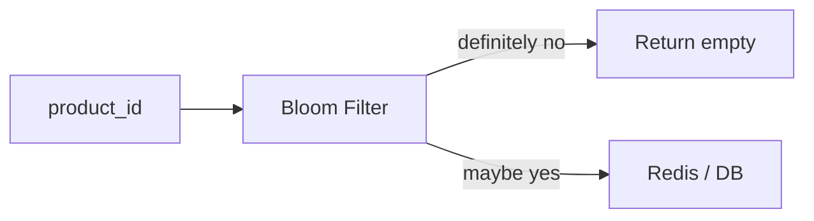
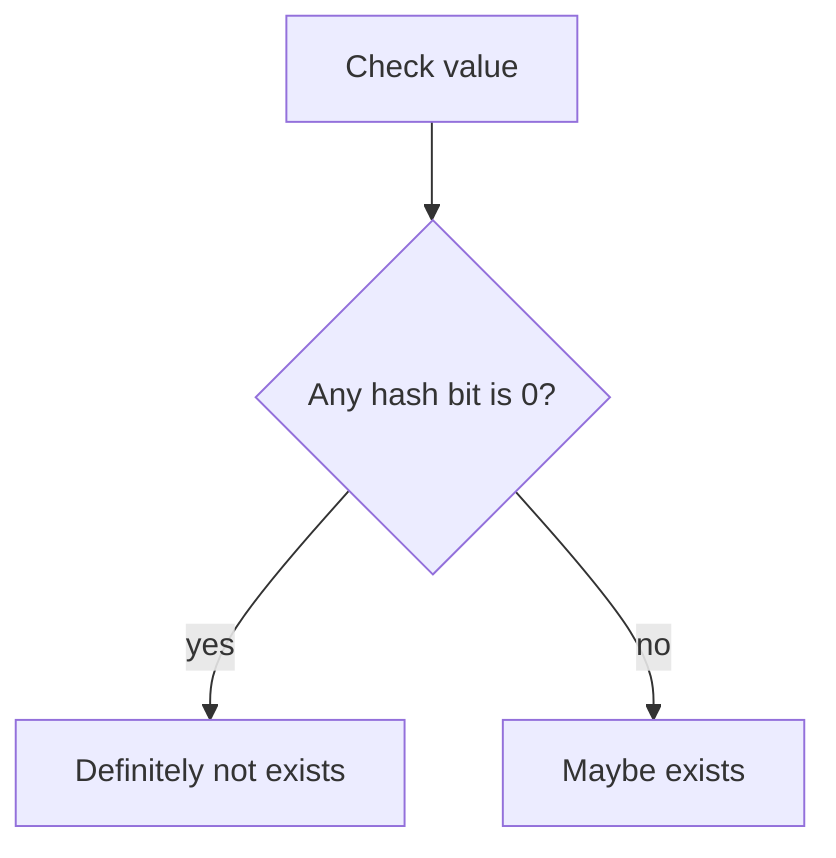

# 布隆过滤器

布隆过滤器常用于防缓存穿透：当请求的 ID 根本不存在时，系统可以在访问数据库前快速判断“这个 ID 一定不存在”，避免大量无效请求打到数据库。



## 场景

缓存穿透场景：

```text
GET /products/unknown_id
Redis miss
DB miss
下一次同样请求继续 miss
```

如果恶意用户不断请求不存在的 ID，Redis 帮不上忙，数据库会被打爆。

## 是什么

布隆过滤器由一个 bit array 和多个 hash 函数组成。

插入一个值时：

```text
hash1(value) -> bit index 1 = 1
hash2(value) -> bit index 2 = 1
hash3(value) -> bit index 3 = 1
```

查询一个值时：

- 如果任意一个 bit 是 0，说明这个值一定不存在。
- 如果所有 bit 都是 1，说明这个值可能存在。



## 为什么需要

反例：缓存 miss 后总是查数据库。

```pseudo
function getProduct(productId):
    cached = redis.get("product:" + productId)
    if cached exists:
        return cached

    product = database.findProduct(productId)
    return product
```

问题：不存在的 ID 每次都会打到数据库。

推荐加布隆过滤器：

```pseudo
function getProduct(productId):
    if not bloomFilter.mightContain(productId):
        return null

    cached = redis.get("product:" + productId)
    if cached exists:
        return cached

    product = database.findProduct(productId)
    if product exists:
        redis.set("product:" + productId, product, ttl = 10 minutes)
    else:
        redis.set("product:null:" + productId, "1", ttl = 1 minute)

    return product
```

## false positive 是什么

布隆过滤器可能误判“可能存在”，但不会误判“一定不存在”。

```text
真实不存在 -> Bloom 可能返回 maybe yes -> 继续查 Redis/DB
真实存在 -> Bloom 不应该返回 definitely no
```

所以布隆过滤器不能替代数据库，它只是减少明显不存在的请求。

## 如何初始化

系统启动或定时任务从数据库加载已有 ID：

```pseudo
function rebuildBloomFilter():
    newFilter = BloomFilter(expectedItems = 100000000, falsePositiveRate = 0.01)

    cursor = 0
    while true:
        ids = database.scanProductIds(cursor, limit = 10000)
        if ids empty:
            break

        for id in ids:
            newFilter.add(id)

        cursor = ids.nextCursor

    bloomFilterRef.swap(newFilter)
```

新增商品时，也要写入布隆过滤器：

```pseudo
function createProduct(product):
    database.insert(product)
    bloomFilter.add(product.productId)
```

如果新增后写 Bloom 失败，短时间内可能误判不存在。解决方式是：创建成功后重试写 Bloom，或让查询在新建后短时间绕过 Bloom。

## 删除问题

普通布隆过滤器不支持删除。因为多个值可能共享同一个 bit，清掉某个 bit 会影响其他值。

反例：

```pseudo
function deleteProduct(productId):
    database.delete(productId)
    bloomFilter.remove(productId)  # 普通 Bloom 不支持
```

可选方案：

| 方案 | 做法 | 代价 |
| --- | --- | --- |
| 不删除 | 删除后 Bloom 仍返回 maybe yes | 会多查一次 DB，但安全 |
| Counting Bloom Filter | bit 改成计数器 | 内存更多，复杂度更高 |
| 定期重建 | 从 DB 全量重建过滤器 | 有重建成本 |
| 黑名单状态 | DB 记录 deleted，读时过滤 | 多一层状态判断 |

对商品、用户、订单这类 ID，通常可以不从 Bloom 删除，靠 DB 状态判断是否可见。

## 和空值缓存的关系

布隆过滤器和空值缓存不是二选一。

| 机制 | 解决什么 |
| --- | --- |
| 布隆过滤器 | 大量明显不存在的随机 ID |
| 空值缓存 | 某个不存在 ID 被反复请求 |
| 参数校验 | 非法 ID 格式，例如负数、过短字符串 |

推荐组合：参数校验 -> Bloom -> Redis -> DB -> 空值缓存。

## 失败补偿

| 问题 | 后果 | 处理 |
| --- | --- | --- |
| Bloom 未加载完成 | 可能误拒绝存在数据 | 加载完成前绕过 Bloom 或只告警不拒绝 |
| 新数据未写 Bloom | 新数据短暂查不到 | 新建后重试写 Bloom，短期绕过 |
| false positive 高 | DB miss 增多 | 调整 bit 数和 hash 数，重建 Bloom |
| 删除数据仍在 Bloom | 多查 DB | 接受，或定期重建 |

## 面试怎么讲

可以这样回答：

> 布隆过滤器用 bit array 和多个 hash 函数判断一个值是否可能存在。它能保证如果返回不存在，那一定不存在；如果返回可能存在，仍然要继续查缓存或数据库。它适合防缓存穿透，例如大量不存在的商品 ID 请求。要注意 false positive，不能用 Bloom 替代数据库；普通 Bloom 也不支持删除，删除后可以靠 DB 状态过滤或定期重建。工程上通常组合参数校验、Bloom、空值缓存一起使用。

## 检查清单

- 是否理解 Bloom 返回的是“可能存在”，不是“一定存在”？
- false positive rate 是否按数据量估算？
- 新增数据是否同步写入 Bloom？
- 删除数据是否有策略：不删、计数 Bloom 或定期重建？
- Bloom 不可用时是否有降级策略？
- 是否仍保留 DB 权威校验？

## 延伸阅读

- [缓存穿透](../cache/cache-penetration.md)
- [Redis Key 设计](../recipes/redis-key-design.md)
- [Bloom Filters by Example](https://llimllib.github.io/bloomfilter-tutorial/)
