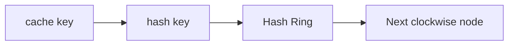
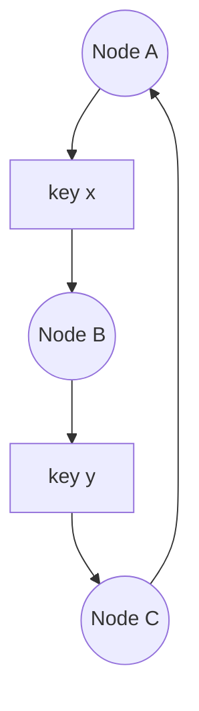
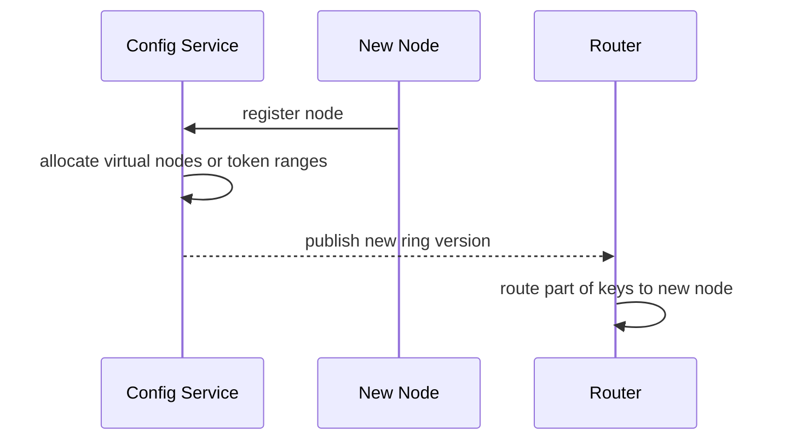

# 一致性哈希 / Token Ring

一致性哈希解决的是“节点数量变化时，如何尽量少迁移 key”。它常见于缓存分片、存储分片、服务路由和一些分布式数据库的 token ring 设计。



## 场景

假设你有 3 台缓存节点：A、B、C。最简单的分片方式是：

```pseudo
node = nodes[hash(key) % len(nodes)]
```

当节点从 3 台扩容到 4 台时，`len(nodes)` 变了，大量 key 会重新映射。缓存命中率会突然下降，大量请求回源数据库，可能造成雪崩。

## 是什么

一致性哈希把 key 和节点都映射到一个环上。查找 key 时，从 key 的 hash 位置顺时针找到第一个节点。



新增节点时，只影响它在环上前后相邻的一部分 key，不会让所有 key 重新分布。

## 为什么需要

反例：普通取模分片。

```pseudo
function routeByModulo(key, nodes):
    index = hash(key) % len(nodes)
    return nodes[index]
```

问题：

```text
1. 原来 3 个节点，key 使用 hash % 3。
2. 扩容到 4 个节点，key 使用 hash % 4。
3. 大部分 key 的目标节点变化。
4. 缓存大面积 miss。
5. 数据库回源压力突然升高。
```

一致性哈希的目标是：节点变化时，只迁移少量 key。

## 推荐做法

基础伪代码：

```pseudo
class ConsistentHashRing:
    ring = sortedMap()

    function addNode(nodeId):
        token = hash(nodeId)
        ring[token] = nodeId

    function removeNode(nodeId):
        token = hash(nodeId)
        ring.remove(token)

    function route(key):
        token = hash(key)
        nodeToken = ring.firstTokenGreaterOrEqual(token)

        if nodeToken not found:
            nodeToken = ring.firstToken()

        return ring[nodeToken]
```

但基础一致性哈希有一个问题：节点在环上分布可能不均匀，导致某些节点承担更多 key。

## 虚拟节点

虚拟节点是把一个物理节点映射成多个 token。

```pseudo
function addNode(nodeId):
    for i in 0..127:
        virtualNodeId = nodeId + "#" + i
        token = hash(virtualNodeId)
        ring[token] = nodeId
```

好处：

- key 分布更均匀。
- 新增节点时迁移更平滑。
- 不同配置的机器可以分配不同数量虚拟节点。

## Token Ring 是什么

Token Ring 可以理解成更工程化的环。系统不只用 hash(nodeId) 自动决定位置，而是明确给节点分配 token 范围。

```text
Node A owns token range: 0 - 999
Node B owns token range: 1000 - 1999
Node C owns token range: 2000 - 2999
```

当新增节点 D 时，可以从 A/B/C 各拿一部分 token range 给 D。这样迁移更可控。

## 节点上下线流程

新增缓存节点：



下线节点：

```pseudo
function removeNode(nodeId):
    mark node as draining
    stop routing new writes to node
    migrate or let cache warm naturally
    remove node tokens from ring
```

缓存场景通常可以让新节点自然预热；存储场景必须迁移数据。

## 反例：节点列表顺序不稳定

```pseudo
nodes = serviceDiscovery.listInstances()
node = nodes[hash(key) % len(nodes)]
```

如果每个进程拿到的 `nodes` 顺序不一样，同一个 key 会路由到不同节点。

后果：

- 缓存命中率降低。
- 写入和读取打到不同节点。
- 问题很隐蔽，排查困难。

修复：节点列表必须排序，或者使用一致性哈希 ring 版本。

## 失败补偿

| 问题 | 后果 | 处理 |
| --- | --- | --- |
| 新节点加入 | 部分 key miss | 预热热点 key，限流回源 |
| 节点宕机 | 部分 key 迁移到下个节点 | 熔断坏节点，允许 miss 回源 |
| ring 配置不一致 | 不同实例路由不同 | ring 带版本号，配置中心发布 |
| 节点负载不均 | 热点集中 | 增加虚拟节点，热点 key 特殊处理 |

## 面试怎么讲

可以这样回答：

> 普通 hash 取模在扩容缩容时会让大量 key 重新映射，缓存命中率会大幅下降。一致性哈希把节点和 key 都映射到一个环上，key 顺时针找到第一个节点。新增节点时，只影响新节点附近的一段 key，迁移量更小。为了避免节点分布不均，会给每个物理节点分配多个虚拟节点。工程上还要保证所有服务看到同一个 ring 版本，节点上下线时要预热、限流和监控回源压力。

## 检查清单

- 节点变化时是否避免大量 key 迁移？
- 是否使用虚拟节点改善均衡性？
- ring 配置是否有版本号？
- 所有客户端是否看到同一份节点视图？
- 新节点加入是否预热热点 key？
- 节点故障时是否限流回源数据库？

## 延伸阅读

- [缓存雪崩](../cache/cache-avalanche.md)
- [热 Key](../cache/hot-key.md)
- [Redis Key 设计](../recipes/redis-key-design.md)
- [Dynamo: Amazon's Highly Available Key-value Store](https://www.allthingsdistributed.com/files/amazon-dynamo-sosp2007.pdf)
