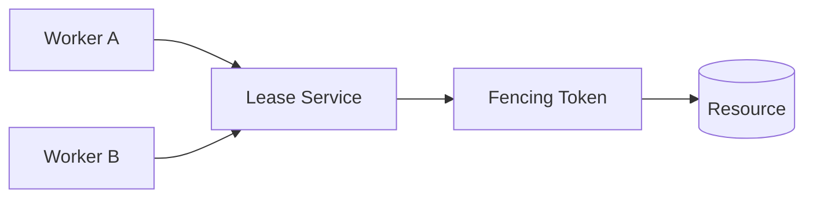
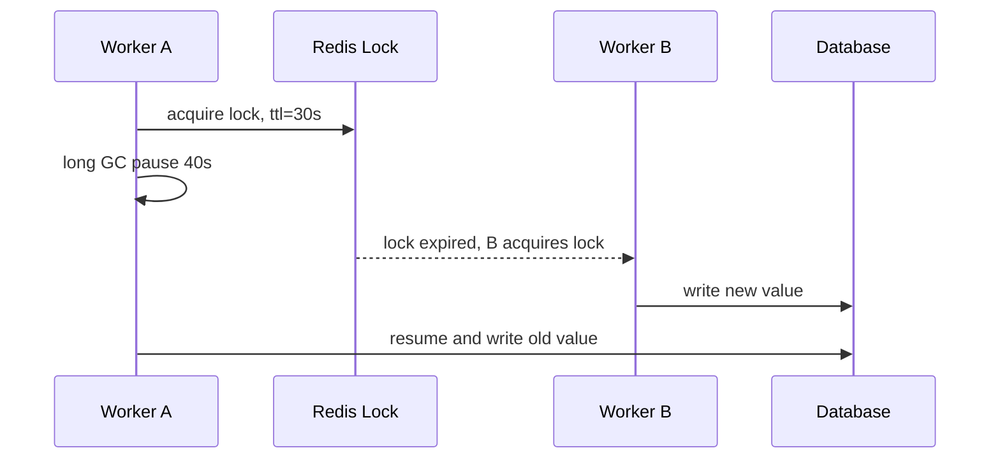
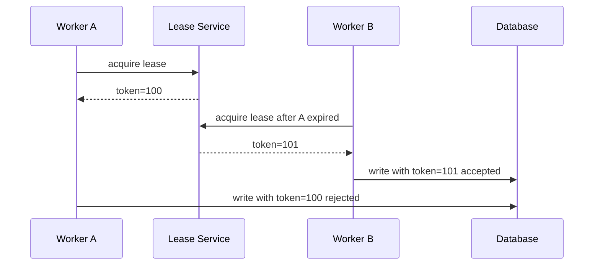

# Lease 与 Fencing Token

分布式锁经常被用来保证“同一时间只有一个执行者”。但如果锁有过期时间，就会出现一个危险场景：旧执行者以为自己还持有锁，锁其实已经过期，新执行者也拿到了锁。Fencing Token 用来防止旧执行者继续写坏数据。



## 场景

常见场景：

- 定时任务只能有一个实例执行。
- 分布式调度器需要选主。
- 多个 worker 竞争同一个资源。
- 需要避免旧主节点在网络卡顿后继续写数据。

## Lease 是什么

Lease 是带过期时间的租约。

```text
Worker A 获得 lease，TTL = 30 秒
Worker A 必须持续续租
如果 30 秒内没有续租，lease 过期，其他 worker 可以获取
```

Redis 锁就是一种 lease：

```pseudo
success = redis.set("lock:job", uniqueValue, nx = true, px = 30000)
```

## 问题：锁过期不等于旧执行者停止

反例：只用 Redis 分布式锁。



后果：Worker A 的锁已经过期，但它恢复后仍然写数据库，覆盖了 Worker B 的新结果。

## Fencing Token 是什么

Fencing Token 是每次获取 lease 时递增的令牌。资源方只接受更大的 token。

```text
Worker A 获取 token = 100
Worker B 后获取 token = 101
数据库只接受 token >= 当前 token 的写入
Worker A 恢复后带 token=100 写入，会被拒绝
```



## 推荐做法

获取 lease 时返回递增 token：

```pseudo
function acquireLease(resourceId, ownerId):
    begin transaction
        lease = select * from leases where resource_id = resourceId for update

        if lease is absent or lease.expire_at < now():
            token = 1 if lease is absent else lease.last_token + 1
            upsert leases(
                resource_id = resourceId,
                owner_id = ownerId,
                expire_at = now() + 30 seconds,
                last_token = token
            )
            commit
            return token

        rollback
        return null
```

如果业务要求 token 在 lease 行被删除后仍然单调递增，不要依赖这行里的 `last_token`，而是单独维护一个不会删除的序列表或使用数据库 sequence。关键要求是：新 owner 拿到的 token 必须大于旧 owner。

写资源时校验 token：

```pseudo
function updateResource(resourceId, token, newValue):
    affected = update resources
               set value = newValue,
                   fencing_token = token
               where resource_id = resourceId
                 and fencing_token < token

    if affected == 0:
        raise StaleOwnerError
```

## 数据表设计

Lease 表：

```sql
create table leases (
  resource_id varchar(128) primary key,
  owner_id varchar(128) not null,
  expire_at timestamp not null,
  last_token bigint not null,
  updated_at timestamp not null
);
```

资源表保存最后接受的 fencing token：

```sql
create table resources (
  resource_id varchar(128) primary key,
  value text not null,
  fencing_token bigint not null,
  updated_at timestamp not null
);
```

## 反例：只续租，不校验 token

```pseudo
function runJob():
    lock = redis.acquire("job")
    doLongWork()
    database.update(result)
```

会出的问题：

- 长 GC、网络暂停、进程卡顿都会让锁过期。
- 旧 worker 恢复后仍可能写数据库。
- Redis 锁本身无法阻止旧 worker 写外部资源。

Fencing Token 的关键是：资源方也参与校验。

## 用在哪些地方

| 场景 | 用法 |
| --- | --- |
| 定时任务主节点 | 获取 lease 后带 token 写任务结果 |
| 分布式调度器 | leader token 防旧 leader 写状态 |
| 文件处理 | 写处理结果时校验 token |
| 库存批处理 | 防止旧批次覆盖新批次 |

## 失败补偿

| 问题 | 后果 | 处理 |
| --- | --- | --- |
| lease 过期 | 其他 worker 可以接管 | 旧 worker 写入时被 token 拒绝 |
| lease 服务不可用 | 无法选主 | 停止执行或降级为单实例 |
| token 未持久化 | 无法比较新旧 | token 必须单调递增并持久化 |
| 资源方不校验 token | fencing 无效 | 所有写入必须带 token 条件 |

## 面试怎么讲

可以这样回答：

> 分布式锁通常是 lease，也就是带 TTL 的租约。问题是锁过期不代表旧持有者停止执行，旧进程可能因为 GC 或网络卡顿恢复后继续写数据。Fencing Token 是每次拿锁时递增的令牌，资源方只接受更大的 token。这样新持有者拿到 token=101 后，旧持有者带 token=100 的写入会被拒绝。核心点是资源方必须校验 token，否则 fencing token 没有意义。

## 检查清单

- 锁是否有 TTL？旧持有者恢复后会发生什么？
- 获取 lease 时是否返回单调递增 token？
- 资源写入是否校验 token？
- token 是否持久化，重启后不会回退？
- lease 服务异常时是否停止执行危险任务？

## 延伸阅读

- [Redis 分布式锁](../cache/distributed-lock.md)
- [数据库锁](../database/database-locks.md)
- [Martin Kleppmann: How to do distributed locking](https://martin.kleppmann.com/2016/02/08/how-to-do-distributed-locking.html)
