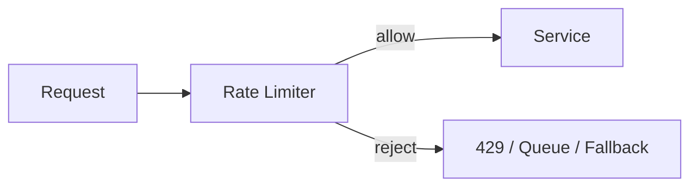

# 限流算法深挖

限流不是一个算法，而是一组控制流量进入系统的策略。面试里常见问题是：固定窗口、滑动窗口、令牌桶、漏桶有什么区别？为什么秒杀更常用令牌桶或排队？全局限流为什么不能只放在应用内存里？



## 场景

常见限流对象：

- 按用户：每个用户每分钟最多 60 次请求。
- 按接口：下单接口总 QPS 不超过 5000。
- 按资源：某个活动、商品、车次限制并发。
- 按下游依赖：调用支付渠道或短信渠道不能超过 SLA。

## 固定窗口

固定窗口把时间切成一段段窗口，例如每分钟一个计数。

```pseudo
function allow(userId):
    key = "rate:user:" + userId + ":" + currentMinute()
    count = redis.incr(key)
    redis.expire(key, 2 minutes)
    return count <= 60
```

优点：简单。

缺点：窗口边界会放过突刺。

```text
12:00:59 允许 60 次
12:01:00 又允许 60 次
实际 1 秒内通过 120 次
```

适合：粗粒度保护、低风险接口。

## 滑动窗口

滑动窗口统计最近一段真实时间内的请求数。

Redis ZSet 伪代码：

```pseudo
function allow(userId):
    key = "rate:user:" + userId
    now = currentMillis()
    windowStart = now - 60000
    member = now + ":" + generateRequestId()

    return redis.evalLua(
        key,
        now,
        windowStart,
        member,
        limit = 60,
        ttlSeconds = 120
    )
```

Lua 脚本内部按顺序执行 `ZREMRANGEBYSCORE -> ZCARD -> ZADD -> EXPIRE`，整个脚本是原子的。不要在应用层分四次调用，否则两个并发请求可能都看到 `count < limit`，最终放过超过限制的请求。`member` 也要唯一，避免同一毫秒内多个请求覆盖同一个 ZSet 成员。

优点：比固定窗口更平滑。

缺点：每次请求要维护时间序列，成本更高。

适合：用户维度精确限流、登录/验证码等风险接口。

## 令牌桶

令牌桶按固定速率往桶里放令牌，请求来了拿一个令牌。桶里有令牌就放行，没有就拒绝或排队。

```pseudo
class TokenBucket:
    capacity = 100
    refillRate = 10 tokens per second
    tokens = 100
    lastRefillAt = now()

    function allow():
        refill()

        if tokens <= 0:
            return false

        tokens -= 1
        return true

    function refill():
        elapsed = now() - lastRefillAt
        tokens = min(capacity, tokens + elapsed * refillRate)
        lastRefillAt = now()
```

优点：允许一定突发流量，同时控制长期平均速率。

适合：秒杀入口、API Gateway、服务调用保护。

## 漏桶

漏桶把请求放入桶中，按固定速率流出。桶满则拒绝。

```pseudo
function submit(request):
    if queue.size >= capacity:
        return false

    queue.push(request)
    return true

function workerLoop():
    every 10 milliseconds:
        request = queue.pop()
        handle(request)
```

优点：输出速率稳定。

缺点：突发流量会排队，增加延迟。

适合：短信发送、渠道调用、后台任务处理。

## 怎么选

| 算法 | 特点 | 适合场景 |
| --- | --- | --- |
| 固定窗口 | 简单，边界突刺明显 | 粗粒度限流 |
| 滑动窗口 | 更精确，成本较高 | 用户/验证码/登录 |
| 令牌桶 | 允许突发，控制平均速率 | 秒杀入口、API 限流 |
| 漏桶 | 输出平滑，可能排队 | 渠道发送、worker 处理 |

## 单机限流和全局限流

反例：每个实例内存限流 100 QPS。

```text
10 个实例 * 100 QPS = 总共 1000 QPS
扩容到 30 个实例后，总限流变成 3000 QPS
```

如果目标是保护全局数据库或下游，不能只用单机内存限流。

全局限流方案：

- API Gateway 统一限流。
- Redis 共享计数或令牌桶。
- 服务网格或专用限流服务。

Redis 令牌桶伪代码：

```pseudo
function allowGlobal(key):
    return redis.eval(luaScript, keys = [key], args = [capacity, refillRate, now])
```

Redis Lua 要把 refill 和扣 token 放在一个原子操作里。

## 被限流后怎么办

限流不是只返回错误。不同场景处理不同：

| 场景 | 行为 |
| --- | --- |
| 普通 API | 返回 `429 Too Many Requests` |
| 秒杀活动 | 返回排队中或售罄 |
| 报表导出 | 进入任务队列 |
| 推荐/评论等非核心模块 | 降级隐藏 |
| 下游渠道 | 延迟重试或切换渠道 |

## 失败补偿

| 问题 | 后果 | 处理 |
| --- | --- | --- |
| 限流状态在本地内存 | 扩容后总流量变大 | 用网关或 Redis 全局限流 |
| Redis 限流不可用 | 无法判断是否放行 | fail closed 保护核心，或 fail open 保可用 |
| 阈值太低 | 大量误伤用户 | 灰度配置、白名单、动态调整 |
| 阈值太高 | 下游被打垮 | 基于压测和 SLO 设置阈值 |

## 面试怎么讲

可以这样回答：

> 固定窗口简单但有边界突刺，滑动窗口更精确但成本更高。令牌桶按固定速率补充 token，允许一定突发，适合 API 和秒杀入口；漏桶让请求按固定速率流出，适合保护短信、支付渠道等下游。单机限流只能保护单实例，全局限流要放在网关、Redis 或专用限流服务。被限流后不一定只返回 429，也可以排队、降级或返回旧结果。

## 检查清单

- 限流目标是保护用户、接口、资源还是下游？
- 是单机限流还是全局限流？
- 阈值是否来自压测和下游容量？
- 被限流后返回 429、排队还是降级？
- 限流规则是否支持灰度、白名单和快速回滚？
- 限流命中率、拒绝数、排队长度是否有监控？

## 延伸阅读

- [限流](../reliability/rate-limit.md)
- [限流规则设计](../recipes/rate-limit-rule-design.md)
- [秒杀系统设计](../system-design/flash-sale-system.md)
