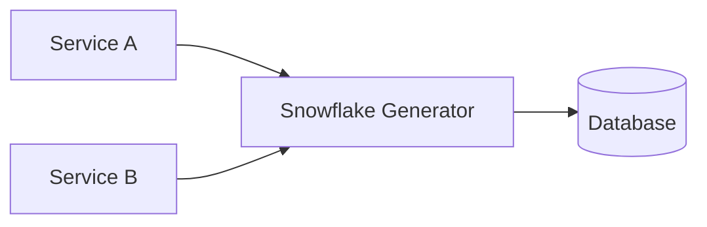

# 雪花 ID / 分布式 ID

分布式系统里，经常需要多个服务实例同时生成唯一 ID，例如订单 ID、消息 ID、支付流水 ID。雪花 ID 是一种常见方案：不依赖数据库自增，也能生成趋势递增的全局唯一 ID。



## 场景

适合用分布式 ID 的场景：

- 多个服务实例都要创建订单、消息、任务。
- 不能每次生成 ID 都访问数据库。
- 希望 ID 大致按时间递增，方便数据库索引写入。
- 需要从 ID 里看出创建时间或来源机器。

## 是什么

经典 Snowflake 用 64 bit 表示一个 ID：

```text
0 | timestamp | worker_id | sequence
```

常见划分：

| 部分 | 位数 | 含义 |
| --- | --- | --- |
| sign | 1 | 固定 0，保证正数 |
| timestamp | 41 | 当前时间与自定义纪元的毫秒差 |
| worker_id | 10 | 机器或节点编号 |
| sequence | 12 | 同一毫秒内的自增序号 |

这样一个节点每毫秒最多生成 `4096` 个 ID，1024 个节点可以并行生成。

## 为什么需要

反例：所有服务都依赖数据库自增 ID。

```pseudo
function createOrder(request):
    id = database.nextAutoIncrementId()
    insert orders(id, request)
```

问题：

- 数据库成为 ID 生成瓶颈。
- 分库分表后，不同库的自增 ID 会冲突。
- 每次生成 ID 都要访问数据库，延迟和可用性受影响。

反例：直接用 UUID。

```pseudo
id = uuid()
insert orders(id, request)
```

问题：

- UUID 通常不按时间递增，B+Tree 索引写入更随机。
- ID 很长，不利于日志排查和人工沟通。
- 无法直接判断大致生成时间。

## 推荐做法

雪花 ID 生成伪代码：

```pseudo
class SnowflakeGenerator:
    epoch = 1704067200000
    workerId = 17
    lastTimestamp = -1
    sequence = 0

    function nextId():
        now = currentTimeMillis()

        if now < lastTimestamp:
            raise ClockMovedBackwardError(lastTimestamp - now)

        if now == lastTimestamp:
            sequence = (sequence + 1) & 4095
            if sequence == 0:
                now = waitUntilNextMillis(lastTimestamp)
        else:
            sequence = 0

        lastTimestamp = now

        return ((now - epoch) << 22) | (workerId << 12) | sequence
```

## 关键问题：时钟回拨

雪花 ID 依赖本机时间。如果机器时间往回跳，可能生成重复 ID。

```text
1. lastTimestamp = 1000
2. 已生成 timestamp=1000, sequence=1
3. 系统时钟回拨到 999
4. 继续生成 ID 可能和历史 ID 冲突
```

常见处理方式：

| 方式 | 做法 | 代价 |
| --- | --- | --- |
| 小回拨等待 | 回拨几毫秒就 sleep 等待 | 生成 ID 延迟增加 |
| 大回拨拒绝 | 回拨超过阈值直接报错 | 需要告警和摘除节点 |
| 使用时钟服务 | 统一授时和监控 | 运维复杂度更高 |
| worker_id 临时切换 | 回拨时换 worker_id | worker_id 管理更复杂 |

推荐：小回拨等待，大回拨拒绝并告警，不要默默继续生成。

## worker_id 怎么分配

worker_id 必须唯一。常见方案：

- 配置中心静态分配：简单，但扩容要管理配置。
- 服务启动时向注册中心申请：自动化更好，但要处理租约过期。
- Kubernetes StatefulSet ordinal：适合固定副本编号。
- IP/hash 生成：容易冲突，不推荐作为唯一依据。

租约式 worker_id 伪代码：

```pseudo
function acquireWorkerId(instanceId):
    for workerId in 0..1023:
        success = registry.createLease(
            key = "snowflake/worker/" + workerId,
            value = instanceId,
            ttl = 30 seconds
        )
        if success:
            keepAlive(workerId)
            return workerId

    raise NoWorkerIdAvailable
```

如果租约失效，实例必须停止生成 ID。

## 和其他方案对比

| 方案 | 优点 | 缺点 | 适合场景 |
| --- | --- | --- | --- |
| 数据库自增 | 简单，严格递增 | 单点瓶颈，分库冲突 | 单库小系统 |
| UUID | 本地生成，无协调 | 长、随机、索引不友好 | 不关心排序的对象 |
| Redis INCR | 简单递增 | 依赖 Redis，可用性问题 | 中小规模计数型 ID |
| 号段模式 | DB 压力低，趋势递增 | 号段浪费，服务要缓存号段 | 业务 ID 平台 |
| Snowflake | 本地生成，趋势递增 | 依赖时钟和 worker_id | 订单、消息、任务 ID |

## 失败补偿

| 问题 | 后果 | 处理 |
| --- | --- | --- |
| worker_id 冲突 | 不同节点生成重复 ID | 启动时租约申请，唯一约束监控 |
| 时钟回拨 | ID 重复或乱序 | 小回拨等待，大回拨停止服务 |
| 同毫秒序列耗尽 | 无法继续生成 | 等待下一毫秒 |
| epoch 设计不合理 | 可用年份不足 | 选业务开始时间附近的 epoch |

## 面试怎么讲

可以这样回答：

> 雪花 ID 是一种本地生成的分布式 ID。它通常用 64 bit 表示，包含时间戳、机器号和同毫秒序列号。好处是不依赖数据库，多个节点可以并行生成，而且 ID 大致递增，对数据库索引比较友好。关键风险是时钟回拨和 worker_id 冲突。时钟小幅回拨可以等待，大幅回拨要停止生成并告警；worker_id 要通过配置中心、注册中心租约或 StatefulSet 编号保证唯一。

## 检查清单

- worker_id 是否全局唯一？
- 时钟回拨是否有明确处理策略？
- 同毫秒序列耗尽是否等待下一毫秒？
- 数据库是否仍有主键唯一约束兜底？
- 日志和监控是否记录 ID 生成失败、回拨、worker_id 冲突？

## 延伸阅读

- [数据库分页：雪花 ID 与游标](../database/pagination.md)
- [订单系统设计](../system-design/order-system.md)
- [Twitter Snowflake 介绍](https://blog.x.com/engineering/en_us/a/2010/announcing-snowflake)
