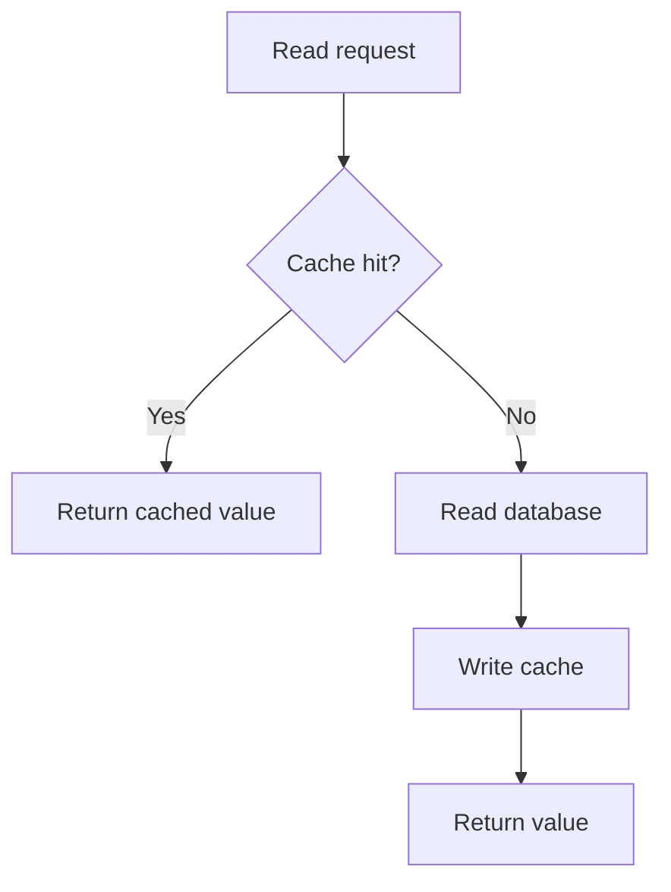

# Cache-Aside 模式

Cache-aside 是最常见的缓存模式：应用先读缓存，miss 后读数据库，再把结果写回缓存。它简单，但一致性、击穿和雪崩都需要额外设计。

## 后续扩写

- 先更新数据库还是先删缓存。
- 双删、延迟删除和 binlog 订阅。
- 读写路径的一致性边界。

## 延伸阅读

- [AWS: Caching strategies](https://docs.aws.amazon.com/whitepapers/latest/database-caching-strategies-using-redis/caching-patterns.html)
- [Azure Architecture Center: Cache-Aside pattern](https://learn.microsoft.com/en-us/azure/architecture/patterns/cache-aside)
