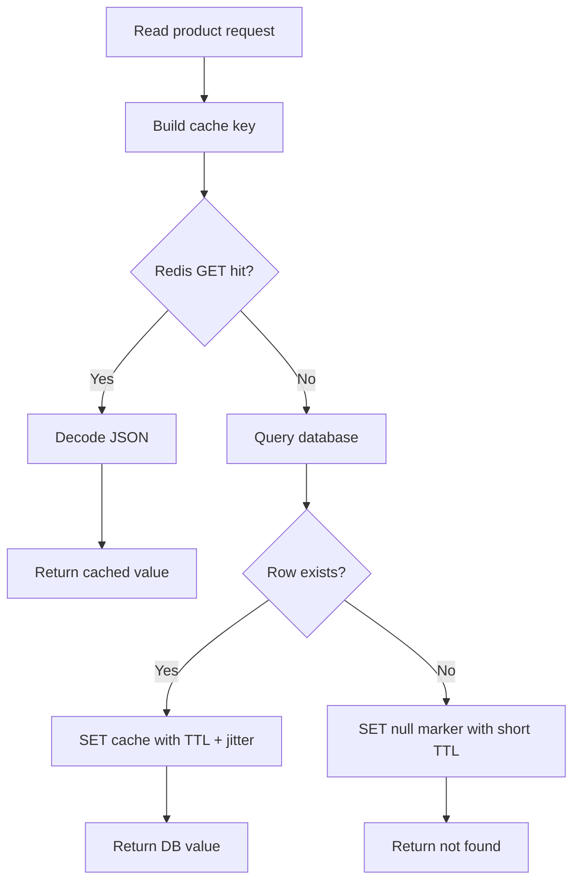
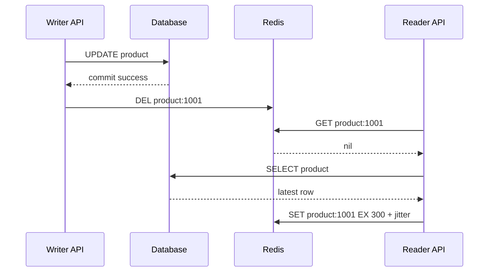
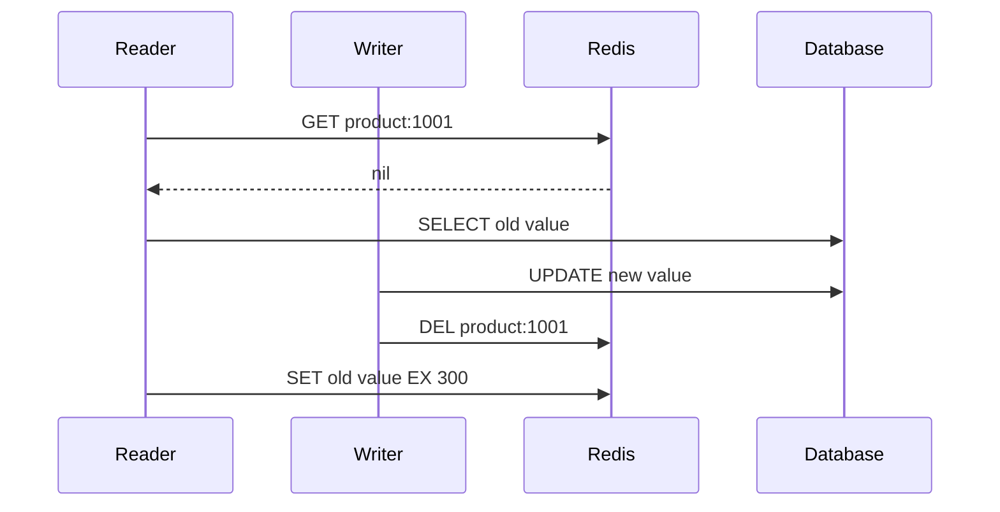
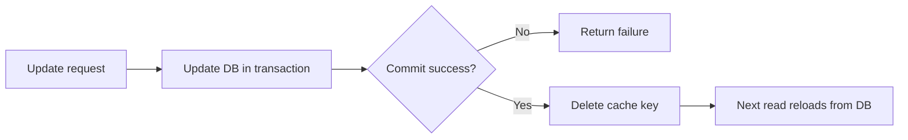
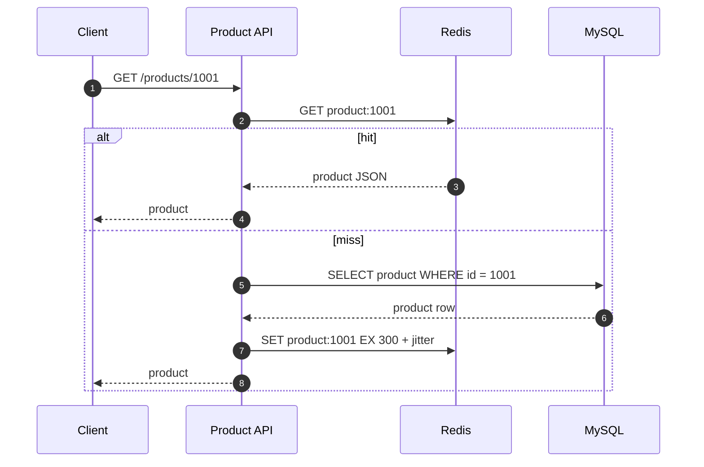

import Tabs from '@theme/Tabs';
import TabItem from '@theme/TabItem';

# Cache-Aside 模式

Cache-Aside 是最常见的缓存模式：应用先读缓存，缓存 miss 后读数据库，再把结果写回缓存。它简单、通用、容易接入现有系统，但一致性、热点 key、缓存击穿和缓存雪崩都需要额外设计。

## 先理解这些概念

- **缓存命中**：Redis 里有这份数据，应用直接返回，不查数据库。
- **缓存 miss**：Redis 里没有这份数据，应用需要继续查数据库。
- **回源**：缓存 miss 后回到数据库读取权威数据。回源是正常行为，但高并发同时回源会有风险。
- **TTL**：缓存过期时间。TTL 太短会频繁 miss，TTL 太长会让用户更久看到旧数据。
- **删除缓存**：写数据时常见做法不是直接更新缓存，而是先更新数据库，再删除缓存，让下一次读重新加载。
- **短暂不一致**：数据库已经变了，但缓存还没刷新或删除，用户可能短时间看到旧值。

读这篇时先记住一句话：Cache-Aside 是“应用自己维护缓存”的模式，缓存只是加速层，数据库才是最终权威来源。

## 它是什么

Cache-Aside 也叫 lazy loading cache。缓存不主动从数据库同步数据，而是由应用在读路径上维护：

1. 先查 Redis。
2. 如果命中，直接返回缓存数据。
3. 如果未命中，查数据库。
4. 把数据库结果写入 Redis。
5. 返回结果。

写路径通常由应用先更新数据库，再删除缓存，让下一次读取重新加载新值。

## 为什么需要它

数据库擅长持久化和事务，但不适合承受所有高频读流量。商品详情、用户资料、配置项、权限信息、库存摘要、首页推荐等读多写少场景，如果每次都查数据库，会消耗连接池、CPU、IO 和锁资源。

Cache-Aside 的目标是把高频读请求挡在缓存层，降低数据库压力，并缩短接口响应时间。它尤其适合：数据可以短时间不完全实时、读多写少、缓存 miss 后可以从数据库恢复的场景。

## 它解决什么问题

| 能力 | 解决的问题 | 边界 |
| --- | --- | --- |
| 缓存读路径 | 降低数据库读压力，降低延迟 | 首次读取和过期后仍会回源数据库 |
| TTL | 避免缓存永久脏数据 | 过短会频繁 miss，过长会增加陈旧窗口 |
| 写后删缓存 | 避免更新数据库后继续读旧缓存 | 删除失败或并发读写仍可能短暂不一致 |
| 空值缓存 | 降低不存在数据反复打 DB 的风险 | 需要短 TTL，避免挡住后续创建的数据 |
| TTL jitter | 避免大量 key 同时过期 | 不能解决单个热点 key 击穿 |

它不能提供强一致性，也不能替代数据库事务。对余额、账务、权限变更这类强一致读写，不能只靠 Cache-Aside 保证正确性。

## 核心原理

读路径是 Cache-Aside 最核心的部分。



写路径通常不推荐“更新数据库后再更新缓存”，更常见的是“更新数据库后删除缓存”。这样可以让下一次读取按读路径重新加载最新数据。



但 Cache-Aside 的一致性不是绝对的。并发读写可能产生短暂旧值窗口，所以要明确业务能否接受。



上面的竞态说明：Cache-Aside 能降低读压力，但不是强一致协议。对一致性要求更高的业务，需要版本号、短 TTL、延迟双删、binlog/CDC 失效、或者直接绕过缓存读取权威数据。

## 最小示例

下面示例实现同一个商品详情缓存策略：

- key 使用 `product:{id}`。
- 命中缓存直接返回。
- miss 后查询数据库并写回缓存。
- 不存在的数据缓存短 TTL 的 null marker。
- 正常数据 TTL 增加 jitter，避免同一批 key 同时过期。
- 写路径先更新数据库，再删除缓存。

<Tabs groupId="language">
  <TabItem value="java" label="Java">

```java
import java.time.Duration;
import java.util.Optional;
import java.util.concurrent.ThreadLocalRandom;

record Product(long id, String name, long priceCents) {}

interface Cache {
    Optional<String> get(String key);
    void set(String key, String value, Duration ttl);
    void delete(String key);
}

interface ProductRepository {
    Optional<Product> findById(long id);
    void update(Product product);
}

interface JsonCodec {
    String encode(Product product);
    Product decodeProduct(String json);
}

public class ProductService {
    private static final String NULL_MARKER = "__null__";

    private final Cache cache;
    private final ProductRepository repository;
    private final JsonCodec json;

    public ProductService(Cache cache, ProductRepository repository, JsonCodec json) {
        this.cache = cache;
        this.repository = repository;
        this.json = json;
    }

    public Optional<Product> getProduct(long id) {
        String key = cacheKey(id);
        Optional<String> cached = cache.get(key);
        if (cached.isPresent()) {
            if (NULL_MARKER.equals(cached.get())) {
                return Optional.empty();
            }
            return Optional.of(json.decodeProduct(cached.get()));
        }

        Optional<Product> product = repository.findById(id);
        if (product.isEmpty()) {
            cache.set(key, NULL_MARKER, Duration.ofSeconds(30));
            return Optional.empty();
        }

        cache.set(key, json.encode(product.get()), ttlWithJitter());
        return product;
    }

    public void updateProduct(Product product) {
        repository.update(product);
        cache.delete(cacheKey(product.id()));
    }

    private String cacheKey(long id) {
        return "product:" + id;
    }

    private Duration ttlWithJitter() {
        return Duration.ofSeconds(300 + ThreadLocalRandom.current().nextInt(60));
    }
}
```

  </TabItem>
  <TabItem value="go" label="Go">

```go
package product

import (
    "context"
    "encoding/json"
    "errors"
    "fmt"
    "math/rand"
    "time"
)

const nullMarker = "__null__"

type Product struct {
    ID         int64  `json:"id"`
    Name       string `json:"name"`
    PriceCents int64  `json:"priceCents"`
}

type Cache interface {
    Get(ctx context.Context, key string) (string, error)
    Set(ctx context.Context, key string, value string, ttl time.Duration) error
    Delete(ctx context.Context, key string) error
}

type Repository interface {
    FindByID(ctx context.Context, id int64) (Product, error)
    Update(ctx context.Context, product Product) error
}

var ErrNotFound = errors.New("not found")

type Service struct {
    cache Cache
    repo  Repository
}

func (s Service) GetProduct(ctx context.Context, id int64) (Product, error) {
    key := cacheKey(id)
    cached, err := s.cache.Get(ctx, key)
    if err == nil && cached != "" {
        if cached == nullMarker {
            return Product{}, ErrNotFound
        }
        var product Product
        if err := json.Unmarshal([]byte(cached), &product); err != nil {
            return Product{}, err
        }
        return product, nil
    }

    product, err := s.repo.FindByID(ctx, id)
    if errors.Is(err, ErrNotFound) {
        _ = s.cache.Set(ctx, key, nullMarker, 30*time.Second)
        return Product{}, ErrNotFound
    }
    if err != nil {
        return Product{}, err
    }

    bytes, err := json.Marshal(product)
    if err != nil {
        return Product{}, err
    }
    _ = s.cache.Set(ctx, key, string(bytes), ttlWithJitter())
    return product, nil
}

func (s Service) UpdateProduct(ctx context.Context, product Product) error {
    if err := s.repo.Update(ctx, product); err != nil {
        return err
    }
    return s.cache.Delete(ctx, cacheKey(product.ID))
}

func cacheKey(id int64) string {
    return fmt.Sprintf("product:%d", id)
}

func ttlWithJitter() time.Duration {
    return time.Duration(300+rand.Intn(60)) * time.Second
}
```

  </TabItem>
  <TabItem value="typescript" label="TypeScript">

```typescript
type Product = {
  id: string;
  name: string;
  priceCents: number;
};

type Cache = {
  get(key: string): Promise<string | null>;
  set(key: string, value: string, ttlSeconds: number): Promise<void>;
  del(key: string): Promise<void>;
};

type ProductRepository = {
  findById(id: string): Promise<Product | null>;
  update(product: Product): Promise<void>;
};

const NULL_MARKER = '__null__';

export class ProductService {
  constructor(
    private readonly cache: Cache,
    private readonly repository: ProductRepository,
  ) {}

  async getProduct(id: string): Promise<Product | null> {
    const key = this.cacheKey(id);
    const cached = await this.cache.get(key);

    if (cached !== null) {
      if (cached === NULL_MARKER) {
        return null;
      }
      return JSON.parse(cached) as Product;
    }

    const product = await this.repository.findById(id);
    if (product === null) {
      await this.cache.set(key, NULL_MARKER, 30);
      return null;
    }

    await this.cache.set(key, JSON.stringify(product), ttlWithJitterSeconds());
    return product;
  }

  async updateProduct(product: Product): Promise<void> {
    await this.repository.update(product);
    await this.cache.del(this.cacheKey(product.id));
  }

  private cacheKey(id: string): string {
    return `product:${id}`;
  }
}

function ttlWithJitterSeconds(): number {
  return 300 + Math.floor(Math.random() * 60);
}
```

  </TabItem>
  <TabItem value="python" label="Python">

```python
import json
import random
from dataclasses import asdict, dataclass
from typing import Optional, Protocol


NULL_MARKER = "__null__"


@dataclass(frozen=True)
class Product:
    id: int
    name: str
    price_cents: int


class Cache(Protocol):
    def get(self, key: str) -> Optional[str]: ...
    def set(self, key: str, value: str, ttl_seconds: int) -> None: ...
    def delete(self, key: str) -> None: ...


class ProductRepository(Protocol):
    def find_by_id(self, product_id: int) -> Optional[Product]: ...
    def update(self, product: Product) -> None: ...


class ProductService:
    def __init__(self, cache: Cache, repository: ProductRepository):
        self.cache = cache
        self.repository = repository

    def get_product(self, product_id: int) -> Optional[Product]:
        key = self._cache_key(product_id)
        cached = self.cache.get(key)
        if cached is not None:
            if cached == NULL_MARKER:
                return None
            data = json.loads(cached)
            return Product(**data)

        product = self.repository.find_by_id(product_id)
        if product is None:
            self.cache.set(key, NULL_MARKER, ttl_seconds=30)
            return None

        self.cache.set(key, json.dumps(asdict(product)), ttl_seconds=self._ttl_with_jitter())
        return product

    def update_product(self, product: Product) -> None:
        self.repository.update(product)
        self.cache.delete(self._cache_key(product.id))

    def _cache_key(self, product_id: int) -> str:
        return f"product:{product_id}"

    def _ttl_with_jitter(self) -> int:
        return 300 + random.randint(0, 59)
```

  </TabItem>
</Tabs>

## 工程实践

### 1. 写路径优先“更新数据库，再删除缓存”

对大多数业务，推荐写路径是：先提交数据库事务，再删除缓存。原因是数据库是权威数据源，缓存是派生数据。直接更新缓存看起来能减少一次 miss，但很容易因为并发写、部分字段更新、序列化差异或删除失败制造更难排查的不一致。



### 2. 明确一致性窗口

Cache-Aside 的一致性通常是“最终一致”。如果业务允许几十毫秒到几分钟的陈旧窗口，可以用 TTL 和删除缓存控制风险。如果业务不能接受读旧值，例如支付状态、余额、权限撤销，需要采用更强的方案：绕过缓存读数据库、使用版本号、使用事件/CDC 驱动缓存失效，或在写后短时间内强制读主库。

### 3. 处理缓存 miss 的边界

缓存 miss 不一定代表数据存在但没缓存，也可能代表数据不存在、Redis 故障、序列化失败或 key 设计错误。工程上至少要区分：

- 真实 miss：回源数据库并写缓存。
- 空结果：写短 TTL null marker，防止穿透。
- Redis 故障：按业务决定 fail open 读数据库，还是 fail closed 返回错误。
- JSON 解码失败：删除坏缓存，回源数据库修复。

### 4. TTL 要加 jitter

如果一批商品缓存都设置固定 300 秒 TTL，它们可能在同一时间集中失效，形成缓存雪崩。给 TTL 加 0 到 60 秒随机抖动，可以降低同一时刻大规模过期的概率。

### 5. 观测缓存效果

Cache-Aside 上线后至少要观察：缓存命中率、Redis 延迟、Redis 连接池等待、DB QPS、DB 查询 P95/P99、缓存 key 数量、null marker 数量、删除缓存失败次数。

## 常见坑

- 把缓存当成权威数据源，数据库和缓存冲突时不知道信谁。
- 更新数据库后更新缓存，遇到并发写时旧请求覆盖新缓存。
- 删除缓存失败没有告警或重试，导致长时间读旧数据。
- 所有 key 使用固定 TTL，活动开始后同一批 key 同时过期。
- 缓存不存在数据时不写 null marker，非法 id 或爬虫流量持续打 DB。
- 缓存 value 过大，把 Redis 网络和内存打满。
- 忽略 Redis 故障路径，缓存挂了以后数据库被全量流量打穿。
- 在事务提交前删除缓存，其他请求可能立即回源读到旧数据并重新写入缓存。

## 完整案例：商品详情页缓存

### 场景

商品详情接口 `GET /products/{id}` 是典型读多写少接口。活动期间某些商品会成为热点，单个商品详情可能达到数千 QPS。如果每次都读数据库，数据库连接池和主库 CPU 都会成为瓶颈。

### 读路径



### 写路径

运营后台修改商品价格时，服务先更新数据库，再删除 `product:{id}`。下一次详情读取会重新加载最新价格。对于价格这种敏感字段，还可以在短时间内让详情接口读主库或对缓存中的版本号做校验。

### 风险控制

- 热点商品提前预热缓存。
- TTL 增加 jitter，避免批量失效。
- 对单个热点 key 的 miss 使用互斥回源，避免缓存击穿。
- Redis 故障时限流数据库回源，必要时返回降级字段。
- 商品更新后缓存删除失败要进入告警或补偿队列。

## 检查清单

学完这一节后，你应该能回答：

- Cache-Aside 的读路径是什么？写路径通常怎么做？
- 为什么推荐“更新数据库后删除缓存”，而不是直接更新缓存？
- Cache-Aside 能提供强一致性吗？并发读写下有哪些旧值窗口？
- TTL、null marker、jitter 分别解决什么问题？
- Redis 故障时，服务应该读数据库、返回错误，还是降级？取决于什么？
- 单个热点 key 过期时，如何避免大量请求同时回源数据库？
- 应该监控哪些指标判断缓存是否真的保护了数据库？

## 这篇文章在系统里怎么用

Cache-Aside 通常是你接入 Redis 的第一种模式。商品详情、用户资料、配置项、权限信息这类读多写少的数据，都可以先从这个模式开始。

在系统设计题里，提到 Cache-Aside 时不要只说“加 Redis”。要继续说明：缓存 miss 后如何回源、写操作为什么删除缓存、TTL 怎么设置、热点 key 过期时怎么防击穿、缓存不可用时数据库能不能扛住。

## 术语回看

- [回源](../system-design/glossary.md#回源)
- [热点 / 热 Key](../system-design/glossary.md#热点--热-key)
- [逻辑过期](../system-design/glossary.md#逻辑过期)
- [最终一致性](../system-design/glossary.md#最终一致性)

## 延伸阅读

- [AWS: Caching patterns](https://docs.aws.amazon.com/whitepapers/latest/database-caching-strategies-using-redis/caching-patterns.html)
- [Azure Architecture Center: Cache-Aside pattern](https://learn.microsoft.com/en-us/azure/architecture/patterns/cache-aside)
- [Redis Documentation](https://redis.io/docs/latest/)
- [Redis Commands: SET](https://redis.io/docs/latest/commands/set/)
- [Martin Fowler: Two Hard Things](https://martinfowler.com/bliki/TwoHardThings.html)
