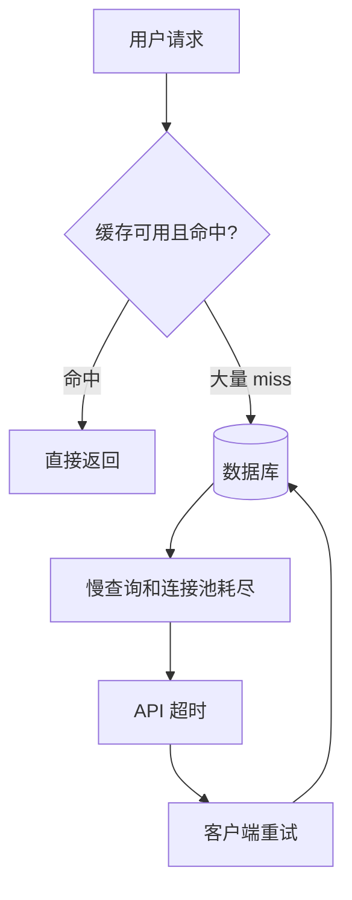
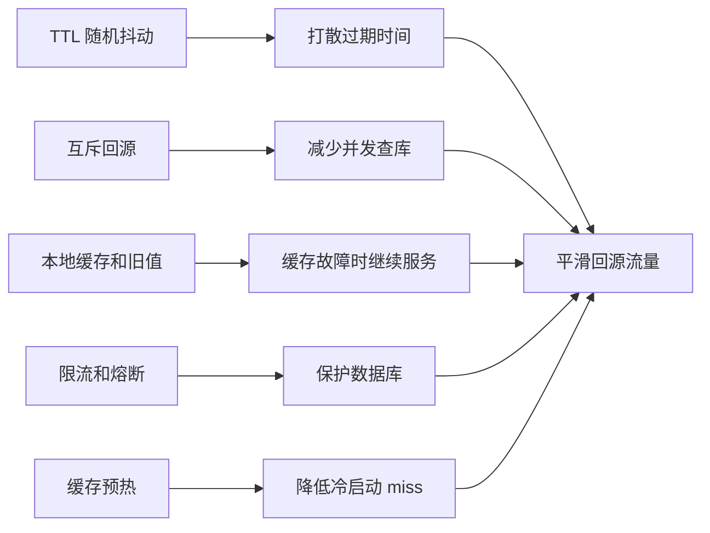
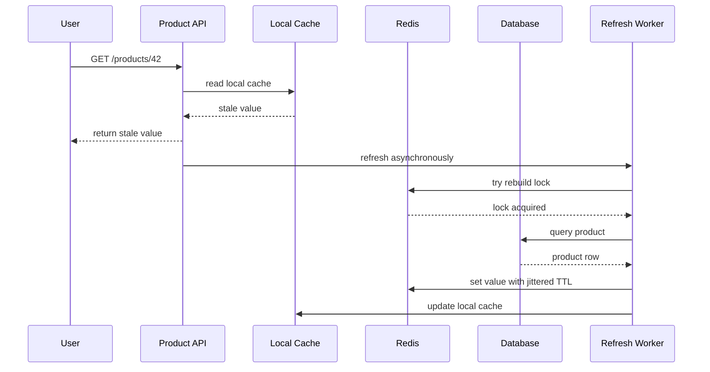

import Tabs from '@theme/Tabs';
import TabItem from '@theme/TabItem';

# 缓存雪崩

缓存雪崩不是单个热点 key 失效，而是大量缓存同时失效，或缓存集群整体不可用，导致原本被缓存吸收的请求瞬间压到数据库和下游服务。



## 它是什么

缓存雪崩是一个系统性失效场景：缓存层在短时间内无法承担原有流量，数据库、搜索、RPC 下游被迫承接突增流量，最终出现超时、重试放大和级联故障。

常见触发条件包括：

- 批量写入的 key 使用相同 TTL，在同一秒集中失效。
- Redis 主从切换、网络分区、集群扩缩容造成短时不可用。
- 发布或定时任务清空了大量缓存。
- 缓存预热不足，服务启动后直接面对全量流量。

## 为什么需要它

缓存本来是为了保护数据库，但如果过期策略和降级策略设计不好，缓存反而会把风险集中到某个时间点释放。高并发系统不能只关心“缓存命中率平均值”，还要关心 miss 是否会在时间上聚集。

如果没有雪崩防护，一个平时 95% 命中率的系统也可能在一分钟内把数据库打满：缓存层少承接的那 95% 流量会直接变成数据库的突刺流量。

## 它解决什么问题

雪崩治理的目标不是保证缓存永远不失效，而是让失效变得平滑、可控、可降级：

- 把同一时刻的集中失效打散成时间窗口内的分散失效。
- 在缓存不可用时限制回源流量，保护数据库。
- 通过本地缓存、默认值、旧值返回降低用户感知。
- 通过预热和后台刷新减少冷启动 miss。

## 核心原理

缓存雪崩通常需要组合治理，没有一个单点手段能覆盖全部场景。



核心做法：

- **TTL 抖动**：基础 TTL 加随机偏移，例如 `30m + random(0, 5m)`。
- **逻辑过期**：缓存里保存过期时间，读请求可以先返回旧值，由后台异步刷新。
- **互斥回源**：同一个 key miss 时只允许少量请求查库，其余等待、返回旧值或快速失败。
- **多级缓存**：Redis 前面加本地短 TTL 缓存，Redis 故障时仍能挡住一部分读流量。
- **限流降级**：缓存不可用时限制数据库 QPS，必要时返回默认值或稍旧数据。

## 最小示例

下面示例只展示 TTL 抖动的核心思想。真实系统还需要监控、限流和回源保护。

<Tabs groupId="language">
<TabItem value="java" label="Java">

```java
import java.time.Duration;
import java.util.concurrent.ThreadLocalRandom;

class CacheTtl {
    static Duration ttlWithJitter(Duration base, Duration jitter) {
        long extraMillis = ThreadLocalRandom.current().nextLong(jitter.toMillis() + 1);
        return base.plusMillis(extraMillis);
    }

    static void cacheProduct(RedisClient redis, String id, String json) {
        Duration ttl = ttlWithJitter(Duration.ofMinutes(30), Duration.ofMinutes(5));
        redis.set("product:" + id, json, ttl);
    }
}

interface RedisClient {
    void set(String key, String value, Duration ttl);
}
```

</TabItem>
<TabItem value="go" label="Go">

```go
package cache

import (
    "context"
    "math/rand"
    "time"
)

type Redis interface {
    Set(ctx context.Context, key string, value string, ttl time.Duration) error
}

func ttlWithJitter(base, jitter time.Duration) time.Duration {
    return base + time.Duration(rand.Int63n(int64(jitter)+1))
}

func CacheProduct(ctx context.Context, r Redis, id string, json string) error {
    ttl := ttlWithJitter(30*time.Minute, 5*time.Minute)
    return r.Set(ctx, "product:"+id, json, ttl)
}
```

</TabItem>
<TabItem value="typescript" label="TypeScript">

```ts
function ttlWithJitter(baseSeconds: number, jitterSeconds: number): number {
  return baseSeconds + Math.floor(Math.random() * (jitterSeconds + 1));
}

async function cacheProduct(redis: Redis, id: string, json: string) {
  const ttl = ttlWithJitter(30 * 60, 5 * 60);
  await redis.set(`product:${id}`, json, { EX: ttl });
}

interface Redis {
  set(key: string, value: string, options: { EX: number }): Promise<void>;
}
```

</TabItem>
<TabItem value="python" label="Python">

```python
import random


def ttl_with_jitter(base_seconds: int, jitter_seconds: int) -> int:
    return base_seconds + random.randint(0, jitter_seconds)


async def cache_product(redis, product_id: str, json: str) -> None:
    ttl = ttl_with_jitter(30 * 60, 5 * 60)
    await redis.set(f"product:{product_id}", json, ex=ttl)
```

</TabItem>
</Tabs>

## 工程实践

- 对批量写入、定时刷新、数据导入产生的 key 默认加 TTL 抖动。
- 对核心读接口增加回源并发限制，避免 miss 后所有请求同时查库。
- 对可接受短暂陈旧的数据使用 `stale-while-revalidate`：先返回旧值，后台刷新。
- Redis 不可用时走降级路径，例如本地缓存、只读快照、默认配置、部分字段隐藏。
- 为缓存层设置独立告警：命中率、miss QPS、Redis 错误率、数据库回源 QPS、缓存重建耗时。
- 做容量评估时按“缓存全部不可用 1 到 5 分钟”压测数据库和限流策略。

## 常见坑

- 只给热点 key 加保护，忽略大量普通 key 同时过期也会造成雪崩。
- 定时任务每天零点统一刷新缓存，导致零点附近出现固定流量尖峰。
- Redis 故障时无限重试，反而把业务线程和连接池耗尽。
- 缓存预热脚本直接全速扫库，预热阶段先把数据库打满。
- 本地缓存没有容量上限，Redis 故障时进程内存被撑爆。

## 完整案例

一个商品详情页平时 Redis 命中率 98%，数据库能稳定承接 300 QPS。某次价格批量更新后，服务把 20 万个商品缓存都写成 30 分钟 TTL。30 分钟后大量 key 同时过期，详情页 8000 QPS 中的主要流量开始回源数据库，数据库连接池耗尽，接口超时后客户端重试，雪崩扩大到订单确认页。

修复方案：

1. 商品缓存 TTL 改为 `30m + random(0, 10m)`。
2. 商品详情 miss 后按商品 ID 做单飞回源，同一商品最多一个请求查库。
3. 缓存值增加逻辑过期时间，过期 2 分钟内允许返回旧值并异步刷新。
4. Redis 错误率超过阈值时，详情页只读取本地 30 秒缓存，并对数据库回源做限流。
5. 批量更新后只预热 Top N 商品，其余商品按访问懒加载。



## 检查清单

- 是否所有批量写入的缓存都有 TTL 抖动？
- 是否定义了 Redis 不可用时的降级策略？
- 是否限制了 miss 后的数据库回源并发？
- 是否监控缓存命中率和回源 QPS 的突变？
- 是否压测过缓存冷启动、批量过期、Redis 故障三类场景？
- 是否允许低风险场景返回旧值，而不是同步等待重建？

## 延伸阅读

- [Redis: Key expiration](https://redis.io/docs/latest/commands/expire/)
- [Redis: Client-side caching](https://redis.io/docs/latest/develop/use/client-side-caching/)
- [Google SRE Book: Handling Overload](https://sre.google/sre-book/handling-overload/)
- [AWS Builders Library: Caching challenges and strategies](https://aws.amazon.com/builders-library/caching-challenges-and-strategies/)
