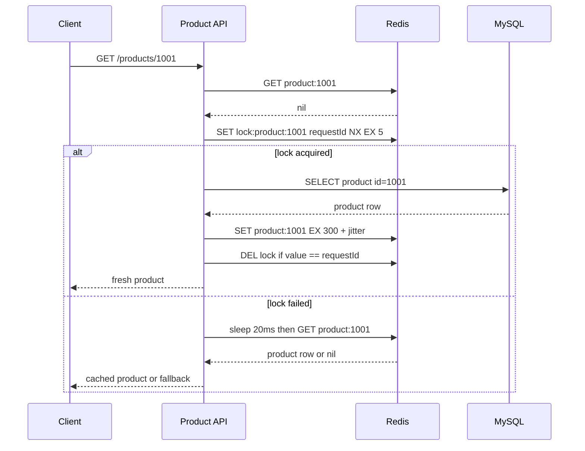
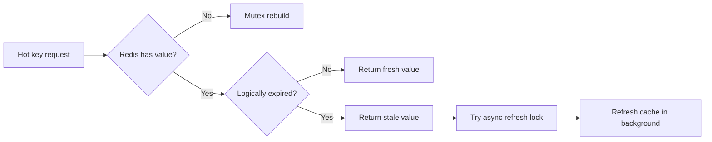
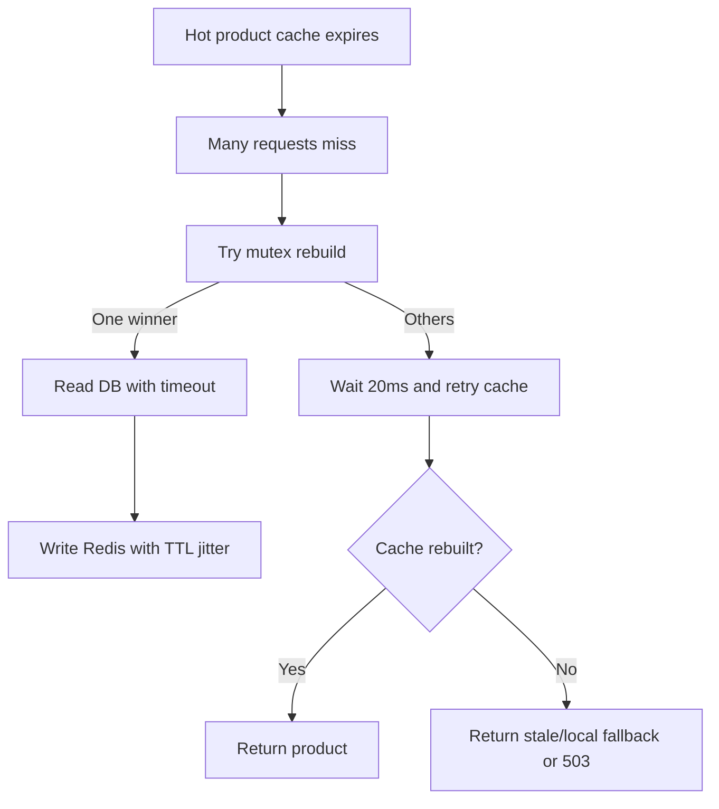

import Tabs from '@theme/Tabs';
import TabItem from '@theme/TabItem';

# Redis 缓存击穿

缓存击穿指某个热点 key 在失效瞬间，大量请求同时发现缓存为空，然后一起回源数据库。它和缓存穿透、缓存雪崩不同：击穿通常发生在“单个热点 key”上，是高并发读场景里最常见的数据库保护问题之一。

## 先理解这些概念

- **热点 key**：访问量特别高的缓存 key，比如首页商品、热门帖子、直播间信息。
- **过期瞬间**：缓存 TTL 到期后，Redis 删除这个 key，下一次读取会 miss。
- **并发回源**：很多请求同时 miss，然后同时去查数据库。数据库其实只需要查一次，却被重复打很多次。
- **互斥回源**：只允许一个请求查数据库并重建缓存，其他请求等待、返回旧值或快速失败。
- **逻辑过期**：缓存物理上不删除，只在 value 里放过期时间。过期后先返回旧值，再后台刷新。

读这篇时可以把击穿想成“一个很热的缓存门突然打开了，所有请求一起冲向数据库”。治理重点是让回源变成少量、可控、可降级。

## 它是什么

缓存击穿的关键条件有三个：

1. 某个 key 是热点，例如首页推荐商品、热门帖子、直播间信息。
2. 这个 key 刚好过期或被删除。
3. 大量请求在缓存重建完成前同时访问它。

例如商品 `product:1001` 是首页推荐商品，缓存 TTL 是 5 分钟。某一刻缓存过期，1 秒内有 10,000 个请求同时访问商品详情。如果每个请求都发现 Redis miss 并查询 MySQL，数据库会承受 10,000 次重复查询。

## 为什么需要它

Cache-Aside 模式下，缓存 miss 后回源数据库是正常行为。但对热点 key 来说，miss 的瞬间会产生“并发回源”。数据库原本只需要处理 1 次查询来重建缓存，却被大量重复请求打满。

缓存击穿的危险在于它非常短暂，但冲击很强：数据库连接池被占满、查询排队、API 线程等待、P99 延迟飙升，调用方可能重试，最终把一个 key 的过期放大成整个服务的故障。

## 它解决什么问题

| 方案 | 解决的问题 | 边界 |
| --- | --- | --- |
| 互斥回源 | 只允许一个请求查数据库并重建缓存 | 锁超时和释放必须正确 |
| TTL jitter | 避免大量 key 同时过期 | 不能单独解决单个热点 key |
| 热点预热 | 活动前提前写入热点缓存 | 需要知道热点集合 |
| 逻辑过期 | 返回旧值，后台异步刷新 | 会牺牲短时间新鲜度 |
| 本地缓存 | 降低 Redis 和 DB 压力 | 多实例一致性更弱 |
| 限流降级 | 保护数据库和 API 线程池 | 用户可能看到降级结果 |

缓存击穿治理的目标不是保证缓存永远命中，而是在缓存 miss 时控制回源并发，让数据库只承担可控流量。

## 核心原理

没有保护时，所有请求都会同时回源。


互斥回源的核心是：缓存 miss 后，只有拿到锁的请求访问数据库并重建缓存；没拿到锁的请求短暂等待后再读缓存，或者返回旧值/降级结果。



对极高频热点，可以使用逻辑过期：Redis 中的 value 不靠物理 TTL 立即消失，而是包含 `expireAt`。请求发现逻辑过期时，先返回旧值，再由后台刷新。



## 最小示例

下面示例实现同一个互斥回源策略：

- 先读 `product:{id}`。
- miss 后尝试 `SET lock:{key} requestId NX EX 5`。
- 拿到锁的请求查数据库并写缓存。
- 没拿到锁的请求短暂等待，再读一次缓存。
- 释放锁时校验 value，避免误删其他请求的锁。
- 缓存 TTL 增加 jitter。

<Tabs groupId="language">
  <TabItem value="java" label="Java">

```java
import java.time.Duration;
import java.util.Optional;
import java.util.UUID;
import java.util.concurrent.ThreadLocalRandom;

record Product(long id, String name, long priceCents) {}

interface Cache {
    Optional<Product> getProduct(String key);
    void setProduct(String key, Product product, Duration ttl);
    boolean setIfAbsent(String key, String value, Duration ttl);
    void deleteIfValueEquals(String key, String value);
}

interface ProductRepository {
    Product findById(long id);
}

public class ProductService {
    private final Cache cache;
    private final ProductRepository repository;

    public ProductService(Cache cache, ProductRepository repository) {
        this.cache = cache;
        this.repository = repository;
    }

    public Product getProduct(long id) throws InterruptedException {
        String key = "product:" + id;
        Optional<Product> cached = cache.getProduct(key);
        if (cached.isPresent()) {
            return cached.get();
        }

        String lockKey = "lock:" + key;
        String lockValue = UUID.randomUUID().toString();
        boolean locked = cache.setIfAbsent(lockKey, lockValue, Duration.ofSeconds(5));

        if (locked) {
            try {
                Product product = repository.findById(id);
                cache.setProduct(key, product, ttlWithJitter());
                return product;
            } finally {
                cache.deleteIfValueEquals(lockKey, lockValue);
            }
        }

        Thread.sleep(20);
        return cache.getProduct(key)
            .orElseThrow(() -> new IllegalStateException("product cache rebuilding"));
    }

    private Duration ttlWithJitter() {
        return Duration.ofSeconds(300 + ThreadLocalRandom.current().nextInt(60));
    }
}
```

  </TabItem>
  <TabItem value="go" label="Go">

```go
package product

import (
    "context"
    "errors"
    "fmt"
    "math/rand"
    "time"
)

type Product struct {
    ID         int64
    Name       string
    PriceCents int64
}

type Cache interface {
    GetProduct(ctx context.Context, key string) (Product, bool, error)
    SetProduct(ctx context.Context, key string, product Product, ttl time.Duration) error
    SetNX(ctx context.Context, key string, value string, ttl time.Duration) (bool, error)
    DeleteIfValueEquals(ctx context.Context, key string, value string) error
}

type Repository interface {
    FindByID(ctx context.Context, id int64) (Product, error)
}

var ErrRebuilding = errors.New("product cache rebuilding")

type Service struct {
    cache Cache
    repo  Repository
}

func (s Service) GetProduct(ctx context.Context, id int64) (Product, error) {
    key := fmt.Sprintf("product:%d", id)
    if product, ok, err := s.cache.GetProduct(ctx, key); err != nil || ok {
        return product, err
    }

    lockKey := "lock:" + key
    lockValue := fmt.Sprintf("%d-%d", time.Now().UnixNano(), rand.Int63())
    locked, err := s.cache.SetNX(ctx, lockKey, lockValue, 5*time.Second)
    if err != nil {
        return Product{}, err
    }

    if locked {
        defer s.cache.DeleteIfValueEquals(ctx, lockKey, lockValue)
        product, err := s.repo.FindByID(ctx, id)
        if err != nil {
            return Product{}, err
        }
        _ = s.cache.SetProduct(ctx, key, product, ttlWithJitter())
        return product, nil
    }

    time.Sleep(20 * time.Millisecond)
    if product, ok, err := s.cache.GetProduct(ctx, key); err != nil || ok {
        return product, err
    }
    return Product{}, ErrRebuilding
}

func ttlWithJitter() time.Duration {
    return time.Duration(300+rand.Intn(60)) * time.Second
}
```

  </TabItem>
  <TabItem value="typescript" label="TypeScript">

```typescript
type Product = {
  id: string;
  name: string;
  priceCents: number;
};

type Cache = {
  getProduct(key: string): Promise<Product | null>;
  setProduct(key: string, product: Product, ttlSeconds: number): Promise<void>;
  setNX(key: string, value: string, ttlSeconds: number): Promise<boolean>;
  deleteIfValueEquals(key: string, value: string): Promise<void>;
};

type ProductRepository = {
  findById(id: string): Promise<Product>;
};

const sleep = (ms: number) => new Promise((resolve) => setTimeout(resolve, ms));

export class ProductService {
  constructor(
    private readonly cache: Cache,
    private readonly repository: ProductRepository,
  ) {}

  async getProduct(id: string): Promise<Product> {
    const key = `product:${id}`;
    const cached = await this.cache.getProduct(key);
    if (cached !== null) {
      return cached;
    }

    const lockKey = `lock:${key}`;
    const lockValue = crypto.randomUUID();
    const locked = await this.cache.setNX(lockKey, lockValue, 5);

    if (locked) {
      try {
        const product = await this.repository.findById(id);
        await this.cache.setProduct(key, product, ttlWithJitterSeconds());
        return product;
      } finally {
        await this.cache.deleteIfValueEquals(lockKey, lockValue);
      }
    }

    await sleep(20);
    const afterWait = await this.cache.getProduct(key);
    if (afterWait !== null) {
      return afterWait;
    }
    throw new Error('product cache rebuilding');
  }
}

function ttlWithJitterSeconds(): number {
  return 300 + Math.floor(Math.random() * 60);
}
```

  </TabItem>
  <TabItem value="python" label="Python">

```python
import random
import time
import uuid
from dataclasses import dataclass
from typing import Optional, Protocol


@dataclass(frozen=True)
class Product:
    id: int
    name: str
    price_cents: int


class Cache(Protocol):
    def get_product(self, key: str) -> Optional[Product]: ...
    def set_product(self, key: str, product: Product, ttl_seconds: int) -> None: ...
    def set_nx(self, key: str, value: str, ttl_seconds: int) -> bool: ...
    def delete_if_value_equals(self, key: str, value: str) -> None: ...


class ProductRepository(Protocol):
    def find_by_id(self, product_id: int) -> Product: ...


class ProductService:
    def __init__(self, cache: Cache, repository: ProductRepository):
        self.cache = cache
        self.repository = repository

    def get_product(self, product_id: int) -> Product:
        key = f"product:{product_id}"
        cached = self.cache.get_product(key)
        if cached is not None:
            return cached

        lock_key = f"lock:{key}"
        lock_value = str(uuid.uuid4())
        locked = self.cache.set_nx(lock_key, lock_value, ttl_seconds=5)

        if locked:
            try:
                product = self.repository.find_by_id(product_id)
                self.cache.set_product(key, product, ttl_seconds=self._ttl_with_jitter())
                return product
            finally:
                self.cache.delete_if_value_equals(lock_key, lock_value)

        time.sleep(0.02)
        after_wait = self.cache.get_product(key)
        if after_wait is not None:
            return after_wait
        raise RuntimeError("product cache rebuilding")

    def _ttl_with_jitter(self) -> int:
        return 300 + random.randint(0, 59)
```

  </TabItem>
</Tabs>

## 工程实践

### 1. 锁必须有过期时间和唯一值

互斥锁要使用 `SET key value NX EX seconds` 这类原子命令。锁 value 要唯一，释放锁时必须先比较 value 再删除，避免请求 A 执行太久导致锁过期，请求 B 拿到新锁后被请求 A 误删。

### 2. 锁过期时间要覆盖回源耗时

锁 TTL 太短，回源还没完成锁就过期，其他请求会继续回源；锁 TTL 太长，回源进程崩溃后其他请求等待时间变长。通常要参考数据库 P99、网络超时和缓存写入耗时，并设置明确的回源超时。

### 3. 没拿到锁的请求不能无限等待

等待请求要有上限，可以短暂 sleep 后重读缓存，也可以返回旧值或降级结果。无限等待会把 API 线程池拖垮，让击穿从数据库问题变成服务整体不可用。

### 4. 热点 key 使用组合策略

互斥回源只是底线。真正的热点 key 通常还需要：缓存预热、TTL jitter、本地缓存、逻辑过期、限流、降级和监控。

### 5. 观测击穿风险

至少监控：缓存命中率、单 key QPS、Redis miss 数、回源数据库 QPS、锁获取成功率、锁等待次数、重建耗时、降级次数、数据库连接池等待。

## 常见坑

- 锁没有过期时间，回源进程崩溃后造成永久阻塞。
- 释放锁时不校验 value，误删其他请求的新锁。
- 锁 TTL 小于数据库 P99，导致同一个热点 key 多批请求连续回源。
- 没拿到锁的请求无限等待，最终拖垮 API worker。
- 缓存重建失败后没有降级，所有请求持续重试回源。
- 只对热点 key 做互斥回源，却没有监控热点 key 和锁等待。
- 所有 key 使用相同 TTL，导致击穿和雪崩同时发生。

## 完整案例：首页推荐商品详情

### 场景

首页推荐位展示商品 `1001`，商品详情被客户端、搜索页、推荐页同时访问。活动开始后单 key QPS 达到 8,000。缓存 TTL 到期时，MySQL 查询从平时 50 QPS 瞬间升到 5,000 QPS，商品详情接口 P99 从 90 ms 升到 3 s。

### 治理路径



### 落地方案

- 活动前预热 `product:1001`。
- 正常 TTL 使用 `300s + 0..60s jitter`。
- miss 时使用 Redis `SET NX EX` 互斥回源。
- 回源数据库查询设置 100 ms 超时。
- 未拿到锁的请求最多等待一次，不做无限自旋。
- 极热点商品额外放入本地缓存 1 到 3 秒。
- 如果缓存重建失败，返回旧快照或降级文案，并触发告警。

## 检查清单

学完这一节后，你应该能回答：

- 缓存击穿、缓存穿透、缓存雪崩有什么区别？
- 为什么单个热点 key 过期能打垮数据库？
- 互斥回源的完整流程是什么？
- Redis 锁为什么必须有过期时间和唯一 value？
- 没拿到锁的请求应该等待、返回旧值，还是降级？取决于什么？
- 逻辑过期适合什么场景，代价是什么？
- 应该监控哪些指标来发现击穿风险？

## 这篇文章在系统里怎么用

缓存击穿通常出现在商品详情、活动配置、热门帖子、直播间、排行榜这类读很多的数据上。系统设计时，如果你说“这个热点数据放 Redis”，就要继续回答：这个 key 过期的一瞬间怎么办。

常见答案是组合拳：热点 key 预热，TTL 加随机抖动，miss 后用互斥回源，允许短暂旧值的场景使用逻辑过期。这样数据库不会因为单个热点 key 过期被打满。

## 术语回看

- [回源](../system-design/glossary.md#回源)
- [热点 / 热 Key](../system-design/glossary.md#热点--热-key)
- [逻辑过期](../system-design/glossary.md#逻辑过期)
- [削峰](../system-design/glossary.md#削峰)

## 延伸阅读

- [Redis Documentation](https://redis.io/docs/latest/)
- [Redis: Distributed Locks with Redis](https://redis.io/docs/latest/develop/use/patterns/distributed-locks/)
- [Redis Commands: SET](https://redis.io/docs/latest/commands/set/)
- [AWS: Caching patterns](https://docs.aws.amazon.com/whitepapers/latest/database-caching-strategies-using-redis/caching-patterns.html)
- [Martin Kleppmann: How to do distributed locking](https://martin.kleppmann.com/2016/02/08/how-to-do-distributed-locking.html)
