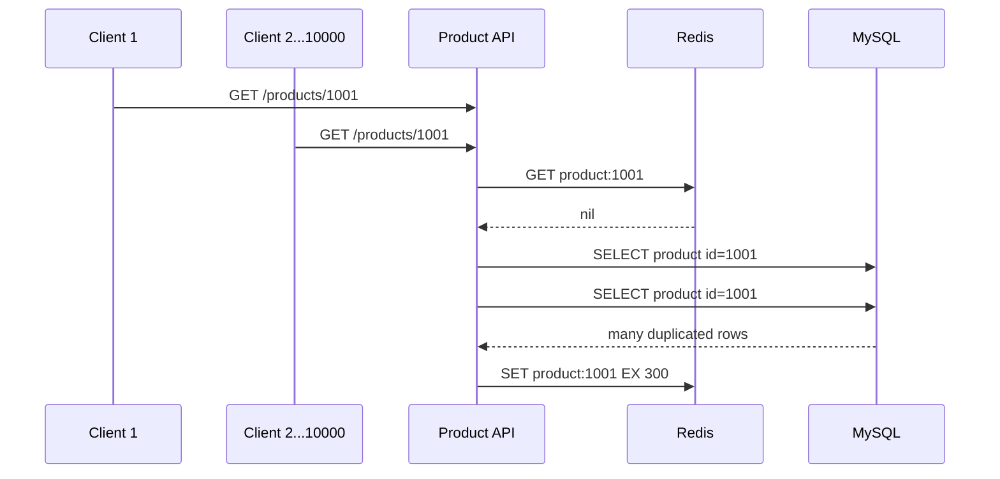
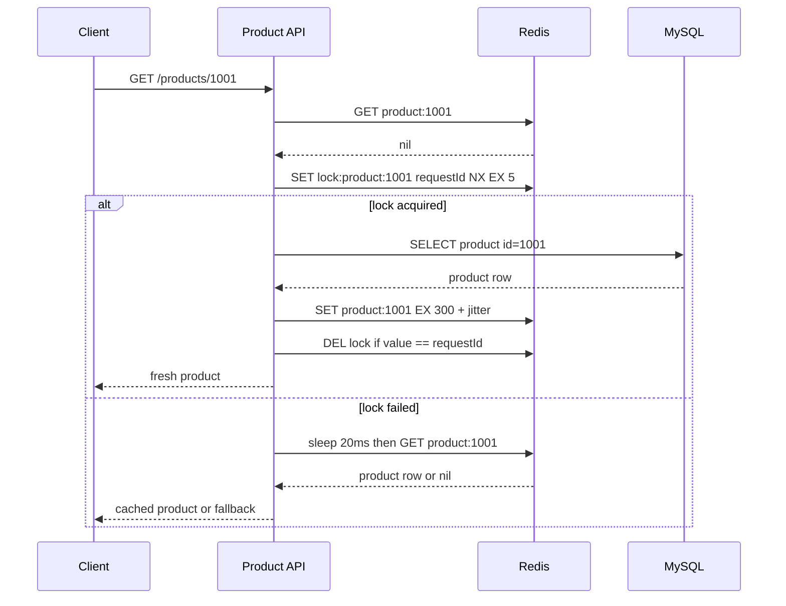
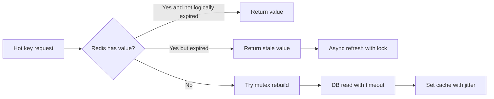

# Redis 缓存击穿

缓存击穿指某个热点 key 在失效瞬间，大量请求同时发现缓存为空，然后一起回源数据库。它和缓存穿透、缓存雪崩不同：击穿通常发生在“单个热点 key”上。

## 问题场景

商品 `product:1001` 是首页推荐商品。它的缓存 TTL 是 5 分钟。某一刻缓存过期，1 秒内有 10,000 个请求同时访问商品详情。

## 未保护的请求时序



## 互斥回源方案

核心思想：缓存 miss 后，只有一个请求拿到回源资格，其他请求短暂等待、重试读取缓存，或者直接返回旧值。



## 示例代码

```java
public Product getProduct(String id) {
    String cacheKey = "product:" + id;
    Product cached = redis.getJson(cacheKey, Product.class);
    if (cached != null) {
        return cached;
    }

    String lockKey = "lock:" + cacheKey;
    String lockValue = UUID.randomUUID().toString();
    boolean locked = redis.setNx(lockKey, lockValue, Duration.ofSeconds(5));

    if (locked) {
        try {
            Product product = productRepository.findById(id);
            int ttlSeconds = 300 + ThreadLocalRandom.current().nextInt(60);
            redis.setJson(cacheKey, product, Duration.ofSeconds(ttlSeconds));
            return product;
        } finally {
            redis.deleteIfValueEquals(lockKey, lockValue);
        }
    }

    sleepMillis(20);
    Product afterWait = redis.getJson(cacheKey, Product.class);
    if (afterWait != null) {
        return afterWait;
    }
    throw new ServiceBusyException("product cache rebuilding");
}
```

## 常见错误

- 锁没有过期时间，回源进程崩溃后造成永久阻塞。
- 释放锁时不校验 value，误删其他请求的新锁。
- 所有 key 使用相同 TTL，导致同一批缓存同时过期。
- 缓存 miss 时无限等待，最终把 API 线程池也拖垮。

## 工程化方案

热点 key 通常需要组合策略：互斥回源、防止 TTL 同步过期、后台预热、短期本地缓存、限流和降级。对于极高频热点，可以使用“逻辑过期”：Redis 里存数据和逻辑过期时间，请求先返回旧值，后台异步刷新。



## 延伸阅读

- [Redis Documentation](https://redis.io/docs/latest/)
- [Redis: Distributed Locks with Redis](https://redis.io/docs/latest/develop/use/patterns/distributed-locks/)
- [AWS Caching Overview](https://aws.amazon.com/caching/)
- [Martin Fowler: Cache-Aside](https://martinfowler.com/bliki/TwoHardThings.html)
