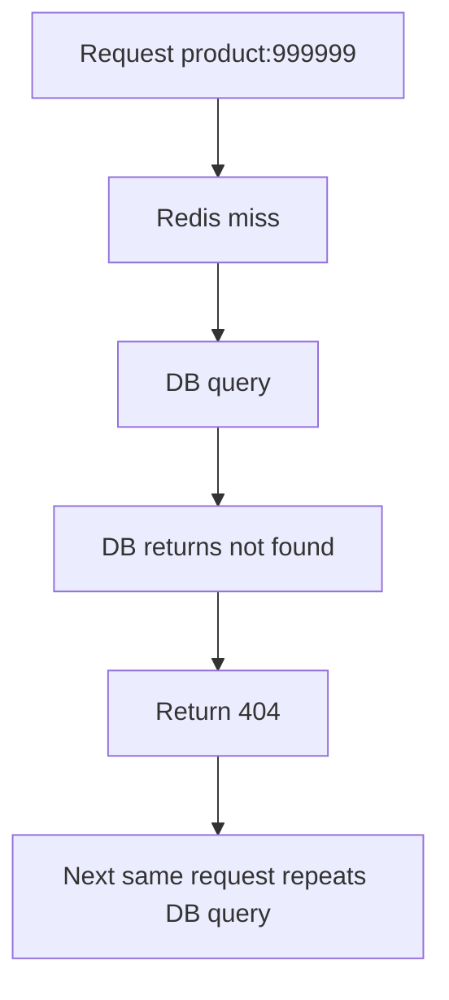
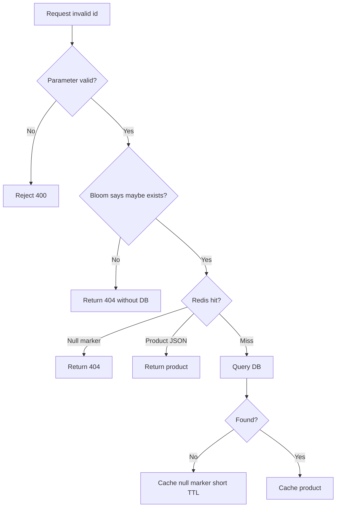
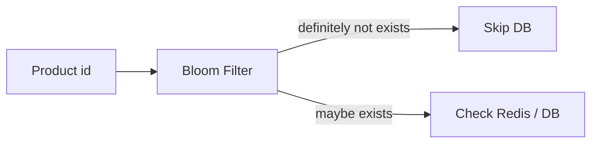
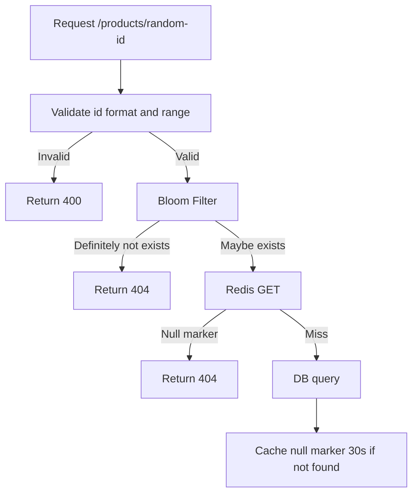

import Tabs from '@theme/Tabs';
import TabItem from '@theme/TabItem';

# 缓存穿透

缓存穿透指请求的数据在缓存和数据库中都不存在，导致每次请求都缓存 miss，然后继续打到数据库。攻击流量、爬虫、异常参数、旧链接和客户端 bug 都可能制造穿透。

## 它是什么

Cache-Aside 模式下，正常缓存 miss 会回源数据库并写入缓存。但如果请求的是不存在的数据，例如 `product:-1`、`product:999999999999` 或已删除商品，数据库也查不到。若不缓存这个“空结果”，下一次相同请求仍然会打数据库。

缓存穿透和缓存击穿、雪崩的区别：

- 穿透：请求的数据不存在，缓存和数据库都没有。
- 击穿：热点 key 存在，但刚好过期，大量请求同时回源。
- 雪崩：大量 key 同时失效或缓存整体不可用。

## 为什么需要它

数据库不应该为明显非法或不存在的数据承受重复查询。攻击者可以随机生成大量 id，让 Redis 持续 miss，数据库持续查空结果。即使每次查询都很快，高 QPS 空查询也会消耗连接池、CPU、IO 和缓存层带宽。

缓存穿透治理的目标是：在请求进入数据库前尽早判断“这个请求没有必要回源”，或者把空结果短时间缓存起来。

## 它解决什么问题

| 方案 | 解决的问题 | 边界 |
| --- | --- | --- |
| 参数校验 | 拦截明显非法 id、格式和范围 | 不能判断合法但不存在的数据 |
| 空值缓存 | 避免相同不存在 key 反复打 DB | TTL 要短，避免挡住后续创建 |
| Bloom Filter | 快速判断 id 是否可能存在 | 有误判率，不能删除或需要可计数变体 |
| 限流 | 限制异常来源或高频 miss | 不能区分所有真实用户 |
| 风控 | 识别扫描、爬虫和攻击 | 需要更多上下文和规则 |

穿透治理不能替代数据库索引和权限校验。即使 Bloom Filter 判断可能存在，仍然要正常查权限、查数据库或缓存。

## 核心原理

没有保护时，不存在的数据会反复穿透到数据库。



加上空值缓存后，相同不存在 key 会在短 TTL 内被 Redis 挡住。



Bloom Filter 的特点是：如果它说“不存在”，那一定不存在；如果它说“可能存在”，还需要继续查缓存或数据库。



## 最小示例

下面示例展示同一个策略：参数校验、Bloom Filter、Redis null marker、短 TTL 空值缓存。

<Tabs groupId="language">
  <TabItem value="java" label="Java">

```java
import java.time.Duration;
import java.util.Optional;

record Product(long id, String name) {}

interface Cache {
    Optional<String> get(String key);
    void set(String key, String value, Duration ttl);
}

interface ProductRepository { Optional<Product> findById(long id); }
interface BloomFilter { boolean mightContain(long id); }
interface JsonCodec { String encode(Product product); Product decode(String json); }

public class ProductService {
    private static final String NULL_MARKER = "__null__";
    private final Cache cache;
    private final ProductRepository repository;
    private final BloomFilter bloom;
    private final JsonCodec json;

    public ProductService(Cache cache, ProductRepository repository, BloomFilter bloom, JsonCodec json) {
        this.cache = cache;
        this.repository = repository;
        this.bloom = bloom;
        this.json = json;
    }

    public Optional<Product> getProduct(long id) {
        if (id <= 0 || !bloom.mightContain(id)) {
            return Optional.empty();
        }

        String key = "product:" + id;
        Optional<String> cached = cache.get(key);
        if (cached.isPresent()) {
            return NULL_MARKER.equals(cached.get()) ? Optional.empty() : Optional.of(json.decode(cached.get()));
        }

        Optional<Product> product = repository.findById(id);
        if (product.isEmpty()) {
            cache.set(key, NULL_MARKER, Duration.ofSeconds(30));
            return Optional.empty();
        }

        cache.set(key, json.encode(product.get()), Duration.ofMinutes(5));
        return product;
    }
}
```

  </TabItem>
  <TabItem value="go" label="Go">

```go
package product

import (
    "context"
    "encoding/json"
    "errors"
    "fmt"
    "time"
)

const nullMarker = "__null__"

type Product struct { ID int64; Name string }
type Cache interface { Get(context.Context, string) (string, bool, error); Set(context.Context, string, string, time.Duration) error }
type Repository interface { FindByID(context.Context, int64) (Product, error) }
type BloomFilter interface { MightContain(int64) bool }

var ErrNotFound = errors.New("not found")

func GetProduct(ctx context.Context, cache Cache, repo Repository, bloom BloomFilter, id int64) (Product, error) {
    if id <= 0 || !bloom.MightContain(id) {
        return Product{}, ErrNotFound
    }

    key := fmt.Sprintf("product:%d", id)
    if cached, ok, err := cache.Get(ctx, key); err != nil || ok {
        if err != nil { return Product{}, err }
        if cached == nullMarker { return Product{}, ErrNotFound }
        var product Product
        return product, json.Unmarshal([]byte(cached), &product)
    }

    product, err := repo.FindByID(ctx, id)
    if errors.Is(err, ErrNotFound) {
        _ = cache.Set(ctx, key, nullMarker, 30*time.Second)
        return Product{}, ErrNotFound
    }
    if err != nil { return Product{}, err }

    bytes, _ := json.Marshal(product)
    _ = cache.Set(ctx, key, string(bytes), 5*time.Minute)
    return product, nil
}
```

  </TabItem>
  <TabItem value="typescript" label="TypeScript">

```typescript
type Product = { id: string; name: string };
type Cache = { get(key: string): Promise<string | null>; set(key: string, value: string, ttlSeconds: number): Promise<void> };
type Repository = { findById(id: string): Promise<Product | null> };
type BloomFilter = { mightContain(id: string): boolean };

const NULL_MARKER = '__null__';

export async function getProduct(
  id: string,
  cache: Cache,
  repository: Repository,
  bloom: BloomFilter,
): Promise<Product | null> {
  if (!/^\d+$/.test(id) || !bloom.mightContain(id)) {
    return null;
  }

  const key = `product:${id}`;
  const cached = await cache.get(key);
  if (cached !== null) {
    return cached === NULL_MARKER ? null : JSON.parse(cached) as Product;
  }

  const product = await repository.findById(id);
  if (product === null) {
    await cache.set(key, NULL_MARKER, 30);
    return null;
  }

  await cache.set(key, JSON.stringify(product), 300);
  return product;
}
```

  </TabItem>
  <TabItem value="python" label="Python">

```python
import json
from dataclasses import asdict, dataclass
from typing import Optional, Protocol


NULL_MARKER = "__null__"


@dataclass(frozen=True)
class Product:
    id: int
    name: str


class Cache(Protocol):
    def get(self, key: str) -> Optional[str]: ...
    def set(self, key: str, value: str, ttl_seconds: int) -> None: ...


class Repository(Protocol):
    def find_by_id(self, product_id: int) -> Optional[Product]: ...


class BloomFilter(Protocol):
    def might_contain(self, product_id: int) -> bool: ...


def get_product(product_id: int, cache: Cache, repository: Repository, bloom: BloomFilter) -> Optional[Product]:
    if product_id <= 0 or not bloom.might_contain(product_id):
        return None

    key = f"product:{product_id}"
    cached = cache.get(key)
    if cached is not None:
        return None if cached == NULL_MARKER else Product(**json.loads(cached))

    product = repository.find_by_id(product_id)
    if product is None:
        cache.set(key, NULL_MARKER, ttl_seconds=30)
        return None

    cache.set(key, json.dumps(asdict(product)), ttl_seconds=300)
    return product
```

  </TabItem>
</Tabs>

## 工程实践

### 1. 参数校验放在最前面

非法 id、超长字符串、错误格式、越权租户等请求，不应该进入缓存和数据库。越早拒绝，成本越低。

### 2. 空值缓存 TTL 要短

null marker 能挡住重复空查询，但 TTL 不能太长。否则某个商品刚创建后，用户还可能读到旧的空缓存。常见 TTL 是几十秒到几分钟，并根据业务创建频率调整。

### 3. Bloom Filter 要有更新策略

商品创建后要把 id 加入 Bloom Filter。删除场景要谨慎：普通 Bloom Filter 不支持删除，可以接受误判，或使用 Counting Bloom Filter、定期重建、按分片重建。

### 4. 结合限流和风控

随机 id 扫描通常伴随异常 QPS、异常 IP、异常 UA 或异常租户。缓存穿透治理应和限流、验证码、风控规则一起使用。

### 5. 监控 miss 和 null marker

需要监控 cache miss rate、DB not-found rate、null marker count、Bloom reject count、异常来源分布。not-found 突增通常说明客户端 bug 或扫描攻击。

## 常见坑

- 不缓存空结果，导致相同不存在 key 反复打数据库。
- null marker TTL 太长，数据创建后仍然返回不存在。
- Bloom Filter 初始化后不更新，新数据长期被误挡。
- 把 Bloom Filter 的“可能存在”当成“一定存在”。
- 参数校验太晚，非法请求已经消耗了 Redis 和 DB 资源。
- 对空结果和真实结果使用同样长 TTL。

## 完整案例：随机商品 ID 扫描

### 场景

爬虫随机请求 `/products/{id}`，每秒生成几万个不存在的商品 id。Redis 全部 miss，MySQL 每次查空结果，数据库连接池开始排队。

### 治理方案



### 效果

明显非法请求在应用层被拒绝；大部分随机 id 被 Bloom Filter 拦截；重复访问不存在 id 被 null marker 挡住。数据库只处理可能存在且缓存 miss 的请求。

## 检查清单

学完这一节后，你应该能回答：

- 缓存穿透和缓存击穿、缓存雪崩有什么区别？
- 为什么不存在数据也需要缓存？
- null marker TTL 应该如何设置？
- Bloom Filter 的“可能存在”和“一定不存在”分别意味着什么？
- 商品新增、删除时 Bloom Filter 如何维护？
- 哪些指标能发现缓存穿透？
- 参数校验、限流和风控在穿透治理里分别起什么作用？

## 延伸阅读

- [Redis: Probabilistic data structures](https://redis.io/docs/latest/develop/data-types/probabilistic/)
- [RedisBloom Documentation](https://redis.io/docs/latest/develop/data-types/probabilistic/bloom-filter/)
- [Google Guava BloomFilter](https://guava.dev/releases/snapshot-jre/api/docs/com/google/common/hash/BloomFilter.html)
- [Wikipedia: Bloom filter](https://en.wikipedia.org/wiki/Bloom_filter)
