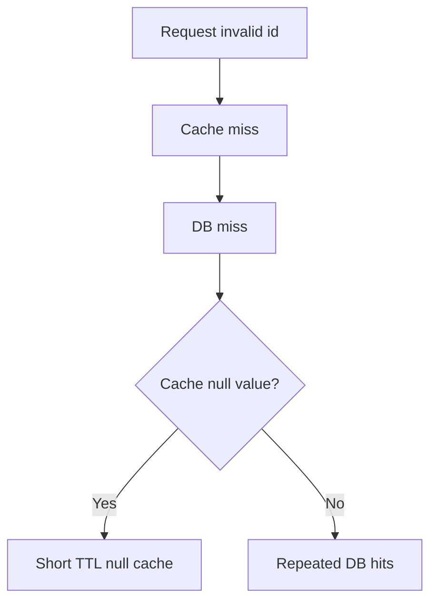

# 缓存穿透

缓存穿透指请求的数据在缓存和数据库中都不存在，攻击流量或异常参数会持续打到数据库。

## 后续扩写

- 空值缓存。
- Bloom Filter。
- 参数校验与限流。

## 延伸阅读

- [Redis: Probabilistic data structures](https://redis.io/docs/latest/develop/data-types/probabilistic/)
- [Google Guava BloomFilter](https://guava.dev/releases/snapshot-jre/api/docs/com/google/common/hash/BloomFilter.html)
