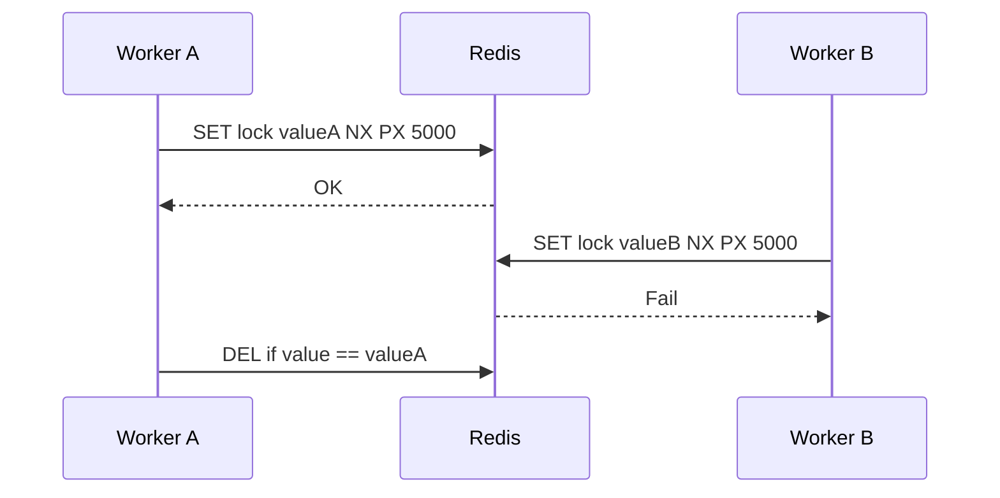

# Redis 分布式锁

Redis 分布式锁适合短时间互斥，但不能把它当成数据库事务或强一致性系统。锁的过期、释放校验和业务幂等都必须设计清楚。

## 后续扩写

- `SET NX PX`。
- Lua 脚本释放锁。
- 锁超时与业务执行时间。
- Redlock 争议。

## 延伸阅读

- [Redis: Distributed Locks with Redis](https://redis.io/docs/latest/develop/use/patterns/distributed-locks/)
- [Martin Kleppmann: How to do distributed locking](https://martin.kleppmann.com/2016/02/08/how-to-do-distributed-locking.html)
