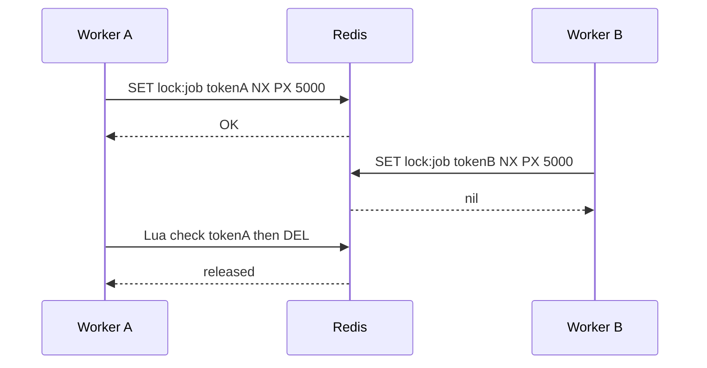
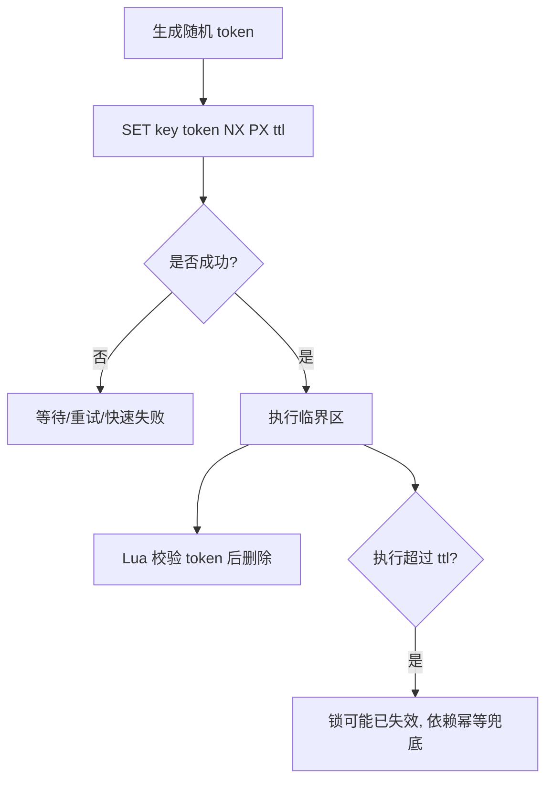
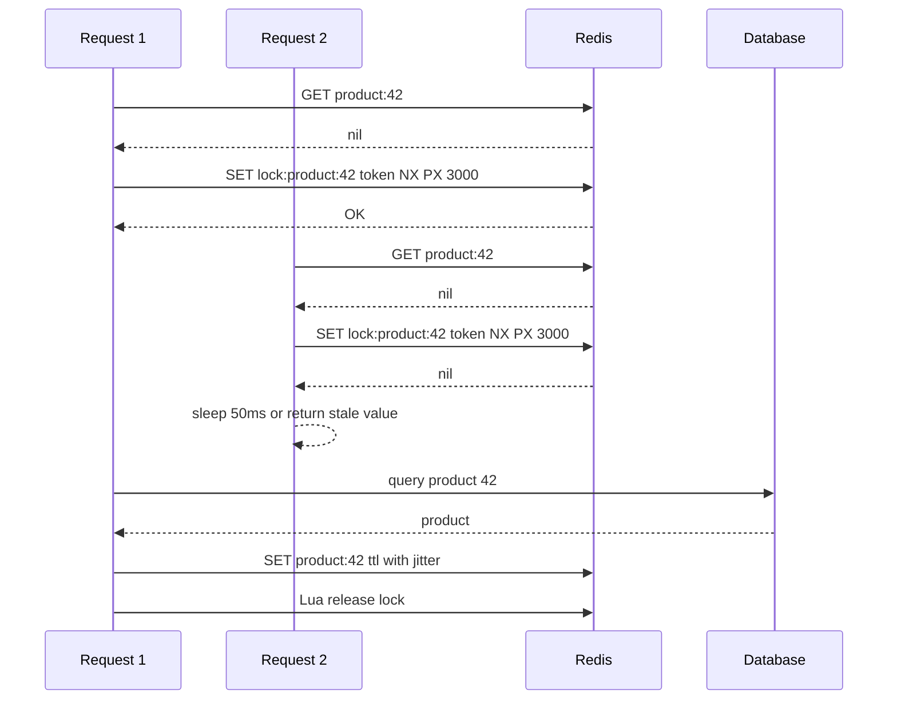

import Tabs from '@theme/Tabs';
import TabItem from '@theme/TabItem';

# Redis 分布式锁

Redis 分布式锁用于在多个进程、多个实例之间做短时间互斥。它适合保护“不能并发执行但可以重试”的临界区，不适合替代数据库事务、唯一约束或强一致协调系统。

## 先理解这些概念

- **本地锁**：只在一个进程内生效，比如 Java `synchronized` 或 Go `sync.Mutex`。服务有多个实例时，本地锁互相看不见。
- **分布式锁**：多个服务实例共同抢同一个外部锁，谁抢到谁执行临界区。
- **临界区**：不能被多个实例同时执行的一小段逻辑，比如重建同一个缓存 key。
- **随机 token**：每次加锁生成的唯一值，用来证明“这个锁是我加的”。释放锁时必须校验它。
- **TTL**：锁的过期时间。持锁实例崩溃后，锁能自动释放，但 TTL 太短会导致业务没做完锁就过期。
- **Lua 释放锁**：把“检查 token”和“删除锁”放在 Redis 里原子执行，避免误删别人刚拿到的锁。

读这篇时先记住：Redis 分布式锁只适合短时间互斥，不能当成强一致事务系统。真正的业务正确性仍然要靠幂等、唯一约束和状态检查兜底。



## 它是什么

Redis 分布式锁本质上是一个带过期时间的互斥标记：只有第一个写入 `SET key value NX PX ttl` 成功的客户端获得锁，其他客户端在 key 存在时获取失败。释放锁时必须校验 value，确保只删除自己持有的锁。

这里的 `value` 通常是随机 token，例如 UUID。它不是业务 ID，而是锁持有者身份，用于防止客户端 A 因超时后误删客户端 B 新获得的锁。

## 为什么需要它

在单进程里可以用 mutex、synchronized 或 channel 控制并发，但后端服务通常会横向扩容到多个实例。多个实例同时处理同一个用户、订单、库存或定时任务时，本地锁无法互相感知。

Redis 锁提供了一个低成本的跨实例互斥手段，常用于：

- 防止多个实例同时执行同一个定时任务。
- 防止同一个缓存 key 被大量请求同时重建。
- 对外部 API 调用做短时间串行化。
- 对不支持幂等的遗留系统做保护层。

## 它解决什么问题

Redis 分布式锁主要解决“多实例并发进入临界区”的问题，但它只能提供有限互斥：

- 正常情况下，同一时间只有一个客户端获得锁。
- 客户端崩溃后，锁会因 TTL 自动释放。
- 释放锁时用 token 校验，避免误删别人的锁。
- 业务执行超时、网络分区、主从切换时，仍需要幂等和补偿兜底。

## 核心原理

一个相对安全的 Redis 锁至少包含三件事：原子加锁、带过期时间、校验后释放。



释放锁不能使用简单 `DEL key`，必须用 Lua 保证“读 value”和“删除 key”是一个原子操作：

```lua
if redis.call("GET", KEYS[1]) == ARGV[1] then
  return redis.call("DEL", KEYS[1])
end
return 0
```

锁 TTL 要比临界区的 p99 执行时间更长，并留出网络抖动和 GC 暂停余量。如果业务执行时间不可预测，需要重新评估是否应该用 Redis 锁，或引入续期机制、任务租约、数据库状态机。

## 最小示例

下面示例展示同一个模式：随机 token 加锁，释放时用 Lua 校验 token。

<Tabs groupId="language">
<TabItem value="java" label="Java">

```java
import java.time.Duration;
import java.util.List;
import java.util.UUID;

class RedisLock {
    private static final String RELEASE_SCRIPT = """
        if redis.call('GET', KEYS[1]) == ARGV[1] then
          return redis.call('DEL', KEYS[1])
        end
        return 0
        """;

    private final RedisClient redis;

    RedisLock(RedisClient redis) {
        this.redis = redis;
    }

    String tryLock(String key, Duration ttl) {
        String token = UUID.randomUUID().toString();
        boolean ok = redis.set(key, token, SetOption.NX, ttl);
        return ok ? token : null;
    }

    void unlock(String key, String token) {
        redis.eval(RELEASE_SCRIPT, List.of(key), List.of(token));
    }
}
```

</TabItem>
<TabItem value="go" label="Go">

```go
package lock

import (
    "context"
    "time"

    "github.com/google/uuid"
)

const releaseScript = `
if redis.call("GET", KEYS[1]) == ARGV[1] then
  return redis.call("DEL", KEYS[1])
end
return 0`

type Redis interface {
    SetNX(ctx context.Context, key string, value string, ttl time.Duration) (bool, error)
    Eval(ctx context.Context, script string, keys []string, args ...string) error
}

func TryLock(ctx context.Context, r Redis, key string, ttl time.Duration) (string, bool, error) {
    token := uuid.NewString()
    ok, err := r.SetNX(ctx, key, token, ttl)
    return token, ok, err
}

func Unlock(ctx context.Context, r Redis, key string, token string) error {
    return r.Eval(ctx, releaseScript, []string{key}, token)
}
```

</TabItem>
<TabItem value="typescript" label="TypeScript">

```ts
import { randomUUID } from "node:crypto";

const releaseScript = `
if redis.call("GET", KEYS[1]) == ARGV[1] then
  return redis.call("DEL", KEYS[1])
end
return 0`;

async function tryLock(redis: Redis, key: string, ttlMs: number) {
  const token = randomUUID();
  const ok = await redis.set(key, token, { NX: true, PX: ttlMs });
  return ok === "OK" ? token : null;
}

async function unlock(redis: Redis, key: string, token: string) {
  await redis.eval(releaseScript, { keys: [key], arguments: [token] });
}
```

</TabItem>
<TabItem value="python" label="Python">

```python
import uuid

RELEASE_SCRIPT = """
if redis.call("GET", KEYS[1]) == ARGV[1] then
  return redis.call("DEL", KEYS[1])
end
return 0
"""


async def try_lock(redis, key: str, ttl_ms: int) -> str | None:
    token = str(uuid.uuid4())
    ok = await redis.set(key, token, nx=True, px=ttl_ms)
    return token if ok else None


async def unlock(redis, key: str, token: str) -> None:
    await redis.eval(RELEASE_SCRIPT, 1, key, token)
```

</TabItem>
</Tabs>

## 工程实践

- 锁 key 要足够具体，例如 `lock:order:{orderId}:close`，避免无关任务互相阻塞。
- TTL 要基于临界区 p99 耗时设置，并留足 GC、网络、Redis 延迟余量。
- 加锁失败要有明确策略：快速失败、有限重试、排队或返回旧结果。
- 临界区必须可重试，业务侧仍要做幂等，例如唯一索引、状态机版本号、请求 ID。
- 长任务优先使用任务表租约、数据库行锁、消息队列分片消费，而不是长时间 Redis 锁。
- 记录锁等待时间、加锁失败率、临界区耗时、锁过期后仍在执行的次数。

## 常见坑

- 用 `SETNX` 后再单独 `EXPIRE`，如果进程在两条命令中间崩溃，会留下死锁。
- 释放锁直接 `DEL`，可能删除别人刚获得的新锁。
- TTL 设置太短，业务还没执行完锁就过期，其他实例进入临界区。
- TTL 设置太长，持锁实例卡住时系统恢复过慢。
- 用 Redis 锁保护扣库存，却没有数据库条件更新或唯一约束兜底。
- 认为 Redlock 可以解决所有一致性问题，忽略时钟漂移、网络分区和业务幂等。

## 完整案例

电商系统中，商品详情缓存 miss 后需要从数据库重建。如果某个热门商品缓存过期，几百个请求同时查库并重建缓存，会造成缓存击穿。可以用 Redis 锁让同一商品只有一个请求执行重建，其他请求短暂等待或返回旧值。



关键点：

1. 锁只保护缓存重建，不承担库存一致性这类强一致职责。
2. 加锁失败的请求不应该无限等待，可以读取旧值或有限退避。
3. 数据库查询和缓存写入要有超时，避免临界区无限拉长。
4. 商品数据本身允许短暂陈旧，适合用这种方式优化读压力。

## 检查清单

- 是否使用 `SET key value NX PX ttl` 一条命令加锁？
- value 是否是每次加锁生成的随机 token？
- 释放锁是否用 Lua 校验 token 后删除？
- TTL 是否覆盖临界区 p99，并考虑 GC 和网络抖动？
- 加锁失败是否有有限重试或降级策略？
- 临界区业务是否有幂等、唯一约束或状态检查兜底？
- 是否确认该场景只需要短时间互斥，而不是强一致事务？

## 这篇文章在系统里怎么用

Redis 分布式锁常用于缓存重建、定时任务抢占、短时间防重复执行。比如缓存击穿时，只让一个请求查数据库并重建缓存，其他请求等待或返回旧值。

不要用 Redis 锁单独保证扣库存、扣款、转账这类强一致业务。那些场景必须有数据库唯一约束、条件更新、状态机或事务兜底。Redis 锁可以减少并发冲突，但不能作为最终正确性的唯一依据。

## 术语回看

- [幂等](../system-design/glossary.md#幂等)
- [状态机](../system-design/glossary.md#状态机)
- [补偿](../system-design/glossary.md#补偿)
- [回源](../system-design/glossary.md#回源)

## 延伸阅读

- [Redis: Distributed Locks with Redis](https://redis.io/docs/latest/develop/use/patterns/distributed-locks/)
- [Redis: SET command](https://redis.io/docs/latest/commands/set/)
- [Martin Kleppmann: How to do distributed locking](https://martin.kleppmann.com/2016/02/08/how-to-do-distributed-locking.html)
- [Antirez: Is Redlock safe?](http://antirez.com/news/101)
