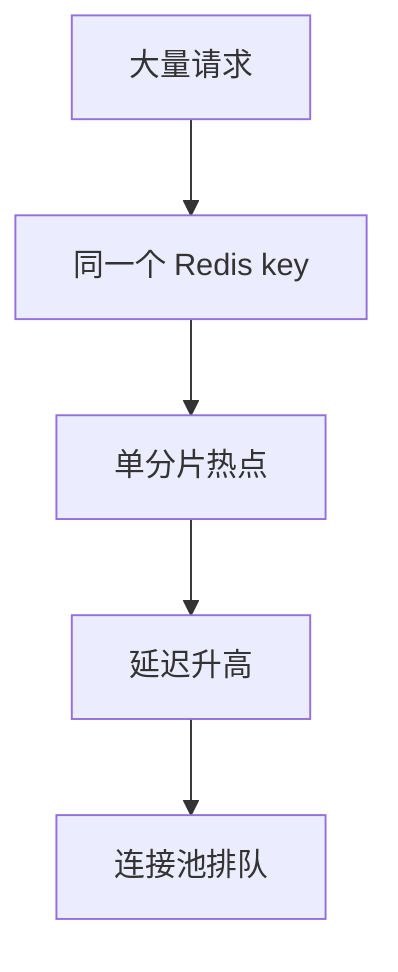
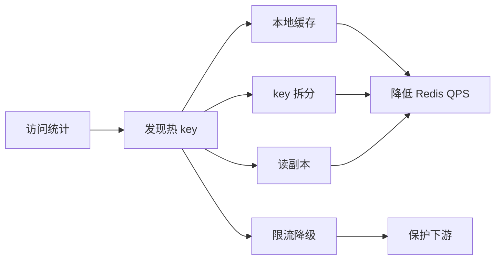
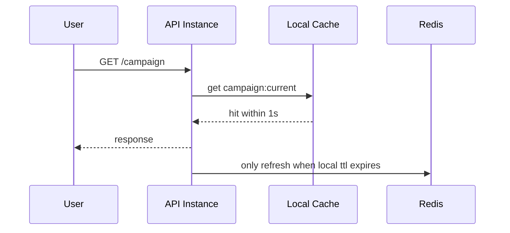

import Tabs from '@theme/Tabs';
import TabItem from '@theme/TabItem';

# 热 Key

热 key 是指少量 key 承担了大量访问。它可能造成 Redis 单分片压力过高、网络瓶颈、应用端连接池排队，甚至让整个缓存集群表现得像“部分不可用”。

## 先理解这些概念

- **访问倾斜**：流量不是平均打到所有 key，而是集中到少数 key。
- **单分片热点**：Redis Cluster 会把一个 key 放到一个分片上，同一个 key 再热也不能自动分摊到多个分片。
- **命中也有成本**：即使 Redis 命中，网络、序列化、连接池、Redis CPU 都会消耗资源。
- **本地缓存**：在应用进程内缓存短时间热点值，减少对 Redis 的请求。
- **Key 拆分**：把一个逻辑 key 拆成多个物理 key，让读请求分散到多个 key 上。

读这篇时先记住：热 Key 的问题不是“查不到”，而是“查得太多”。它和缓存击穿不同，热 Key 即使命中缓存也可能把 Redis 打慢。



## 它是什么

热 key 是访问分布极度不均匀的缓存 key。例如秒杀商品库存、首页配置、热门直播间信息、爆款商品详情、全站开关配置。

它和缓存击穿不同：击穿强调热点 key 失效后大量请求回源数据库；热 key 强调 key 即使命中缓存，也可能因为访问过于集中把 Redis 或网络打满。

## 为什么需要它

Redis Cluster 按 key 分片。一个 key 只能落到一个分片，无法自动被多个分片共同承接。如果 20% 甚至 80% 流量集中到一个 key，这个 key 所在分片会先成为瓶颈。

高并发系统不能只看整体 QPS 和平均命中率，还要看 key 维度的访问倾斜。

## 它解决什么问题

- 发现单 key 或少量 key 导致的单分片压力。
- 降低 Redis 请求延迟和应用连接池等待。
- 避免热点配置、热点商品、热点活动拖垮缓存层。
- 在突发热点出现时快速降级和保护数据库。

## 核心原理

热 key 治理分为三步：发现热点、分散读取、限制冲击。



常见手段：

- **本地缓存**：热点 key 在应用进程内缓存几十毫秒到几秒。
- **Key 拆分**：把一个逻辑 key 拆成多个物理 key，例如 `product:42:0..N`。
- **读副本**：读请求分散到 Redis replica 或独立缓存集群。
- **热点探测**：采样 key 访问次数，结合 Redis hotkeys、代理层统计或应用埋点。
- **降级保护**：热点 key 查询失败时返回旧值、默认值或静态快照。

## 最小示例

下面示例展示本地短 TTL 缓存，适合读多写少、允许短暂陈旧的热点数据。

<Tabs groupId="language">
<TabItem value="java" label="Java">

```java
class HotKeyCache {
    private final LocalCache<String, String> local;
    private final RedisClient redis;

    String getConfig(String key) {
        String value = local.get(key);
        if (value != null) return value;
        value = redis.get(key);
        local.set(key, value, 500); // ttl millis
        return value;
    }
}
```

</TabItem>
<TabItem value="go" label="Go">

```go
package hotkey

import "time"

func GetConfig(local LocalCache, redis Redis, key string) (string, error) {
    if value, ok := local.Get(key); ok {
        return value, nil
    }
    value, err := redis.Get(key)
    if err != nil {
        return "", err
    }
    local.Set(key, value, 500*time.Millisecond)
    return value, nil
}
```

</TabItem>
<TabItem value="typescript" label="TypeScript">

```ts
async function getConfig(local: LocalCache, redis: Redis, key: string) {
  const cached = local.get(key);
  if (cached !== undefined) return cached;

  const value = await redis.get(key);
  local.set(key, value, 500);
  return value;
}
```

</TabItem>
<TabItem value="python" label="Python">

```python
async def get_config(local_cache, redis, key: str):
    cached = local_cache.get(key)
    if cached is not None:
        return cached

    value = await redis.get(key)
    local_cache.set(key, value, ttl_ms=500)
    return value
```

</TabItem>
</Tabs>

## 工程实践

- 在应用层采样记录 key 访问频次，避免 Redis 端才发现热点。
- 对首页配置、活动配置、热门商品等已知热点默认加本地缓存。
- 本地缓存 TTL 要短，并支持主动失效或版本号，控制陈旧窗口。
- Key 拆分适合只读或读多写少数据；写多场景要谨慎处理一致性。
- 对突发热点预留降级策略，例如返回静态快照或隐藏非核心字段。
- Redis 监控要看分片级 QPS、CPU、网络、慢命令和连接数。

## 常见坑

- 只看 Redis 集群整体 CPU，忽略单分片已经打满。
- 本地缓存没有容量上限，热点变化后内存持续增长。
- 热点 key 本地缓存 TTL 太长，配置变更无法及时生效。
- Key 拆分后写入只更新一个副本，读到不一致数据。
- 发现热点后只扩 Redis 节点，但单 key 仍落在一个分片。

## 完整案例

大促活动页有一个 `campaign:current` key，所有用户进入首页都会读取。活动开始后 Redis 集群整体 CPU 只有 40%，但其中一个分片 CPU 100%，商品服务 P99 从 120ms 升到 900ms。

治理方案：

1. 应用侧统计 key 访问频次，确认 `campaign:current` 是热点。
2. 在服务进程内增加 1 秒本地缓存，配置变更通过版本号触发刷新。
3. 活动详情拆成多个只读副本 key，读请求随机选择一个。
4. Redis 异常时返回上一次成功读取的活动快照。
5. 增加热点 key 告警：单 key QPS 超过阈值自动通知。



## 检查清单

- 是否能按 key 维度发现访问倾斜？
- Redis 监控是否能看到分片级压力？
- 已知热点是否有本地缓存或快照？
- 本地缓存是否有 TTL、容量上限和失效策略？
- Key 拆分后是否处理一致性和更新逻辑？
- Redis 故障时是否有旧值或静态降级？

## 这篇文章在系统里怎么用

热 Key 常出现在秒杀商品、热门微博、首页活动配置、直播间信息、排行榜和全站开关上。系统设计时，如果某个对象会被大量用户同时读取，就要考虑热 Key，而不是只说“放 Redis”。

常见做法是：应用侧统计 key 访问量，热点数据加本地短 TTL 缓存，必要时做 key 拆分或读副本，Redis 异常时返回旧值或静态快照。目标是让热点流量尽量在应用侧被吸收，不要全部压到 Redis 单分片。

## 术语回看

- [热点 / 热 Key](../system-design/glossary.md#热点--热-key)
- [削峰](../system-design/glossary.md#削峰)
- [逻辑过期](../system-design/glossary.md#逻辑过期)

## 延伸阅读

- [Redis: Latency monitoring](https://redis.io/docs/latest/operate/oss_and_stack/management/optimization/latency-monitor/)
- [Redis: Identifying hot keys](https://redis.io/learn/howtos/antipatterns#7-hot-keys)
- [Redis: Client-side caching](https://redis.io/docs/latest/develop/use/client-side-caching/)
- [AWS Builders Library: Caching challenges and strategies](https://aws.amazon.com/builders-library/caching-challenges-and-strategies/)
