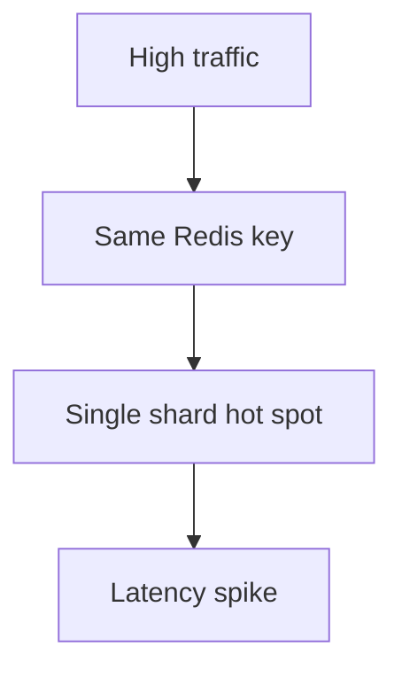

# 热 Key

热 key 是指少量 key 承担了大量访问。它可能造成 Redis 单分片压力过高、网络瓶颈或应用端连接池排队。

## 后续扩写

- 热 key 发现方法。
- 本地缓存。
- key 拆分和读副本。
- 热点保护与降级。

## 延伸阅读

- [Redis: Latency monitoring](https://redis.io/docs/latest/operate/oss_and_stack/management/optimization/latency-monitor/)
- [Redis: Memory optimization](https://redis.io/docs/latest/operate/oss_and_stack/management/optimization/memory-optimization/)
