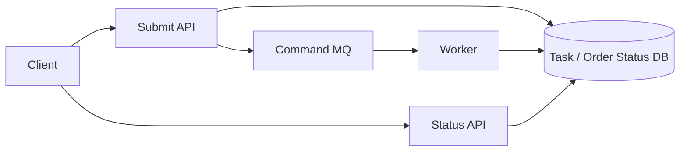
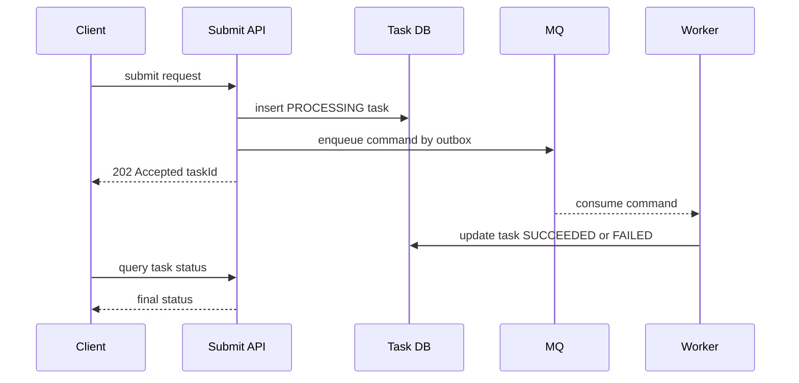
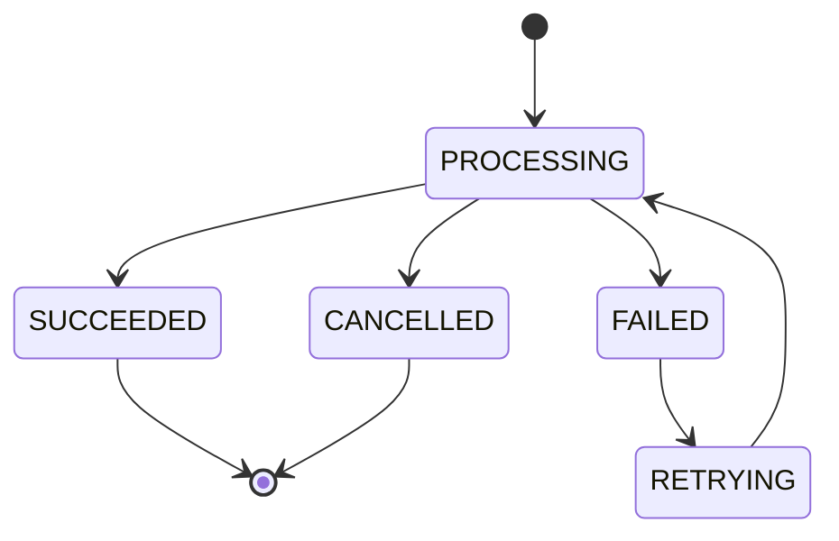

# 异步请求结果返回模式

很多后端操作不会在本次 HTTP 请求里真正完成。比如秒杀下单、导出报表、视频转码、批量通知、异步支付确认。API 只负责接收请求，真正的业务由 worker 后台执行。问题是：请求已经返回了，最终结果怎么告诉用户？



## 场景

适合异步返回的场景：

- 操作耗时长，例如导出报表、视频处理。
- 需要排队削峰，例如秒杀下单。
- 依赖外部系统，结果不确定，例如支付、出票。
- 用户能接受“处理中”，稍后查询结果。

不适合异步返回的场景：

- 用户必须立刻知道结果，例如登录密码是否正确。
- 操作很快且不会冲击下游。
- 业务上不能接受处理中状态。

## 推荐操作顺序

推荐：**提交接口创建状态记录并入队，返回 `202 Accepted + taskId`；worker 执行后更新状态；用户查询状态接口或接收推送**。

```text
1. API 接收请求
2. 写 async_tasks 状态 PROCESSING
3. 发送 command 到 MQ
4. 返回 202 Accepted + taskId
5. worker 消费 command
6. worker 执行业务并更新 task 状态
7. 用户轮询或收到推送
```

提交伪代码：

```pseudo
function submitExport(request):
    taskId = generateId()

    begin transaction
        insert async_tasks(
            task_id = taskId,
            user_id = request.userId,
            type = "EXPORT_REPORT",
            status = "PROCESSING",
            request_hash = hash(request),
            created_at = now()
        )

        insert outbox_events(
            event_type = "ExportReportCommand",
            aggregate_id = taskId,
            payload = request
        )
    commit

    return 202, { "taskId": taskId, "status": "PROCESSING" }
```

查询伪代码：

```pseudo
function queryTask(taskId, userId):
    task = select * from async_tasks
           where task_id = taskId and user_id = userId

    if task not found:
        return 404, { "code": "NOT_FOUND" }

    return 200, {
        "taskId": task.taskId,
        "status": task.status,
        "result": task.result,
        "error": task.error
    }
```

Worker 伪代码：

```pseudo
function exportWorker(message):
    taskId = message.taskId

    task = select * from async_tasks where task_id = taskId
    if task.status in ("SUCCEEDED", "FAILED"):
        ack(message)
        return

    try:
        fileUrl = generateReport(task.request)

        update async_tasks
        set status = "SUCCEEDED", result = fileUrl, updated_at = now()
        where task_id = taskId and status = "PROCESSING"

        notifyUser(task.userId, taskId)
        ack(message)
    catch retryableError:
        retryLater(message)
    catch finalError:
        update async_tasks
        set status = "FAILED", error = finalError.message
        where task_id = taskId and status = "PROCESSING"
        ack(message)
```

## 为什么这样做

API 返回的是“请求已被系统接收”，不是“业务已完成”。这两件事必须区分。



这样做的好处：

- API 链路短，不会被长任务拖垮。
- 用户能拿到稳定的 `taskId` 查询结果。
- worker 失败后可以重试或标记失败。
- 状态表是用户可见结果的权威来源。

## HTTP 状态码怎么选

| 状态 | 含义 | 适合场景 |
| --- | --- | --- |
| `200 OK` | 本次请求已经完成并返回最终结果 | 同步查询、快速操作 |
| `201 Created` | 资源已经创建完成 | 同步创建资源 |
| `202 Accepted` | 请求已接收，稍后完成 | 异步任务、排队下单 |
| `409 Conflict` | 当前状态不允许继续 | 重复下单、库存不足、状态冲突 |
| `429 Too Many Requests` | 被限流 | 用户或活动流量过高 |
| `500/503` | 系统异常或依赖不可用 | 未能可靠接收请求 |

如果 API 已经可靠写入 `PROCESSING` 状态并入队，就可以返回 `202`。如果入队也失败，不能假装处理中。

## 反例 1：异步任务刚入队就返回成功

```pseudo
function badSubmitOrder(request):
    mq.publish(CreateOrderCommand(request))
    return 200, { "status": "SUCCESS" }
```

会出的问题：

- Worker 可能创建订单失败，但用户已经看到成功。
- 后续需要反向通知失败，用户体验和数据解释都很差。
- 没有状态表时，用户刷新不知道到底发生了什么。

正确返回应该是：

```json
{
  "status": "PROCESSING",
  "taskId": "task_1001"
}
```

## 反例 2：只发 MQ，不写状态表

```pseudo
function badSubmit(request):
    taskId = generateId()
    mq.publish(Command(taskId, request))
    return 202, { taskId }
```

会出的问题：

- MQ 发送成功但 worker 还没处理时，查询接口没有权威状态。
- MQ 消息丢失或长期积压时，用户看到的状态无法解释。
- worker 失败后没有地方记录失败原因。

状态表不是可选项，它是异步结果返回的核心。

## 状态表设计

```sql
create table async_tasks (
  task_id varchar(64) primary key,
  user_id varchar(64) not null,
  task_type varchar(64) not null,
  status varchar(32) not null,
  request_hash varchar(128),
  result text,
  error_code varchar(64),
  error_message text,
  retry_count int not null default 0,
  created_at timestamp not null,
  updated_at timestamp not null
);

create index idx_async_tasks_user_created
on async_tasks(user_id, created_at desc);
```

状态机：



## 结果怎么通知用户

常见方式：

| 方式 | 优点 | 代价 | 适合场景 |
| --- | --- | --- | --- |
| 轮询状态接口 | 简单可靠 | 多一次查询流量 | 下单、导出、出票 |
| WebSocket | 实时 | 需要长连接 | IM、实时协作、交易看板 |
| SSE | 服务端单向推送简单 | 浏览器场景为主 | 进度条、报表生成 |
| Push/短信/邮件 | 用户不在线也能触达 | 延迟和失败不可控 | 通知、审核结果 |

大多数业务可以先用轮询：

```text
POST /orders -> 202 {orderToken}
GET /orders/status/{orderToken} -> PROCESSING / CREATED / FAILED / SOLD_OUT
```

如果用户体验要求更高，再增加 WebSocket 或 Push。

## 失败补偿

| 失败点 | 后果 | 补偿 |
| --- | --- | --- |
| 状态表写失败 | 请求没有被可靠接收 | 返回 500，不入队 |
| 状态表成功，MQ 失败 | 任务卡在 PROCESSING | 用 Outbox 重试发送 command |
| Worker 失败可重试 | 状态长时间处理中 | retry_count、next_retry_at、告警 |
| Worker 最终失败 | 用户需要知道失败原因 | 更新 FAILED 和 error_code |
| 用户重复提交 | 多个任务重复执行 | request_hash 或 idempotency_key 去重 |

## 面试怎么讲

可以这样回答：

> 对于耗时或需要排队的操作，我不会在提交接口里返回最终成功，而是返回 `202 Accepted` 和一个 `taskId`。提交接口要先写状态表，把任务标记为 `PROCESSING`，再通过 Outbox 或 MQ 交给 worker。worker 执行完成后更新状态为 `SUCCEEDED` 或 `FAILED`。用户通过状态查询接口轮询，也可以用 WebSocket、SSE 或 Push 通知结果。这样 API 链路短，失败可重试，用户也能看到明确状态。

## 检查清单

- API 返回的是接收成功，还是业务完成？是否说清楚？
- 是否有状态表作为异步结果的权威来源？
- 入队失败是否会导致任务卡住？是否用了 Outbox？
- Worker 是否能更新成功和失败原因？
- 用户是否能查询处理中、成功、失败状态？
- 是否有超时任务扫描和告警？
- 重复提交是否有幂等保护？

## 延伸阅读

- [高并发下单系统设计](../practice/high-concurrency-order-system.md)
- [可运行项目：高并发订单系统](../interview/high-concurrency-order-project.md)
- [数据库与 MQ 一致性：Outbox](./database-mq-outbox.md)
- [状态机设计](../recipes/order-state-machine-design.md)
