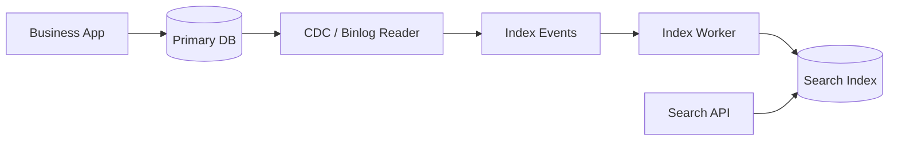
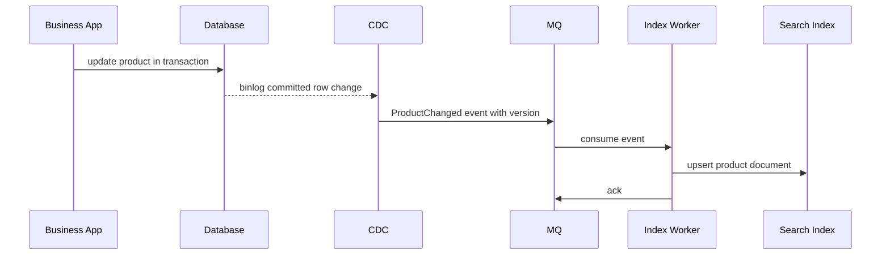

# CDC 与搜索索引同步

搜索系统通常不会直接查业务数据库，而是把数据库中的商品、订单、帖子同步到 Elasticsearch 或 OpenSearch。这里最容易出错的点是：**数据库事务成功了，搜索索引什么时候、怎样、以什么顺序更新**。



## 场景

商品后台修改标题和价格后，用户在搜索页希望尽快看到新内容：

- 商品详情页读数据库，要求正确。
- 搜索页读搜索索引，允许秒级延迟。
- 数据库更新不能因为搜索索引故障而失败。
- 索引同步失败后要能重试、补偿和全量重建。

## CDC 是什么

CDC 是 Change Data Capture，意思是捕获数据库变更。常见做法是读取 MySQL binlog 或 PostgreSQL WAL，把行变更转换成事件，再交给索引 worker 更新搜索引擎。

它解决的是“数据库和搜索引擎之间的异步同步”问题。数据库仍然是权威数据源，搜索索引是查询加速和复杂检索视图。

## 推荐同步流程

```text
1. 业务服务只写数据库
2. CDC 读取数据库提交后的变更日志
3. CDC 把变更写入 MQ 或内部队列
4. Index Worker 消费事件，按主键 upsert 到搜索索引
5. 记录同步位点和失败事件
6. 用户搜索时读索引，详情页读数据库
```



## 事件与文档设计

事件至少包含主键、版本和发生时间：

```json
{
  "eventId": "evt_20260712_001",
  "eventType": "ProductChanged",
  "productId": "sku_1001",
  "rowVersion": 42,
  "op": "UPDATE",
  "occurredAt": "2026-07-12T10:00:00Z"
}
```

搜索文档要保存数据库版本，用来抵挡乱序事件：

```json
{
  "productId": "sku_1001",
  "title": "机械键盘",
  "price": 29900,
  "status": "ON_SALE",
  "rowVersion": 42,
  "indexedAt": "2026-07-12T10:00:02Z"
}
```

## Worker 伪代码

推荐 worker 不完全相信事件 payload，而是用事件里的主键回查数据库，再写索引。这样可以减少字段缺失、schema 演进和事件乱序造成的问题。

```pseudo
function indexProductWorker(event):
    if alreadyConsumed(event.eventId):
        ack(event)
        return

    product = database.query(
        "select * from products where product_id = ?",
        event.productId
    )

    if product not exists or product.deleted:
        search.delete(index = "products", id = event.productId)
        markConsumed(event.eventId)
        ack(event)
        return

    document = buildProductDocument(product)
    updated = search.conditionalUpsert(
        index = "products",
        id = product.productId,
        body = document,
        condition = "existing is absent or existing.rowVersion < body.rowVersion"
    )

    if not updated:
        # A newer database version has already reached the index.
        markConsumed(event.eventId)
        ack(event)
        return

    markConsumed(event.eventId)
    ack(event)
```

关键点：

- 用 `eventId` 做消费幂等。
- 用 `rowVersion` 或 `updated_at` 抵挡旧事件覆盖新索引。比较和写入必须在搜索引擎侧原子完成，例如 Elasticsearch/OpenSearch external versioning，或 scripted update 里判断 `ctx._source.rowVersion < params.rowVersion` 后再写。
- 删除数据要同步 delete 或写入 `status=DELETED`，取决于查询是否需要历史。
- 搜索失败不能 ack，应该重试或进入死信队列。

## 为什么这样做

业务写入和索引更新解耦后，搜索引擎故障不会阻塞下单、发帖、改商品。CDC 读取的是数据库提交后的日志，比“业务代码同时写 DB 和 ES”更容易保证最终一致。

| 组件 | 职责 | 权威性 |
| --- | --- | --- |
| 数据库 | 保存商品真实状态 | 权威 |
| CDC | 捕获已提交变更 | 传输与位点 |
| MQ | 缓冲索引任务 | 传输 |
| Index Worker | 构建搜索文档 | 计算视图 |
| 搜索索引 | 检索和排序 | 非权威 |

## 反例与后果

反例 1：业务代码在一个请求里先写 DB 再写 ES。

```pseudo
function badUpdateProduct(product):
    database.update(product)
    search.upsert(product)
    return OK
```

后果：ES 超时会拖慢业务请求；DB 成功但 ES 失败时需要额外补偿；重试请求可能重复写或乱序写。

反例 2：索引 worker 只按事件 payload 覆盖索引。

后果：事件乱序时旧事件覆盖新数据；payload 少字段时索引文档字段丢失；schema 变更时旧 worker 更容易写坏索引。

反例 3：没有全量重建能力。

后果：索引 mapping 变更、历史 bug 修复、数据污染后只能手工修数据。搜索索引必须能从数据库重新构建。

## 失败补偿

| 失败点 | 后果 | 补偿 |
| --- | --- | --- |
| CDC 暂停 | 索引延迟增加 | 记录 binlog 位点，恢复后续跑；告警同步延迟 |
| MQ 堆积 | 搜索结果变旧 | 扩 worker，限流非关键索引任务 |
| ES 写入失败 | 单条文档不同步 | 不 ack，重试；超过阈值进 DLQ |
| 文档构建 bug | 大量索引错误 | 修 bug 后按数据库全量重建索引 |
| 事件乱序 | 旧文档覆盖新文档 | 文档保存 rowVersion，旧版本丢弃 |

## 全量重建流程

```text
1. 创建新索引 products_v2
2. 从数据库分页扫描商品表
3. 批量写入 products_v2
4. 同时记录 CDC 增量位点
5. 追平增量事件
6. 切 alias: products -> products_v2
7. 保留旧索引一段时间便于回滚
```

```pseudo
function rebuildIndex():
    createIndex("products_v2")
    checkpoint = cdc.currentPosition()

    for page in scanDatabaseById("products"):
        docs = page.map(buildProductDocument)
        search.bulkUpsert("products_v2", docs)

    replayCdcEvents(from = checkpoint, to = now(), targetIndex = "products_v2")
    search.switchAlias("products", "products_v2")
```

## 面试怎么讲

可以这样回答：

> 搜索索引不是权威数据源，我会让业务服务只写数据库，再通过 CDC 读取提交后的 binlog，把变更交给索引 worker 异步更新 ES。worker 要做消费幂等，并用数据库 rowVersion 防止乱序事件覆盖新文档。搜索同步允许秒级最终一致，但必须监控 CDC lag、MQ lag 和索引失败率。索引还要支持从数据库全量重建，否则 mapping 变更或历史 bug 很难修复。

## 延伸阅读

- [数据库 + MQ + Outbox 协作](./database-mq-outbox.md)
- [幂等消费者](../messaging/idempotent-consumer.md)
- [重试与死信队列](../messaging/retry-dlq.md)
