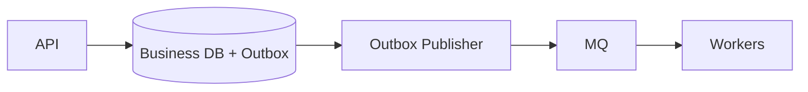
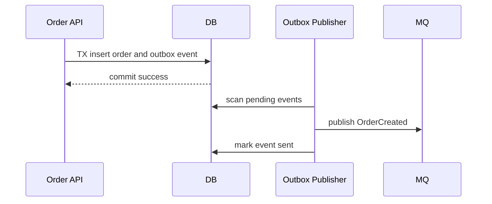
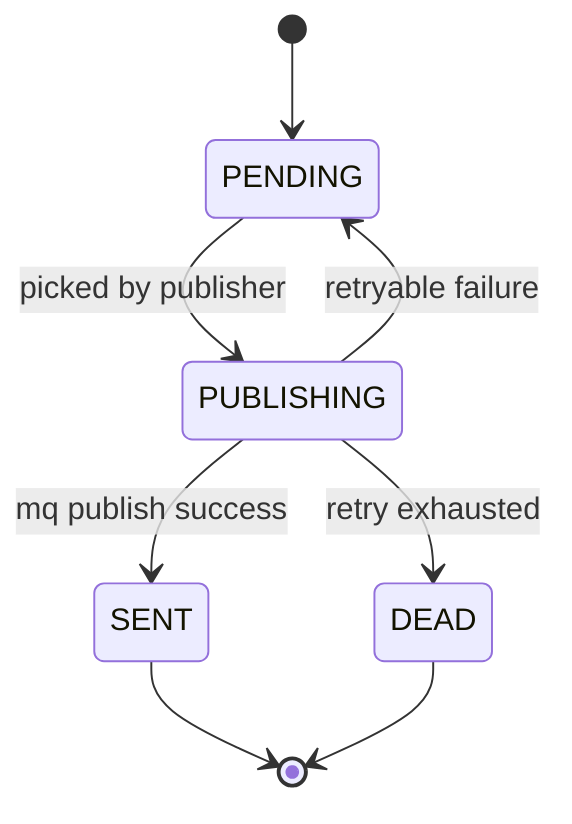

# 数据库与 MQ 一致性：Outbox

后端系统经常需要“写数据库后通知下游”。比如订单创建后通知库存、支付成功后通知订单、评论创建后通知作者。如果数据库写成功但 MQ 发送失败，系统就会进入不一致状态。Outbox 解决的就是这个问题。



## 场景

创建订单时，订单服务要做两件事：

1. 写入订单表。
2. 发出 `OrderCreated` 消息，让库存、通知、搜索等系统跟进。

这两个动作跨越数据库和 MQ，不能放进同一个普通数据库事务。如果处理不好，就会出现“订单已经存在，但下游不知道”的问题。

## 推荐操作顺序

推荐使用 Outbox：**同一个本地事务里写业务表和 outbox 表，事务提交后由 publisher 异步发送 MQ**。

```text
1. begin transaction
2. insert business row
3. insert outbox event row
4. commit
5. publisher scans outbox
6. publisher sends MQ
7. publisher marks event sent
```

API 伪代码：

```pseudo
function createOrder(request):
    begin transaction
        order = insert orders(
            user_id = request.userId,
            status = "CREATED"
        )

        insert outbox_events(
            event_id = generateId(),
            aggregate_type = "ORDER",
            aggregate_id = order.orderId,
            event_type = "OrderCreated",
            payload = toJson(order),
            status = "PENDING"
        )
    commit

    return order
```

Publisher 伪代码：

```pseudo
function publishOutboxLoop():
    while true:
        events = selectPendingEvents(limit = 100)

        for event in events:
            try:
                mq.publish(topic = event.eventType, key = event.aggregateId, payload = event.payload)
                markEventSent(event.eventId)
            catch error:
                increaseRetryCount(event.eventId)
                scheduleNextRetry(event.eventId)
```

## 为什么这样做

业务数据和 outbox 事件在同一个数据库事务里提交，保证：

- 订单写入失败，就不会有 `OrderCreated` 事件。
- 订单写入成功，一定会有一条待发送事件。
- MQ 暂时失败时，事件仍在数据库里，可以重试。



Outbox 不保证消息只发送一次。它保证消息最终能发出去。消费者仍然必须幂等。

## 反例 1：先写数据库，再直接发 MQ

```pseudo
function badCreateOrder(request):
    order = database.insertOrder(request)
    mq.publish("OrderCreated", order)
    return order
```

会出的问题：

```text
1. database.insertOrder 成功。
2. mq.publish 因网络抖动失败。
3. API 返回 500 或超时。
4. 数据库里已经有订单。
5. 库存、通知、履约都没有收到消息。
```

如果客户端重试，还可能创建重复订单，除非另有幂等约束。

## 反例 2：先发 MQ，再写数据库

```pseudo
function badPublishFirst(request):
    mq.publish("OrderCreated", request)
    order = database.insertOrder(request)
    return order
```

会出的问题：

- MQ 消息已经被消费者处理，但订单最终写库失败。
- 下游查订单查不到。
- 库存或通知系统处理了一个不存在的订单。

这个顺序通常更危险，因为消息传播出去后更难撤回。

## Outbox 表设计

```sql
create table outbox_events (
  event_id varchar(64) primary key,
  aggregate_type varchar(64) not null,
  aggregate_id varchar(64) not null,
  event_type varchar(128) not null,
  payload text not null,
  status varchar(32) not null,
  retry_count int not null default 0,
  next_retry_at timestamp not null,
  created_at timestamp not null,
  updated_at timestamp not null
);

create index idx_outbox_pending
on outbox_events(status, next_retry_at, created_at);
```

状态机：



多 publisher 并发扫描时，要避免抢同一条事件。可以用数据库锁、状态抢占或分片扫描。

```pseudo
function selectPendingEvents(limit):
    begin transaction
        events = select * from outbox_events
                 where status = "PENDING"
                   and next_retry_at <= now()
                 order by created_at
                 limit limit
                 for update skip locked

        update selected events set status = "PUBLISHING"
    commit

    return events
```

## 消费者为什么还要幂等

Publisher 可能出现这种情况：

```text
1. MQ publish 成功。
2. Publisher 更新 outbox status = SENT 前宕机。
3. Publisher 重启后重新扫描到这条 PENDING/PUBLISHING 事件。
4. 消息再次发送。
```

所以消费者必须允许重复消息。

消费者伪代码：

```pseudo
function consumeOrderCreated(message):
    begin transaction
        inserted = insert consumed_messages(consumer_name, message_id)
        if not inserted:
            commit
            ack(message)
            return

        reserveInventory(message.orderId, message.skuId)
    commit

    ack(message)
```

去重表：

```sql
create table consumed_messages (
  consumer_name varchar(64) not null,
  message_id varchar(64) not null,
  consumed_at timestamp not null,
  primary key (consumer_name, message_id)
);
```

## 失败补偿

| 失败点 | 后果 | 补偿 |
| --- | --- | --- |
| 业务事务失败 | 没有业务数据 | outbox 一起回滚，无需发消息 |
| MQ publish 失败 | 下游暂时不知道 | outbox 保留 PENDING，publisher 重试 |
| publisher 宕机 | 消息暂停发送 | 重启后继续扫描 PENDING/PUBLISHING |
| 消息重复发送 | 消费者可能重复处理 | 消费者幂等表或业务唯一约束 |
| 事件长期失败 | 积压或业务停滞 | DEAD 状态、告警、修复后重放 |

## 面试怎么讲

可以这样回答：

> 数据库和 MQ 不在同一个事务里，所以不能简单写库后直接发 MQ。否则 DB 成功但 MQ 失败会导致业务状态变化了，下游不知道。推荐使用 Outbox：在同一个本地事务里写业务表和 outbox 事件表，事务提交后由 publisher 扫描 outbox 发 MQ。这样只要业务写入成功，就一定有事件可以重试发送。Outbox 只能保证最终发送，不能保证只发送一次，所以消费者必须用 message_id 去重或业务唯一约束保证幂等。

## 检查清单

- 业务表和 outbox 是否在同一个本地事务里写入？
- publisher 是否支持重试和 DEAD 状态？
- 多 publisher 是否避免重复抢同一事件？
- MQ 消息是否带全局唯一 `event_id`？
- 消费者是否幂等？
- outbox 积压、失败次数、最老事件年龄是否有告警？

## 延伸阅读

- [Outbox Pattern](../messaging/outbox-pattern.md)
- [MQ 幂等消费](../messaging/idempotent-consumer.md)
- [重试与死信队列](../messaging/retry-dlq.md)
- [Microservices.io: Transactional Outbox](https://microservices.io/patterns/data/transactional-outbox.html)
