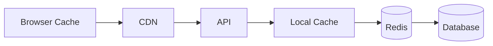
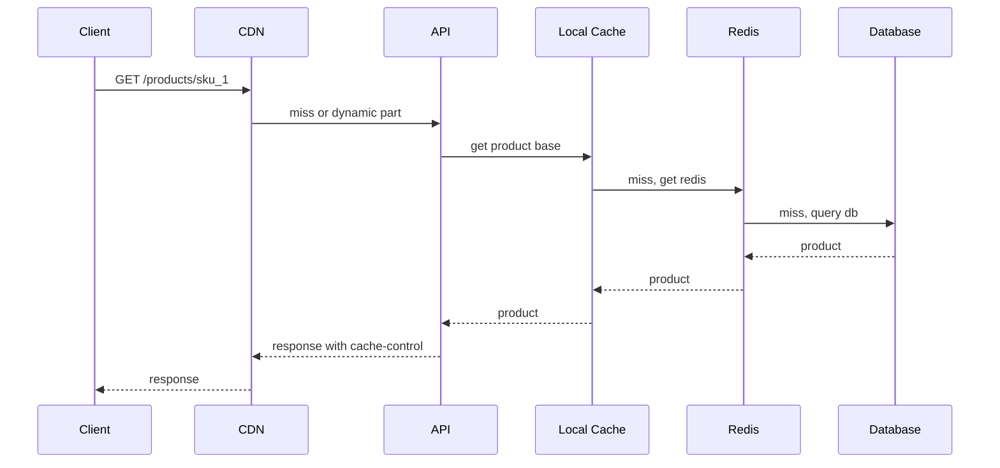

# 多级缓存协作

多级缓存不是“缓存越多越好”。它的价值是让不同距离、不同成本的缓存各自处理适合的请求：浏览器和 CDN 扛静态资源，本地缓存扛极热配置，Redis 扛共享热点，数据库保留权威数据。



## 场景

商品详情页同时包含：

- 商品基础信息：标题、图片、描述，变化不频繁。
- 价格和库存：变化频繁，不能长期缓存旧值。
- 活动配置：全站热点，读多写少。
- 用户是否收藏：用户维度数据，不适合 CDN 缓存。

多级缓存要按数据类型拆，而不是把整个页面无脑缓存。

## 各层职责

| 层级 | 适合缓存 | 不适合缓存 | 常见 TTL |
| --- | --- | --- | --- |
| Browser | 静态资源、带版本号图片 | 用户敏感数据 | 分钟到天 |
| CDN | 商品图片、公开页面片段 | 个人化状态、下单结果 | 秒到小时 |
| Local Cache | 热点配置、字典表 | 大对象、频繁变化数据 | 秒到分钟 |
| Redis | 共享热点对象、计数、短状态 | 权威交易账 | 秒到小时 |
| DB | 权威数据 | 高并发重复读 | 不用 TTL |

## 推荐读流程

```text
1. 浏览器命中静态资源缓存，直接返回
2. CDN 命中公开缓存，直接返回
3. API 收到动态请求
4. 先读本地缓存
5. 本地 miss 后读 Redis
6. Redis miss 后读数据库
7. 回填 Redis 和本地缓存
```



## Key 与版本设计

```text
product:base:{sku_id}:v{version} -> 商品基础信息
product:price:{sku_id} -> 价格，短 TTL 或主动失效
product:stock:{sku_id} -> 展示库存，短 TTL，不作为扣减权威
config:promotion:{promotion_id}:v{version} -> 活动配置
local:config:promotion:{promotion_id}:v{version} -> 进程内缓存
```

带版本号的 key 适合读多写少的数据。更新时发布新版本，旧 key 自然过期，避免大规模 delete 风暴。

## 伪代码

```pseudo
function getProductBase(skuId):
    version = getProductVersion(skuId)  // can be local small cache
    key = "product:base:" + skuId + ":v" + version

    localValue = localCache.get(key)
    if localValue exists:
        return localValue

    redisValue = redis.get(key)
    if redisValue exists:
        localCache.set(key, redisValue, ttl = 5 seconds)
        return redisValue

    lockKey = "lock:rebuild:" + key
    lockToken = randomUuid()
    if redis.setNx(lockKey, lockToken, ttl = 3 seconds):
        try:
            product = database.query("select * from products where sku_id = ?", skuId)
            redis.set(key, product, ttl = 30 minutes + randomJitter())
            localCache.set(key, product, ttl = 5 seconds)
            return product
        finally:
            redis.evalLua("""
                if redis.call('get', KEYS[1]) == ARGV[1] then
                    return redis.call('del', KEYS[1])
                end
                return 0
            """, keys = [lockKey], args = [lockToken])

    sleep(50 milliseconds)
    return redis.get(key) or queryDatabaseWithRateLimit(skuId)
```

本地缓存 TTL 要短，因为它分散在每个 API 实例里，主动失效比 Redis 更难。

## 写入和失效流程

商品基础信息更新：

```text
1. 写数据库，version + 1
2. 提交事务
3. 删除旧 Redis key 或等待 TTL
4. 发布 ProductChanged 事件
5. API 实例收到事件后删除本地缓存
6. CDN 根据 surrogate key 或 URL 版本失效
```

```pseudo
function updateProductBase(skuId, patch):
    begin transaction
        update products
        set title = patch.title, version = version + 1, updated_at = now()
        where sku_id = skuId
    commit

    redis.delete("product:version:" + skuId)
    mq.publish(ProductChanged(skuId))
    cdn.purgeByTag("product:" + skuId)
```

## 为什么这样做

每一层缓存的成本和一致性能力不同：

- 越靠近用户，延迟越低，但失效越难控制。
- 越靠近数据库，一致性越容易控制，但承压能力越弱。
- 本地缓存很快，但每个进程都有一份，不能放需要强一致的数据。
- Redis 是共享缓存，适合作为动态数据的主要缓存层。

## 反例与后果

反例 1：整页 CDN 缓存包含用户状态。

后果：A 用户可能看到 B 用户的收藏、优惠券、登录状态，这是严重数据泄露。公开内容和个人化内容必须拆分。

反例 2：本地缓存 TTL 很长。

后果：某台 API 实例长期返回旧配置，问题只影响部分用户，排查困难。进程内缓存要短 TTL，并配合变更事件删除。

反例 3：热点 key 同时过期。

后果：大量请求穿透 Redis 打到数据库，形成缓存雪崩。TTL 要加随机抖动，热点 key 用互斥重建或逻辑过期。

## 失败补偿

| 失败点 | 后果 | 补偿 |
| --- | --- | --- |
| CDN purge 失败 | 边缘节点返回旧内容 | 短 TTL、重试 purge、URL 带版本 |
| 本地缓存删除事件丢失 | 个别实例读旧值 | 本地短 TTL 兜底，定期刷新版本 |
| Redis 重建失败 | 请求打到 DB | 限流回源，返回降级数据 |
| 热点 key 过期 | DB 压力突增 | 逻辑过期、互斥锁、预热 |
| 缓存了用户私有数据 | 数据泄露 | 按用户维度 key，禁止 CDN 共享缓存 |

## 面试怎么讲

可以这样回答：

> 多级缓存要按数据类型设计。静态资源和公开内容可以放浏览器或 CDN，热点配置可以放短 TTL 本地缓存，动态共享数据放 Redis，数据库仍是权威源。更新时我会先写 DB，再失效 Redis，并通过事件删除本地缓存；CDN 用短 TTL、版本化 URL 或 tag purge。反例是把用户私有数据放进共享 CDN，或者本地缓存 TTL 过长，都会造成严重一致性和安全问题。

## 延伸阅读

- [缓存雪崩](../cache/cache-avalanche.md)
- [热点 Key](../cache/hot-key.md)
- [Redis 与数据库一致性](./redis-database-consistency.md)
