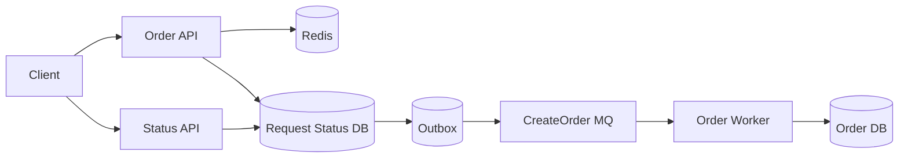
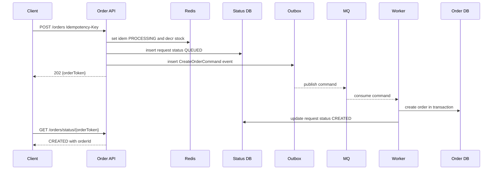
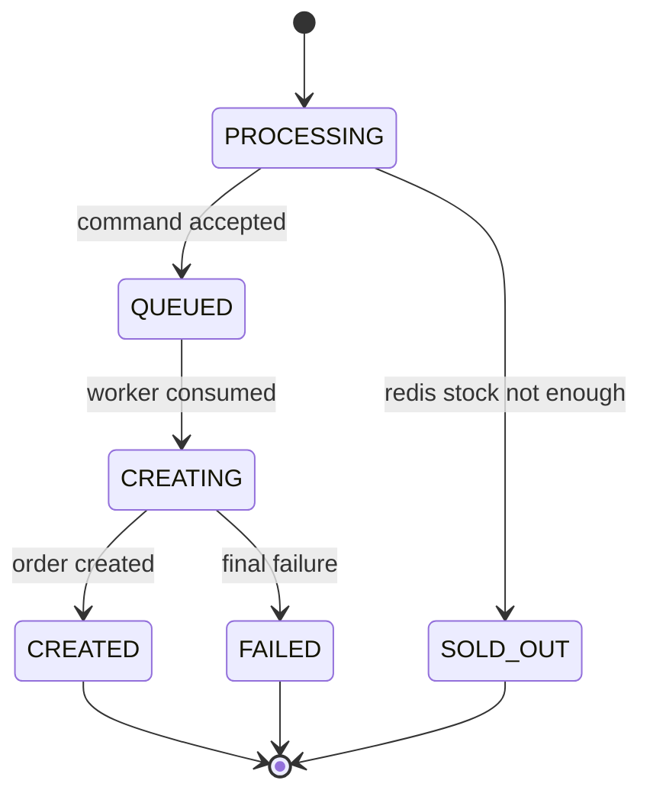

# 下单链路组件协作完整案例

这篇把 Redis、数据库、MQ、Worker、Outbox 和状态查询串成一个完整下单链路。目标是回答一个核心问题：用户点“下单”后，本次请求什么时候返回？后台真正创建订单后，结果又怎么给用户？



## 场景

高并发活动下单：

- 同一个用户不能重复下单。
- 库存有限，不能超卖。
- API 不能同步等待所有数据库和下游操作完成。
- 用户需要看到处理中、成功、失败、售罄等最终结果。

这里用“Redis 预扣库存 + 异步创建订单 + 状态查询”的方案。

## 推荐操作顺序

提交下单：

```text
1. API 校验参数和幂等键
2. Redis 设置幂等占位 PROCESSING
3. Redis 原子预扣库存
4. 数据库写 request_status = QUEUED 和 outbox command
5. 返回 202 Accepted + orderToken
6. Outbox publisher 发送 CreateOrderCommand
7. Worker 消费 MQ
8. Worker 在 DB 事务里创建订单并更新 request_status
9. 用户查询状态接口获取最终结果
```

整体时序：



## 为什么这样做

这条链路把不同组件的职责拆清楚：

| 组件 | 职责 | 是否权威 |
| --- | --- | --- |
| Redis 幂等 key | 快速挡重复请求 | 临时状态 |
| Redis 库存 | 承接高并发预扣 | 资格状态，不是最终库存账 |
| request_status 表 | 用户查询结果的权威来源 | 是 |
| Outbox | 保证 command 最终进入 MQ | 是 |
| MQ | 削峰和异步调度 | 传输层 |
| Worker | 真正创建订单 | 执行业务 |
| orders 表 | 最终订单权威数据 | 是 |

API 返回 `202`，表示“系统已经接收请求并排队处理”，不是“订单已经创建成功”。最终结果以状态查询接口为准。

## API 伪代码

```pseudo
function submitOrder(request):
    idemKey = "idem:order:" + request.userId + ":" + request.idempotencyKey
    stockKey = "stock:sku:" + request.skuId
    orderToken = generateId()

    started = redis.setNx(idemKey, "PROCESSING", ttl = 10 minutes)
    if not started:
        existing = queryRequestByIdempotencyKey(request.userId, request.idempotencyKey)
        return 200, existing

    left = redis.decr(stockKey)
    if left < 0:
        redis.incr(stockKey)
        redis.set(idemKey, "SOLD_OUT", ttl = 10 minutes)
        return 409, { "status": "SOLD_OUT" }

    try:
        begin transaction
            insert order_requests(
                order_token = orderToken,
                user_id = request.userId,
                idempotency_key = request.idempotencyKey,
                status = "QUEUED"
            )

            insert outbox_events(
                event_type = "CreateOrderCommand",
                aggregate_id = orderToken,
                payload = request
            )
        commit

        redis.set(idemKey, "QUEUED:" + orderToken, ttl = 10 minutes)
        return 202, { "orderToken": orderToken, "status": "QUEUED" }

    catch error:
        redis.incr(stockKey)
        redis.set(idemKey, "FAILED", ttl = 10 minutes)
        throw error
```

这里有一个关键点：Redis 预扣成功后，如果数据库事务失败，必须回补 Redis 库存。否则库存会少一份。

## Worker 伪代码

```pseudo
function createOrderWorker(message):
    orderToken = message.orderToken

    begin transaction
        inserted = insert consumed_messages(
            consumer_name = "order-worker",
            message_id = message.eventId
        )

        if not inserted:
            commit
            ack(message)
            return

        request = select * from order_requests
                  where order_token = orderToken
                  for update

        if request.status in ("CREATED", "FAILED", "SOLD_OUT"):
            commit
            ack(message)
            return

        order = insert orders(
            order_id = generateId(),
            user_id = request.userId,
            sku_id = request.skuId,
            status = "PENDING_PAYMENT"
        )

        update order_requests
        set status = "CREATED", result = order.orderId
        where order_token = orderToken and status = "QUEUED"
    commit

    ack(message)
```

如果创建订单最终失败：

```pseudo
function markCreateOrderFailed(orderToken, reason):
    begin transaction
        update order_requests
        set status = "FAILED", error_message = reason
        where order_token = orderToken and status in ("QUEUED", "PROCESSING")
    commit

    redis.incr("stock:sku:" + skuId)
```

## 状态表设计

```sql
create table order_requests (
  order_token varchar(64) primary key,
  user_id varchar(64) not null,
  idempotency_key varchar(128) not null,
  sku_id varchar(64) not null,
  status varchar(32) not null,
  result text,
  error_code varchar(64),
  error_message text,
  created_at timestamp not null,
  updated_at timestamp not null,
  unique (user_id, idempotency_key)
);
```

状态机：



查询接口：

```pseudo
function queryOrderStatus(orderToken, userId):
    request = select * from order_requests
              where order_token = orderToken and user_id = userId

    if request.status == "CREATED":
        return 200, { "status": "CREATED", "orderId": request.result }

    if request.status == "FAILED":
        return 200, { "status": "FAILED", "error": request.error_code }

    if request.status == "SOLD_OUT":
        return 200, { "status": "SOLD_OUT" }

    return 200, { "status": request.status }
```

## 反例 1：API 预扣库存后直接返回成功

```pseudo
function badSubmit(request):
    redis.decr(stockKey)
    mq.publish(CreateOrderCommand(request))
    return 200, { "status": "SUCCESS" }
```

会出的问题：

- MQ 发送失败或 worker 创建订单失败，用户已经看到成功。
- 没有状态表时，用户刷新无法知道真实结果。
- 客服和运营无法解释“为什么成功后没有订单”。

## 反例 2：只靠 Redis 存任务状态

```pseudo
function badStatusInRedisOnly(request):
    redis.set("order:status:" + token, "QUEUED")
    mq.publish(command)
```

会出的问题：

- Redis key 过期后，用户无法查询历史结果。
- Redis 故障时状态丢失。
- 无法审计失败原因和补偿过程。

Redis 可以缓存状态，但状态权威应该在数据库。

## 反例 3：API 直接同步等待 worker 完成

```pseudo
function badSyncWait(request):
    mq.publish(command)
    wait until worker finishes or timeout
    return final result
```

会出的问题：

- API 线程被长时间占用。
- worker 慢或 MQ 积压时，入口接口大量超时。
- 客户端重试会放大流量。

异步链路应该让客户端通过状态接口获取结果，而不是同步等待后台 worker。

## 失败补偿

| 失败点 | 后果 | 补偿 |
| --- | --- | --- |
| Redis 幂等占位成功，库存不足 | 用户没抢到 | 设置 SOLD_OUT 状态 |
| Redis 预扣成功，DB 写请求状态失败 | 库存少一份 | 回补 Redis 库存，标记 FAILED |
| DB 写成功，MQ 发布失败 | 任务卡在 QUEUED | Outbox publisher 重试 |
| Worker 重复消费 | 重复创建订单 | consumed_messages 或订单唯一约束 |
| Worker 最终失败 | 用户一直处理中 | 更新 FAILED，回补库存 |
| 查询状态压力高 | DB 被读爆 | `order:status:{token}` 短 TTL 缓存 |

## 用户结果返回方式

基础方式：轮询。

```text
POST /orders -> 202 {orderToken}
GET /orders/status/{orderToken} -> QUEUED / CREATED / FAILED / SOLD_OUT
```

增强方式：

- WebSocket：订单创建成功后主动推送。
- Push：用户离开页面后提醒。
- 短信/邮件：只适合低频关键结果。

即使有推送，也要保留状态查询接口。推送可能丢，查询接口是兜底。

## 面试怎么讲

可以这样回答：

> 高并发下单我会把入口和真正创建订单拆开。API 先用 Redis 做幂等占位和库存预扣，成功后在数据库写一条请求状态记录和 outbox command，然后返回 `202 Accepted` 和 `orderToken`。Outbox publisher 把 command 发到 MQ，worker 消费后在数据库事务里创建订单，并把请求状态更新为 `CREATED` 或 `FAILED`。用户通过状态接口查询最终结果，也可以用 WebSocket 或 Push 提醒。这样入口链路短，Redis 承接高并发，MQ 削峰，数据库保存权威状态。任何异步链路都要有状态表、幂等和补偿。

## 检查清单

- API 返回的是 `202` 还是错误地返回最终成功？
- Redis 预扣成功后，后续失败是否会回补库存？
- 是否有数据库状态表供用户查询最终结果？
- 状态表和 command 是否通过 Outbox 保证一致？
- Worker 是否幂等消费？
- 查询接口是否有缓存保护？
- 是否有卡在 QUEUED/PROCESSING 的超时扫描？

## 延伸阅读

- [Redis 与数据库一致性](./redis-database-consistency.md)
- [数据库与 MQ 一致性：Outbox](./database-mq-outbox.md)
- [异步请求结果返回模式](./async-result-return.md)
- [Worker 消费 MQ 标准流程](./worker-mq-consumption.md)
- [高并发下单系统设计](../practice/high-concurrency-order-system.md)
