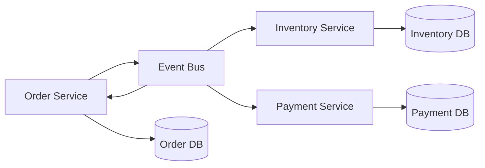
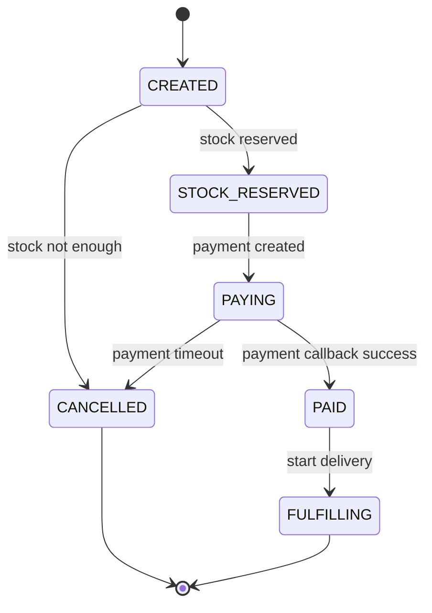
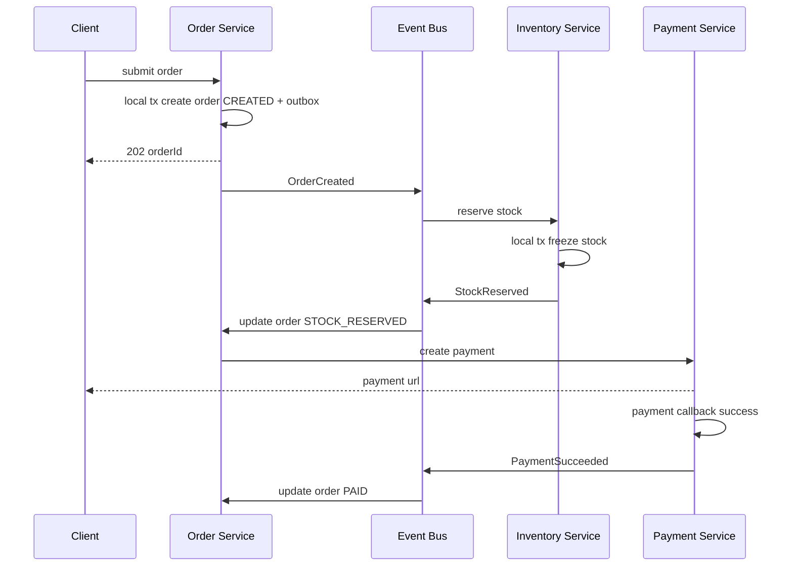

# 订单库存支付 Saga

订单、库存、支付通常属于不同服务，不能指望一个数据库事务同时锁住三套系统。Saga 的思路是：每个服务只做自己的本地事务，然后用事件推动下一步；如果后续失败，就执行补偿动作，把业务状态走到可解释的终态。



## 场景

用户提交订单并支付：

- 订单服务创建订单。
- 库存服务冻结库存，避免超卖。
- 支付服务创建支付单并等待三方回调。
- 用户超时未支付要取消订单并释放库存。
- 支付成功但订单更新失败，要能最终修正。

## 推荐状态机



订单状态不要只有 `success/failed`。真实系统需要表达“库存已冻结但未支付”“支付中”“已支付但待履约”等中间状态，否则失败补偿无法判断该做什么。

## 推荐流程

```text
1. Order Service 创建订单，状态 CREATED，写 outbox: OrderCreated
2. Inventory Service 消费 OrderCreated，冻结库存，写 outbox: StockReserved 或 StockReserveFailed
3. Order Service 消费库存结果，更新订单状态
4. Payment Service 创建支付单，用户跳转支付
5. Payment Service 收到三方回调，更新支付单，写 outbox: PaymentSucceeded
6. Order Service 消费 PaymentSucceeded，订单改为 PAID
7. 超时任务发现未支付订单，发布 CancelOrder
8. Inventory Service 消费取消事件，释放冻结库存
```



## 表设计示例

订单表：

```sql
create table orders (
  order_id varchar(64) primary key,
  user_id varchar(64) not null,
  sku_id varchar(64) not null,
  quantity int not null,
  status varchar(32) not null,
  expire_at timestamp not null,
  version bigint not null default 0,
  created_at timestamp not null,
  updated_at timestamp not null
);
```

库存表：

```sql
create table sku_inventory (
  sku_id varchar(64) primary key,
  available int not null,
  frozen int not null,
  version bigint not null default 0
);

create table stock_reservations (
  reservation_id varchar(64) primary key,
  order_id varchar(64) not null unique,
  sku_id varchar(64) not null,
  quantity int not null,
  status varchar(32) not null,
  created_at timestamp not null
);
```

支付表：

```sql
create table payments (
  payment_id varchar(64) primary key,
  order_id varchar(64) not null unique,
  amount bigint not null,
  status varchar(32) not null,
  provider_trade_no varchar(128),
  created_at timestamp not null,
  updated_at timestamp not null
);
```

## 创建订单伪代码

```pseudo
function submitOrder(userId, skuId, quantity, idempotencyKey):
    if existsOrderByIdempotencyKey(userId, idempotencyKey):
        return existingOrder

    orderId = snowflake.nextId()

    begin transaction
        insert orders(order_id, user_id, sku_id, quantity, status, expire_at)
        values(orderId, userId, skuId, quantity, "CREATED", now() + 15 minutes)

        insert idempotency_records(user_id, idempotency_key, result_id)
        values(userId, idempotencyKey, orderId)

        insert outbox_events(event_type, aggregate_id, payload)
        values("OrderCreated", orderId, {skuId, quantity})
    commit

    return 202, { orderId, status: "CREATED" }
```

这里返回 `202` 更准确，因为订单只是创建并进入 Saga，不代表库存和支付都完成。

## 冻结库存伪代码

```pseudo
function handleOrderCreated(event):
    orderId = event.orderId

    begin transaction
        if exists stock_reservations where order_id = orderId:
            commit
            ack(event)
            return

        updated = update sku_inventory
                  set available = available - event.quantity,
                      frozen = frozen + event.quantity,
                      version = version + 1
                  where sku_id = event.skuId
                    and available >= event.quantity

        if updated == 1:
            insert stock_reservations(order_id, sku_id, quantity, status)
            values(orderId, event.skuId, event.quantity, "RESERVED")

            insert outbox_events(event_type, aggregate_id, payload)
            values("StockReserved", orderId, event)
        else:
            insert outbox_events(event_type, aggregate_id, payload)
            values("StockReserveFailed", orderId, {reason: "NOT_ENOUGH_STOCK"})
    commit

    ack(event)
```

库存扣减必须是条件更新，不能先查后扣：

```sql
update sku_inventory
set available = available - ?, frozen = frozen + ?
where sku_id = ? and available >= ?;
```

## 支付成功与取消补偿

支付回调必须幂等，因为三方支付可能重复通知。

```pseudo
function handlePaymentCallback(callback):
    begin transaction
        payment = select * from payments where payment_id = callback.paymentId for update

        if payment.status == "SUCCESS":
            commit
            return OK

        update payments
        set status = "SUCCESS", provider_trade_no = callback.tradeNo
        where payment_id = callback.paymentId and status in ("CREATED", "PAYING")

        insert outbox_events(event_type, aggregate_id, payload)
        values("PaymentSucceeded", payment.orderId, callback)
    commit

    return OK
```

订单超时取消：

```pseudo
function cancelExpiredOrders():
    orders = query("select * from orders where status in ('CREATED','STOCK_RESERVED','PAYING') and expire_at < now()")

    for order in orders:
        begin transaction
            updated = update orders
                      set status = "CANCELLED", version = version + 1
                      where order_id = order.orderId
                        and status in ("CREATED", "STOCK_RESERVED", "PAYING")

            if updated == 1:
                insert outbox_events(event_type, aggregate_id, payload)
                values("OrderCancelled", order.orderId, order)
        commit
```

释放库存：

```pseudo
function handleOrderCancelled(event):
    begin transaction
        reservation = select * from stock_reservations
                      where order_id = event.orderId for update

        if reservation not exists or reservation.status == "RELEASED":
            commit
            ack(event)
            return

        update sku_inventory
        set available = available + reservation.quantity,
            frozen = frozen - reservation.quantity
        where sku_id = reservation.skuId

        update stock_reservations
        set status = "RELEASED"
        where reservation_id = reservation.reservationId
    commit

    ack(event)
```

如果支付成功事件和取消任务并发到达，订单服务要用状态条件更新处理：

```pseudo
update orders
set status = "PAID"
where order_id = orderId and status in ("PAYING", "STOCK_RESERVED")
```

如果订单已经 `CANCELLED`，但支付已经成功，就不能直接改成 `PAID`，要进入退款流程。

## 反例与后果

反例 1：下单接口同步调用库存和支付，全部成功才返回。

后果：链路长，任何下游慢都会拖慢下单；部分成功后补偿复杂；高峰期容易线程池耗尽。

反例 2：库存先查后扣。

```pseudo
stock = select available from inventory where sku_id = skuId
if stock >= quantity:
    update inventory set available = stock - quantity
```

后果：并发下两个请求都读到足够库存，最终超卖。必须用条件更新或库存流水加唯一约束。

反例 3：取消订单只改订单状态，不释放库存。

后果：冻结库存越来越多，用户看到有库存但无法购买，运营需要手工修库存。

## 失败补偿

| 失败点 | 后果 | 补偿 |
| --- | --- | --- |
| OrderCreated 未发布 | 库存不冻结 | Outbox 重发，订单停留 CREATED 可被扫描补偿 |
| 冻结库存失败 | 订单不能继续 | 发布 StockReserveFailed，订单改 CANCELLED |
| 支付创建失败 | 用户无法支付 | 订单保持 STOCK_RESERVED，重试创建支付或超时取消 |
| 支付成功但订单更新失败 | 钱已付，订单未完成 | PaymentSucceeded outbox 重放；仍失败则人工告警 |
| 订单取消后收到支付成功 | 状态冲突 | 进入退款 Saga，不直接改已取消订单 |
| 释放库存失败 | 库存被冻结 | OrderCancelled 事件重试，库存 reservation 幂等释放 |

## 面试怎么讲

可以这样回答：

> 订单、库存、支付跨服务时，我不会用一个大事务强行包住所有系统，而是用 Saga。订单服务先本地创建订单和 outbox，库存服务消费事件后用条件更新冻结库存，支付成功通过回调和 outbox 通知订单服务。每一步都要幂等，状态更新要带条件，失败通过事件重试和补偿动作处理。比如订单超时取消会发布 OrderCancelled，库存服务根据 reservation 幂等释放冻结库存；如果取消后又收到支付成功，则进入退款流程。

## 延伸阅读

- [Saga 与 TCC](../microservices/saga-tcc.md)
- [下单链路组件协作完整案例](./order-flow-collaboration.md)
- [幂等 Key 设计](../recipes/idempotency-key-design.md)
