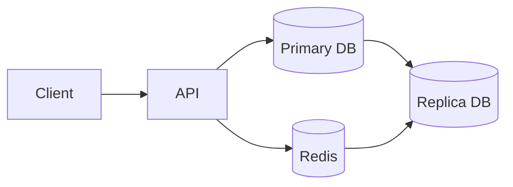
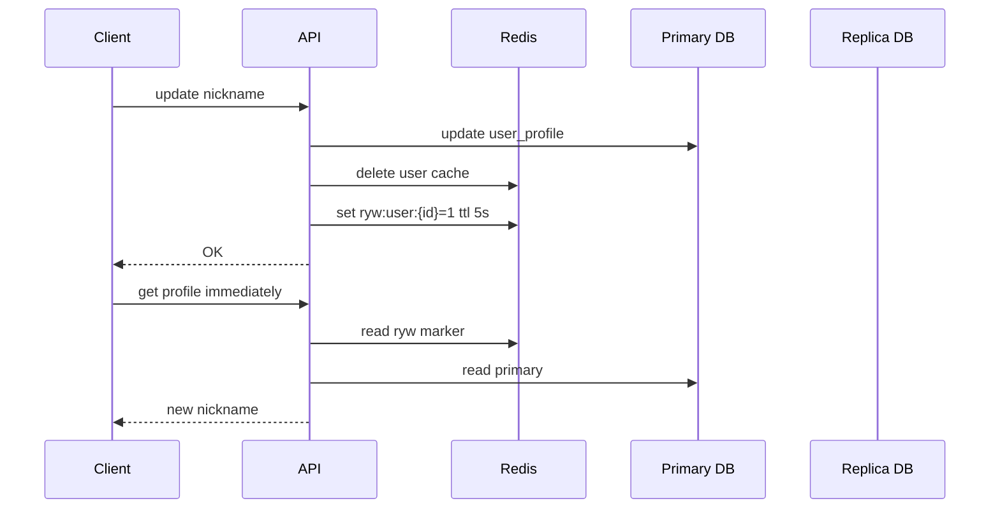

# 读写分离与缓存协作

读写分离把写请求打到主库，把读请求打到从库；缓存把热点读请求挡在 Redis 或本地内存。两者一起用时，核心问题是：**刚写完的数据，读请求到底应该读哪里**。



## 场景

用户修改昵称后立刻刷新个人页：

- 写请求必须进主库。
- 普通读请求优先读缓存，缓存 miss 后读从库。
- 主从复制有延迟，从库可能还没看到新昵称。
- 缓存如果被旧值回填，会让用户短时间看到旧数据。

## 推荐读写流程

写流程：

```text
1. 写主库
2. 提交事务
3. 删除用户缓存
4. 记录 read-your-write 标记，短时间内强制读主库
5. 返回成功
```

读流程：

```text
1. 如果命中 read-your-write 标记，跳过缓存和从库，读主库
2. 否则读 Redis
3. Redis miss 后读从库
4. 回填 Redis，设置较短 TTL
```



## Key 设计

```text
user:profile:{user_id} -> 用户资料快照，TTL 5-30 min
user:profile:null:{user_id} -> 空值缓存，TTL 30-60 s
ryw:user:profile:{user_id} -> 写后读主库标记，TTL 2-10 s
cache:delete:user:profile:{user_id} -> 删除缓存补偿任务
```

`ryw` 是 read your write 的缩写，意思是“用户刚写完，后续短时间读必须看到自己的写入”。它不是强一致系统的完整解法，但对个人资料、订单状态、后台配置这类体验问题很实用。

## 伪代码

```pseudo
function updateProfile(userId, patch):
    begin transaction
        update user_profiles
        set nickname = patch.nickname, version = version + 1, updated_at = now()
        where user_id = userId
    commit

    cacheKey = "user:profile:" + userId
    deleted = redis.delete(cacheKey)
    if not deleted:
        insertCacheDeleteTask(cacheKey)

    redis.set("ryw:user:profile:" + userId, "1", ttl = 5 seconds)
    return OK
```

```pseudo
function getProfile(userId):
    if redis.exists("ryw:user:profile:" + userId):
        return primaryDb.query("select * from user_profiles where user_id = ?", userId)

    cacheKey = "user:profile:" + userId
    cached = redis.get(cacheKey)
    if cached exists:
        return cached

    profile = replicaDb.query("select * from user_profiles where user_id = ?", userId)
    if profile exists:
        redis.set(cacheKey, profile, ttl = 10 minutes)
    else:
        redis.set("user:profile:null:" + userId, "1", ttl = 30 seconds)

    return profile
```

## 为什么这样做

读写分离提高读吞吐，但牺牲了“写后立刻从从库读到新值”的能力。缓存进一步放大这个问题，因为一旦从库旧值被写入缓存，旧值会活到 TTL 过期。

推荐方案把请求分成两类：

| 请求类型 | 读路径 | 理由 |
| --- | --- | --- |
| 刚写完的用户读自己的数据 | 主库 | 避免主从延迟导致读旧值 |
| 普通读请求 | Redis -> 从库 | 成本低，吞吐高 |
| 后台强一致查询 | 主库 | 以正确性优先 |

## 反例与后果

反例 1：写完后立刻允许从库回填缓存。

```pseudo
function badGetProfile(userId):
    cached = redis.get("user:profile:" + userId)
    if cached exists:
        return cached

    profile = replicaDb.query(...)
    redis.set("user:profile:" + userId, profile, ttl = 10 minutes)
    return profile
```

后果：主库已经是新昵称，从库还没同步，读请求拿旧昵称写回 Redis，用户接下来 10 分钟都可能看到旧昵称。

反例 2：所有读都强制读主库。

后果：简单但失去读写分离价值，热点读会压垮主库；主库承担写入、事务和全部查询，扩容成本高。

反例 3：永久使用 read-your-write 标记。

后果：大量用户长期读主库，流量无法回到从库和缓存；标记必须短 TTL，并且只覆盖对新鲜度敏感的读。

## 失败补偿

| 失败点 | 后果 | 补偿 |
| --- | --- | --- |
| 主库写失败 | 权威数据没变 | 不删缓存，返回失败 |
| 删除缓存失败 | 旧缓存继续存在 | 写入删除任务，后台重试，TTL 兜底 |
| read-your-write 标记写失败 | 用户短时间可能读旧值 | 可降级为本次响应返回新数据，或短时间强制读主库 |
| 从库延迟过大 | 大量读到旧数据 | 监控 replication lag，延迟超阈值时部分读切主库 |

## 面试怎么讲

可以这样回答：

> 读写分离下，主库写成功不代表从库马上可见。我的默认读路径是 Redis 命中直接返回，miss 后读从库并回填；写路径是先写主库，再删缓存。对“写后马上读”的场景，我会加一个短 TTL 的 read-your-write 标记，让该用户短时间绕过缓存和从库读主库。否则从库旧值可能被回填到 Redis，造成比主从延迟更长的脏读。

## 延伸阅读

- [Redis 与数据库一致性](./redis-database-consistency.md)
- [数据库连接池与容量](../fundamentals/connection-pool.md)
- [P99 延迟怎么理解](../performance/p99-latency.md)
