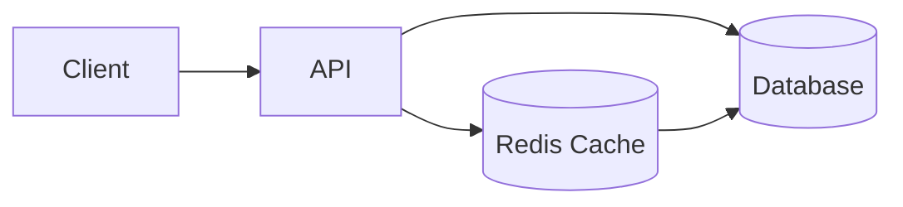
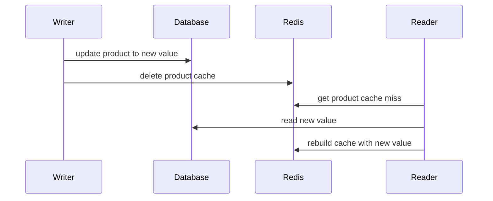
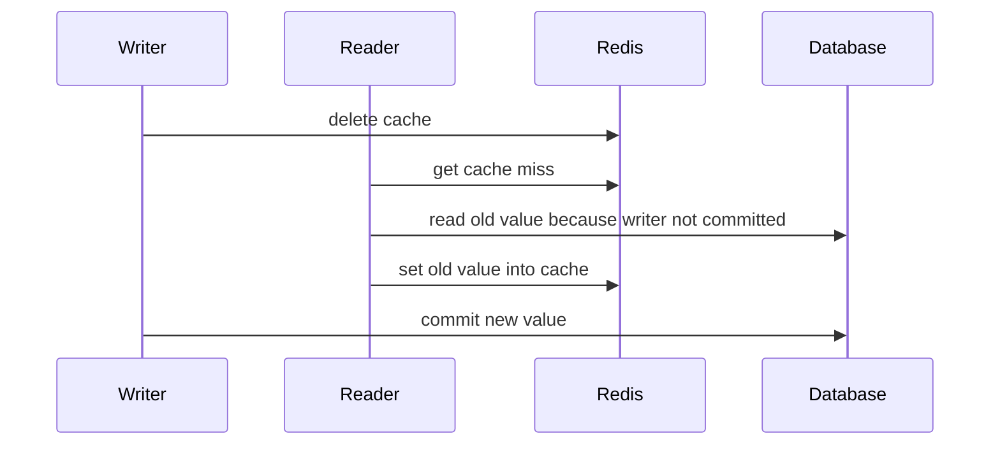

# Redis 与数据库一致性

Redis 和数据库一起用时，最常见的问题不是“怎么缓存”，而是“写数据时先更新谁”。后端面试里，如果只说 Cache-Aside 不够，还要能说清楚推荐顺序、反例会出什么问题、失败后怎么补偿。



## 场景

典型读流程：

1. 先读 Redis。
2. Redis miss 后读数据库。
3. 把数据库结果写回 Redis。

典型写流程：

1. 修改数据库。
2. 删除缓存。
3. 下次读取 miss，回源数据库重建缓存。

这个模式叫 Cache-Aside。数据库是权威数据源，Redis 是读加速层。

## 推荐操作顺序

更新商品信息时，推荐：**先写数据库，再删除缓存**。

```text
1. begin transaction
2. update database
3. commit
4. delete redis cache
5. return success
```

伪代码：

```pseudo
function updateProduct(productId, newValue):
    begin transaction
        update products
        set value = newValue, updated_at = now()
        where product_id = productId
    commit

    redis.delete("product:" + productId)

    return OK
```

读请求伪代码：

```pseudo
function getProduct(productId):
    cacheKey = "product:" + productId

    cached = redis.get(cacheKey)
    if cached exists:
        return cached

    product = database.query("select * from products where product_id = ?", productId)

    if product exists:
        redis.set(cacheKey, product, ttl = 10 minutes)
    else:
        redis.set("product:null:" + productId, "1", ttl = 1 minute)

    return product
```

## 为什么这样做

数据库是权威数据。先写数据库成功，再删除缓存，可以让后续读请求 miss 后读到新值并重建缓存。



这个顺序不能保证绝对强一致，但它把旧缓存长期存在的概率降到较低，并且实现简单、性能好。

## 反例 1：先删缓存，再写数据库

看起来合理，但并发下可能把旧值写回缓存。

```pseudo
function badUpdateProduct(productId, newValue):
    redis.delete("product:" + productId)

    begin transaction
        update products set value = newValue where product_id = productId
    commit
```

会出的问题：



结果：数据库是新值，Redis 是旧值。这个旧值可能一直保留到 TTL 过期。

## 反例 2：先更新缓存，再写数据库

```pseudo
function badUpdateCacheFirst(productId, newValue):
    redis.set("product:" + productId, newValue)
    database.update(productId, newValue)
```

会出的问题：

- Redis 更新成功，但数据库更新失败，缓存里出现不存在的权威状态。
- 多个并发写请求可能乱序更新缓存。
- 缓存变成第二份权威数据，系统更难恢复。

## 反例 3：写数据库后更新缓存

```pseudo
function updateDbThenSetCache(productId, newValue):
    database.update(productId, newValue)
    redis.set("product:" + productId, newValue)
```

这个做法在低并发时看起来可以，但并发写下容易乱序：

```text
1. 请求 A 写 DB = A1
2. 请求 B 写 DB = B1
3. 请求 B set cache = B1
4. 请求 A set cache = A1
```

最终数据库是 B1，缓存却是 A1。删除缓存比更新缓存更稳，因为删除后由下一次读请求从数据库重建。

## 缓存删除失败怎么办

写数据库成功但删除 Redis 失败，会导致旧缓存继续被读到。

推荐补偿：

```pseudo
function updateProduct(productId, newValue):
    database.update(productId, newValue)

    try:
        redis.delete("product:" + productId)
    catch RedisError:
        retryQueue.publish(CacheDeleteCommand("product:" + productId))
```

Redis `DEL` 返回 `0` 不一定是失败，它也可能表示 key 本来就不存在。补偿任务应该在 Redis 超时、连接异常、命令失败这类“不知道是否删除成功”的情况下触发，而不是因为删除数量为 `0` 就触发。

后台重试：

```pseudo
function cacheDeleteWorker():
    message = retryQueue.consume()

    try:
        redis.delete(message.cacheKey)
        ack(message)
    catch error:
        retryLater(message)
```

补偿队列可以用 MQ，也可以用本地任务表。关键是删除失败不能静默忽略。

## 延迟双删什么时候用

延迟双删是：写数据库前删一次缓存，写数据库后再延迟删一次。

```pseudo
function updateWithDelayedDoubleDelete(productId, newValue):
    redis.delete("product:" + productId)

    database.update(productId, newValue)

    sleep(500 milliseconds)
    redis.delete("product:" + productId)
```

它试图修复“先删缓存期间读请求把旧值写回缓存”的问题。但它有明显问题：

- sleep 时间不好选。
- 会拖慢写请求。
- 不能彻底保证一致。

实践中更常用的是：先写 DB 再删缓存，删除失败进重试；热点场景用逻辑过期或版本号兜底。

## 状态表和 Key 设计

Redis Key：

```text
product:{product_id} -> product snapshot
product:null:{product_id} -> null marker
cache:delete:retry:{cache_key} -> retry marker if using Redis queue
```

如果用数据库任务表记录删除失败：

```sql
create table cache_delete_tasks (
  task_id varchar(64) primary key,
  cache_key varchar(256) not null,
  status varchar(32) not null,
  retry_count int not null default 0,
  next_retry_at timestamp not null,
  created_at timestamp not null
);
```

## 失败补偿

| 失败点 | 后果 | 补偿 |
| --- | --- | --- |
| DB 更新失败 | 权威数据没变 | 不删缓存，返回失败 |
| DB 成功，Redis 删除失败 | 旧缓存继续存在 | 删除任务重试，TTL 兜底 |
| 读请求回源失败 | 缓存无法重建 | 返回降级或错误，避免写入空假数据 |
| 热点 key 过期 | 大量回源 DB | 互斥重建、逻辑过期、本地缓存 |

## 面试怎么讲

可以这样回答：

> Redis 和数据库一起用时，我会把数据库作为权威数据源，缓存只做加速。更新数据时推荐先写数据库，再删除缓存。这样后续读请求 cache miss 后会从数据库读到新值并重建缓存。不推荐先删缓存再写数据库，因为写库未提交期间读请求可能读到旧值并写回缓存。也不推荐写 DB 后直接 set 缓存，因为并发写可能乱序覆盖。删除缓存失败要进入重试任务或 MQ，不能静默忽略，TTL 是最后兜底。

## 检查清单

- 是否明确数据库是权威数据源？
- 写流程是否采用“先写 DB，再删缓存”？
- 删除缓存失败是否有重试或任务表？
- 热点 key 重建是否有互斥或逻辑过期？
- 空值缓存 TTL 是否较短？
- 是否能接受短暂读旧值？如果不能，是否应该绕过缓存读主库？

## 延伸阅读

- [Cache-Aside 模式](../cache/cache-aside.md)
- [Redis 缓存击穿](../cache/cache-breakdown.md)
- [缓存穿透](../cache/cache-penetration.md)
- [数据库索引与慢查询](../database/index-and-slow-query.md)
