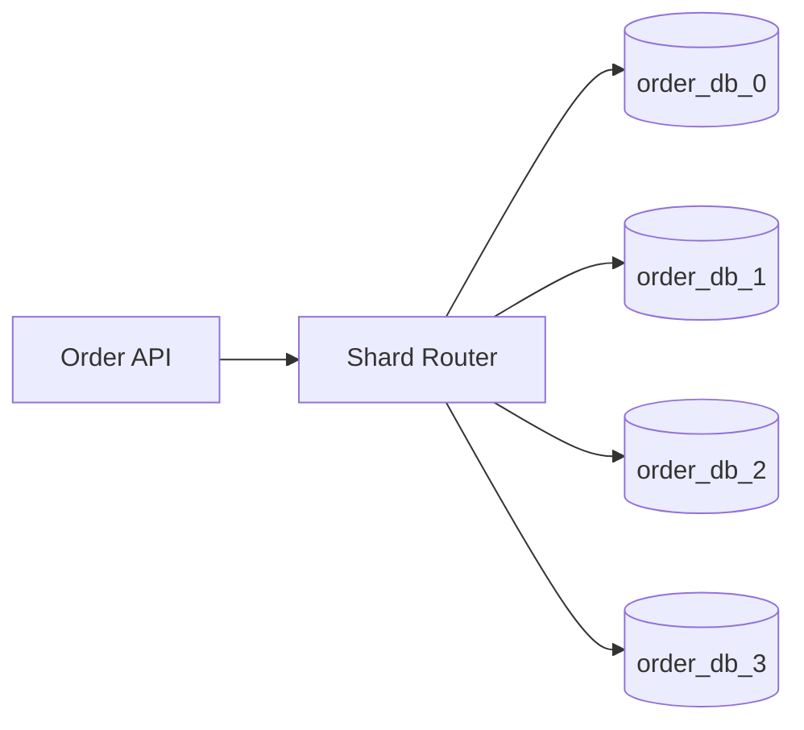
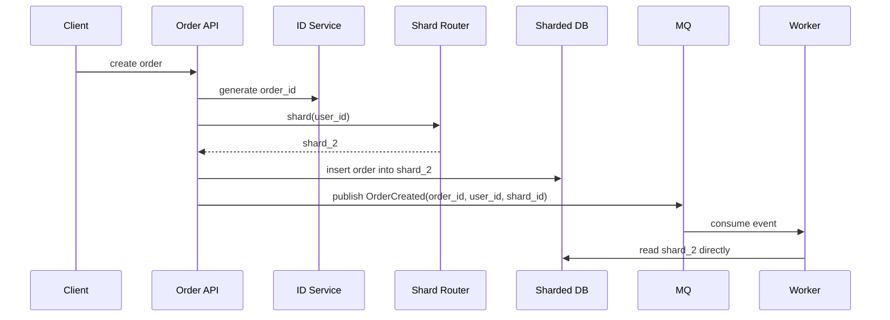

# 分库分表协作

分库分表不是数据库优化的第一步。它通常是在单库容量、写入吞吐或单表数据量接近瓶颈后，把数据按某个分片键拆到多个库表里。真正难点不在“取模”，而在应用、ID、事务、查询、缓存和迁移如何配合。



## 场景

订单表增长到几十亿行，单表索引变大、写入变慢、历史数据查询影响在线交易。此时可以按 `user_id` 或 `order_id` 分片。

常见目标：

- 写入压力分摊到多个库。
- 单表数据量可控。
- 大部分查询能命中单个分片。
- 扩容迁移时业务不停机。

## 分片键怎么选

分片键决定了系统未来几年最痛的查询是什么。

| 分片键 | 优点 | 缺点 | 适合场景 |
| --- | --- | --- | --- |
| `user_id` | 用户订单列表命中单分片 | 按订单号查需要 orderId 包含路由信息或查映射表 | C 端订单 |
| `order_id` | 按订单号查简单 | 用户订单列表可能跨分片 | 订单号查询为主 |
| `tenant_id` | 租户隔离好 | 大租户可能热点 | SaaS 多租户 |
| 时间 | 历史归档方便 | 热点集中在最新分片 | 日志、流水 |

订单系统通常优先考虑 `user_id`，因为“查我的订单”是高频路径。订单号可以用雪花 ID 携带分片信息，或维护 `order_id -> shard_id` 映射。

## 推荐组件职责

```text
1. ID 服务生成全局唯一 order_id
2. Shard Router 根据 user_id 计算 shard_id
3. API 只访问目标分片
4. Redis key 带业务主键，不暴露物理分片
5. MQ 消息携带 shard_id，worker 直接路由
6. 查询服务避免在线 fan-out，必要时用搜索索引或宽表
```



## 路由伪代码

```pseudo
function shardByUserId(userId):
    hashValue = stableHash(userId)
    return hashValue % shardCount

function tableByUserId(userId):
    hashValue = stableHash(userId)
    return "orders_" + (hashValue % tableCountPerShard)

function getOrderConnection(userId):
    shardId = shardByUserId(userId)
    return connectionPool.get("order_db_" + shardId)
```

创建订单：

```pseudo
function createOrder(userId, request):
    orderId = snowflake.nextId(workerId = shardByUserId(userId))
    db = getOrderConnection(userId)
    table = tableByUserId(userId)

    begin transaction on db
        insert into table(order_id, user_id, sku_id, amount, status)
        values(orderId, userId, request.skuId, request.amount, "CREATED")

        insert outbox_events(event_id, event_type, aggregate_id, shard_id, payload)
        values(generateId(), "OrderCreated", orderId, shardByUserId(userId), request)
    commit

    return orderId
```

按订单号查询如果没有 userId：

```pseudo
function getOrderByOrderId(orderId):
    route = routeTable.query("select user_id, shard_id from order_routes where order_id = ?", orderId)
    if route not exists:
        return NOT_FOUND

    db = connectionPool.get("order_db_" + route.shardId)
    table = tableByUserId(route.userId)
    return db.query("select * from " + table + " where order_id = ?", orderId)
```

## 为什么这样做

分库分表后，应用必须把“路由”作为一等能力。不要让每个业务函数自己猜库表，否则迁移、扩容和排障都会失控。

推荐把分片规则封装在统一 Router：

- 分片算法可灰度升级。
- 连接池按分片管理。
- 日志能打印 `shard_id`，排障更快。
- MQ 和 worker 能复用同一套路由逻辑。

## 跨分片问题

反例：在一个请求里更新两个不同用户的订单，并要求一个数据库事务保证原子性。

```pseudo
function badTransferOrder(fromUserId, toUserId, orderId):
    db1 = getOrderConnection(fromUserId)
    db2 = getOrderConnection(toUserId)
    begin distributed transaction
        db1.update(...)
        db2.update(...)
    commit
```

后果：分布式事务成本高、锁时间长、失败恢复复杂。更常见的做法是调整业务边界：单个本地事务只修改一个分片，跨分片协作用 Saga、状态机或异步补偿。

跨分片查询也要谨慎：

```pseudo
function badQueryAllRecentOrders():
    results = []
    for shard in allShards:
        results.add(shard.query("select * from orders order by created_at desc limit 20"))
    return mergeSort(results).limit(20)
```

这种 fan-out 查询会把慢分片拖成整体慢请求。后台报表可以接受，在线接口应优先用搜索索引、汇总表或按用户单分片查询。

## 扩容迁移流程

从 4 个分片扩到 8 个分片，不能简单把 `hash % 4` 改成 `hash % 8`，否则大量老数据找不到。

推荐迁移流程：

```text
1. 引入路由表或一致性哈希版本
2. 新写入按新规则进入目标分片
3. 老数据后台搬迁
4. 搬迁期间读先查新分片，miss 后查旧分片
5. 校验新旧数据数量和 checksum
6. 切读到新分片
7. 下线旧数据
```

```pseudo
function getOrderDuringMigration(userId, orderId):
    newShard = newRouter.route(userId)
    order = newShard.query(orderId)
    if order exists:
        return order

    oldShard = oldRouter.route(userId)
    return oldShard.query(orderId)
```

## 失败补偿

| 失败点 | 后果 | 补偿 |
| --- | --- | --- |
| 分片键选错 | 高频查询跨分片 | 增加映射表、搜索索引或重新分片 |
| 路由规则不一致 | 数据写错库 | 统一 Router 包，日志打印 shard_id |
| 扩容搬迁中断 | 新旧分片数据不一致 | 迁移任务可重入，按主键校验和重试 |
| 跨分片事务失败 | 部分分片成功 | 状态机 + Saga 补偿，避免强依赖 2PC |
| 热点用户集中 | 单分片过载 | 大用户单独分片或二级分片 |

## 面试怎么讲

可以这样回答：

> 分库分表首先要根据访问模式选分片键，比如订单系统常按 user_id 分片，让用户订单列表命中单分片。应用层需要统一 Shard Router，MQ 消息也携带 shard_id，worker 不再广播查库。跨分片事务尽量避免，用本地事务加 Saga 补偿。扩容时不能直接从 hash mod 4 改成 mod 8，而要有路由版本、双读或迁移校验，保证老数据仍能被找到。

## 延伸阅读

- [雪花 ID](../algorithms/snowflake-id.md)
- [一致性哈希与 Token Ring](../algorithms/consistent-hashing.md)
- [Saga 与 TCC](../microservices/saga-tcc.md)
