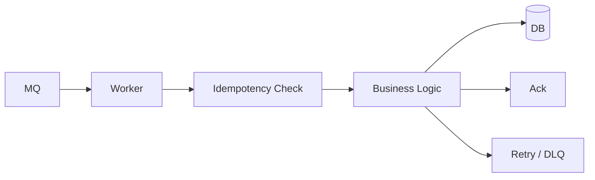
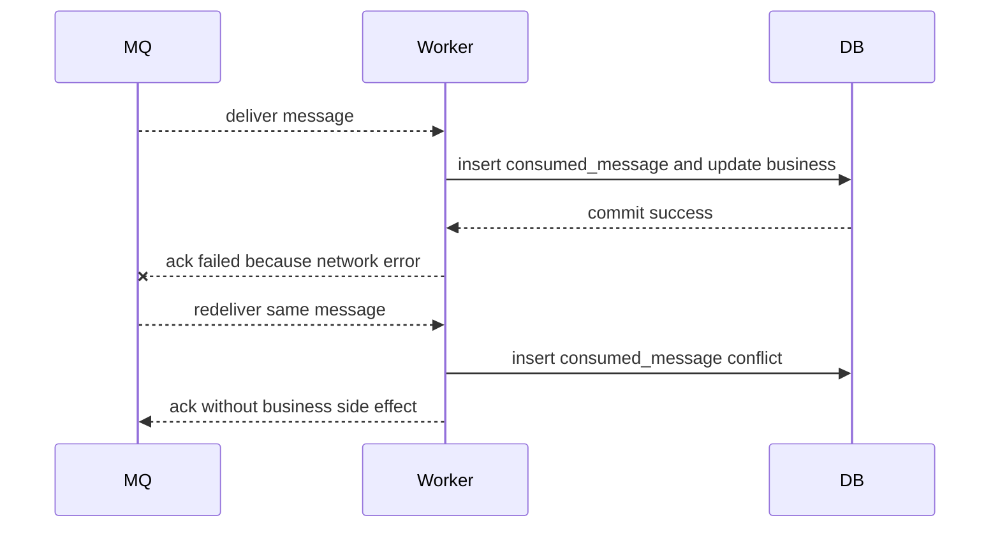

# Worker 消费 MQ 标准流程

MQ 消费者的难点不是“拿到消息然后处理”，而是处理重复消息、失败重试、ack 时机、坏消息、幂等和补偿。大多数消息系统都按“至少一次投递”工作，所以你必须默认：同一条消息可能被消费多次。



## 场景

典型消费者：

- 订单创建后，库存服务预占库存。
- 支付成功后，订单服务更新订单状态。
- 评论创建后，通知服务发送提醒。
- Outbox publisher 发出的业务事件由多个服务消费。

这些消费逻辑通常都有副作用：写数据库、调外部接口、发通知、更新缓存。副作用一旦重复执行，就可能造成重复扣库存、重复发货、重复通知。

## 推荐操作顺序

推荐流程：**收到消息后先做幂等检查，业务处理和幂等记录放在同一个事务里，成功后再 ack**。

```text
1. 拉取消息
2. 解析和校验消息
3. 开启本地事务
4. 插入消费去重记录
5. 执行业务更新
6. 提交事务
7. ack 消息
8. 失败则按类型重试或进入 DLQ
```

伪代码：

```pseudo
function consume(message):
    try:
        validate(message)

        begin transaction
            inserted = insert consumed_messages(
                consumer_name = "inventory-service",
                message_id = message.eventId
            )

            if not inserted:
                commit
                ack(message)
                return

            reserveInventory(
                orderId = message.orderId,
                skuId = message.skuId,
                quantity = message.quantity
            )
        commit

        ack(message)

    catch RetryableError:
        rollback if transaction active
        retryLater(message)

    catch PermanentError:
        rollback if transaction active
        sendToDlq(message)
        ack(message)
```

## 为什么这样做

如果业务事务已经提交，但 ack 失败，MQ 会重新投递消息。消费者再次收到消息时，去重表会命中，然后直接 ack，不会重复执行业务。



这就是消费者幂等的核心。

## 反例 1：先 ack，再执行业务

```pseudo
function badConsume(message):
    ack(message)
    reserveInventory(message)
```

会出的问题：

- ack 成功后，MQ 认为消息处理完了。
- worker 随后宕机或业务失败。
- 消息不会再投递。
- 订单事件丢失，库存没有预占。

这个做法会导致消息丢失，除非业务本身完全不重要。

## 反例 2：业务成功后没有幂等记录

```pseudo
function badNoIdempotency(message):
    reserveInventory(message.orderId, message.skuId)
    ack(message)
```

会出的问题：

```text
1. reserveInventory 成功。
2. ack 因网络失败没有到达 MQ。
3. MQ 重新投递同一条消息。
4. reserveInventory 再执行一次。
5. 库存被重复预占。
```

## 反例 3：幂等记录和业务更新不在一个事务

```pseudo
function badSplitTransaction(message):
    insertConsumedMessage(message.eventId)
    reserveInventory(message)
    ack(message)
```

会出的问题：

- 去重记录写成功后，业务更新失败。
- 下次重试时发现消息已消费，直接跳过。
- 业务永远不会执行。

所以去重记录和业务副作用要放在同一个本地事务里。

## 去重表设计

```sql
create table consumed_messages (
  consumer_name varchar(64) not null,
  message_id varchar(64) not null,
  consumed_at timestamp not null,
  primary key (consumer_name, message_id)
);
```

如果业务天然有唯一约束，也可以用业务表做幂等。例如库存预占表：

```sql
create table inventory_reservations (
  reservation_id varchar(64) primary key,
  order_id varchar(64) not null,
  sku_id varchar(64) not null,
  quantity int not null,
  status varchar(32) not null,
  created_at timestamp not null,
  unique (order_id, sku_id)
);
```

收到重复 `OrderCreated` 时，`unique (order_id, sku_id)` 会阻止重复预占。

## 错误分类

消费者不要所有错误都无限重试。

| 错误 | 例子 | 处理 |
| --- | --- | --- |
| 可重试错误 | DB 超时、Redis 短暂不可用、下游 503 | 延迟重试 |
| 永久错误 | 消息字段缺失、业务对象不存在、金额非法 | 进入 DLQ |
| 幂等冲突 | 已经处理过 | 直接 ack |
| 业务状态冲突 | 订单已取消但收到支付成功 | 条件更新失败，进入补偿或差错流程 |

重试建议加退避和上限：

```pseudo
function retryLater(message):
    message.retryCount += 1

    if message.retryCount > 10:
        sendToDlq(message)
        ack(message)
        return

    delay = min(2 ^ message.retryCount seconds, 5 minutes)
    mq.republishWithDelay(message, delay)
    ack(message)
```

## DLQ 和重放

DLQ 不是垃圾桶，而是待修复队列。每条 DLQ 消息至少要包含：

```json
{
  "messageId": "evt_1001",
  "topic": "order.created",
  "payload": {},
  "errorCode": "INVALID_SKU",
  "errorMessage": "sku does not exist",
  "failedAt": "2026-07-12T10:00:00Z",
  "retryCount": 10
}
```

重放流程：

```text
1. 排查失败原因。
2. 修复代码、配置或数据。
3. 选择一批 DLQ 消息。
4. 低速重放。
5. 观察成功率和业务指标。
```

## 状态和指标

关键指标：

```text
mq_consumer_lag_messages{topic,consumer}
mq_consume_success_total{topic,consumer}
mq_consume_failure_total{topic,consumer,error_type}
mq_consume_duration_ms{topic,consumer}
mq_retry_total{topic,consumer}
mq_dlq_total{topic,consumer}
mq_duplicate_total{topic,consumer}
```

这些指标能回答：是否积压、是否失败、是否重试过多、是否有重复消息、是否进入 DLQ。

## 失败补偿

| 失败点 | 后果 | 补偿 |
| --- | --- | --- |
| 消费者宕机 | 消息未处理 | MQ 重新投递 |
| 业务成功但 ack 失败 | 消息重复投递 | 幂等表跳过重复业务 |
| 去重记录成功但业务失败 | 消息被误判已消费 | 避免拆事务 |
| 可重试错误无限重试 | 队列被坏消息占满 | 重试上限 + DLQ |
| DLQ 无人处理 | 业务长期缺数据 | DLQ 告警和重放工具 |

## 面试怎么讲

可以这样回答：

> MQ 消费要按至少一次投递设计。Worker 收到消息后，先做校验，然后在同一个本地事务里写消费去重记录和业务更新，事务提交后再 ack。这样即使业务成功但 ack 失败，消息重复投递时也会被去重表拦住。不能先 ack 再执行业务，否则 worker 宕机会丢消息；也不能把去重记录和业务更新拆成两个事务，否则可能记录已消费但业务没执行。失败要区分可重试和永久错误，可重试退避重试，超过上限进 DLQ，修复后低速重放。

## 检查清单

- 消费者是否按至少一次投递设计？
- 业务副作用是否幂等？
- 去重记录和业务更新是否在同一个事务里？
- ack 是否在业务事务提交之后？
- 是否区分可重试错误和永久错误？
- 是否有 DLQ 告警和重放工具？
- 是否监控 consumer lag、失败率、重试数和重复消息数？

## 延伸阅读

- [MQ 幂等消费](../messaging/idempotent-consumer.md)
- [重试与死信队列](../messaging/retry-dlq.md)
- [数据库与 MQ 一致性：Outbox](./database-mq-outbox.md)
- [订单状态机设计](../recipes/order-state-machine-design.md)
