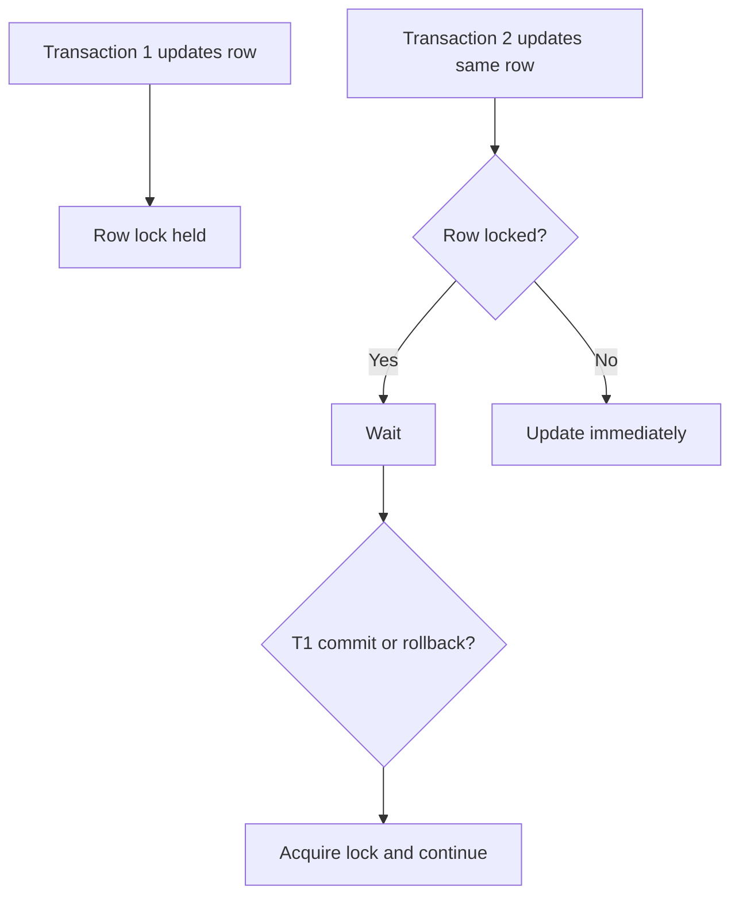
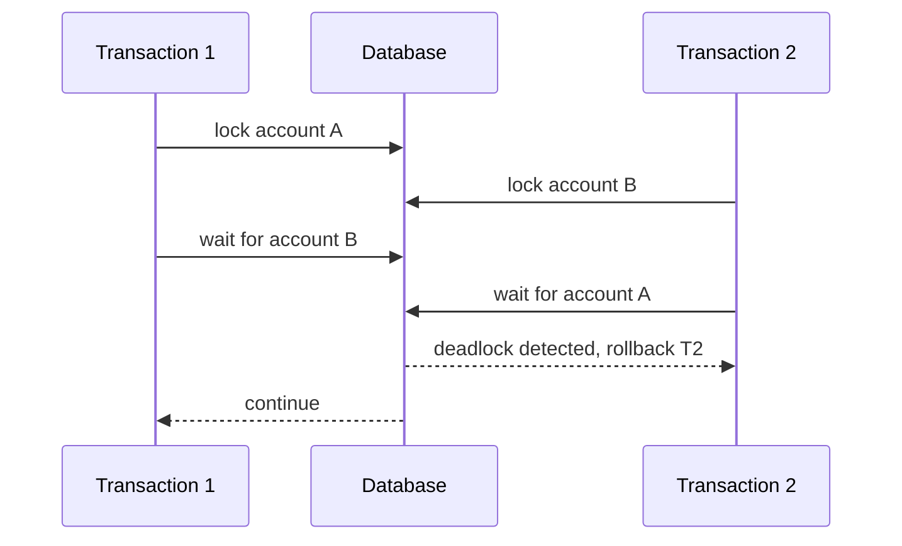
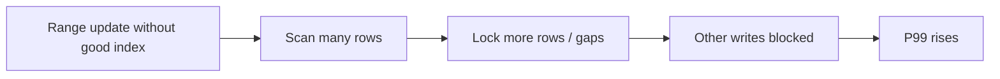
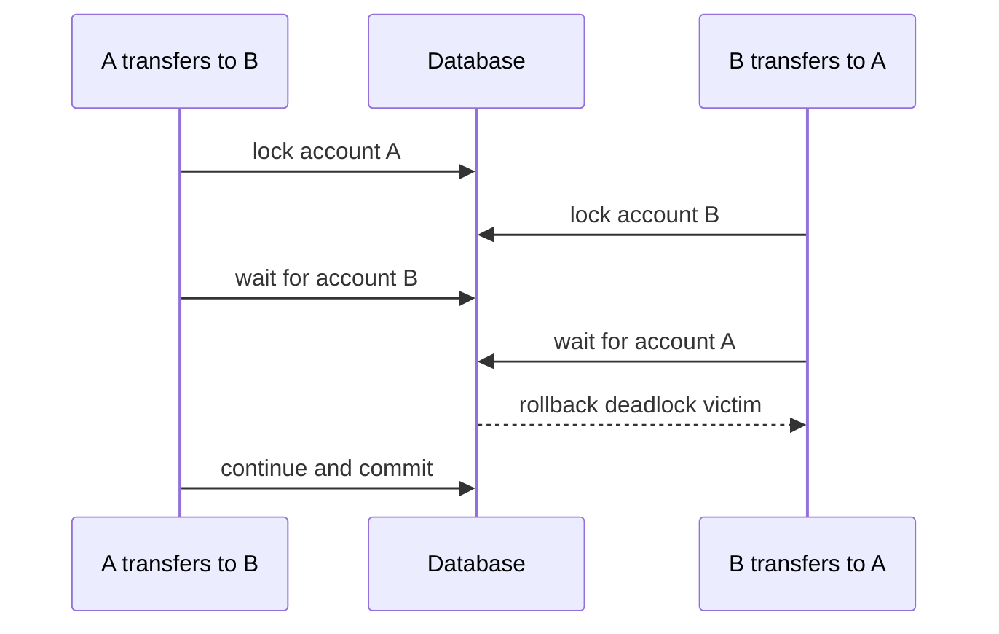

import Tabs from '@theme/Tabs';
import TabItem from '@theme/TabItem';

# 数据库锁

锁让并发写入保持正确，但也会带来等待、死锁和长尾延迟。后端排查慢接口时，要区分 SQL 执行慢、锁等待慢和连接池等待慢。

## 先理解这些概念

- **锁**：数据库为了防止并发修改互相破坏，对数据加的保护。
- **行锁**：锁住某一行或一批行，影响范围相对小。
- **表锁**：锁住整张表，影响范围大。
- **共享锁**：别人可以读，但通常不能改。
- **排他锁**：当前事务修改数据时使用，别人通常要等待。
- **锁等待**：想改的数据被别人锁住，只能等对方提交或回滚。
- **死锁**：两个事务互相等对方释放锁，谁都走不下去。

读这篇时先记住：锁是保证正确性的工具，但锁范围越大、持有越久，性能风险越高。

## 它是什么

数据库锁是数据库在并发读写时保护数据一致性的机制。常见锁包括：

- 行锁：锁住被更新或显式选择的行。
- 表锁：锁住整张表，影响范围大。
- 间隙锁 / Next-Key Lock：锁住索引记录之间的范围，常见于 MySQL InnoDB 的范围查询。
- 意向锁：表级标记，帮助数据库协调表锁和行锁。
- 元数据锁：保护表结构变更和查询之间的一致性。

应用通常不直接管理所有锁，但 SQL 写法、索引、事务时间和隔离级别会决定数据库怎么加锁。

## 为什么需要它

没有锁，并发写入会破坏数据正确性：两个请求同时扣库存、两个转账同时扣余额、两个审批同时修改状态。锁让这些操作按可控顺序执行。

但锁也会带来成本：一个事务持有锁越久，其他事务等待越久；两个事务以不同顺序持有锁，可能死锁；范围查询没有合适索引，可能锁住远大于预期的范围。线上很多“慢 SQL”其实是在等锁，不是在执行。

## 它解决什么问题

| 锁能力 | 解决的问题 | 风险 |
| --- | --- | --- |
| 行锁 | 防止同一行被并发修改出错 | 热点行会排队 |
| `SELECT FOR UPDATE` | 先锁定再执行业务判断 | 事务必须尽快提交 |
| 间隙锁 | 防止范围内出现幻读 | 索引不当会扩大锁范围 |
| 死锁检测 | 发现循环等待并回滚其中一个事务 | 应用要能重试 |
| 锁等待超时 | 避免请求无限等待 | 需要处理失败语义 |
| 一致锁顺序 | 降低死锁概率 | 需要业务统一约定 |

锁不能替代唯一索引、状态机和幂等设计。正确做法通常是锁、约束和条件更新一起使用。

## 核心原理

更新同一行时，后来的事务要等待先持锁的事务提交或回滚。



死锁发生在两个事务互相等待对方持有的锁。



范围查询如果没有合适索引，可能锁住更多行或范围。



## 最小示例

下面示例展示同一个悲观锁模式：转账时按固定顺序锁定两个账户，避免余额被并发修改，并降低死锁概率。

<Tabs groupId="language">
  <TabItem value="java" label="Java">

```java
import java.math.BigDecimal;
import java.sql.Connection;
import java.sql.PreparedStatement;
import java.sql.ResultSet;

public class TransferRepository {
    public void transfer(Connection connection, long from, long to, BigDecimal amount) throws Exception {
        boolean oldAutoCommit = connection.getAutoCommit();
        connection.setAutoCommit(false);
        try {
            long first = Math.min(from, to);
            long second = Math.max(from, to);
            lockAccount(connection, first);
            lockAccount(connection, second);

            updateBalance(connection, from, amount.negate());
            updateBalance(connection, to, amount);
            connection.commit();
        } catch (Exception e) {
            connection.rollback();
            throw e;
        } finally {
            connection.setAutoCommit(oldAutoCommit);
        }
    }

    private void lockAccount(Connection connection, long id) throws Exception {
        try (PreparedStatement statement = connection.prepareStatement(
            "SELECT id FROM accounts WHERE id = ? FOR UPDATE")) {
            statement.setLong(1, id);
            try (ResultSet ignored = statement.executeQuery()) {}
        }
    }

    private void updateBalance(Connection connection, long id, BigDecimal delta) throws Exception {
        try (PreparedStatement statement = connection.prepareStatement(
            "UPDATE accounts SET balance = balance + ? WHERE id = ?")) {
            statement.setBigDecimal(1, delta);
            statement.setLong(2, id);
            statement.executeUpdate();
        }
    }
}
```

  </TabItem>
  <TabItem value="go" label="Go">

```go
package account

import (
    "context"
    "database/sql"
)

func Transfer(ctx context.Context, db *sql.DB, fromID, toID int64, amount int64) error {
    tx, err := db.BeginTx(ctx, nil)
    if err != nil {
        return err
    }
    defer tx.Rollback()

    first, second := fromID, toID
    if first > second {
        first, second = second, first
    }
    if err := lockAccount(ctx, tx, first); err != nil {
        return err
    }
    if err := lockAccount(ctx, tx, second); err != nil {
        return err
    }

    if _, err := tx.ExecContext(ctx, `UPDATE accounts SET balance = balance - ? WHERE id = ?`, amount, fromID); err != nil {
        return err
    }
    if _, err := tx.ExecContext(ctx, `UPDATE accounts SET balance = balance + ? WHERE id = ?`, amount, toID); err != nil {
        return err
    }
    return tx.Commit()
}

func lockAccount(ctx context.Context, tx *sql.Tx, id int64) error {
    var lockedID int64
    return tx.QueryRowContext(ctx, `SELECT id FROM accounts WHERE id = ? FOR UPDATE`, id).Scan(&lockedID)
}
```

  </TabItem>
  <TabItem value="typescript" label="TypeScript">

```typescript
import { Pool, PoolClient } from 'pg';

export async function transfer(pool: Pool, fromId: string, toId: string, amount: number): Promise<void> {
  const client = await pool.connect();
  try {
    await client.query('BEGIN');
    const [first, second] = [fromId, toId].sort((a, b) => Number(a) - Number(b));
    await lockAccount(client, first);
    await lockAccount(client, second);

    await client.query('UPDATE accounts SET balance = balance - $1 WHERE id = $2', [amount, fromId]);
    await client.query('UPDATE accounts SET balance = balance + $1 WHERE id = $2', [amount, toId]);
    await client.query('COMMIT');
  } catch (error) {
    await client.query('ROLLBACK');
    throw error;
  } finally {
    client.release();
  }
}

async function lockAccount(client: PoolClient, id: string): Promise<void> {
  await client.query('SELECT id FROM accounts WHERE id = $1 FOR UPDATE', [id]);
}
```

  </TabItem>
  <TabItem value="python" label="Python">

```python
from decimal import Decimal


def transfer(connection, from_id: int, to_id: int, amount: Decimal) -> None:
    try:
        with connection.cursor() as cursor:
            first, second = sorted([from_id, to_id])
            lock_account(cursor, first)
            lock_account(cursor, second)

            cursor.execute("UPDATE accounts SET balance = balance - %s WHERE id = %s", (amount, from_id))
            cursor.execute("UPDATE accounts SET balance = balance + %s WHERE id = %s", (amount, to_id))
        connection.commit()
    except Exception:
        connection.rollback()
        raise


def lock_account(cursor, account_id: int) -> None:
    cursor.execute("SELECT id FROM accounts WHERE id = %s FOR UPDATE", (account_id,))
```

  </TabItem>
</Tabs>

## 工程实践

### 1. 保持固定锁顺序

多个事务需要锁多条记录时，必须按统一顺序加锁，例如按账户 id 从小到大。这样可以显著降低死锁概率。

### 2. 缩短事务时间

事务内不要做 HTTP 调用、等待用户输入、发送 MQ 或执行复杂计算。先准备好数据，进入事务后只做必要读写，然后尽快提交。

### 3. 为锁等待设置超时

锁等待不能无限持续。应用要能识别 lock wait timeout、deadlock detected 这类错误，并决定有限重试、返回失败或降级。

### 4. 索引影响锁范围

更新或范围查询没有命中合适索引时，数据库可能扫描并锁住更多记录。锁问题经常和索引问题一起出现。

### 5. 监控锁等待

除了慢查询日志，还要观察 lock wait、deadlock count、transaction duration、rows locked、active transactions。锁等待高时，SQL 执行计划本身可能没问题。

## 常见坑

- 把所有慢查询都当成 SQL 执行慢，忽略锁等待。
- 事务里调用下游服务，导致锁持有时间不可控。
- 多条记录加锁顺序不一致，增加死锁概率。
- 范围更新缺少索引，锁住大量不相关数据。
- 死锁后没有有限重试，直接把偶发冲突暴露给用户。
- 为了解决锁等待盲目调大连接池，导致更多事务同时竞争锁。

## 完整案例：转账死锁

### 场景

用户 A 给用户 B 转账，同时用户 B 给用户 A 转账。两个事务都先锁付款方，再锁收款方，于是可能互相等待。



### 修复

所有转账事务都按账户 id 从小到大加锁，而不是按付款方、收款方顺序加锁。这样两个事务会竞争同一把第一锁，不会形成环形等待。

## 检查清单

学完这一节后，你应该能回答：

- 行锁、表锁、间隙锁、元数据锁分别是什么？
- 锁等待和 SQL 执行慢有什么区别？
- 死锁是怎么发生的？为什么固定锁顺序能降低死锁？
- 为什么事务里不能做远程调用？
- 索引为什么会影响锁范围？
- 遇到 deadlock 或 lock wait timeout 应该怎么处理？
- 应该监控哪些锁相关指标？

## 这篇文章在系统里怎么用

数据库锁常出现在扣库存、转账、订单状态更新、唯一资源抢占等场景。系统设计时，如果多个请求可能同时修改同一行数据，就要说明数据库如何加锁、事务多长、死锁如何处理。

排查慢接口时，要把锁等待和 SQL 慢区分开。SQL 本身可能很快，但一直等别人释放锁。减少锁风险的核心是：事务要短、索引要准、加锁顺序要固定、远程调用不要放在事务里。

## 术语回看

- [状态机](../system-design/glossary.md#状态机)
- [补偿](../system-design/glossary.md#补偿)
- [P99](../system-design/glossary.md#p99)

## 延伸阅读

- [MySQL: InnoDB Locking](https://dev.mysql.com/doc/refman/8.4/en/innodb-locking.html)
- [MySQL: Deadlocks in InnoDB](https://dev.mysql.com/doc/refman/8.4/en/innodb-deadlocks.html)
- [PostgreSQL: Explicit Locking](https://www.postgresql.org/docs/current/explicit-locking.html)
- [PostgreSQL: Monitoring Locks](https://www.postgresql.org/docs/current/view-pg-locks.html)
