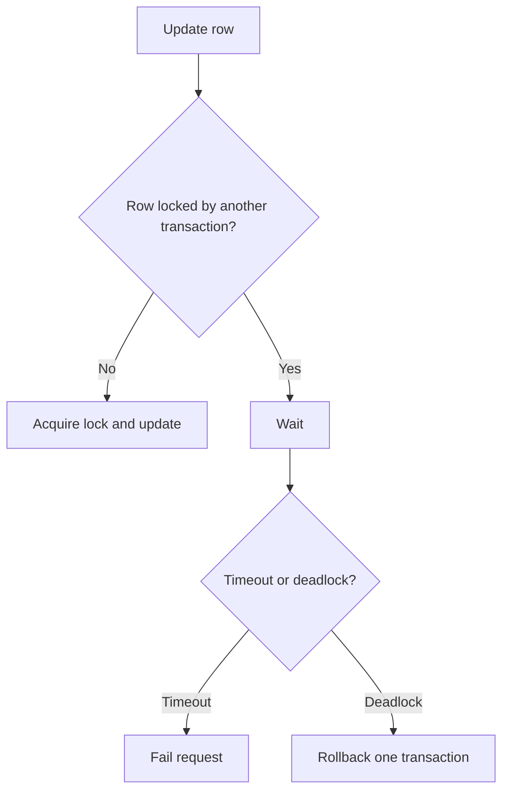

# 数据库锁

锁让并发写入保持正确，但也会带来等待、死锁和长尾延迟。后端排查慢接口时，要区分 SQL 执行慢和锁等待慢。

## 后续扩写

- 行锁、表锁、间隙锁。
- 死锁检测。
- 如何缩短事务时间。

## 延伸阅读

- [MySQL: InnoDB Locking](https://dev.mysql.com/doc/refman/8.4/en/innodb-locking.html)
- [PostgreSQL: Explicit Locking](https://www.postgresql.org/docs/current/explicit-locking.html)
