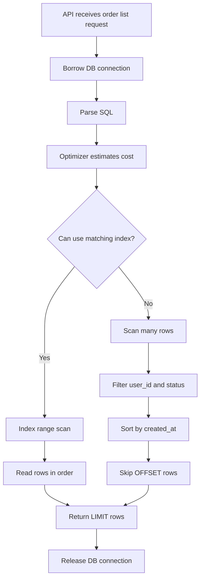
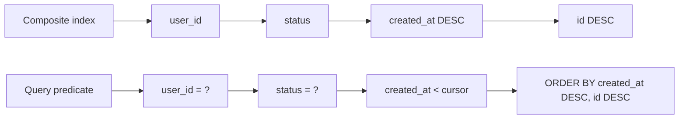
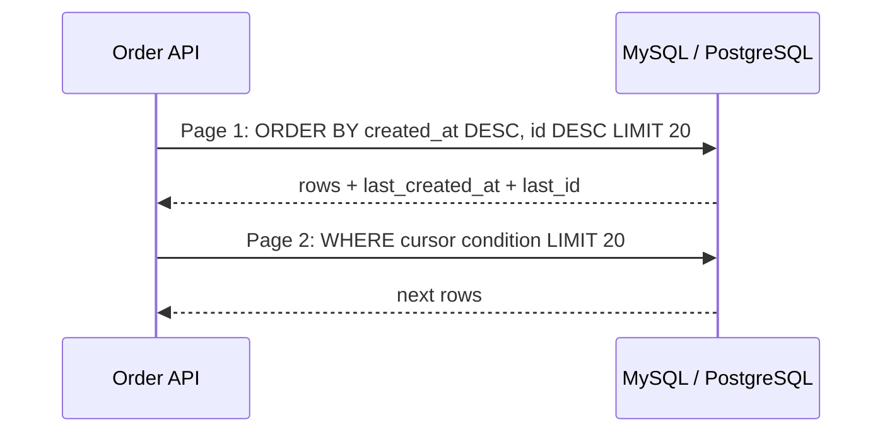
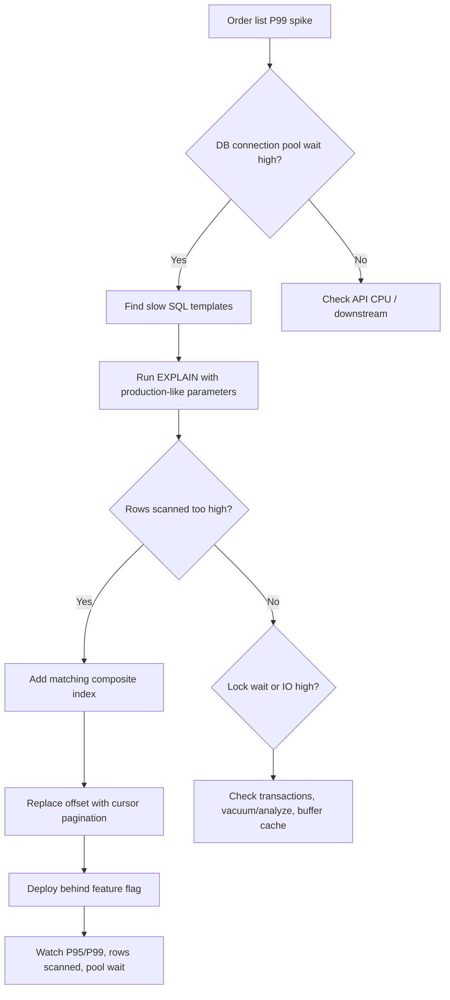

import Tabs from '@theme/Tabs';
import TabItem from '@theme/TabItem';

# 数据库索引与慢查询

数据库是大多数后端系统最容易变成瓶颈的地方。索引不是“给字段加个 B+Tree”这么简单，它和查询条件、排序、分页、数据分布、事务锁、连接池一起决定线上表现。

## 先理解这些概念

- **索引**：数据库为了快速找到数据额外维护的目录。
- **全表扫描**：不走有效索引，把表里很多行都扫一遍。
- **复合索引**：多个字段组成一个索引，字段顺序会影响能不能用上。
- **覆盖索引**：查询需要的字段都在索引里，不必再回到数据行读取。
- **回表**：先通过索引找到主键，再回到数据表读取完整行。
- **执行计划 EXPLAIN**：数据库告诉你这条 SQL 准备怎么查。
- **选择性**：某个字段能过滤掉多少数据，选择性越高越适合做索引前缀。

读这篇时先记住：索引不是越多越好。索引能加速读，但会增加写入和维护成本，关键是让查询条件、排序和索引顺序匹配。

## 它是什么

**索引**是数据库为了更快定位数据而维护的额外数据结构。MySQL InnoDB 和 PostgreSQL 常用的 B-Tree 索引，本质上是让数据库可以按某种顺序快速查找、范围扫描和排序，而不是逐行扫描整张表。

**慢查询**是执行时间超过预期或超过阈值的 SQL。慢不一定代表 SQL 本身复杂，也可能是扫描行数太多、排序落盘、锁等待、连接池耗尽、统计信息过期或缓存命中率下降。

## 为什么需要它

后端接口在数据量小时通常都很快，问题会在数据规模和并发上来后暴露。一个订单列表接口在 1 万行数据上可能只需要 5 ms；同样的 SQL 到 1,000 万行时，如果索引和分页方式不合适，可能变成 2 s，甚至拖满数据库连接池。

数据库慢查询的影响会被放大：慢 SQL 占住连接，连接池开始排队，API worker 等待连接，接口 P99 升高，调用方重试，数据库压力进一步升高。索引和慢查询治理的目标不是“让某条 SQL 快一点”，而是保护整个服务的尾延迟和数据库容量。

## 它解决什么问题

| 能力 | 解决的问题 | 代价或边界 |
| --- | --- | --- |
| 单列索引 | 按单个字段快速过滤 | 低选择性字段收益有限 |
| 复合索引 | 同时支持过滤、排序、范围查询 | 字段顺序很关键 |
| 覆盖索引 | 直接从索引返回需要的列，减少回表 | 索引变大，写入成本增加 |
| Cursor 分页 | 避免深分页扫描大量无用行 | 不能随意跳到第 N 页 |
| `EXPLAIN` | 观察优化器选择的访问路径 | 需要结合真实数据分布理解 |
| 慢查询日志 | 发现线上真实慢 SQL | 需要聚合、归因和持续治理 |

索引不适合解决所有问题。写多读少的表，索引过多会拖慢写入；选择性极低的字段，例如只有 `true/false` 的状态字段，单独建索引通常收益有限；任意组合筛选和排序的后台查询，不能靠无限建索引解决，通常要限制查询条件或使用专门的分析系统。

## 核心原理

下面以订单列表查询为例：

```sql
SELECT id, user_id, status, created_at, amount
FROM orders
WHERE user_id = 42 AND status = 'PAID'
ORDER BY created_at DESC
LIMIT 20 OFFSET 10000;
```

没有合适索引时，数据库可能需要扫描大量行，再排序，再丢弃前 10,000 条。



更合理的复合索引通常是：

```sql
CREATE INDEX idx_orders_user_status_created_id
ON orders (user_id, status, created_at DESC, id DESC);
```

设计原因：

- `user_id` 和 `status` 是等值过滤，放在前面。
- `created_at DESC` 服务于排序和游标范围。
- `id DESC` 作为稳定的 tie-breaker，避免同一秒多条订单导致翻页重复或遗漏。

复合索引的字段顺序决定可用性。可以把它想象成电话簿：先按姓排序，再按名排序。如果只知道名，不知道姓，就很难利用前面的顺序。



## 最小示例

下面示例展示同一个查询策略：使用 cursor pagination，而不是深分页 `OFFSET`。接口接收上一页最后一条记录的 `(created_at, id)`，下一页从这个游标之后继续查。

核心 SQL：

```sql
SELECT id, user_id, status, created_at, amount
FROM orders
WHERE user_id = ?
  AND status = ?
  AND (
    created_at < ?
    OR (created_at = ? AND id < ?)
  )
ORDER BY created_at DESC, id DESC
LIMIT ?;
```

<Tabs groupId="language">
  <TabItem value="java" label="Java">

```java
import java.math.BigDecimal;
import java.sql.Connection;
import java.sql.PreparedStatement;
import java.sql.ResultSet;
import java.sql.Timestamp;
import java.time.Instant;
import java.util.ArrayList;
import java.util.List;

record OrderRow(long id, long userId, String status, Instant createdAt, BigDecimal amount) {}

public List<OrderRow> listPaidOrders(
        Connection connection,
        long userId,
        Instant cursorCreatedAt,
        long cursorId,
        int limit) throws Exception {
    String sql = """
        SELECT id, user_id, status, created_at, amount
        FROM orders
        WHERE user_id = ?
          AND status = ?
          AND (created_at < ? OR (created_at = ? AND id < ?))
        ORDER BY created_at DESC, id DESC
        LIMIT ?
        """;

    try (PreparedStatement statement = connection.prepareStatement(sql)) {
        Timestamp cursor = Timestamp.from(cursorCreatedAt);
        statement.setLong(1, userId);
        statement.setString(2, "PAID");
        statement.setTimestamp(3, cursor);
        statement.setTimestamp(4, cursor);
        statement.setLong(5, cursorId);
        statement.setInt(6, limit);

        try (ResultSet rs = statement.executeQuery()) {
            List<OrderRow> orders = new ArrayList<>();
            while (rs.next()) {
                orders.add(new OrderRow(
                    rs.getLong("id"),
                    rs.getLong("user_id"),
                    rs.getString("status"),
                    rs.getTimestamp("created_at").toInstant(),
                    rs.getBigDecimal("amount")
                ));
            }
            return orders;
        }
    }
}
```

  </TabItem>
  <TabItem value="go" label="Go">

```go
package orders

import (
    "context"
    "database/sql"
    "time"
)

type OrderRow struct {
    ID        int64
    UserID    int64
    Status    string
    CreatedAt time.Time
    Amount    string
}

func ListPaidOrders(ctx context.Context, db *sql.DB, userID int64, cursorCreatedAt time.Time, cursorID int64, limit int) ([]OrderRow, error) {
    const query = `
        SELECT id, user_id, status, created_at, amount
        FROM orders
        WHERE user_id = ?
          AND status = ?
          AND (created_at < ? OR (created_at = ? AND id < ?))
        ORDER BY created_at DESC, id DESC
        LIMIT ?`

    rows, err := db.QueryContext(ctx, query, userID, "PAID", cursorCreatedAt, cursorCreatedAt, cursorID, limit)
    if err != nil {
        return nil, err
    }
    defer rows.Close()

    orders := make([]OrderRow, 0, limit)
    for rows.Next() {
        var order OrderRow
        if err := rows.Scan(&order.ID, &order.UserID, &order.Status, &order.CreatedAt, &order.Amount); err != nil {
            return nil, err
        }
        orders = append(orders, order)
    }
    return orders, rows.Err()
}
```

  </TabItem>
  <TabItem value="typescript" label="TypeScript">

```typescript
import { Pool } from 'pg';

type OrderRow = {
  id: string;
  user_id: string;
  status: string;
  created_at: Date;
  amount: string;
};

export async function listPaidOrders(
  pool: Pool,
  userId: string,
  cursorCreatedAt: Date,
  cursorId: string,
  limit: number,
): Promise<OrderRow[]> {
  const sql = `
    SELECT id, user_id, status, created_at, amount
    FROM orders
    WHERE user_id = $1
      AND status = $2
      AND (created_at < $3 OR (created_at = $3 AND id < $4))
    ORDER BY created_at DESC, id DESC
    LIMIT $5`;

  const result = await pool.query<OrderRow>(sql, [
    userId,
    'PAID',
    cursorCreatedAt,
    cursorId,
    limit,
  ]);
  return result.rows;
}
```

  </TabItem>
  <TabItem value="python" label="Python">

```python
from dataclasses import dataclass
from datetime import datetime
from decimal import Decimal
from typing import Sequence


@dataclass(frozen=True)
class OrderRow:
    id: int
    user_id: int
    status: str
    created_at: datetime
    amount: Decimal


def list_paid_orders(connection, user_id: int, cursor_created_at: datetime, cursor_id: int, limit: int) -> Sequence[OrderRow]:
    sql = """
        SELECT id, user_id, status, created_at, amount
        FROM orders
        WHERE user_id = %s
          AND status = %s
          AND (created_at < %s OR (created_at = %s AND id < %s))
        ORDER BY created_at DESC, id DESC
        LIMIT %s
    """

    with connection.cursor() as cursor:
        cursor.execute(sql, (user_id, "PAID", cursor_created_at, cursor_created_at, cursor_id, limit))
        return [
            OrderRow(id=row[0], user_id=row[1], status=row[2], created_at=row[3], amount=row[4])
            for row in cursor.fetchall()
        ]
```

  </TabItem>
</Tabs>

## 工程实践

### 1. 先看访问模式，再建索引

索引应该从接口访问模式出发，而不是从字段出发。先写出核心查询：过滤条件、排序字段、分页方式、返回列、更新频率。再决定是否需要单列索引、复合索引或覆盖索引。

| 查询特征 | 索引设计倾向 |
| --- | --- |
| 多个等值条件 + 排序 | 等值字段在前，排序字段在后 |
| 范围查询 + 排序 | 范围字段后的索引列可用性会受影响 |
| 只返回少量列 | 可以考虑覆盖索引 |
| 写入非常频繁 | 控制索引数量，避免写放大 |
| 后台任意筛选 | 限制查询条件，或使用搜索/分析系统 |

### 2. 用 `EXPLAIN` 验证，而不是靠猜

MySQL 中要重点看：

- `type`：是否从 `ALL` 全表扫描变成 `range`、`ref` 或 `const`。
- `key`：实际使用了哪个索引。
- `rows`：优化器预计扫描多少行。
- `Extra`：是否出现 `Using filesort`、`Using temporary`。

PostgreSQL 中要重点看：

- 是否使用 `Index Scan`、`Index Only Scan` 或 `Bitmap Index Scan`。
- `actual time` 和 `rows`。
- `shared hit/read`，判断是否大量读磁盘。
- 排序是否使用内存，还是出现外部排序。

### 3. 慢查询要看“扫描行数”和“等待时间”

慢查询不只是 SQL 执行时间。一个请求变慢可能是：

- 扫描行数过多。
- 排序或临时表开销大。
- 等待行锁或元数据锁。
- 等待数据库连接池。
- 数据库 CPU 或 IO 已经打满。
- 查询计划因为统计信息变化而切换。

### 4. 大表分页优先使用 cursor

深分页比索引本身更容易被忽略。`OFFSET 10000 LIMIT 20` 的语义是“先找到 10020 条，再丢掉前 10000 条”。高并发接口更适合使用 cursor pagination。



## 常见坑

- 每个字段单独建索引，以为优化器会自动组合出最佳效果。
- 只在测试库验证 SQL，忽略真实数据分布和线上参数分布。
- 给高频写入表加过多索引，导致写入、更新和删除变慢。
- 在线上接口暴露任意排序字段，破坏可控的索引路径。
- 只看 SQL 执行时间，不看锁等待和连接池等待。
- 用 `OFFSET` 支持无限深分页，数据一大后接口尾延迟飙升。
- 忽略稳定排序字段，同一时间戳的数据翻页时重复或遗漏。
- 看到“走了索引”就认为没问题，但实际扫描了几十万条索引记录。

## 完整案例：订单列表接口慢查询治理

### 场景

订单系统有一个用户订单列表接口：

```sql
SELECT id, user_id, status, created_at, amount
FROM orders
WHERE user_id = ? AND status = ?
ORDER BY created_at DESC
LIMIT 20 OFFSET ?;
```

上线初期数据量小，接口 P99 是 80 ms。半年后订单表超过 5,000 万行，活动期间 P99 升到 1.8 s，数据库连接池等待时间明显增加。

### 排查路径



### 修复方案

1. 增加复合索引：`(user_id, status, created_at DESC, id DESC)`。
2. API 从 offset pagination 改成 cursor pagination。
3. 返回结果中带上 `nextCursor`，由客户端请求下一页。
4. 监控 SQL 模板的 P95/P99、扫描行数、返回行数、连接池等待时间。
5. 对极老订单查询增加时间范围限制，避免无限历史扫描。

修复后，接口不会因为用户翻到很深页面而扫描大量无用记录，数据库连接占用时间下降，活动期间的尾延迟也更稳定。

## 检查清单

学完这一节后，你应该能回答：

- 索引为什么能加速查询？代价是什么？
- 单列索引、复合索引、覆盖索引分别适合什么场景？
- 为什么复合索引的字段顺序很重要？
- `EXPLAIN` 中应该重点看哪些字段？
- 为什么“走了索引”不等于查询一定快？
- 深分页为什么慢？cursor pagination 为什么更适合高并发接口？
- 慢查询可能是 SQL 慢，也可能是哪些等待导致的？
- 如何把慢查询治理接入上线前审查和线上监控？

## 这篇文章在系统里怎么用

数据库索引是几乎所有系统设计题的基础。订单列表、商品搜索、用户消息、Feed 分页，只要数据量变大，都要说明查询条件、排序方式和索引设计。

排查慢接口时，不要只看 SQL 文本。要看执行计划、扫描行数、是否排序落盘、是否锁等待、连接池是否排队。很多线上慢查询最终表现为 API P99 升高。

## 术语回看

- [P99](../system-design/glossary.md#p99)
- [游标分页](../system-design/glossary.md#游标分页)
- [读写分离](../system-design/glossary.md#读写分离)

## 延伸阅读

- [MySQL 8.4 Reference Manual: Optimization and Indexes](https://dev.mysql.com/doc/refman/8.4/en/optimization-indexes.html)
- [MySQL 8.4 Reference Manual: EXPLAIN Statement](https://dev.mysql.com/doc/refman/8.4/en/explain.html)
- [MySQL 8.4 Reference Manual: InnoDB Indexes](https://dev.mysql.com/doc/refman/8.4/en/innodb-index-types.html)
- [PostgreSQL Documentation: Indexes](https://www.postgresql.org/docs/current/indexes.html)
- [PostgreSQL Documentation: Using EXPLAIN](https://www.postgresql.org/docs/current/using-explain.html)
- [Use The Index, Luke](https://use-the-index-luke.com/)
- [Use The Index, Luke: No OFFSET](https://use-the-index-luke.com/no-offset)
