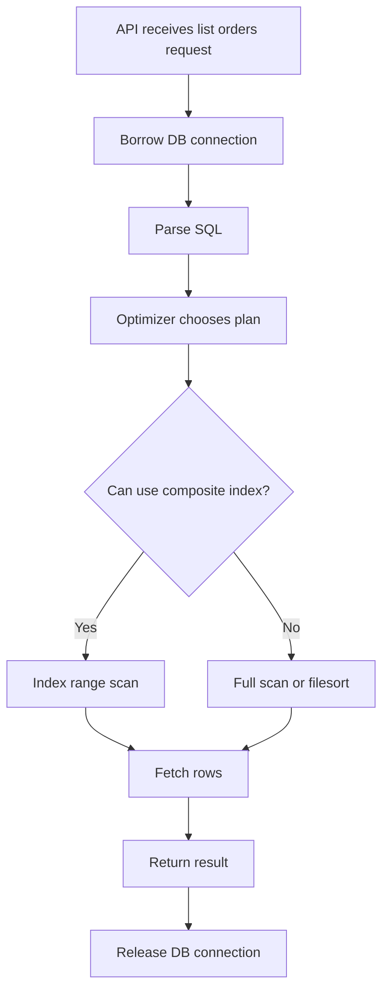
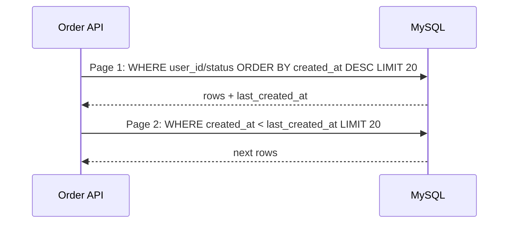

# 数据库索引与慢查询

数据库是大多数后端系统最容易变成瓶颈的地方。索引不是“给字段加个 B+Tree”这么简单，它和查询条件、排序、分页、数据分布、事务锁、连接池一起决定线上表现。

## 问题场景

订单列表接口支持按用户查询最近订单：

```sql
SELECT id, user_id, status, created_at, amount
FROM orders
WHERE user_id = 42 AND status = 'PAID'
ORDER BY created_at DESC
LIMIT 20 OFFSET 10000;
```

随着订单表增长到千万级，接口 P99 延迟明显上升。

## 查询路径



## 索引设计

对这个查询，更合理的复合索引通常是：

```sql
CREATE INDEX idx_orders_user_status_created
ON orders (user_id, status, created_at DESC);
```

原因：

- `user_id` 和 `status` 是等值过滤，放在前面。
- `created_at DESC` 用于排序，避免额外 filesort。
- 查询只取 20 条，但 `OFFSET 10000` 仍然要跳过大量记录。

## 分页优化

深分页比索引本身更容易被忽略。`OFFSET 10000 LIMIT 20` 的语义是“先找到 10020 条，再丢掉前 10000 条”。更适合高并发接口的方式是基于游标翻页：

```sql
SELECT id, user_id, status, created_at, amount
FROM orders
WHERE user_id = 42
  AND status = 'PAID'
  AND created_at < '2026-07-12 10:00:00'
ORDER BY created_at DESC
LIMIT 20;
```



## 慢查询排查清单

| 检查项 | 关注点 |
| --- | --- |
| `EXPLAIN` | type、key、rows、Extra |
| 索引顺序 | 是否匹配过滤、排序、分组 |
| 数据分布 | 低选择性字段单独建索引通常收益低 |
| 返回列 | 是否需要回表，是否可以覆盖索引 |
| 锁等待 | 慢不一定是查询慢，也可能在等锁 |
| 连接池 | 慢查询会占住连接，进一步放大延迟 |

## 常见错误

- 每个字段单独建索引，以为优化器会自动组合出最佳效果。
- 只在测试库验证 SQL，忽略真实数据分布。
- 给高频写入表加过多索引，导致写入变慢。
- 在线上接口暴露任意排序字段，破坏可控的索引路径。

## 工程化方案

慢查询治理要配合监控和发布流程：上线前审查新增 SQL；生产开启慢查询日志；核心接口记录 SQL 模板、耗时和 rows scanned；大表变更使用在线 DDL；分页 API 优先设计成 cursor-based，而不是无限制 offset。

## 延伸阅读

- [MySQL 8.4 Reference Manual: Optimization and Indexes](https://dev.mysql.com/doc/refman/8.4/en/optimization-indexes.html)
- [MySQL 8.4 Reference Manual: EXPLAIN Statement](https://dev.mysql.com/doc/refman/8.4/en/explain.html)
- [PostgreSQL Documentation: Using EXPLAIN](https://www.postgresql.org/docs/current/using-explain.html)
- [Use The Index, Luke](https://use-the-index-luke.com/)
