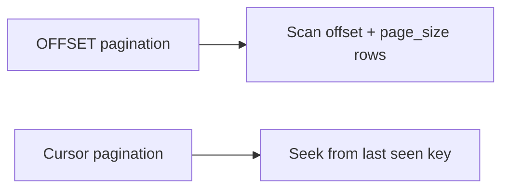
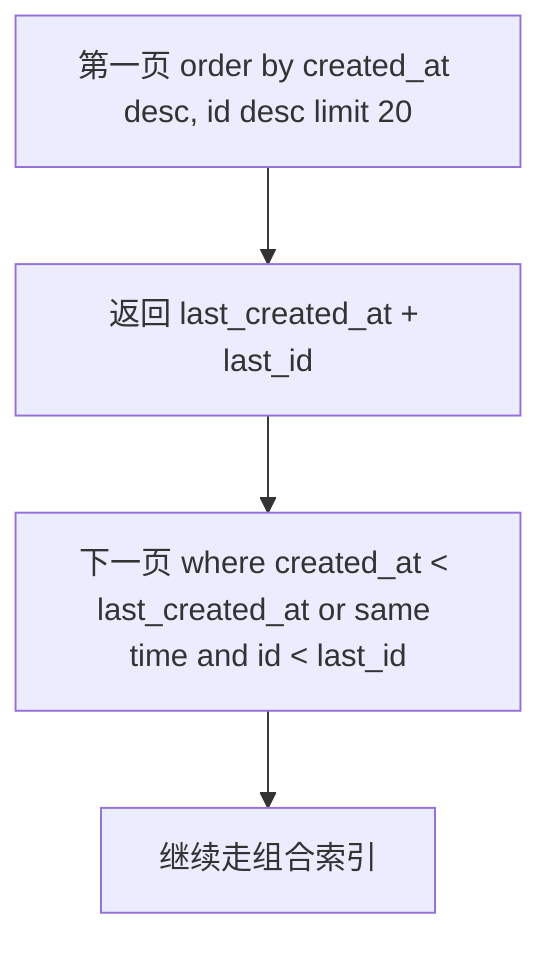
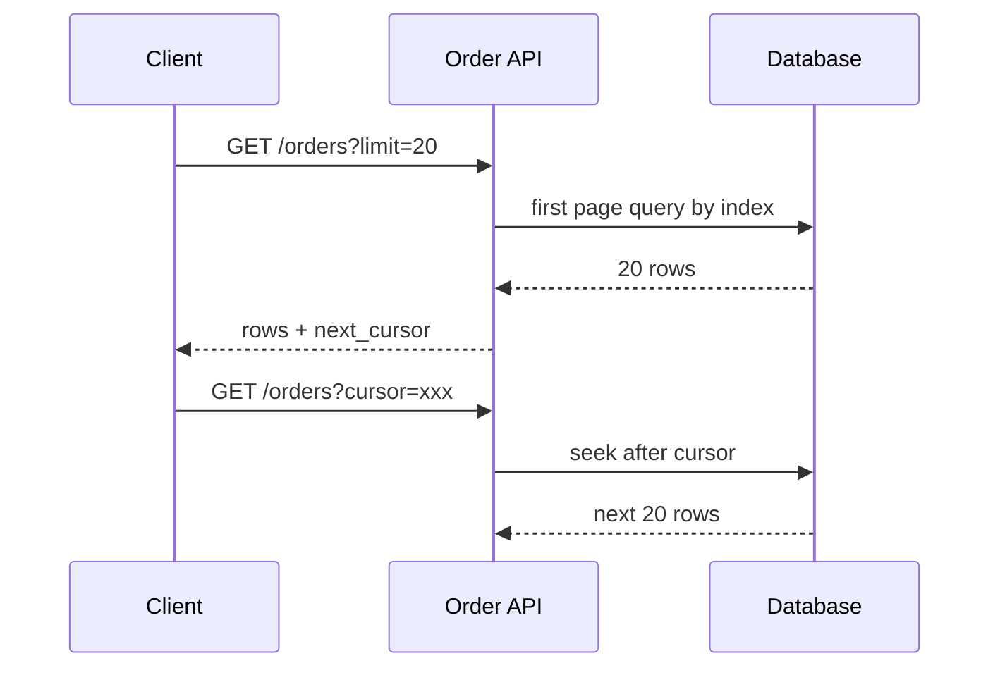

import Tabs from '@theme/Tabs';
import TabItem from '@theme/TabItem';

# 分页优化

大表深分页是典型性能问题。`OFFSET` 越大，数据库需要扫描并丢弃的行越多。高频列表接口应优先使用 cursor-based pagination。

## 先理解这些概念

- **分页**：一次只返回一部分数据，比如每页 20 条。
- **Offset 分页**：跳过前 N 条再取数据，页数越深越慢。
- **深分页**：offset 很大，例如第 10000 页，数据库要扫描并丢弃大量行。
- **Cursor 分页**：用上一页最后一条记录的位置继续查下一页。
- **稳定排序**：排序字段必须能确定唯一顺序，常用 `created_at + id`。
- **组合索引**：让过滤条件和排序字段一起走索引。
- **Keyset pagination**：Cursor 分页的常见实现，用上一页最后一条记录的排序键继续查询。
- **不透明 cursor**：客户端只负责传回 token，不依赖内部字段结构。

读这篇时先记住：分页慢通常不是“返回 20 条慢”，而是“为了找到这 20 条，数据库扫了很多没返回的行”。



## 它是什么

分页是把大结果集按页返回给客户端。常见方式有两种：

- **Offset 分页**：`limit 20 offset 10000`，适合后台低频跳页。
- **Cursor 分页**：基于上一页最后一条记录的排序键继续查询，适合高频滚动列表和大表。

## 为什么需要它

列表接口很容易从小数据量演变成大表查询。前期 `OFFSET` 简单好用，但数据达到百万级后，深分页会让数据库扫描大量无用行，造成 CPU、IO 和 buffer pool 压力。

如果列表还要稳定排序，新增数据可能导致 offset 分页出现重复或漏数据。

## 它解决什么问题

- 降低深分页扫描和丢弃行的成本。
- 避免翻页过程中新增数据导致重复或遗漏。
- 让列表接口延迟随页数增长保持稳定。
- 为移动端无限滚动、后台导出、时间线列表提供可靠访问模式。

## 核心原理

Cursor 分页的关键是使用有序、唯一、可索引的游标条件，把“跳过 N 行”变成“从某个位置继续 seek”。



推荐索引：

```sql
create index idx_orders_user_created_id on orders(user_id, created_at desc, id desc);
```

下一页查询：

```sql
select *
from orders
where user_id = ?
  and (
    created_at < ?
    or (created_at = ? and id < ?)
  )
order by created_at desc, id desc
limit 20;
```

## 最小示例

<Tabs groupId="language">
<TabItem value="java" label="Java">

```java
class OrderQuery {
    List<Order> nextPage(String userId, Cursor cursor, int size) {
        return jdbc.query("""
            select * from orders
            where user_id = ?
              and (created_at < ? or (created_at = ? and id < ?))
            order by created_at desc, id desc
            limit ?
            """, userId, cursor.createdAt(), cursor.createdAt(), cursor.id(), size);
    }
}
```

</TabItem>
<TabItem value="go" label="Go">

```go
package pagination

func NextOrders(db DB, userID string, cursor Cursor, size int) ([]Order, error) {
    return db.QueryOrders(`select * from orders
        where user_id = ? and (created_at < ? or (created_at = ? and id < ?))
        order by created_at desc, id desc
        limit ?`, userID, cursor.CreatedAt, cursor.CreatedAt, cursor.ID, size)
}
```

</TabItem>
<TabItem value="typescript" label="TypeScript">

```ts
async function nextOrders(db: Database, userId: string, cursor: Cursor, size = 20) {
  return db.orders.findMany({
    where: {
      userId,
      cursorBefore: { createdAt: cursor.createdAt, id: cursor.id },
    },
    orderBy: [{ createdAt: "desc" }, { id: "desc" }],
    take: size,
  });
}
```

</TabItem>
<TabItem value="python" label="Python">

```python
async def next_orders(db, user_id: str, cursor: dict, size: int = 20):
    return await db.fetch(
        """select * from orders
           where user_id = $1
             and (created_at < $2 or (created_at = $2 and id < $3))
           order by created_at desc, id desc
           limit $4""",
        user_id,
        cursor["created_at"],
        cursor["id"],
        size,
    )
```

</TabItem>
</Tabs>

## 工程实践

- 排序字段必须稳定，常用 `created_at + id` 或自增/雪花 ID。
- 查询条件和排序顺序要匹配组合索引。
- cursor 要包含所有排序字段；如果排序是 `created_at desc, id desc`，cursor 也要包含 `created_at` 和 `id`。
- cursor 不要暴露内部细节，可用 base64 编码 JSON，并加签防篡改。
- 后台管理页需要跳页时可以保留 offset，但要限制最大页数。
- 导出大数据使用游标扫描或批处理，不要用深 offset 循环。
- 对复杂筛选条件，先确认 explain 是否走到预期索引。

### 真正需要深分页时怎么做

如果业务真的需要“很深的页”，先区分场景，而不是直接放开无限 `OFFSET`。

| 场景 | 更合适的做法 |
| --- | --- |
| 用户端时间流、评论、消息、订单列表 | 改成交互上的加载更多或无限滚动，使用 cursor pagination |
| 后台低频管理页 | 可以保留 OFFSET，但限制最大页数，并要求增加筛选条件 |
| 必须精确跳到很深位置 | 维护页码到 cursor 的映射、使用搜索系统、快照或预计算结果 |
| 大批量导出 | 使用 cursor/keyset 或按主键分批扫描，不要循环深 OFFSET |

深分页往往是产品交互和数据访问方式一起设计的问题。用户端通常更关心最新内容和连续浏览；后台如果真的要查历史数据，更应该提供时间范围、状态、关键词、用户 ID 等筛选条件，而不是让数据库为任意页码做大量无效跳过。

### Cursor 改造后仍要用 EXPLAIN 验证

Cursor pagination 避免了深 OFFSET，但如果组合索引不匹配，仍然可能全表扫描或 filesort。上线前要用生产级数据分布验证：是否命中预期索引、扫描行数是否小、`Extra` 是否还有 `Using filesort` 或 `Using temporary`。上线后继续观察接口 P99、SQL P99、扫描行数和连接池等待是否下降。

## 常见坑

- `order by created_at` 不唯一，同一时间多条记录翻页不稳定。
- 组合索引顺序和 where/order by 不匹配，导致 filesort 或全表扫描。
- cursor 只带时间，不带 ID，新增数据时重复或漏数据。
- 排序用了多个字段，但 cursor 没包含完整排序键。
- 允许用户跳到第 10000 页，数据库被深分页拖慢。
- 用 offset 批量导出，越导越慢。
- cursor 改造后没有用 EXPLAIN 验证执行计划，结果仍然全表扫描或 filesort。

## 完整案例

订单列表最初使用 `limit 20 offset n`。用户翻到第 500 页时，数据库需要扫描并丢弃 10000 行；运营后台批量导出时不断增加 offset，慢查询持续出现。

改造方案：

1. 用户端改成 cursor 分页，只支持下一页。
2. 排序使用 `created_at desc, id desc`，避免同一时间重复。
3. 建索引 `(user_id, created_at desc, id desc)`。
4. cursor 编码为 `base64({created_at, id})`。
5. 后台导出使用同样 cursor 扫描，避免深 offset。
6. 后台管理页如果保留页码跳转，限制最大页数并引导使用筛选条件。



## 检查清单

- 高频大表接口是否避免深 offset？
- 排序字段是否唯一且稳定？
- 是否有匹配 where 和 order by 的组合索引？
- cursor 是否包含所有排序字段？
- cursor 是否防篡改或可校验？
- 是否限制后台跳页和导出规模？
- 业务真的需要深分页时，是用户端、后台管理、导出还是精确跳页？分别采用什么方案？
- 是否用 explain 验证执行计划？

## 这篇文章在系统里怎么用

分页优化常用于订单列表、消息列表、Feed、评论、后台导出。高频用户列表和无限滚动应该优先用 cursor 分页；后台低频跳页可以保留 offset，但要限制最大页数。

系统设计时，提到列表查询要继续说明：按什么字段排序，cursor 里放什么，是否有对应组合索引，新增数据时会不会重复或漏数据。

如果面试官追问“必须深分页怎么办”，不要只回答“不支持”。可以说明取舍：用户端改成交互上的加载更多；后台低频页限制最大页数并增加筛选条件；导出任务用 keyset 分批扫描；必须精确深跳页时，用搜索、快照、预计算或页码到 cursor 的映射承担额外复杂度。

## 术语回看

- [游标分页](../system-design/glossary.md#游标分页)
- [P99](../system-design/glossary.md#p99)
- [读写分离](../system-design/glossary.md#读写分离)

## 延伸阅读

- [Use The Index, Luke: Pagination](https://use-the-index-luke.com/no-offset)
- [PostgreSQL: LIMIT and OFFSET](https://www.postgresql.org/docs/current/queries-limit.html)
- [MySQL: LIMIT Query Optimization](https://dev.mysql.com/doc/refman/8.0/en/limit-optimization.html)
- [GraphQL Cursor Connections Specification](https://relay.dev/graphql/connections.htm)
