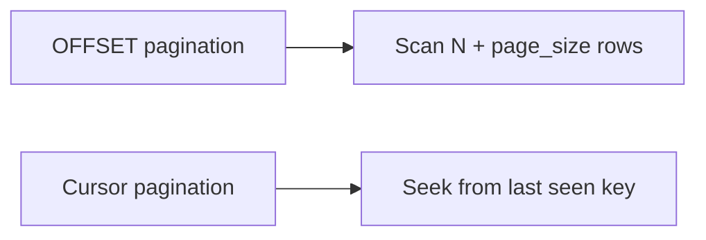

# 分页优化

大表深分页是典型性能问题。`OFFSET` 越大，数据库需要扫描并丢弃的行越多。高频接口应优先使用 cursor-based pagination。

## 后续扩写

- offset 分页与 cursor 分页对比。
- created_at + id 组合游标。
- 翻页稳定性和重复数据问题。

## 延伸阅读

- [Use The Index, Luke: Pagination](https://use-the-index-luke.com/no-offset)
- [PostgreSQL: LIMIT and OFFSET](https://www.postgresql.org/docs/current/queries-limit.html)
