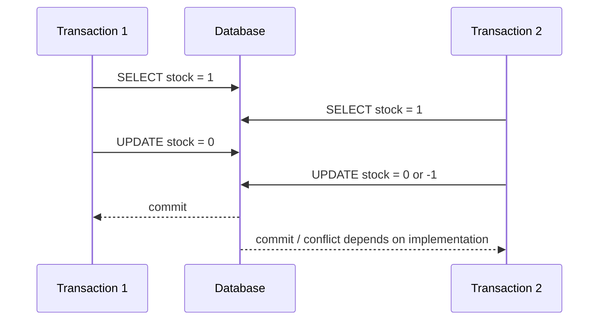
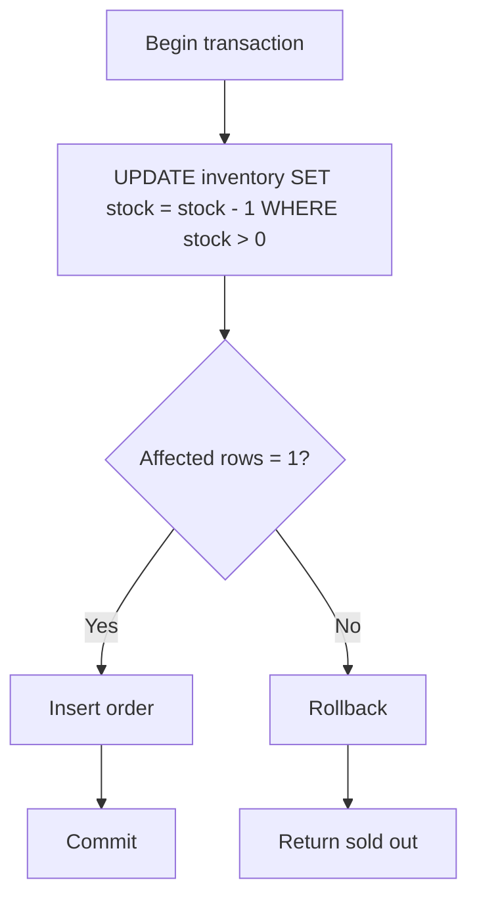
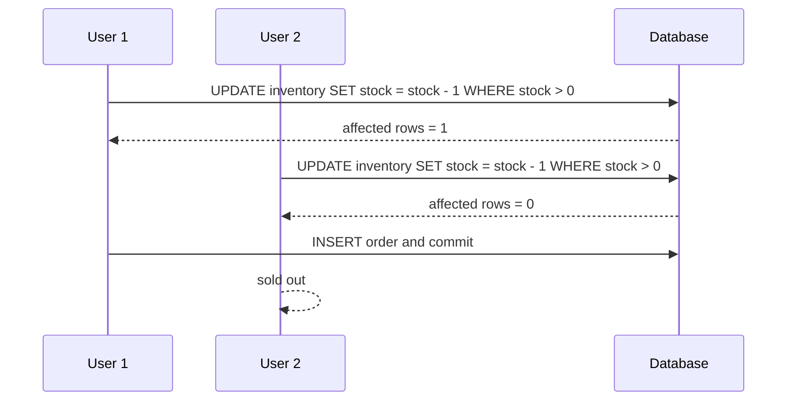

import Tabs from '@theme/Tabs';
import TabItem from '@theme/TabItem';

# 事务隔离级别

事务隔离级别决定并发读写时，一个事务能看到其他事务的哪些中间状态。它直接影响库存扣减、下单、转账、账务、支付状态流转这类强一致业务的正确性。

## 它是什么

事务有四个经典特性：ACID。隔离性是其中最容易被误解的一项。数据库为了在正确性和性能之间平衡，提供了不同隔离级别。

常见隔离级别包括：

- `Read Uncommitted`：可能读到未提交数据，生产业务很少使用。
- `Read Committed`：只能读到已提交数据，PostgreSQL 默认级别。
- `Repeatable Read`：同一事务中多次读取结果保持一致，MySQL InnoDB 默认级别。
- `Serializable`：效果接近事务串行执行，正确性强但并发成本高。

## 为什么需要它

低并发时，很多代码看起来正确：先查库存，再扣库存；先查余额，再扣款；先查订单状态，再更新状态。但并发上来后，多个事务可能同时基于旧数据做决策，导致超卖、重复扣款、状态回退或账务不平。

隔离级别不是纯数据库理论。它决定你写的业务逻辑在并发下是否成立，也决定你需要使用条件更新、唯一约束、乐观锁、悲观锁还是更高隔离级别。

## 它解决什么问题

| 问题 | 含义 | 常见影响 |
| --- | --- | --- |
| 脏读 | 读到其他事务未提交的数据 | 基于最终回滚的数据做决策 |
| 不可重复读 | 同一事务两次读取同一行结果不同 | 状态检查和更新不一致 |
| 幻读 | 同一事务两次范围查询出现新增/消失的行 | 名额、库存、唯一性判断错误 |
| 写偏斜 | 两个事务分别读到条件成立，然后写入不同记录破坏约束 | 排班、额度、库存类约束失效 |
| 丢失更新 | 两个事务基于同一旧值写回，后写覆盖先写 | 计数、余额、库存错误 |

隔离级别能减少某些异常，但不能替代业务约束。关键业务仍然要用唯一索引、条件更新、版本号和事务边界兜底。

## 核心原理

“先读库存，再写库存”在并发下很危险。两个事务都读到库存为 1，然后都认为可以下单。



更安全的库存扣减方式，是把“判断库存大于 0”和“扣减库存”合并成一条条件更新，让数据库在写入时做原子判断。

```sql
UPDATE inventory
SET stock = stock - 1
WHERE sku_id = ? AND stock > 0;
```

如果影响行数是 1，扣减成功；如果是 0，说明库存不足或记录不存在。



不同隔离级别能屏蔽的异常不同。

| 隔离级别 | 脏读 | 不可重复读 | 幻读 | 并发成本 |
| --- | --- | --- | --- | --- |
| Read Uncommitted | 可能 | 可能 | 可能 | 低 |
| Read Committed | 避免 | 可能 | 可能 | 较低 |
| Repeatable Read | 避免 | 通常避免 | 依数据库实现 | 中 |
| Serializable | 避免 | 避免 | 避免 | 高 |

## 最小示例

下面示例展示同一个安全扣库存事务：条件更新库存，成功后插入订单，失败则回滚并返回售罄。

<Tabs groupId="language">
  <TabItem value="java" label="Java">

```java
import java.sql.Connection;
import java.sql.PreparedStatement;
import java.sql.SQLException;

public class OrderRepository {
    public boolean createOrder(Connection connection, long userId, long skuId, long orderId) throws SQLException {
        boolean oldAutoCommit = connection.getAutoCommit();
        connection.setAutoCommit(false);
        try {
            int affected = deductStock(connection, skuId);
            if (affected == 0) {
                connection.rollback();
                return false;
            }

            try (PreparedStatement statement = connection.prepareStatement(
                "INSERT INTO orders(id, user_id, sku_id, status) VALUES (?, ?, ?, ?)")) {
                statement.setLong(1, orderId);
                statement.setLong(2, userId);
                statement.setLong(3, skuId);
                statement.setString(4, "CREATED");
                statement.executeUpdate();
            }
            connection.commit();
            return true;
        } catch (SQLException e) {
            connection.rollback();
            throw e;
        } finally {
            connection.setAutoCommit(oldAutoCommit);
        }
    }

    private int deductStock(Connection connection, long skuId) throws SQLException {
        try (PreparedStatement statement = connection.prepareStatement(
            "UPDATE inventory SET stock = stock - 1 WHERE sku_id = ? AND stock > 0")) {
            statement.setLong(1, skuId);
            return statement.executeUpdate();
        }
    }
}
```

  </TabItem>
  <TabItem value="go" label="Go">

```go
package order

import (
    "context"
    "database/sql"
)

func CreateOrder(ctx context.Context, db *sql.DB, userID, skuID, orderID int64) (bool, error) {
    tx, err := db.BeginTx(ctx, &sql.TxOptions{Isolation: sql.LevelReadCommitted})
    if err != nil {
        return false, err
    }
    defer tx.Rollback()

    result, err := tx.ExecContext(ctx,
        `UPDATE inventory SET stock = stock - 1 WHERE sku_id = ? AND stock > 0`,
        skuID,
    )
    if err != nil {
        return false, err
    }
    affected, err := result.RowsAffected()
    if err != nil || affected == 0 {
        return false, err
    }

    _, err = tx.ExecContext(ctx,
        `INSERT INTO orders(id, user_id, sku_id, status) VALUES (?, ?, ?, ?)`,
        orderID,
        userID,
        skuID,
        "CREATED",
    )
    if err != nil {
        return false, err
    }
    return true, tx.Commit()
}
```

  </TabItem>
  <TabItem value="typescript" label="TypeScript">

```typescript
import { Pool } from 'pg';

export async function createOrder(
  pool: Pool,
  userId: string,
  skuId: string,
  orderId: string,
): Promise<boolean> {
  const client = await pool.connect();
  try {
    await client.query('BEGIN ISOLATION LEVEL READ COMMITTED');

    const stock = await client.query(
      'UPDATE inventory SET stock = stock - 1 WHERE sku_id = $1 AND stock > 0',
      [skuId],
    );
    if (stock.rowCount === 0) {
      await client.query('ROLLBACK');
      return false;
    }

    await client.query(
      'INSERT INTO orders(id, user_id, sku_id, status) VALUES ($1, $2, $3, $4)',
      [orderId, userId, skuId, 'CREATED'],
    );
    await client.query('COMMIT');
    return true;
  } catch (error) {
    await client.query('ROLLBACK');
    throw error;
  } finally {
    client.release();
  }
}
```

  </TabItem>
  <TabItem value="python" label="Python">

```python
def create_order(connection, user_id: int, sku_id: int, order_id: int) -> bool:
    try:
        with connection.cursor() as cursor:
            cursor.execute(
                "UPDATE inventory SET stock = stock - 1 WHERE sku_id = %s AND stock > 0",
                (sku_id,),
            )
            if cursor.rowcount == 0:
                connection.rollback()
                return False

            cursor.execute(
                "INSERT INTO orders(id, user_id, sku_id, status) VALUES (%s, %s, %s, %s)",
                (order_id, user_id, sku_id, "CREATED"),
            )
        connection.commit()
        return True
    except Exception:
        connection.rollback()
        raise
```

  </TabItem>
</Tabs>

## 工程实践

### 1. 不要把隔离级别当唯一防线

隔离级别越高，并发成本通常越高。生产系统更常用的是：合理隔离级别 + 条件更新 + 唯一索引 + 业务状态机。比如防重复下单靠 `UNIQUE(user_id, activity_id)`，防超卖靠条件更新和库存流水。

### 2. 读写逻辑尽量合并到写语句

如果业务规则能表达成 `UPDATE ... WHERE condition`，就不要先 `SELECT` 再根据结果 `UPDATE`。把判断交给数据库写入阶段，可以减少并发窗口。

### 3. 长事务会放大锁和版本压力

事务里不要做远程调用、用户交互、慢计算或等待 MQ。事务越长，锁持有越久，MVCC 版本保留越多，其他请求越容易等待。

### 4. 了解数据库默认隔离级别

MySQL InnoDB 默认是 `Repeatable Read`，PostgreSQL 默认是 `Read Committed`。同样 SQL 在不同数据库上的行为可能不同，特别是范围查询、幻读、锁和序列化失败处理。

### 5. 为冲突设计重试

高隔离级别或乐观锁可能返回序列化失败、死锁或版本冲突。业务要区分可重试错误和不可重试错误，并设置有限重试与退避。

## 常见坑

- 先查库存再更新库存，两个事务同时读到旧值导致超卖。
- 事务里调用外部 HTTP 或 MQ，导致锁长时间持有。
- 以为 `Repeatable Read` 可以解决所有并发异常。
- 没有唯一索引，只靠应用层查询判断“是否已经下单”。
- 死锁或序列化失败后无限重试，造成更大压力。
- 在只读报表和核心交易上使用同一事务策略。

## 完整案例：限量库存扣减

### 场景

商品库存只剩 1 件，两个用户同时下单。如果代码先读库存，再写回库存，就可能两个请求都认为库存充足。

### 安全方案



### 关键点

- 库存判断和扣减必须在同一条写语句里。
- 订单创建和库存扣减必须在同一事务里。
- 用户维度防重复下单必须用唯一索引兜底。
- 事务失败后要回滚，不要留下半完成状态。

## 检查清单

学完这一节后，你应该能回答：

- Read Committed、Repeatable Read、Serializable 的差异是什么？
- 脏读、不可重复读、幻读分别是什么？
- 为什么“先读后写”在高并发下危险？
- 条件更新为什么能防止库存超卖？
- 唯一索引和事务隔离分别解决什么问题？
- 为什么事务里不能做慢 IO？
- 哪些数据库错误适合有限重试？

## 延伸阅读

- [MySQL: Transaction Isolation Levels](https://dev.mysql.com/doc/refman/8.4/en/innodb-transaction-isolation-levels.html)
- [PostgreSQL: Transaction Isolation](https://www.postgresql.org/docs/current/transaction-iso.html)
- [PostgreSQL: Explicit Locking](https://www.postgresql.org/docs/current/explicit-locking.html)
- [Martin Kleppmann: Hermitage test suite](https://github.com/ept/hermitage)
- [Designing Data-Intensive Applications](https://dataintensive.net/)
