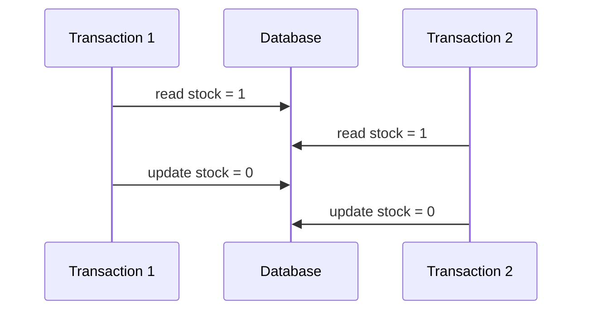

# 事务隔离级别

事务隔离级别决定并发读写时可能看到哪些中间状态。它直接影响超卖、重复扣款、库存扣减和账务类系统的正确性。

## 后续扩写

- Read Committed、Repeatable Read、Serializable。
- 脏读、不可重复读、幻读。
- 乐观锁和悲观锁。

## 延伸阅读

- [MySQL: Transaction Isolation Levels](https://dev.mysql.com/doc/refman/8.4/en/innodb-transaction-isolation-levels.html)
- [PostgreSQL: Transaction Isolation](https://www.postgresql.org/docs/current/transaction-iso.html)
