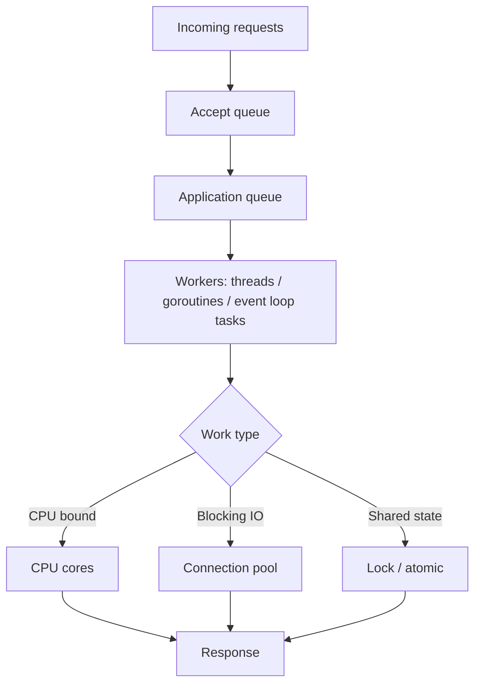
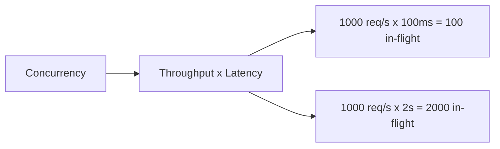
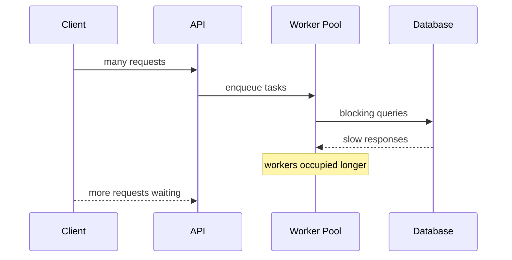
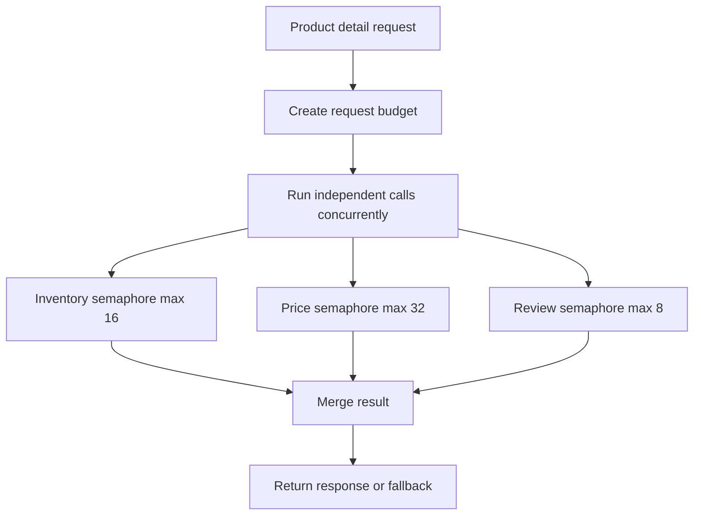

import Tabs from '@theme/Tabs';
import TabItem from '@theme/TabItem';

# 并发模型

后端服务的并发能力取决于运行时模型、线程或协程调度、队列长度、锁竞争、连接池和下游等待。高并发不是线程越多越好，而是让有限资源在可控排队和明确超时下工作。

## 先理解这些概念

- **并发**：多个任务在同一段时间内推进，不一定真的同时执行。
- **并行**：多个任务在多个 CPU 核上真正同时执行。
- **线程**：操作系统调度的执行单元，创建和切换成本相对高。
- **协程 / goroutine**：语言运行时调度的轻量任务，数量可以更多，但也不能无限增长。
- **事件循环**：一个循环不断处理 IO 回调和异步任务，Node.js 常见。
- **背压**：下游处理不过来时，上游要减速、排队或拒绝，而不是无限堆积。

读这篇时先把并发想成“服务怎么安排很多请求一起工作”。关键不是开多少任务，而是哪里排队、谁执行、什么时候拒绝。

## 它是什么

并发模型描述的是服务如何同时处理多个请求。不同语言和框架使用不同抽象：

- Java 常见是线程池和阻塞 IO，也可以用虚拟线程或响应式模型。
- Go 使用 goroutine 和 channel，调度成本低，但仍然要控制下游连接和共享资源。
- Node.js / TypeScript 使用事件循环和异步 IO，CPU 阻塞会卡住整个 event loop。
- Python 可以用线程池、进程池或 `asyncio`，不同模型适合不同工作负载。

并发模型最终要回答：请求来了以后在哪里排队？由谁执行？最多同时执行多少？阻塞时占用什么资源？过载时如何拒绝或背压？

## 为什么需要它

很多后端问题看起来是“接口慢”，实际是并发模型失控：线程池被慢下游占满、goroutine 数量无限增长、Node.js event loop 被 CPU 任务阻塞、Python async 代码里混入阻塞 IO、队列无限堆积导致内存上涨。

理解并发模型后，才能正确配置线程池、连接池、超时、队列长度和限流策略。否则很容易出现“机器 CPU 不高，但请求全超时”的情况，因为瓶颈可能是连接池等待、队列排队或锁竞争。

## 它解决什么问题

| 概念 | 解决的问题 | 边界 |
| --- | --- | --- |
| 线程池 | 限制同时执行的阻塞任务数量 | 线程多会增加上下文切换和内存占用 |
| 协程 / goroutine | 用较低成本表达大量并发任务 | 下游连接池仍然是硬限制 |
| 事件循环 | 高效处理大量非阻塞 IO | 不能执行长时间 CPU 阻塞任务 |
| 有界队列 | 控制排队长度，避免内存无限增长 | 队列满时必须有拒绝策略 |
| 背压 | 让上游感知下游处理不过来 | 需要协议或业务语义配合 |
| 锁与原子操作 | 保护共享状态正确性 | 锁竞争会增加尾延迟 |

并发模型不能让慢数据库变快，也不能替代容量规划。它解决的是“有限资源如何被并发请求使用”。

## 核心原理

一次请求进入服务后，通常会经过入口队列、执行单元和下游依赖。每一层都可能排队。



并发数、吞吐和延迟之间有直接关系。按 Little's Law 的直觉：系统里同时处理的请求数约等于吞吐量乘以平均响应时间。



当下游变慢时，即使入口 QPS 不变，in-flight 请求数也会暴涨，进而占满线程、协程、连接池和队列。



## 最小示例

下面示例展示同一个核心策略：有界并发。无论语言模型是什么，都不要让请求无限制地同时访问下游。

<Tabs groupId="language">
  <TabItem value="java" label="Java">

```java
import java.util.List;
import java.util.concurrent.ArrayBlockingQueue;
import java.util.concurrent.ThreadPoolExecutor;
import java.util.concurrent.TimeUnit;

public class BoundedExecutor {
    private final ThreadPoolExecutor executor = new ThreadPoolExecutor(
        16,
        16,
        0L,
        TimeUnit.MILLISECONDS,
        new ArrayBlockingQueue<>(100),
        new ThreadPoolExecutor.AbortPolicy()
    );

    public void submit(Runnable task) {
        executor.execute(task);
    }

    public void fetchProducts(List<String> ids, ProductClient client) {
        for (String id : ids) {
            submit(() -> client.fetch(id));
        }
    }
}

interface ProductClient {
    void fetch(String id);
}
```

  </TabItem>
  <TabItem value="go" label="Go">

```go
package concurrency

import (
    "context"
    "sync"
)

type ProductClient interface {
    Fetch(ctx context.Context, id string) error
}

func FetchProducts(ctx context.Context, ids []string, client ProductClient, maxConcurrent int) error {
    sem := make(chan struct{}, maxConcurrent)
    var wg sync.WaitGroup
    var once sync.Once
    var firstErr error

    for _, id := range ids {
        id := id
        sem <- struct{}{}
        wg.Add(1)
        go func() {
            defer wg.Done()
            defer func() { <-sem }()
            if err := client.Fetch(ctx, id); err != nil {
                once.Do(func() { firstErr = err })
            }
        }()
    }

    wg.Wait()
    return firstErr
}
```

  </TabItem>
  <TabItem value="typescript" label="TypeScript">

```typescript
export async function mapWithConcurrency<T, R>(
  items: T[],
  concurrency: number,
  worker: (item: T) => Promise<R>,
): Promise<R[]> {
  const results: R[] = [];
  let nextIndex = 0;

  async function run(): Promise<void> {
    while (nextIndex < items.length) {
      const current = nextIndex;
      nextIndex += 1;
      results[current] = await worker(items[current]);
    }
  }

  const workers = Array.from(
    { length: Math.min(concurrency, items.length) },
    () => run(),
  );
  await Promise.all(workers);
  return results;
}

// Usage:
// await mapWithConcurrency(ids, 16, (id) => productClient.fetch(id));
```

  </TabItem>
  <TabItem value="python" label="Python">

```python
import asyncio
from collections.abc import Awaitable, Callable, Sequence
from typing import TypeVar


T = TypeVar("T")
R = TypeVar("R")


async def map_with_concurrency(
    items: Sequence[T],
    concurrency: int,
    worker: Callable[[T], Awaitable[R]],
) -> list[R]:
    semaphore = asyncio.Semaphore(concurrency)

    async def run(item: T) -> R:
        async with semaphore:
            return await worker(item)

    return await asyncio.gather(*(run(item) for item in items))


# Usage:
# await map_with_concurrency(ids, 16, product_client.fetch)
```

  </TabItem>
</Tabs>

## 工程实践

### 1. 区分 CPU bound 和 IO bound

CPU bound 任务受 CPU 核数限制，线程开太多只会增加上下文切换。IO bound 任务主要等待网络和磁盘，但仍然受连接池、下游容量和超时控制。不要用同一个线程池同时跑 CPU 密集任务和慢 IO。

### 2. 队列必须有界

无界队列会把过载隐藏成内存增长和长尾延迟。队列满时应该拒绝、降级或触发背压，而不是无限堆积。拒绝比排队 30 秒后超时更容易恢复。

### 3. 并发数要和下游容量匹配

API 有 1,000 个 worker，不代表数据库能承受 1,000 个并发查询。下游连接池、线程池和限流值要一起设计。一般要让入口并发大于下游并发，但不能无限大。

### 4. 锁要缩小作用域

共享状态需要锁，但锁内不要做网络 IO、数据库查询或复杂计算。锁持有时间越长，排队越严重，P99 越容易失控。

### 5. 监控队列和等待

除了 QPS 和延迟，还要看 active workers、queue length、rejected tasks、lock wait、connection pool wait、event loop lag、goroutine/thread count。很多并发问题最先出现在等待指标上。

## 常见坑

- 线程池设置很大，但数据库连接池很小，最终所有线程都在等连接。
- 使用无界队列，流量高峰时内存上涨，延迟越来越长。
- 在 Node.js event loop 里做 CPU 密集计算，导致所有请求卡住。
- 在 Python `asyncio` 里调用阻塞 IO，破坏异步模型。
- goroutine 无限创建，没有 semaphore 或 worker pool 控制下游并发。
- 锁里执行远程调用，造成锁竞争和长尾延迟。
- 只看 CPU，不看队列长度、连接池等待和 event loop lag。

## 完整案例：商品详情批量聚合

### 场景

商品详情接口需要聚合商品基础信息、库存、价格、推荐和评论摘要。为了降低延迟，开发者把这些下游调用并发执行。但没有控制并发后，活动期间库存服务连接池被打满，接口 P99 升高。

### 受控并发方案



### 设计要点

- 每个下游有独立并发上限和超时。
- 非核心依赖失败时降级，不阻塞主响应。
- 下游调用共享入口 trace id，方便排查慢在哪一段。
- 监控每个依赖的 active calls、queue wait、timeout、fallback 次数。

## 检查清单

学完这一节后，你应该能回答：

- 线程、协程、事件循环分别适合什么场景？
- 为什么高并发不是线程越多越好？
- 队列为什么必须有界？队列满了应该怎么办？
- CPU bound 和 IO bound 任务应该如何隔离？
- 下游变慢时，为什么 in-flight 请求数会暴涨？
- 如何用 semaphore、worker pool 或线程池控制下游并发？
- 应该监控哪些指标来发现并发模型失控？

## 这篇文章在系统里怎么用

并发模型会影响所有高并发接口。比如下游慢了，线程池会被占满；队列无界，内存会涨；事件循环被 CPU 任务阻塞，所有请求都会慢。

系统设计时，除了说“服务可以水平扩容”，还要说明单个实例内部如何控制并发：线程池多大、队列是否有界、下游调用是否有限流、CPU 任务和 IO 任务是否隔离、过载时如何快速失败。

## 术语回看

- [削峰](../system-design/glossary.md#削峰)
- [P99](../system-design/glossary.md#p99)
- [读写分离](../system-design/glossary.md#读写分离)

## 延伸阅读

- [Java Concurrency Utilities](https://docs.oracle.com/javase/8/docs/technotes/guides/concurrency/)
- [Java Virtual Threads](https://docs.oracle.com/en/java/javase/21/core/virtual-threads.html)
- [Go: Share Memory By Communicating](https://go.dev/blog/codelab-share)
- [Go: Concurrency Patterns](https://go.dev/talks/2012/concurrency.slide)
- [Node.js: Don't Block the Event Loop](https://nodejs.org/en/learn/asynchronous-work/dont-block-the-event-loop)
- [Python asyncio Documentation](https://docs.python.org/3/library/asyncio.html)
