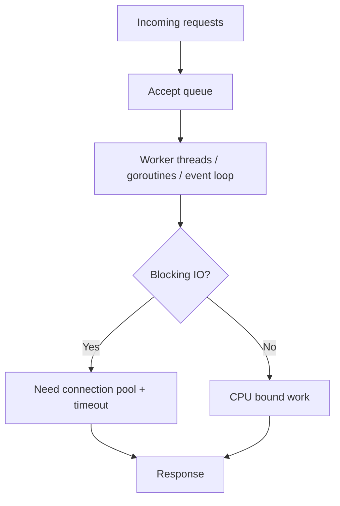

# 并发模型

后端服务的并发能力取决于运行时模型、线程或协程调度、锁竞争、队列长度和下游等待。高并发不是线程越多越好，而是让有限资源在可控排队下工作。

## 后续扩写

- Java 线程池、Go goroutine、Node.js event loop 的差异。
- 队列、背压和线程池拒绝策略。
- 锁竞争和原子操作。

## 延伸阅读

- [Java Concurrency Utilities](https://docs.oracle.com/javase/8/docs/technotes/guides/concurrency/)
- [Go: Share Memory By Communicating](https://go.dev/blog/codelab-share)
