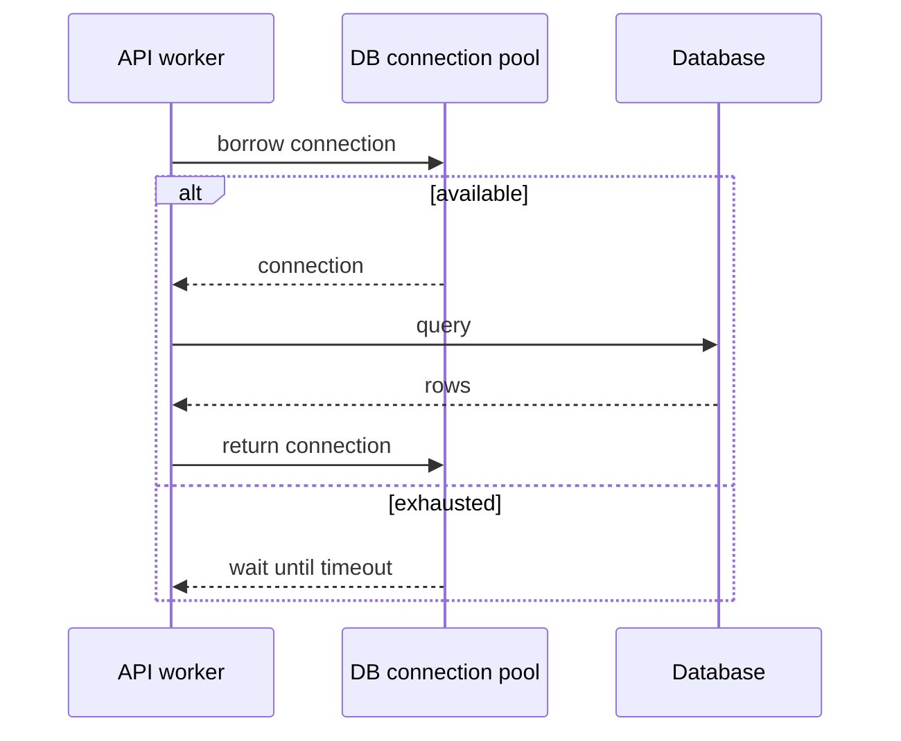

# 连接池

数据库、Redis 和 HTTP client 通常都依赖连接池。连接池太小会排队，太大会压垮下游；真正要配置的是吞吐、延迟、下游容量和超时之间的平衡。

## 后续扩写

- 连接池大小估算。
- 等待超时和查询超时。
- 池耗尽时如何定位根因。

## 延伸阅读

- [HikariCP Wiki: About Pool Sizing](https://github.com/brettwooldridge/HikariCP/wiki/About-Pool-Sizing)
- [PostgreSQL: Number of Database Connections](https://wiki.postgresql.org/wiki/Number_Of_Database_Connections)
