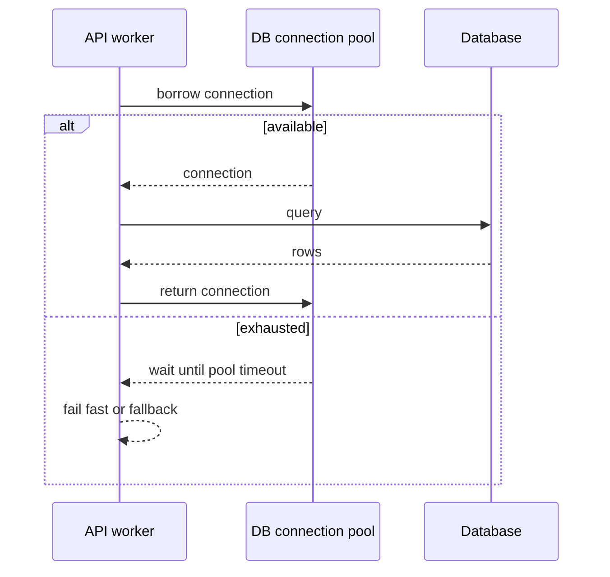
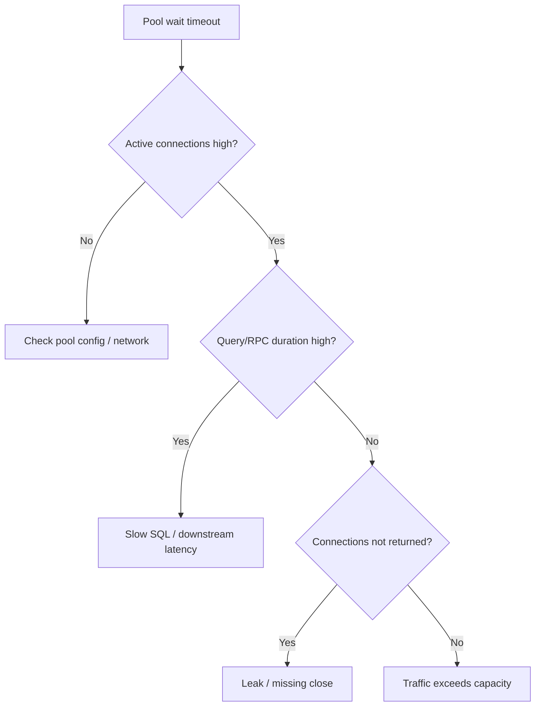
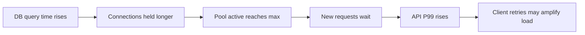
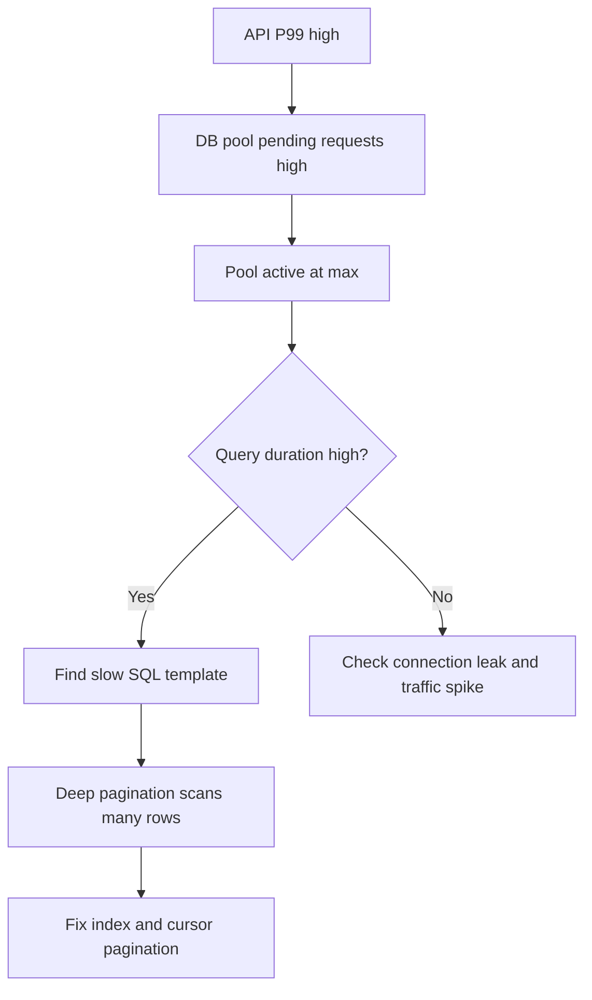

import Tabs from '@theme/Tabs';
import TabItem from '@theme/TabItem';

# 连接池

数据库、Redis 和 HTTP client 通常都依赖连接池。连接池太小会排队，太大会压垮下游；真正要配置的是吞吐、延迟、下游容量、等待超时和故障恢复之间的平衡。

## 它是什么

连接池是一组可复用的网络连接。应用启动后预先或按需创建连接，请求需要访问数据库、Redis 或下游服务时，从池里借一个连接，用完后归还。

连接池的核心参数通常包括：

- 最大连接数：最多同时持有多少连接。
- 最小空闲连接数：空闲时保留多少连接。
- 获取连接等待超时：池满时最多等多久。
- 连接最大生命周期：连接多久后重建，避免长期连接异常。
- 空闲超时：空闲连接多久回收。

## 为什么需要它

每次请求都新建连接会带来 DNS、TCP、TLS、认证和数据库握手开销。高并发下，这些开销会显著增加延迟，也会给下游带来大量短连接压力。

但连接池不是越大越好。数据库同时能高效处理的连接数有限，过多连接会增加上下文切换、锁竞争、内存占用和查询排队。连接池的目标是复用连接，同时把并发访问控制在下游能承受的范围内。

## 它解决什么问题

| 能力 | 解决的问题 | 边界 |
| --- | --- | --- |
| 连接复用 | 减少建连、握手、认证开销 | 长连接需要健康检查和生命周期管理 |
| 最大连接数 | 限制应用打到下游的并发 | 过小会排队，过大会压垮下游 |
| 等待超时 | 池耗尽时快速失败 | 不能修复慢查询或连接泄漏 |
| 空闲连接 | 降低冷启动延迟 | 空闲过多浪费下游资源 |
| 生命周期控制 | 避免连接长期异常或被中间设备断开 | 过短会频繁重建连接 |
| 池指标 | 定位排队、泄漏和下游慢 | 需要和 SQL/RPC 指标一起看 |

连接池解决的是连接管理和并发控制，不解决慢 SQL、下游过载或网络抖动本身。

## 核心原理

请求借连接、使用连接、归还连接。池满时，请求会等待；等待超过阈值后失败。



池耗尽常见不是“连接数太小”这么简单，而是下游变慢或连接没有归还。



连接池也会把下游变慢放大成上游 P99：查询耗时变长，连接被占用更久，等待连接的请求增多，入口请求尾延迟上升。



## 最小示例

下面示例展示连接池使用的关键原则：设置最大连接数和等待超时；借到连接后用 `try/finally`、`defer`、`finally` 或 context manager 保证归还。

<Tabs groupId="language">
  <TabItem value="java" label="Java">

```java
import com.zaxxer.hikari.HikariConfig;
import com.zaxxer.hikari.HikariDataSource;
import java.sql.Connection;
import java.sql.PreparedStatement;
import java.sql.ResultSet;

public class ProductRepository {
    private final HikariDataSource dataSource;

    public ProductRepository(String jdbcUrl) {
        HikariConfig config = new HikariConfig();
        config.setJdbcUrl(jdbcUrl);
        config.setMaximumPoolSize(16);
        config.setMinimumIdle(4);
        config.setConnectionTimeout(200); // wait for pool connection
        config.setMaxLifetime(30 * 60 * 1000L);
        this.dataSource = new HikariDataSource(config);
    }

    public String findName(long productId) throws Exception {
        try (Connection connection = dataSource.getConnection();
             PreparedStatement statement = connection.prepareStatement(
                 "SELECT name FROM products WHERE id = ?")) {
            statement.setLong(1, productId);
            try (ResultSet rs = statement.executeQuery()) {
                return rs.next() ? rs.getString("name") : null;
            }
        }
    }
}
```

  </TabItem>
  <TabItem value="go" label="Go">

```go
package product

import (
    "context"
    "database/sql"
    "time"
)

func ConfigurePool(db *sql.DB) {
    db.SetMaxOpenConns(16)
    db.SetMaxIdleConns(4)
    db.SetConnMaxLifetime(30 * time.Minute)
    db.SetConnMaxIdleTime(5 * time.Minute)
}

func FindProductName(ctx context.Context, db *sql.DB, productID int64) (string, error) {
    ctx, cancel := context.WithTimeout(ctx, 200*time.Millisecond)
    defer cancel()

    var name string
    err := db.QueryRowContext(ctx,
        `SELECT name FROM products WHERE id = ?`,
        productID,
    ).Scan(&name)
    return name, err
}
```

  </TabItem>
  <TabItem value="typescript" label="TypeScript">

```typescript
import { Pool } from 'pg';

const pool = new Pool({
  connectionString: process.env.DATABASE_URL,
  max: 16,
  idleTimeoutMillis: 30_000,
  connectionTimeoutMillis: 200,
});

export async function findProductName(productId: string): Promise<string | null> {
  const client = await pool.connect();
  try {
    const result = await client.query<{ name: string }>(
      'SELECT name FROM products WHERE id = $1',
      [productId],
    );
    return result.rows[0]?.name ?? null;
  } finally {
    client.release();
  }
}
```

  </TabItem>
  <TabItem value="python" label="Python">

```python
from contextlib import contextmanager
from queue import Queue, Empty
from typing import Iterator


class SimpleConnectionPool:
    def __init__(self, connections: list[object]):
        self.connections = Queue(maxsize=len(connections))
        for connection in connections:
            self.connections.put(connection)

    @contextmanager
    def borrow(self, timeout_seconds: float) -> Iterator[object]:
        try:
            connection = self.connections.get(timeout=timeout_seconds)
        except Empty as exc:
            raise TimeoutError("connection pool exhausted") from exc
        try:
            yield connection
        finally:
            self.connections.put(connection)


def find_product_name(pool: SimpleConnectionPool, product_id: int) -> str | None:
    with pool.borrow(timeout_seconds=0.2) as connection:
        cursor = connection.cursor()
        cursor.execute("SELECT name FROM products WHERE id = %s", (product_id,))
        row = cursor.fetchone()
        return row[0] if row else None
```

  </TabItem>
</Tabs>

## 工程实践

### 1. 池大小要从下游容量倒推

不要每个服务实例都配置 100 个数据库连接。如果有 20 个实例，每个 100 个连接，就是 2,000 个数据库连接。数据库可能在连接建立上还没出问题，已经在调度和内存上被拖垮。

### 2. 等待超时要短于入口预算

如果入口 API 总预算是 500 ms，连接池等待超时不能设置成 1 s。池满时应该快速失败、降级或限流，而不是排队到入口超时。

### 3. 查询超时和池等待超时都要有

池等待超时控制“借连接等多久”，查询超时控制“拿到连接后执行多久”。只设置其中一个是不完整的：慢查询会占住连接，池等待会继续放大。

### 4. 归还连接必须可靠

连接泄漏是池耗尽的常见原因。所有语言都要使用 `try-with-resources`、`defer Close`、`finally release` 或 context manager。异常路径尤其要检查。

### 5. 监控池指标

至少监控：active connections、idle connections、pending/waiting requests、connection acquire time、connection timeout count、connection creation count、query duration。池指标要和慢 SQL、DB CPU、DB lock wait 一起看。

## 常见坑

- 池太小导致请求大量等待，却误以为是业务代码慢。
- 池太大导致数据库连接数爆炸，把问题推给数据库。
- 没有连接等待超时，池满后请求一直挂住。
- 查询超时缺失，慢 SQL 长时间占住连接。
- 异常路径忘记归还连接，流量一高连接池耗尽。
- HTTP client 不复用连接，每次调用都重新握手。
- Redis pool 太大，热点 key 请求把 Redis 单线程压满。

## 完整案例：订单列表接口连接池耗尽

### 场景

订单列表接口 P99 从 120 ms 升到 2 s。数据库 CPU 不高，但 API 日志出现大量 `connection timeout`。开发者第一反应是“连接池太小”，想把池从 16 调到 100。

### 排查路径



### 结论

根因不是池太小，而是订单列表深分页慢查询让连接持有时间变长。把连接池调大只会让更多慢查询同时进入数据库，可能让数据库更慢。正确修复是优化 SQL、限制分页、设置查询超时，并保留合理的池等待超时。

## 检查清单

学完这一节后，你应该能回答：

- 连接池为什么能降低延迟？为什么不是越大越好？
- 池等待超时、查询超时、入口超时之间有什么关系？
- 如何根据实例数和数据库容量估算池大小？
- 池耗尽时如何区分慢查询、连接泄漏和流量过高？
- 为什么下游变慢会导致 API P99 升高？
- 应该监控哪些连接池指标？
- HTTP、Redis、DB 连接池有什么共同点和差异？

## 延伸阅读

- [HikariCP Wiki: About Pool Sizing](https://github.com/brettwooldridge/HikariCP/wiki/About-Pool-Sizing)
- [PostgreSQL: Number of Database Connections](https://wiki.postgresql.org/wiki/Number_Of_Database_Connections)
- [Go database/sql: Managing connections](https://go.dev/doc/database/manage-connections)
- [node-postgres: Pooling](https://node-postgres.com/features/pooling)
- [AWS Builders Library: Timeouts, retries, and backoff with jitter](https://aws.amazon.com/builders-library/timeouts-retries-and-backoff-with-jitter/)
