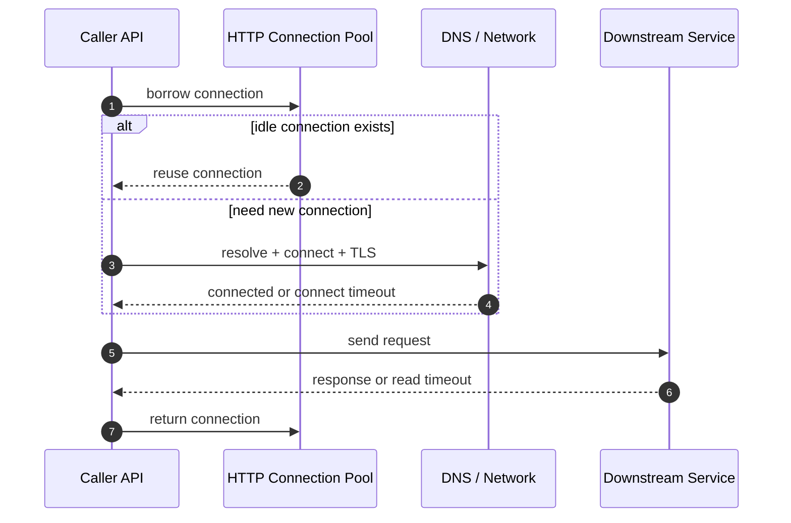
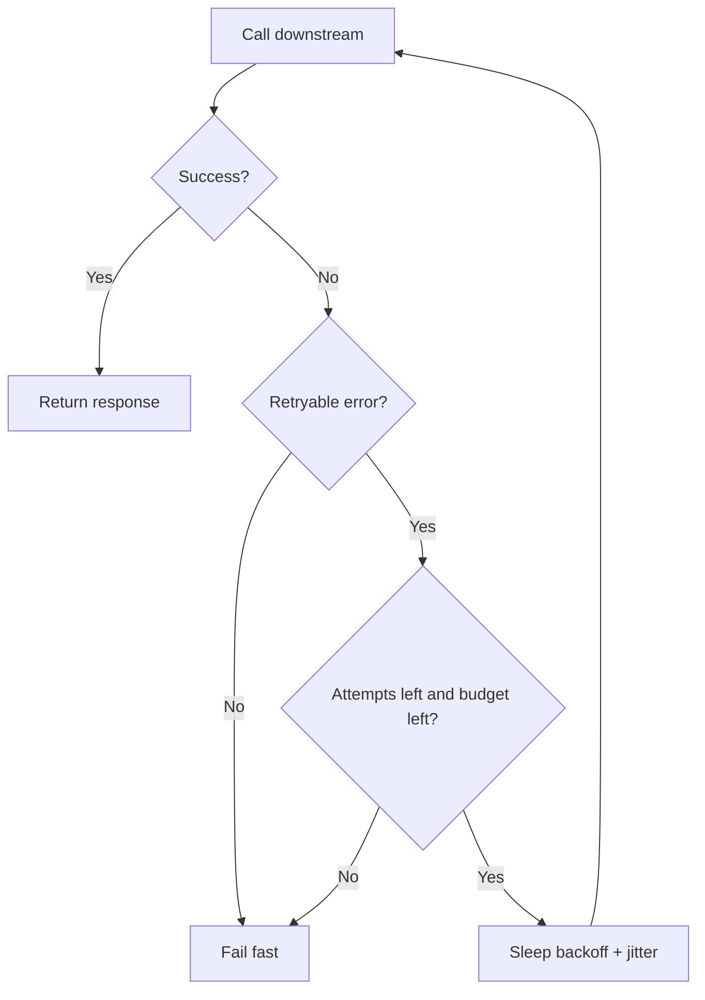
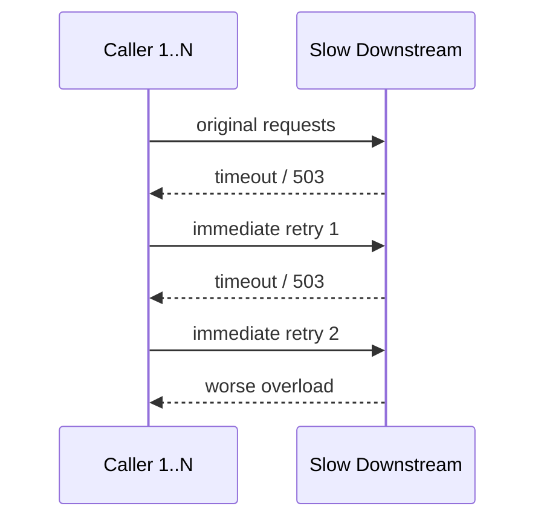
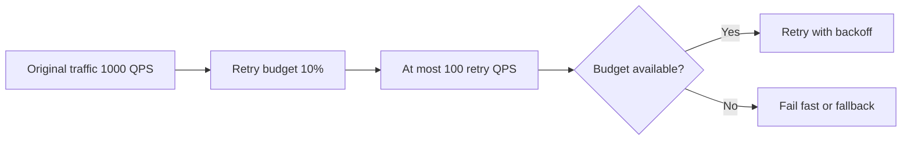
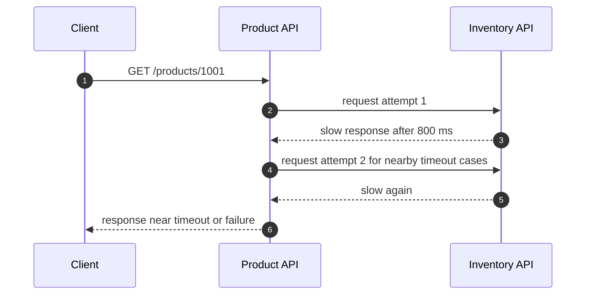

import Tabs from '@theme/Tabs';
import TabItem from '@theme/TabItem';

# HTTP 超时与重试

超时和重试是可靠性设计的入口。没有超时，请求会无限占用线程、协程、连接和队列；没有边界的重试，会在下游变慢时把局部故障放大成全链路故障。

## 先理解这些概念

- **超时**：一次等待的最长时间，超过就放弃。
- **重试**：失败后再试一次，适合临时故障，不适合业务失败。
- **退避 backoff**：重试前先等一会儿，后续等待时间逐渐变长。
- **jitter**：在等待时间里加入随机值，避免大量客户端同一时间重试。
- **幂等**：同一个操作重复执行，最终效果一致。写请求能否重试，先看是否幂等。
- **重试放大**：多层服务都重试时，请求量会成倍增加。
- **幂等处理中**：同一个幂等 key 的第一次请求还没完成，后续重复请求不能并发执行同一写操作。
- **重试预算**：允许重试产生的额外流量上限，常按原始流量比例控制。

读这篇时先记住：超时负责“别无限等”，重试负责“临时失败再试一下”，幂等负责“重试不会造成重复副作用”。

## 它是什么

**超时**是给一次等待设置上限：连接建立要等多久、读取响应要等多久、等待连接池要等多久、整个请求最多允许多久。

**重试**是在一次调用失败后，再尝试发起同一个操作。它通常用于临时故障，例如网络抖动、连接重置、短暂 503、服务刚好滚动发布。

两者必须一起设计：只有超时没有重试，短暂故障会直接暴露给用户；只有重试没有超时，请求可能长期卡住；有重试但没有边界，则可能压垮已经变慢的下游。

## 为什么需要它

分布式系统里，跨网络调用一定会失败：网络会抖、DNS 会慢、连接池会满、下游会发布、数据库会锁等待、某台机器会过载。后端服务不能假设每个依赖都能稳定快速返回。

如果没有超时，一个慢下游会持续占用调用方资源。调用方线程池被占满后，即使其他正常接口也会被拖慢。如果重试设计不当，请求量会被放大。例如入口流量是 1,000 QPS，每个请求对下游最多重试 2 次，下游最坏会看到 3,000 QPS。

## 它解决什么问题

| 机制 | 解决的问题 | 不解决的问题 |
| --- | --- | --- |
| 超时 | 防止无限等待，释放线程、连接和队列资源 | 不能让慢下游变快 |
| 重试 | 屏蔽短暂故障，提高临时失败场景下的成功率 | 不能修复持续故障，可能放大压力 |
| 退避 | 避免所有请求立刻再次打到下游 | 不能替代限流和熔断 |
| jitter | 避免大量客户端在同一时刻重试 | 不能解决非幂等副作用 |
| 重试预算 | 限制额外流量，避免重试风暴 | 不能替代容量规划 |

核心原则是：**失败要快，重试要少，等待要有上限，副作用要幂等**。

## 核心原理

一次 HTTP 调用可以拆成多个阶段。每个阶段都可能卡住，因此实际工程里通常需要多个超时，而不是一个笼统的“接口超时”。



重试的关键是只在“可能恢复”的错误上做有限尝试，并使用退避和 jitter 分散重试流量。



如果所有调用方都立即重试，会形成重试风暴。



## 最小示例

下面示例实现一个共同策略：

- 单次请求 200 ms 超时。
- 最多 3 次尝试，也就是 1 次原始请求 + 2 次重试。
- 只对超时、连接错误、`429`、`503` 重试。
- 使用指数退避和 jitter。
- 传递 `X-Request-Id`，为幂等和排查问题留入口。

<Tabs groupId="language">
  <TabItem value="java" label="Java">

```java
import java.io.IOException;
import java.net.URI;
import java.net.http.HttpClient;
import java.net.http.HttpRequest;
import java.net.http.HttpResponse;
import java.time.Duration;
import java.util.concurrent.ThreadLocalRandom;

public class RetryingHttpClient {
    private final HttpClient client = HttpClient.newBuilder()
        .connectTimeout(Duration.ofMillis(100))
        .build();

    public String get(String url, String requestId) throws Exception {
        int maxAttempts = 3;

        for (int attempt = 1; attempt <= maxAttempts; attempt++) {
            HttpRequest request = HttpRequest.newBuilder()
                .uri(URI.create(url))
                .timeout(Duration.ofMillis(200))
                .header("X-Request-Id", requestId)
                .GET()
                .build();

            try {
                HttpResponse<String> response = client.send(request, HttpResponse.BodyHandlers.ofString());
                if (!shouldRetryStatus(response.statusCode())) {
                    if (response.statusCode() >= 400) {
                        throw new IOException("http status " + response.statusCode());
                    }
                    return response.body();
                }
                if (attempt == maxAttempts) {
                    throw new IOException("retryable status after max attempts: " + response.statusCode());
                }
            } catch (IOException e) {
                if (attempt == maxAttempts) {
                    throw e;
                }
            }

            Thread.sleep(backoffMillis(attempt));
        }

        throw new IllegalStateException("unreachable");
    }

    private boolean shouldRetryStatus(int status) {
        return status == 429 || status == 503;
    }

    private long backoffMillis(int attempt) {
        long base = 50L * (1L << (attempt - 1));
        long jitter = ThreadLocalRandom.current().nextLong(0, 30);
        return base + jitter;
    }
}
```

  </TabItem>
  <TabItem value="go" label="Go">

```go
package retryhttp

import (
    "context"
    "fmt"
    "io"
    "math/rand"
    "net/http"
    "time"
)

var client = &http.Client{Timeout: 200 * time.Millisecond}

func Get(ctx context.Context, url, requestID string) (string, error) {
    const maxAttempts = 3

    for attempt := 1; attempt <= maxAttempts; attempt++ {
        reqCtx, cancel := context.WithTimeout(ctx, 200*time.Millisecond)
        req, err := http.NewRequestWithContext(reqCtx, http.MethodGet, url, nil)
        if err != nil {
            cancel()
            return "", err
        }
        req.Header.Set("X-Request-Id", requestID)

        resp, err := client.Do(req)
        cancel()

        if err == nil {
            body, readErr := io.ReadAll(resp.Body)
            resp.Body.Close()
            if !shouldRetry(resp.StatusCode) || attempt == maxAttempts {
                if resp.StatusCode >= 400 {
                    return "", fmt.Errorf("downstream status: %d", resp.StatusCode)
                }
                return string(body), readErr
            }
        } else if attempt == maxAttempts {
            return "", err
        }

        time.Sleep(backoff(attempt))
    }

    return "", fmt.Errorf("unreachable")
}

func shouldRetry(status int) bool {
    return status == http.StatusTooManyRequests || status == http.StatusServiceUnavailable
}

func backoff(attempt int) time.Duration {
    base := 50 * time.Millisecond * time.Duration(1<<(attempt-1))
    jitter := time.Duration(rand.Intn(30)) * time.Millisecond
    return base + jitter
}
```

  </TabItem>
  <TabItem value="typescript" label="TypeScript">

```typescript
function sleep(ms: number): Promise<void> {
  return new Promise((resolve) => setTimeout(resolve, ms));
}

function backoffMs(attempt: number): number {
  const base = 50 * 2 ** (attempt - 1);
  const jitter = Math.floor(Math.random() * 30);
  return base + jitter;
}

function shouldRetryStatus(status: number): boolean {
  return status === 429 || status === 503;
}

export async function getWithRetry(url: string, requestId: string): Promise<string> {
  const maxAttempts = 3;

  for (let attempt = 1; attempt <= maxAttempts; attempt += 1) {
    const controller = new AbortController();
    const timeout = setTimeout(() => controller.abort(), 200);

    try {
      const response = await fetch(url, {
        method: 'GET',
        headers: { 'X-Request-Id': requestId },
        signal: controller.signal,
      });

      if (!shouldRetryStatus(response.status) || attempt === maxAttempts) {
        if (response.status >= 400) {
          throw new Error(`downstream status: ${response.status}`);
        }
        return await response.text();
      }
    } catch (error) {
      if (attempt === maxAttempts) {
        throw error;
      }
    } finally {
      clearTimeout(timeout);
    }

    await sleep(backoffMs(attempt));
  }

  throw new Error('unreachable');
}
```

  </TabItem>
  <TabItem value="python" label="Python">

```python
import random
import time
from urllib import error, request


def should_retry_status(status: int) -> bool:
    return status in (429, 503)


def backoff_seconds(attempt: int) -> float:
    base = 0.05 * (2 ** (attempt - 1))
    jitter = random.uniform(0, 0.03)
    return base + jitter


def get_with_retry(url: str, request_id: str) -> str:
    max_attempts = 3

    for attempt in range(1, max_attempts + 1):
        req = request.Request(url, method="GET", headers={"X-Request-Id": request_id})

        try:
            with request.urlopen(req, timeout=0.2) as response:
                body = response.read().decode("utf-8")
                if not should_retry_status(response.status) or attempt == max_attempts:
                    if response.status >= 400:
                        raise RuntimeError(f"downstream status: {response.status}")
                    return body
        except error.HTTPError as exc:
            if not should_retry_status(exc.code) or attempt == max_attempts:
                raise
        except error.URLError:
            if attempt == max_attempts:
                raise

        time.sleep(backoff_seconds(attempt))

    raise RuntimeError("unreachable")
```

  </TabItem>
</Tabs>

## 工程实践

### 1. 拆分超时类型

| 超时 | 建议关注点 |
| --- | --- |
| 连接池等待超时 | 等不到连接时要快速失败，否则请求会在本地排队 |
| DNS / connect timeout | 下游不可达时快速失败，通常比 read timeout 更短 |
| TLS handshake timeout | HTTPS 或 mTLS 服务要单独关注握手耗时 |
| read timeout | 下游处理慢时的等待上限 |
| total request timeout | 覆盖一次完整调用，不能超过入口请求预算 |

### 2. 设计重试条件

适合重试的情况：

- 连接重置、临时网络错误。
- 读请求超时，且服务端副作用可忽略。
- `429 Too Many Requests`，并尊重 `Retry-After`。
- `503 Service Unavailable` 或滚动发布期间的短暂不可用。

不适合直接重试的情况：

- `400`、`401`、`403` 这类客户端或权限错误。
- `404`，除非业务明确存在读后写传播延迟。
- 非幂等写操作，例如下单、扣款、发券，除非有稳定幂等 key。
- 下游已经持续过载，此时应该熔断、限流或降级。

### 3. 使用重试预算

重试预算限制额外流量。例如允许重试流量不超过原始请求的 10%。当错误率升高时，不让所有调用方都无限补发请求。



工程上可以用滚动窗口计数或 token bucket 实现重试预算。按下游服务或接口统计最近一段时间的原始请求数和重试请求数，如果重试请求已经超过原始请求的 10%，新的重试就快速失败或降级。token bucket 则可以按原始请求补充少量 retry token，每次重试消耗 token，token 不足时不再重试。预算不需要绝对精确，目标是防止故障时重试流量失控。

### 4. 写请求重试要先处理幂等状态

POST /orders 这类写请求超时后，调用方不知道服务端是否已经创建订单。安全做法是调用方携带稳定 `Idempotency-Key`，服务端用唯一索引或幂等表记录处理状态。重复请求如果发现状态是 `SUCCESS`，返回同一结果；如果状态是 `PROCESSING`，可以返回 `202 Accepted`、`409 Conflict`，或者短暂等待第一次请求完成后返回同一结果；如果明确失败，才允许重新处理或进入补偿。核心原则是同一个幂等 key 不能并发执行两次写入。

### 5. 和限流、熔断配合

超时和重试只处理单次调用策略。下游持续异常时，要通过熔断器快速失败；入口流量超过系统容量时，要通过限流保护核心依赖；业务允许时，再提供降级结果。

## 常见坑

- 入口接口 1 秒超时，但下游调用也配置 1 秒，导致入口已经超时后下游还在执行。
- 每一层都重试 3 次，调用链路一深，实际请求量指数级放大。
- 对 POST 请求无脑重试，导致重复下单、重复扣款、重复发券。
- 同一个 Idempotency-Key 的请求处理中时，第二个请求又并发执行业务写入。
- 重试没有 jitter，大量请求在同一时刻再次打到下游。
- HTTP client 没有连接池限制，流量高峰时把下游连接打满。
- 只记录最终失败，不记录每次尝试的状态码、耗时和 attempt。
- 重试吞掉错误，调用方只看到“成功返回空数据”。

## 完整案例：库存服务变慢导致商品详情 P99 飙升

### 场景

商品详情接口会调用库存服务获取实时库存。库存服务发布新版本后，部分实例响应从 30 ms 增加到 800 ms。Product API 对库存服务设置了 1 秒读超时，并且对所有异常立刻重试 2 次。

### 故障过程



### 修复方案

- Product API 总预算是 500 ms，库存调用预算调整为 120 ms。
- 只对连接错误和 `503` 重试一次，且使用指数退避和 jitter。
- 对库存展示使用降级：库存服务超时时返回“库存紧张”或隐藏精确库存。
- 增加 inventory dependency dashboard：调用量、错误率、P95/P99、重试次数、熔断状态。
- 库存服务发布过程增加金丝雀和自动回滚条件。

## 检查清单

学完这一节后，你应该能回答：

- connect timeout、read timeout、request timeout、pool wait timeout 分别是什么？
- 为什么重试必须配合超时、退避和 jitter？
- 哪些 HTTP 状态码适合重试，哪些不适合？
- 为什么非幂等写操作不能无脑重试？
- 同一个 Idempotency-Key 仍在处理中时，后续重试应该怎么返回？
- 多层服务都重试时，流量会如何被放大？
- 如何为一个 500 ms 的入口 API 分配下游调用预算？
- 重试预算可以如何落地实现？
- 重试预算、限流、熔断分别解决什么问题？

## 这篇文章在系统里怎么用

任何跨网络调用都要考虑这篇文章：HTTP、RPC、数据库、Redis、第三方 API 都可能慢或失败。系统设计时，不能只说“调用库存服务”，还要说明单次超时是多少、是否重试、重试几次、是否有退避和 jitter、写操作如何保证幂等。

这篇和后面的限流、熔断、幂等是组合使用的：超时让请求有边界，重试提升临时故障成功率，限流和熔断防止故障扩大，幂等保证重试安全。

## 术语回看

- [幂等](../system-design/glossary.md#幂等)
- [削峰](../system-design/glossary.md#削峰)
- [P99](../system-design/glossary.md#p99)
- [补偿](../system-design/glossary.md#补偿)

## 延伸阅读

- [AWS Builders Library: Timeouts, retries, and backoff with jitter](https://aws.amazon.com/builders-library/timeouts-retries-and-backoff-with-jitter/)
- [AWS Builders Library: Making retries safe with idempotent APIs](https://aws.amazon.com/builders-library/making-retries-safe-with-idempotent-APIs/)
- [Google SRE Book: Addressing Cascading Failures](https://sre.google/sre-book/addressing-cascading-failures/)
- [Google SRE Book: Handling Overload](https://sre.google/sre-book/handling-overload/)
- [MDN: 429 Too Many Requests](https://developer.mozilla.org/en-US/docs/Web/HTTP/Status/429)
- [MDN: 503 Service Unavailable](https://developer.mozilla.org/en-US/docs/Web/HTTP/Status/503)
