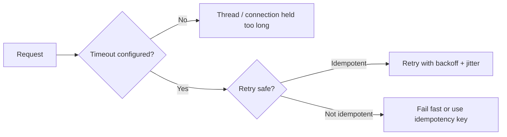

# HTTP 超时与重试

超时和重试是可靠性设计的入口。没有超时，请求会无限占用线程、连接和队列；没有边界的重试，会在下游变慢时放大故障。

## 后续扩写

- 连接超时、读超时、总请求超时的区别。
- 指数退避和 jitter。
- 重试预算、熔断和限流的配合。

## 延伸阅读

- [AWS Builders Library: Timeouts, retries, and backoff with jitter](https://aws.amazon.com/builders-library/timeouts-retries-and-backoff-with-jitter/)
- [Google SRE Book: Addressing Cascading Failures](https://sre.google/sre-book/addressing-cascading-failures/)
