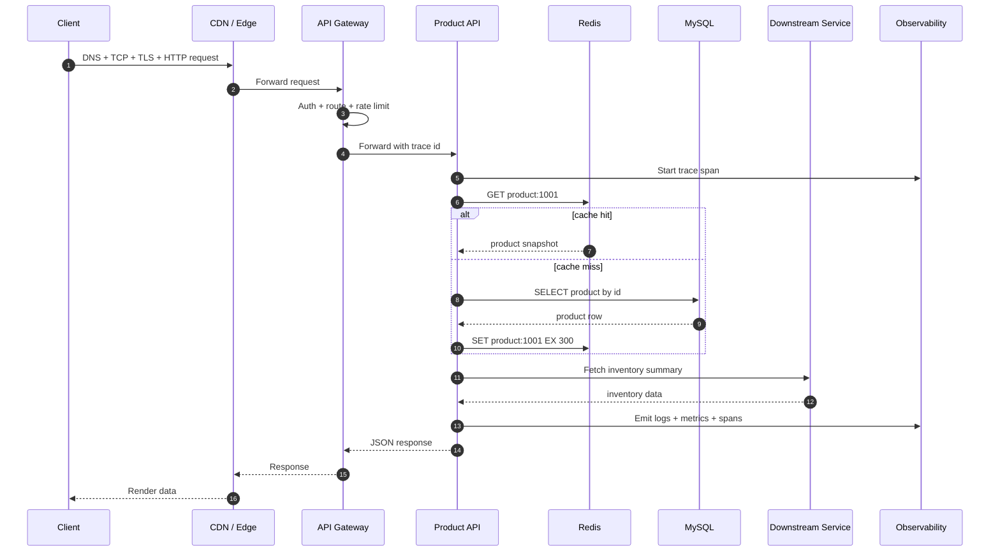
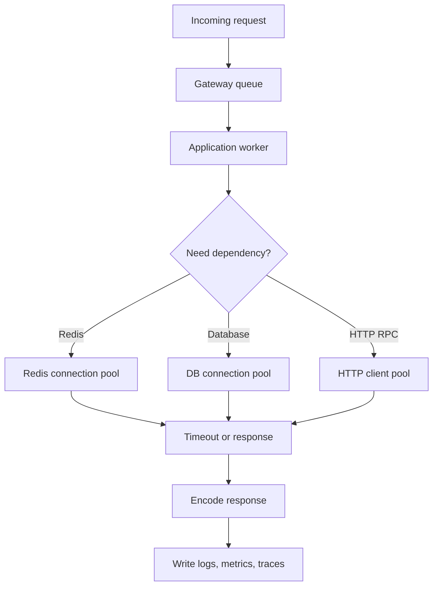
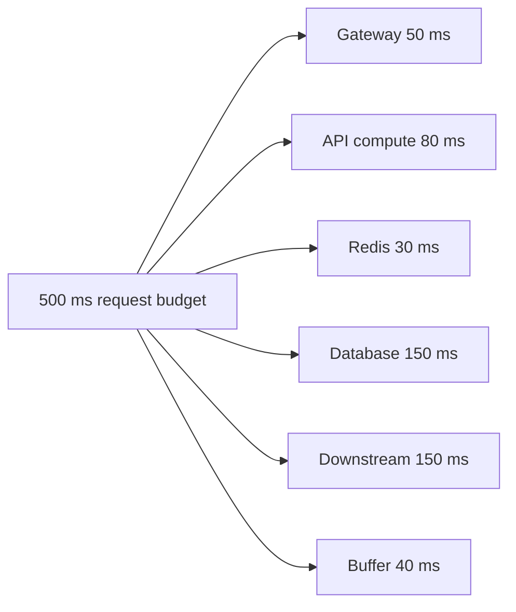
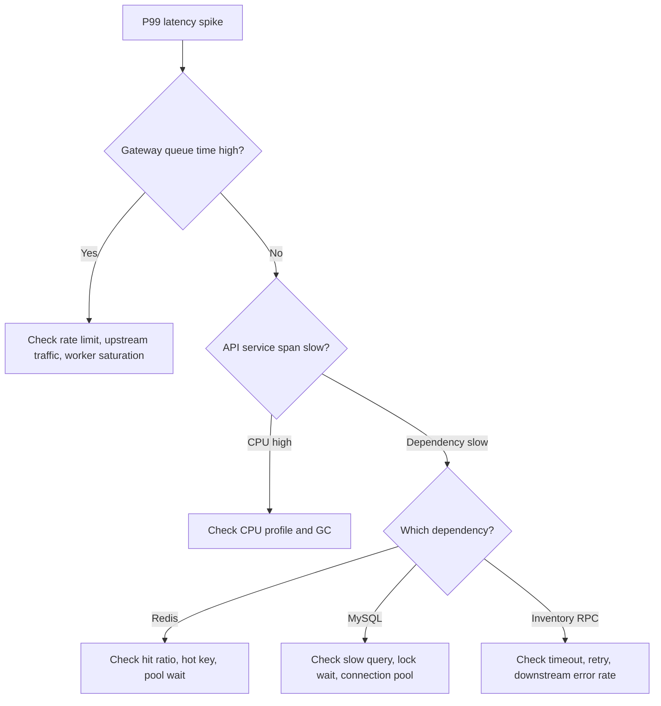

import Tabs from '@theme/Tabs';
import TabItem from '@theme/TabItem';

# 一个请求的完整生命周期

理解后端性能和可靠性的第一步，是把一个请求经过的所有环节拆开。一个接口变慢，通常不是“代码慢”这么简单，而可能是 DNS、TLS、网关排队、线程池耗尽、连接池等待、慢 SQL、Redis 热 key、GC 暂停或下游重试放大共同导致的。

## 先理解这些概念

- **请求链路**：一次用户请求从客户端到服务端再返回的完整路径。
- **网关**：流量进入后端前的统一入口，常做鉴权、限流、路由和日志。
- **连接池**：提前准备好一批数据库或 HTTP 连接，避免每次请求都重新建立连接。
- **下游服务**：当前服务调用的其他服务，比如商品服务调用库存服务。
- **P99**：最慢 1% 请求的延迟，常用来观察长尾问题。
- **Trace ID**：一次请求的唯一追踪 ID，用来把多层日志和链路串起来。

读这篇时先把请求想成一条流水线：任何一段排队、超时或重试，都会影响最终响应。

## 它是什么

一个请求的生命周期，是指客户端发起请求后，经过网络、边缘节点、网关、业务服务、缓存、数据库、下游服务、日志指标链路，最后返回响应的完整过程。

以商品详情页为例，客户端请求 `GET /api/products/1001`。这个请求表面上只是“查一个商品”，但真实链路可能包含：DNS 解析、TLS 握手、API Gateway 鉴权、Product API 读取 Redis、缓存 miss 后查询 MySQL、写入日志和指标、返回 JSON。

## 为什么需要它

前端和客户端通常更关注“接口是否返回”和“返回数据是否正确”。后端还必须关注：

- 请求在哪一层排队？
- 每一层的超时预算是多少？
- 慢的是业务代码、数据库、缓存，还是下游服务？
- 重试会不会把一个局部故障放大？
- P99 变差时，是否能用 trace id 找到根因？

如果不理解完整链路，线上排查很容易停留在猜测：看到接口慢，就怀疑 SQL；看到 CPU 高，就怀疑代码；看到 Redis 慢，就怀疑缓存。但真实问题经常发生在层与层之间，例如连接池等待、网关排队、下游超时设置不合理。

## 它解决什么问题

理解请求生命周期主要解决三个问题。

| 问题 | 具体收益 |
| --- | --- |
| 性能分析 | 能把端到端延迟拆成 DNS、网络、网关、应用、缓存、数据库、下游等部分 |
| 可靠性设计 | 能为每一层设置超时、重试、限流、熔断、降级和隔离策略 |
| 线上排查 | 能通过日志、指标和链路追踪定位错误率升高或 P99 延迟升高的原因 |

它不直接解决业务建模、数据一致性或容量扩容问题，但它是分析这些问题的基础视角。

## 核心原理

一次请求通常会经历“入口处理、业务计算、依赖访问、返回响应、观测记录”几个阶段。每个阶段都可能等待资源，也都需要独立的失败边界。



从资源角度看，请求不是一直在“运行”，更多时候是在等待：等连接、等锁、等数据库、等网络、等下游返回。高并发系统最怕等待没有上限，因为等待会占住线程、协程、连接池和队列。



## 最小示例

下面的示例展示同一个核心动作：调用下游库存服务时传递 `trace id`，并设置 200 ms 超时。这里不引入完整框架，只保留请求生命周期里最关键的工程点：跨服务调用必须有超时，且必须能被观测系统串起来。

<Tabs groupId="language">
  <TabItem value="java" label="Java">

```java
import java.net.URI;
import java.net.http.HttpClient;
import java.net.http.HttpRequest;
import java.net.http.HttpResponse;
import java.time.Duration;

public class InventoryClient {
    private final HttpClient client = HttpClient.newBuilder()
        .connectTimeout(Duration.ofMillis(100))
        .build();

    public String fetchInventory(String productId, String traceId) throws Exception {
        HttpRequest request = HttpRequest.newBuilder()
            .uri(URI.create("https://inventory.internal/products/" + productId))
            .timeout(Duration.ofMillis(200))
            .header("X-Trace-Id", traceId)
            .GET()
            .build();

        HttpResponse<String> response = client.send(request, HttpResponse.BodyHandlers.ofString());
        if (response.statusCode() >= 500) {
            throw new IllegalStateException("inventory service unavailable");
        }
        return response.body();
    }
}
```

  </TabItem>
  <TabItem value="go" label="Go">

```go
package inventory

import (
    "context"
    "fmt"
    "io"
    "net/http"
    "time"
)

var client = &http.Client{Timeout: 200 * time.Millisecond}

func FetchInventory(ctx context.Context, productID, traceID string) (string, error) {
    ctx, cancel := context.WithTimeout(ctx, 200*time.Millisecond)
    defer cancel()

    url := fmt.Sprintf("https://inventory.internal/products/%s", productID)
    req, err := http.NewRequestWithContext(ctx, http.MethodGet, url, nil)
    if err != nil {
        return "", err
    }
    req.Header.Set("X-Trace-Id", traceID)

    resp, err := client.Do(req)
    if err != nil {
        return "", err
    }
    defer resp.Body.Close()

    if resp.StatusCode >= 500 {
        return "", fmt.Errorf("inventory service unavailable: %d", resp.StatusCode)
    }
    body, err := io.ReadAll(resp.Body)
    return string(body), err
}
```

  </TabItem>
  <TabItem value="typescript" label="TypeScript">

```typescript
export async function fetchInventory(productId: string, traceId: string): Promise<string> {
  const controller = new AbortController();
  const timeout = setTimeout(() => controller.abort(), 200);

  try {
    const response = await fetch(`https://inventory.internal/products/${productId}`, {
      method: 'GET',
      headers: { 'X-Trace-Id': traceId },
      signal: controller.signal,
    });

    if (response.status >= 500) {
      throw new Error('inventory service unavailable');
    }
    return await response.text();
  } finally {
    clearTimeout(timeout);
  }
}
```

  </TabItem>
  <TabItem value="python" label="Python">

```python
from urllib import request, error


def fetch_inventory(product_id: str, trace_id: str) -> str:
    req = request.Request(
        f"https://inventory.internal/products/{product_id}",
        method="GET",
        headers={"X-Trace-Id": trace_id},
    )

    try:
        with request.urlopen(req, timeout=0.2) as response:
            if response.status >= 500:
                raise RuntimeError("inventory service unavailable")
            return response.read().decode("utf-8")
    except error.URLError as exc:
        raise TimeoutError("inventory request failed or timed out") from exc
```

  </TabItem>
</Tabs>

## 工程实践

### 1. 给请求设置时间预算

不要只设置一个入口超时。入口 API 如果总预算是 500 ms，那么网关、应用计算、Redis、数据库和下游 RPC 都需要有子预算。子预算相加还要留出 buffer，否则每一层都“刚好超时”时，整体一定超时。



### 2. 区分不同超时

| 超时类型 | 含义 | 常见问题 |
| --- | --- | --- |
| connect timeout | 建立连接的时间上限 | 下游不可达时没有快速失败 |
| read timeout | 等待响应数据的时间上限 | 下游慢时线程长期阻塞 |
| request timeout | 一次完整调用的总上限 | 多阶段调用累计超过入口预算 |
| pool wait timeout | 等待连接池资源的上限 | 连接池耗尽时请求堆积 |

### 3. 日志、指标和 trace 要能互相跳转

一次请求至少要能记录：`trace_id`、接口名、状态码、错误类型、总耗时、下游耗时、数据库耗时、缓存命中状态。指标用于发现异常，trace 用于定位慢在哪一段，日志用于看具体错误上下文。

### 4. 重试必须受控

只有临时错误才适合重试，例如连接重置、短暂网络抖动、429/503。重试要有最大次数、指数退避、jitter 和幂等保障。对非幂等接口，例如下单、支付、扣款，必须先设计幂等 key。

## 常见坑

- 只给入口接口设置超时，下游 HTTP client、Redis client、数据库查询没有独立超时。
- HTTP client 没有复用连接，每次请求都重新建连接和 TLS 握手。
- 对所有错误无脑重试，导致下游已经慢的时候被更多请求压垮。
- 只看平均延迟，不看 P95/P99，错过长尾问题。
- 没有统一 trace id，线上排查只能靠时间和关键词猜测。
- 业务日志里只记录“请求失败”，没有记录下游名称、耗时、状态码和错误类型。

## 完整案例：商品详情接口 P99 升高

### 现象

商品详情接口平均延迟 70 ms，但 P99 从 120 ms 升到 2 s。错误率不高，用户反馈偶发页面加载很慢。

### 排查路径



### 一种常见根因

缓存命中率从 98% 降到 85%，大量请求开始查询 MySQL。MySQL 查询本身不是特别慢，但数据库连接池被占满，后续请求等待连接池资源。等待时间进入 P99，入口 API 又对下游库存服务做了一次重试，进一步拉长尾部延迟。

### 修复方向

- 商品详情缓存增加 TTL jitter，避免大量 key 同时过期。
- 缓存 miss 回源增加互斥保护，避免击穿数据库。
- 数据库连接池增加等待超时和监控。
- 下游库存服务调用设置更短超时，重试只对幂等读请求启用。
- Dashboard 同时展示 cache hit ratio、DB pool wait、RPC latency 和 API P99。

## 检查清单

学完这一节后，你应该能回答：

- 一个后端请求从客户端到数据库通常会经过哪些环节？
- 接口变慢时，如何区分网络慢、网关慢、应用慢、缓存慢、数据库慢和下游慢？
- 为什么平均延迟正常时，用户仍然可能感觉很慢？
- 为什么每个下游调用都需要独立超时？
- 重试为什么可能导致级联故障？
- trace id、日志、指标和链路追踪分别解决什么问题？
- 连接池等待为什么会表现为接口 P99 升高？

## 这篇文章在系统里怎么用

这是后端排查问题的总地图。后面学习超时、重试、连接池、缓存、数据库、P99 和链路追踪时，都可以回到这张地图上定位：问题发生在入口、应用、缓存、数据库、下游，还是观测链路。

系统设计时也一样，不要只画一个 API 和一个数据库。要说明请求如何进入系统，在哪些地方排队，怎么设置超时，哪些依赖可降级，如何用日志、指标和 trace 找到慢点。

## 术语回看

- [P99](../system-design/glossary.md#p99)
- [热点 / 热 Key](../system-design/glossary.md#热点--热-key)
- [削峰](../system-design/glossary.md#削峰)
- [幂等](../system-design/glossary.md#幂等)

## 延伸阅读

- [MDN: An overview of HTTP](https://developer.mozilla.org/en-US/docs/Web/HTTP/Overview)
- [Google SRE Book: Monitoring Distributed Systems](https://sre.google/sre-book/monitoring-distributed-systems/)
- [Google SRE Book: Addressing Cascading Failures](https://sre.google/sre-book/addressing-cascading-failures/)
- [AWS Builders Library: Timeouts, retries, and backoff with jitter](https://aws.amazon.com/builders-library/timeouts-retries-and-backoff-with-jitter/)
- [AWS Builders Library: Making retries safe with idempotent APIs](https://aws.amazon.com/builders-library/making-retries-safe-with-idempotent-APIs/)
- [OpenTelemetry: Distributed Tracing](https://opentelemetry.io/docs/concepts/signals/traces/)
