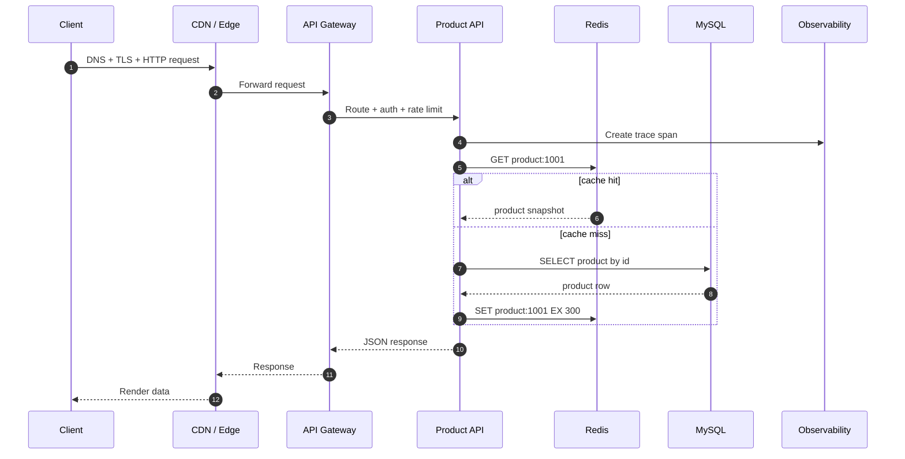
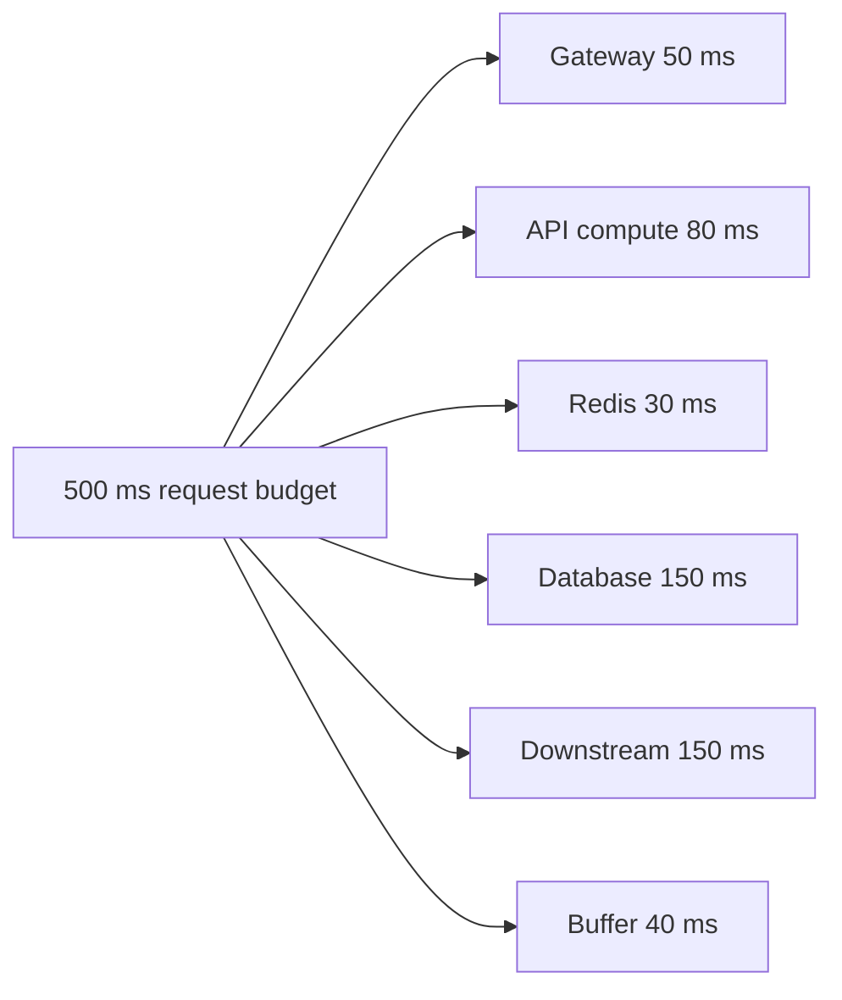

# 一个请求的完整生命周期

理解后端性能和可靠性的第一步，是把一个请求经过的所有环节拆开。一个接口变慢，通常不是“代码慢”这么简单，而可能是 DNS、TLS、网关排队、线程池耗尽、连接池等待、慢 SQL、Redis 热 key 或下游重试放大共同导致的。

## 问题场景

用户打开商品详情页，客户端请求 `GET /api/products/1001`。接口偶发 P99 延迟从 80 ms 升到 2 s，但平均延迟仍然正常。

## 请求时序



## 每一层的关键问题

| 层级 | 常见风险 | 需要观察的指标 |
| --- | --- | --- |
| Client / CDN | DNS 慢、TLS 握手慢、弱网重试 | DNS time、connect time、TTFB |
| Gateway | 限流误伤、认证服务慢、路由排队 | QPS、4xx/5xx、queue time |
| API service | 线程池耗尽、GC、锁竞争 | CPU、heap、GC pause、active threads |
| Redis | 热 key、大 key、连接池等待 | ops/sec、latency、hit ratio、pool wait |
| Database | 慢查询、锁等待、连接耗尽 | query time、lock wait、connections |
| Observability | 日志缺 trace id、采样过低 | trace coverage、error rate |

## 示例代码：带超时和 trace id 的下游调用

```java
public Product fetchProduct(String id, String traceId) {
    HttpRequest request = HttpRequest.newBuilder()
        .uri(URI.create("https://inventory.internal/products/" + id))
        .timeout(Duration.ofMillis(200))
        .header("X-Trace-Id", traceId)
        .GET()
        .build();

    try {
        HttpResponse<String> response = httpClient.send(request, BodyHandlers.ofString());
        if (response.statusCode() >= 500) {
            throw new DownstreamException("inventory unavailable");
        }
        return productParser.parse(response.body());
    } catch (HttpTimeoutException e) {
        throw new DownstreamTimeoutException("inventory timeout", e);
    }
}
```

## 常见错误

- 只给入口接口设置超时，下游 HTTP client、Redis client、数据库查询没有独立超时。
- 对所有错误无脑重试，导致下游已经慢的时候被更多请求压垮。
- 只看平均延迟，不看 P95/P99，错过长尾问题。
- 没有统一 trace id，线上排查只能靠时间和关键词猜测。

## 工程化方案

请求链路要有明确的时间预算。比如入口 API 总预算 500 ms，那么网关、认证、Redis、DB 和下游 RPC 都要分配子预算。每个跨网络调用都必须设置超时；重试必须有上限、退避和幂等保障；日志、指标和 trace 要围绕同一个请求 id 串起来。



## 延伸阅读

- [Google SRE Book: Monitoring Distributed Systems](https://sre.google/sre-book/monitoring-distributed-systems/)
- [AWS Builders Library: Timeouts, retries, and backoff with jitter](https://aws.amazon.com/builders-library/timeouts-retries-and-backoff-with-jitter/)
- [OpenTelemetry: Distributed Tracing](https://opentelemetry.io/docs/concepts/signals/traces/)
- [MDN: An overview of HTTP](https://developer.mozilla.org/en-US/docs/Web/HTTP/Overview)
