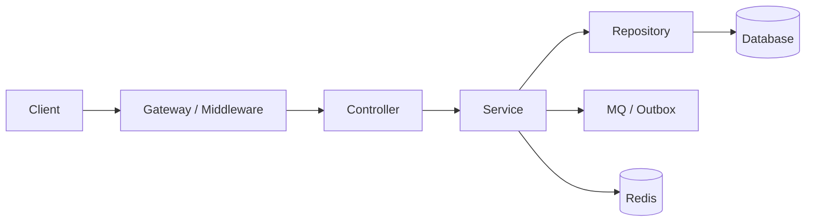
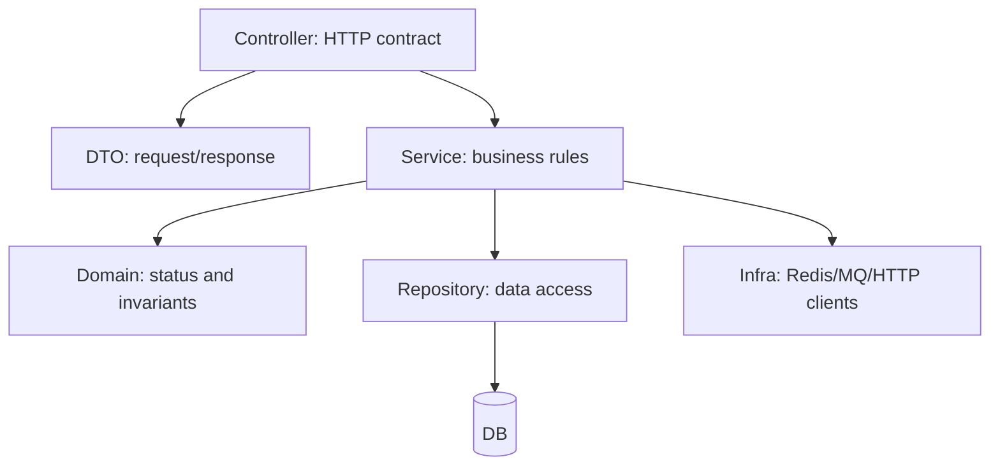

# 后端 API 与项目分层基础

如果你从前端或客户端转后端，最容易低估的是：后端接口不是“接参数、查数据库、返回 JSON”这么简单。面试官会看你是否能把 API 契约、鉴权、幂等、错误码、分页、事务边界和代码分层说清楚。



## 你要掌握什么

后端 API 设计要回答 4 个问题：

- 客户端应该怎么调用：URL、方法、请求体、响应体、状态码。
- 服务端如何保护自己：鉴权、限流、参数校验、超时、幂等。
- 业务状态如何推进：Service 里做规则判断、事务、状态机。
- 出错后如何定位和恢复：错误码、日志、traceId、可重试边界。

前端常关注页面体验，后端还要多想一步：**这个请求重复来、并发来、下游失败、客户端超时后重试，会不会把数据写坏。**

## 一个标准创建订单 API

```http
POST /v1/orders
Idempotency-Key: order_create:user_1001:req_202607120001
Authorization: Bearer <token>
Content-Type: application/json

{
  "skuId": "sku_1001",
  "quantity": 1,
  "addressId": "addr_2001"
}
```

成功时返回：

```json
{
  "code": "OK",
  "data": {
    "orderId": "ord_9001",
    "status": "PENDING_PAYMENT"
  },
  "traceId": "tr_abc123"
}
```

重复请求时返回同一个业务结果，而不是再创建一笔订单：

```json
{
  "code": "OK",
  "data": {
    "orderId": "ord_9001",
    "status": "PENDING_PAYMENT"
  },
  "traceId": "tr_def456"
}
```

## REST 设计模板

| 场景 | 方法与路径 | 说明 |
| --- | --- | --- |
| 创建资源 | `POST /v1/orders` | 非幂等意图，必须配幂等键 |
| 查询详情 | `GET /v1/orders/{orderId}` | 安全、幂等，可缓存 |
| 查询列表 | `GET /v1/orders?cursor=...&limit=20` | 用 cursor 分页 |
| 更新状态 | `POST /v1/orders/{orderId}/cancel` | 状态动作比 `PUT status` 更清晰 |
| 部分更新 | `PATCH /v1/users/me/profile` | 只改部分字段 |
| 删除资源 | `DELETE /v1/carts/items/{itemId}` | 注意软删除和权限 |

不要为了“纯 REST”牺牲业务清晰度。`POST /orders/{id}/pay`、`POST /orders/{id}/cancel` 在业务系统里通常比直接更新 `status` 更安全，因为它表达的是动作，而不是让客户端随便指定状态。

## 分页、过滤与排序

列表接口优先使用 cursor，不建议用深 offset。

```http
GET /v1/orders?status=PAID&limit=20&cursor=2026-07-12T10:01:02Z_ord_9001
```

SQL 形态：

```sql
select order_id, status, amount, created_at
from orders
where user_id = ?
  and status = ?
  and (created_at < ? or (created_at = ? and order_id < ?))
order by created_at desc, order_id desc
limit 20;
```

响应里返回下一页游标：

```json
{
  "code": "OK",
  "data": {
    "items": [],
    "nextCursor": "2026-07-12T09:58:10Z_ord_8900",
    "hasMore": true
  },
  "traceId": "tr_abc123"
}
```

## 错误码和状态码

HTTP 状态码表达通用语义，业务错误码表达业务原因。

| HTTP | 业务码 | 场景 | 客户端动作 |
| --- | --- | --- | --- |
| `400` | `INVALID_ARGUMENT` | 参数格式错 | 修正请求 |
| `401` | `UNAUTHENTICATED` | 未登录或 token 无效 | 重新登录 |
| `403` | `FORBIDDEN` | 没权限访问资源 | 不要重试 |
| `404` | `NOT_FOUND` | 资源不存在或不可见 | 展示空态 |
| `409` | `STATE_CONFLICT` | 订单已取消，不能支付 | 刷新状态 |
| `429` | `RATE_LIMITED` | 被限流 | 稍后重试 |
| `500` | `INTERNAL` | 服务端 bug 或未知异常 | 可重试但要告警 |
| `503` | `DEPENDENCY_UNAVAILABLE` | 下游不可用 | 可重试或降级 |

错误响应模板：

```json
{
  "code": "STATE_CONFLICT",
  "message": "order cannot be paid after cancelled",
  "details": {
    "orderId": "ord_9001",
    "currentStatus": "CANCELLED"
  },
  "traceId": "tr_abc123"
}
```

## 项目分层怎么写



推荐职责：

- Controller：解析请求、鉴权结果、参数校验、调用 Service、映射响应。
- Service：业务规则、事务边界、状态流转、幂等处理、调用仓储和外部依赖。
- Repository：SQL、ORM、数据读写，不写业务规则。
- Domain：订单状态、金额计算、是否允许取消等业务不变量。
- Infrastructure：Redis、MQ、第三方 HTTP client、配置、日志。

## 最小代码例子

下面用 TypeScript 表达结构，重点看职责边界。

```ts
type CreateOrderRequest = {
  userId: string;
  skuId: string;
  quantity: number;
  idempotencyKey: string;
};

type Order = {
  orderId: string;
  userId: string;
  skuId: string;
  quantity: number;
  status: 'PENDING_PAYMENT' | 'PAID' | 'CANCELLED';
};

class OrderController {
  constructor(private readonly service: OrderService) {}

  async create(req: HttpRequest): Promise<HttpResponse> {
    const input = {
      userId: req.auth.userId,
      skuId: String(req.body.skuId),
      quantity: Number(req.body.quantity),
      idempotencyKey: req.headers['idempotency-key'],
    };

    const order = await this.service.createOrder(input);
    return ok({ orderId: order.orderId, status: order.status });
  }
}

class OrderService {
  constructor(
    private readonly orders: OrderRepository,
    private readonly idem: IdempotencyRepository,
  ) {}

  async createOrder(input: CreateOrderRequest): Promise<Order> {
    if (!input.idempotencyKey) throw new BadRequest('missing idempotency key');
    if (input.quantity <= 0) throw new BadRequest('quantity must be positive');

    return this.orders.transaction(async () => {
      const started = await this.idem.tryStart(input.userId, input.idempotencyKey);
      if (!started) {
        const existing = await this.idem.findResult(input.userId, input.idempotencyKey);
        if (existing) return existing;
        throw new ConflictError('same request is still processing');
      }

      const order = await this.orders.insertPendingOrder(input);
      await this.idem.saveResult(input.userId, input.idempotencyKey, order);
      return order;
    });
  }
}
```

这个例子里，Controller 不直接写 SQL，也不判断订单状态；Repository 不决定业务是否允许创建订单；幂等逻辑放在 Service 的事务里。`tryStart` 背后应该是 `user_id + idempotency_key` 唯一约束的插入占位，避免两个并发请求都先查不到结果然后同时创建订单。订单表自身也可以保留同样的唯一约束作为第二道防线。

## 常见反例

| 反例 | 问题 | 修复 |
| --- | --- | --- |
| Controller 里直接写 SQL | 业务散落，难测试 | 下沉到 Service 和 Repository |
| 客户端传 `status=PAID` | 客户端可伪造状态 | 用动作接口，服务端推进状态 |
| 创建接口没有幂等键 | 重试会重复写 | `Idempotency-Key` + 唯一约束 |
| 列表用深 offset | 越翻越慢，数据抖动 | cursor 分页 |
| 只返回 `message` | 客户端无法稳定处理 | 稳定业务错误码 |
| 日志没有 traceId | 线上无法串联请求 | 网关生成并透传 traceId |

## 面试怎么讲

面试官问“你怎么设计一个创建订单接口”，可以这样回答：

> 我会先定义 API 契约：`POST /v1/orders`，请求里传 sku、数量、地址，header 里要求 `Idempotency-Key`。Controller 只做鉴权、参数校验和响应映射，真正的业务规则放在 Service。Service 在事务里检查幂等记录、校验库存或调用库存服务、创建订单，再保存幂等结果。数据库用唯一约束兜底，例如 `user_id + idempotency_key`。错误响应用稳定业务码，比如参数错是 `INVALID_ARGUMENT`，状态冲突是 `STATE_CONFLICT`。列表查询用 cursor 分页，日志带 traceId，方便线上排查。

追问“为什么不直接让前端传订单状态”：

> 状态是后端业务不变量，不能由客户端任意指定。客户端只能表达动作，比如创建、支付、取消；后端根据当前状态机判断动作是否合法，再推进状态。

## 检查清单

- 创建、支付、取消等写接口是否有幂等设计？
- Controller 是否只处理 HTTP 契约，不承载复杂业务？
- Service 是否负责事务、状态流转和外部依赖编排？
- Repository 是否只处理数据访问？
- 错误响应是否有稳定业务码和 traceId？
- 列表接口是否使用 cursor 分页？
- 鉴权、限流、参数校验、超时是否在入口统一处理？

## 延伸阅读

- [Microsoft REST API Guidelines](https://github.com/microsoft/api-guidelines)
- [Google API Improvement Proposals](https://google.aip.dev/)
- [Stripe: Idempotent requests](https://docs.stripe.com/api/idempotent_requests)
- [Martin Fowler: Service Layer](https://martinfowler.com/eaaCatalog/serviceLayer.html)
