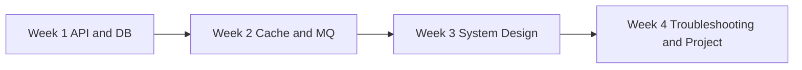

# 30 天后端面试计划

这份计划面向已经有前端、客户端或简单后端经验，但缺少高并发、高可靠系统经验的读者。目标不是 30 天学完所有后端知识，而是把站点已有文章串成一条可执行的面试准备路径。

## 使用方式

每天做三件事：

1. 读 1 到 3 篇文章。
2. 写一段自己的面试回答，不超过 3 分钟。
3. 用检查清单复盘一个具体场景，例如下单、支付、通知、评论点赞。

如果时间紧，优先完成每周的“必须产出”。如果时间充足，再补延伸阅读和代码实现。

## 第 1 周：API、分层、数据库

目标：能设计一个后端接口，并解释表结构、唯一约束、事务和并发控制。

| 天数 | 内容 | 必须产出 |
| --- | --- | --- |
| Day 1 | [后端 API 与项目分层基础](./backend-api-layering.md) | 画出 Controller、Service、Repository 职责图 |
| Day 2 | [一个请求的完整生命周期](../fundamentals/request-lifecycle.md)、[HTTP 超时与重试](../fundamentals/http-timeout-retry.md) | 解释一次请求会在哪里排队和超时 |
| Day 3 | [数据库建模与事务并发实战](./database-modeling-concurrency.md) | 写出订单、库存、幂等表结构 |
| Day 4 | [数据库索引与慢查询](../database/index-and-slow-query.md)、[分页优化](../database/pagination.md) | 为订单列表设计联合索引和 cursor 分页 SQL |
| Day 5 | [事务隔离级别](../database/transaction-isolation.md)、[数据库锁](../database/database-locks.md) | 回答“怎么防超卖” |
| Day 6 | 复盘工程配方：[数据库索引设计](../recipes/database-index-design.md)、[幂等 Key 设计](../recipes/idempotency-key-design.md) | 写一个创建订单接口的伪代码 |
| Day 7 | 周复盘 | 用 3 分钟讲清楚“创建订单接口怎么设计” |

本周面试题：

- 为什么不能让客户端直接传订单状态？
- 怎么防止重复下单？
- 怎么防止库存超卖？
- 什么时候用乐观锁，什么时候用悲观锁？

## 第 2 周：缓存、MQ、可靠性

目标：能解释缓存失效、热点、MQ 重复消费、Outbox、限流和补偿。

| 天数 | 内容 | 必须产出 |
| --- | --- | --- |
| Day 8 | [Cache-Aside 模式](../cache/cache-aside.md) | 画出读缓存和写数据库流程 |
| Day 9 | [Redis 缓存击穿](../cache/cache-breakdown.md)、[缓存穿透](../cache/cache-penetration.md)、[缓存雪崩](../cache/cache-avalanche.md) | 对比击穿、穿透、雪崩 |
| Day 10 | [热 Key](../cache/hot-key.md)、[Redis Key 设计](../recipes/redis-key-design.md) | 设计商品详情和库存 Redis key |
| Day 11 | [MQ 基础模型](../messaging/mq-basics.md)、[MQ 幂等消费](../messaging/idempotent-consumer.md) | 写消费者去重表 |
| Day 12 | [重试与死信队列](../messaging/retry-dlq.md)、[Outbox Pattern](../messaging/outbox-pattern.md) | 画出 Outbox 发布流程 |
| Day 13 | [限流](../reliability/rate-limit.md)、[限流规则设计](../recipes/rate-limit-rule-design.md)、[熔断与降级](../reliability/circuit-breaker.md) | 设计下单接口限流规则 |
| Day 14 | 周复盘 | 用 3 分钟讲清楚“高并发下单为什么需要 Redis + MQ” |

本周面试题：

- 缓存击穿、穿透、雪崩分别怎么处理？
- MQ 为什么会重复消费？
- 数据库写成功但消息发送失败怎么办？
- 限流和熔断分别保护什么？

## 第 3 周：系统设计案例

目标：能把 API、数据库、缓存、MQ、状态机、观测串成完整系统设计。

| 天数 | 内容 | 必须产出 |
| --- | --- | --- |
| Day 15 | [系统设计常见术语表](../system-design/glossary.md) | 整理不熟的 10 个术语 |
| Day 16 | [订单系统设计](../system-design/order-system.md)、[高并发下单系统设计](../practice/high-concurrency-order-system.md) | 画下单时序图 |
| Day 17 | [秒杀系统设计](../system-design/flash-sale-system.md)、[火车票购票系统设计](../system-design/train-ticket-system.md) | 对比库存和座位一致性差异 |
| Day 18 | [支付系统设计](../system-design/payment-system.md) | 画支付状态机和回调幂等流程 |
| Day 19 | [微博 Feed 系统设计](../system-design/weibo-feed-system.md)、[即时聊天系统设计](../system-design/instant-messaging-system.md) | 对比读扩散和写扩散 |
| Day 20 | [通知中心系统设计](../system-design/notification-system.md)、[评论点赞系统设计](../system-design/comment-like-system.md) | 设计未读数和点赞计数补偿方案 |
| Day 21 | 周复盘 | 任选一个系统，按需求、模型、流程、瓶颈、补偿讲 5 分钟 |

本周面试题：

- Feed 系统为什么要区分大 V 和普通用户？
- 支付回调为什么必须幂等？
- 评论点赞计数为什么适合异步聚合？
- IM 系统怎么处理离线消息和 ACK？

## 第 4 周：排障、问答、项目

目标：能回答面试高频题，能讲一个可运行项目，能说明线上问题怎么定位。

| 天数 | 内容 | 必须产出 |
| --- | --- | --- |
| Day 22 | [日志、指标与链路追踪](../observability/logging-metrics-tracing.md)、[SLO 与告警](../observability/slo-alerting.md) | 给下单接口定义 5 个指标 |
| Day 23 | [线上排障案例](./production-troubleshooting.md) | 背熟 P99 升高排查模板 |
| Day 24 | [后端面试问答模板](./backend-interview-qa.md) | 每题写 1 个自己的业务例子 |
| Day 25 | [可运行项目：高并发订单系统](./high-concurrency-order-project.md) | 本地跑通示例项目 |
| Day 26 | 改造项目：补充 Redis/MySQL/MQ 设计文档 | 写出真实组件替换计划 |
| Day 27 | 故障注入：库存不足、重复请求、worker 延迟 | 记录现象、指标、修复方式 |
| Day 28 | 模拟面试 1：API + DB + 缓存 + MQ | 录音或写稿，控制在 15 分钟 |
| Day 29 | 模拟面试 2：系统设计 + 排障 | 任选订单、支付、通知或 IM |
| Day 30 | 总复盘 | 整理 1 页项目讲解稿和 1 页高频问答 |

本周面试题：

- 接口 P99 突然升高怎么排查？
- MQ 积压怎么处理？
- Redis 热 key 怎么发现和解决？
- 你这个项目最核心的技术取舍是什么？

## 最终面试检查清单

- 能否用 3 分钟讲清楚一个创建订单接口？
- 能否写出幂等、库存、订单、Outbox 的核心表结构？
- 能否解释缓存击穿、穿透、雪崩和热 key 的区别？
- 能否说明 MQ 至少一次投递下消费者如何幂等？
- 能否画出支付回调、下单、通知投递中的任意一个时序图？
- 能否说出 P99 升高、MQ 积压、慢 SQL、连接池打满的排查路径？
- 能否把可运行项目讲成一个真实后端项目，而不是脚本 demo？

## 面试前一天

只做三件事：

1. 复读 [后端面试问答模板](./backend-interview-qa.md)。
2. 跑一遍 [可运行项目：高并发订单系统](./high-concurrency-order-project.md)。
3. 用自己的话讲一遍订单系统、支付系统和线上排障。
