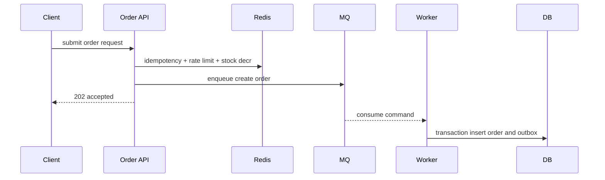

# 后端面试问答模板

这篇不是知识点大全，而是训练面试表达。后端面试里，单句定义通常不够；更好的回答要包含：是什么、为什么需要、怎么实现、有什么坑、怎么观测或补偿。


## 回答框架

遇到后端问题，可以按这个结构回答：

1. 先定义：这个技术是什么。
2. 说场景：为什么业务里会需要它。
3. 讲实现：具体用什么表、key、SQL、MQ、状态机。
4. 讲坑：重复、并发、超时、乱序、热点、回源。
5. 讲兜底：唯一约束、幂等、补偿、告警、降级。

## Redis 为什么快

面试官问法：Redis 为什么性能高？

普通回答：

> Redis 是内存数据库，所以快。

更好的回答：

> Redis 快主要因为数据在内存里，避免了大部分磁盘 IO；核心命令执行路径比较短；常见数据结构实现高效；网络模型能处理大量连接。工程上我不会只说它快，还要注意大 key、热 key、慢命令和连接池问题。比如热点商品详情可以放 Redis，但单个 key 太热时要用本地缓存、读副本或 key 拆分保护。

追问：Redis 快就能替代数据库吗？

回答要点：

- 不能。Redis 常用于缓存、限流、分布式锁、计数和临时状态。
- 权威数据仍应在数据库，尤其是订单、支付、库存这类强一致状态。
- Redis 故障、过期、淘汰、主从延迟都要考虑。

## 缓存击穿、穿透、雪崩

面试官问法：缓存击穿、穿透、雪崩分别是什么，怎么解决？

更好的回答：

> 穿透是请求的数据根本不存在，每次都绕过缓存打数据库，常用空值缓存、布隆过滤器和参数校验解决。击穿是一个热点 key 过期，大量请求同时回源数据库，常用互斥重建、逻辑过期、后台刷新解决。雪崩是大量 key 同时失效或 Redis 故障，导致请求集中打数据库，常用 TTL 加随机抖动、多级缓存、限流降级和熔断解决。

具体例子：

```text
product:detail:1001 -> 热门商品详情
product:null:bad_id -> 空值缓存，TTL 1 分钟
```

追问：热点商品缓存过期怎么办？

回答要点：

- 不让热点 key 同时硬过期。
- 用逻辑过期：先返回旧值，后台异步刷新。
- 回源加互斥锁，避免所有请求一起查库。

## MQ 为什么会重复消费

面试官问法：MQ 如何保证消息不丢？会不会重复？

更好的回答：

> 大多数业务系统会接受 MQ 至少一次投递，也就是消息尽量不丢，但可能重复。重复来自生产者重试、broker 重投、消费者处理成功但 ack 失败。解决方式不是假设消息只来一次，而是消费者幂等，比如用 `message_id` 去重表、业务唯一约束或状态条件更新。生产端如果要保证数据库写成功后消息不丢，可以用 Outbox：同一事务写业务表和事件表，再由 publisher 发送 MQ。

消费者去重表：

```sql
create table consumed_messages (
  consumer_name varchar(64) not null,
  message_id varchar(64) not null,
  consumed_at timestamp not null,
  primary key (consumer_name, message_id)
);
```

追问：如果消费者处理一半失败怎么办？

回答要点：

- 可重试错误让消息重试。
- 不可重试错误进入 DLQ。
- 消费逻辑要幂等，重试不会重复扣款、重复发券。

## 如何设计高并发下单

面试官问法：秒杀下单怎么设计？

更好的回答：

> 我会把链路拆成入口限流、资格校验、Redis 预扣库存、MQ 削峰、订单 worker 落库、失败补偿。入口按用户和商品限流，防止所有流量进核心链路。库存先在 Redis 原子扣减，成功后发送创建订单命令到 MQ，API 返回处理中。worker 消费后在数据库事务里创建订单，用唯一约束防重复，用数据库库存条件更新做最终兜底，同时写 outbox 事件。失败时要补回 Redis 库存或进入补偿任务。

核心时序：



追问：Redis 预扣成功，但 MQ 发送失败怎么办？

回答要点：

- 立即补回 Redis 库存，并把幂等状态标记失败。
- 更可靠的做法是把请求状态持久化，后台扫描补偿。
- 关键是不能让库存永久少一份。

## MySQL 索引为什么会失效

面试官问法：什么情况下索引用不上？

更好的回答：

> 索引是否可用取决于查询条件和索引结构是否匹配。常见问题包括联合索引不满足最左前缀、在索引列上做函数计算、隐式类型转换、前导模糊查询、低选择性字段单独建索引、排序字段和过滤字段不匹配。排查时我会看 `EXPLAIN`，关注 type、key、rows、Extra，然后结合真实查询频率调整联合索引。

反例：

```sql
-- created_at 上有索引，但函数包住后可能无法有效使用
select * from orders where date(created_at) = '2026-07-12';

-- 更好的写法
select * from orders
where created_at >= '2026-07-12 00:00:00'
  and created_at < '2026-07-13 00:00:00';
```

追问：订单列表索引怎么建？

回答要点：

- 从查询倒推索引。
- `where user_id = ? and status = ? order by created_at desc limit 20`。
- 建 `user_id, status, created_at desc, order_id desc`。

## 事务隔离级别解决什么问题

面试官问法：读已提交和可重复读有什么区别？

更好的回答：

> 事务隔离级别决定并发事务之间能看到什么。读已提交避免脏读，但同一个事务里两次读同一条件可能看到不同结果。可重复读保证同一事务里一致读结果稳定，在 MySQL InnoDB 下还通过 MVCC 和锁机制处理一部分幻读问题。实际业务里，我不会只依赖隔离级别解决并发写问题，关键写操作仍会用唯一约束、条件更新或显式锁。

追问：防超卖靠提高隔离级别行不行？

回答要点：

- 不建议只靠隔离级别。
- 用条件更新 `where available >= quantity` 更直接。
- 检查影响行数，失败返回库存不足。

## 分布式锁有哪些坑

面试官问法：Redis 分布式锁怎么实现？

更好的回答：

> 最基本实现是 `SET key value NX PX ttl`，释放时用 Lua 校验 value，防止删掉别人的锁。坑主要有：业务执行超过 TTL 导致锁过期、没有唯一 value 导致误删、锁粒度太大影响吞吐、把分布式锁当数据库约束使用。对于订单防重复，我更倾向于唯一索引和幂等表；分布式锁适合保护缓存重建、短时间互斥任务。

释放锁 Lua：

```lua
if redis.call('get', KEYS[1]) == ARGV[1] then
  return redis.call('del', KEYS[1])
else
  return 0
end
```

追问：锁过期但业务还没执行完怎么办？

回答要点：

- 设置合理 TTL，必要时续期。
- 业务仍要有数据库约束兜底。
- 不要用锁替代幂等和唯一约束。

## 什么是最终一致性

面试官问法：你怎么理解最终一致性？

更好的回答：

> 最终一致性是指系统不保证所有组件立刻一致，但通过重试、补偿、对账和事件重放，最终收敛到正确状态。比如支付成功后，支付服务先把支付单置为成功并写 outbox，订单服务异步消费支付成功事件后把订单置为已支付。短时间内订单可能还是待支付，但查单补偿和消息重试会让状态最终一致。资金类业务要控制不一致窗口，并有对账兜底。

追问：哪些场景不能随便最终一致？

回答要点：

- 资金、库存最终确认、权限撤销等风险高场景要更谨慎。
- 可以局部最终一致，但核心状态要有明确权威来源和补偿。

## 线上接口突然变慢怎么排查

面试官问法：接口 P99 延迟突然升高，你怎么查？

更好的回答：

> 我会先看范围：是单接口、单机房、单实例，还是全站。然后看四类指标：流量、错误、延迟、饱和度。接着用 trace 拆分时间花在哪里：网关、应用、数据库、Redis、MQ、第三方。常见原因包括慢 SQL、连接池耗尽、下游超时、Redis 热 key、GC、线程池排队。定位后先止血，比如限流、降级、扩容、回滚，再做根因修复。

追问：连接池打满有什么现象？

回答要点：

- 请求等待连接，P99 升高。
- DB QPS 不一定升高，应用线程可能阻塞。
- 看 pool active、idle、wait time、timeout count。

## 一页速记

| 问题 | 一句话答案 |
| --- | --- |
| 防重复下单 | 幂等键 + 唯一约束 + 返回已有结果 |
| 防超卖 | 条件更新扣库存，检查影响行数 |
| MQ 重复消费 | 接受至少一次，消费者幂等 |
| 消息不丢 | 本地事务写业务表和 outbox |
| 缓存击穿 | 热点 key 过期，大量请求回源，用互斥或逻辑过期 |
| 热 key | 单 key 流量过高，用本地缓存、拆分、限流 |
| 慢 SQL | `EXPLAIN` + 联合索引匹配过滤和排序 |
| P99 高 | 先分范围，再拆 trace，看饱和度和下游 |

## 检查清单

- 回答是否包含“具体怎么实现”，而不只是定义？
- 是否能给出 SQL、Redis key、表结构或时序图例子？
- 是否主动提到失败场景：重复、超时、乱序、积压？
- 是否能说出取舍：一致性、吞吐、延迟、复杂度？
- 是否能把答案落到订单、支付、库存、通知这类业务场景？

## 延伸阅读

- [AWS Builders Library: Making retries safe with idempotent APIs](https://aws.amazon.com/builders-library/making-retries-safe-with-idempotent-APIs/)
- [Google SRE Book: Monitoring Distributed Systems](https://sre.google/sre-book/monitoring-distributed-systems/)
- [MySQL: EXPLAIN Output Format](https://dev.mysql.com/doc/refman/8.4/en/explain-output.html)
- [Redis: Distributed locks with Redis](https://redis.io/docs/latest/develop/clients/patterns/distributed-locks/)
