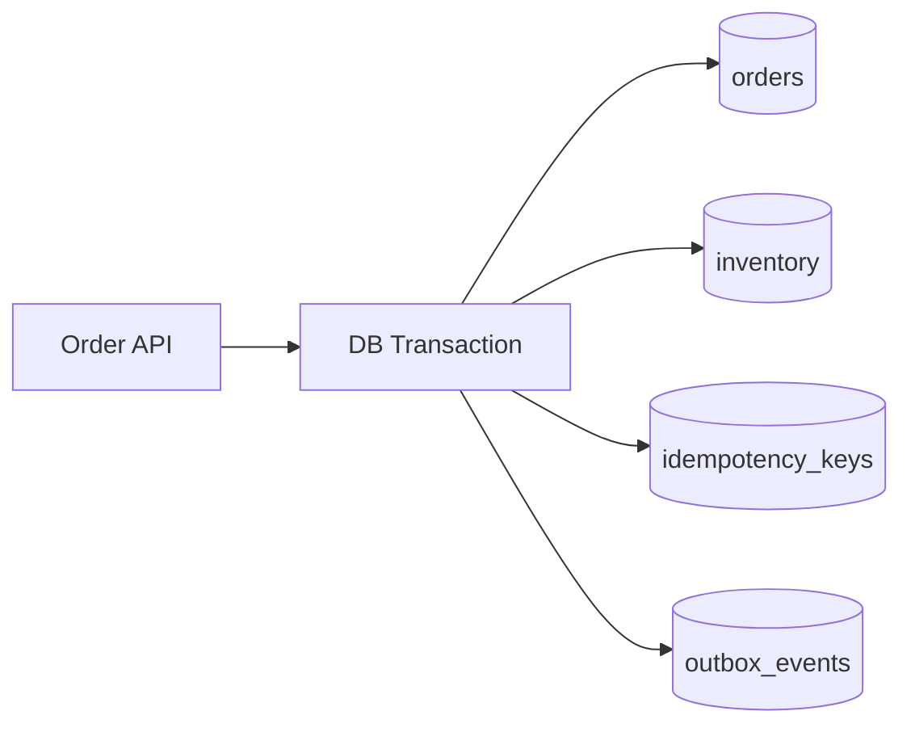
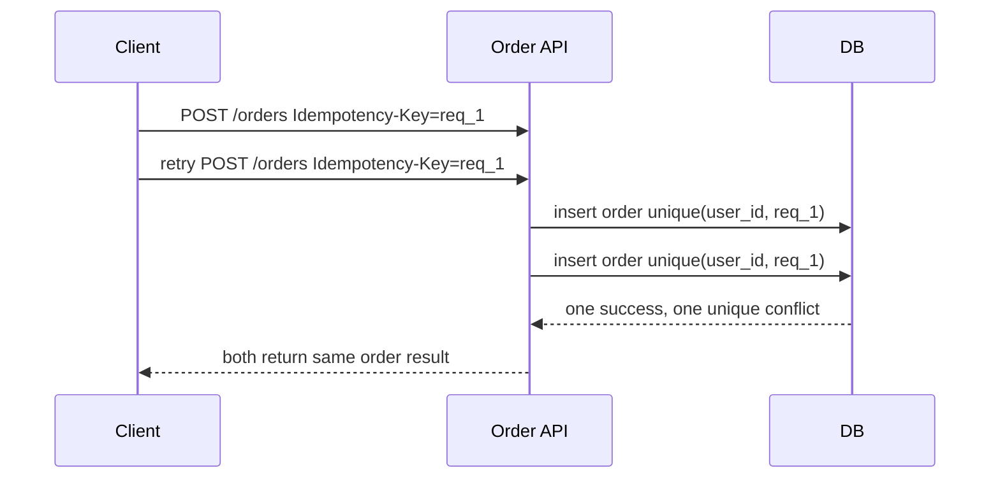
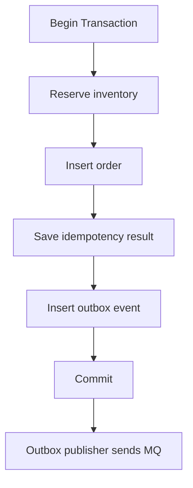

# 数据库建模与事务并发实战

后端面试里，数据库问题经常不是问你“事务是什么”，而是问：订单表怎么设计、怎么防重复下单、怎么防超卖、怎么处理并发更新、索引怎么建、为什么线上慢查询会拖垮接口。



## 你要掌握什么

数据库实战能力可以拆成 5 件事：

- 会建模：知道哪些字段、表、约束表达业务事实。
- 会加约束：唯一索引、外键或逻辑约束怎么兜底。
- 会写事务：哪些 SQL 必须在同一个事务里完成。
- 会处理并发：乐观锁、悲观锁、条件更新分别解决什么问题。
- 会查性能：索引是否匹配查询，慢 SQL 如何定位。

最重要的原则：**数据库约束是后端最后一道防线。代码判断可以错，重试可以重复，并发可以同时发生，但唯一约束和条件更新必须挡住坏数据。**

## 订单场景的数据模型

一个最小订单系统可以从这些表开始：

```sql
create table orders (
  order_id varchar(64) primary key,
  user_id varchar(64) not null,
  sku_id varchar(64) not null,
  quantity int not null,
  amount_cents bigint not null,
  status varchar(32) not null,
  idempotency_key varchar(128) not null,
  created_at timestamp not null,
  updated_at timestamp not null,
  version int not null default 0,
  unique (user_id, idempotency_key)
);

create table inventory (
  sku_id varchar(64) primary key,
  available int not null,
  locked int not null default 0,
  sold int not null default 0,
  version int not null default 0,
  updated_at timestamp not null
);

create table outbox_events (
  event_id varchar(64) primary key,
  aggregate_id varchar(64) not null,
  event_type varchar(64) not null,
  payload text not null,
  status varchar(32) not null,
  created_at timestamp not null
);
```

为什么这些字段重要：

- `unique (user_id, idempotency_key)`：防止同一次业务请求创建多笔订单。
- `status`：订单状态必须显式表达，不能靠“有没有支付记录”推断。
- `version`：支持乐观锁，防止并发覆盖。
- `outbox_events`：订单创建成功后可靠通知下游。

## 防重复下单

重复下单来自前端连点、客户端超时重试、网关重试、MQ 重投。只靠前端禁用按钮不够，后端必须有幂等键和唯一约束。



处理唯一冲突的伪代码：

```ts
async function createOrder(input: CreateOrderInput): Promise<Order> {
  try {
    return await tx(async () => {
      const order = await orders.insert(input);
      await outbox.insert(orderCreatedEvent(order));
      return order;
    });
  } catch (e) {
    if (isUniqueConflict(e, 'orders_user_id_idempotency_key')) {
      return await orders.findByIdempotencyKey(input.userId, input.idempotencyKey);
    }
    throw e;
  }
}
```

## 防库存超卖

不要先查库存再扣库存：

```sql
select available from inventory where sku_id = 'sku_1001';
-- 看到 available = 1
update inventory set available = available - 1 where sku_id = 'sku_1001';
```

两个事务可能都看到 `available = 1`，最后扣成负数。更稳的写法是条件更新：

```sql
update inventory
set available = available - 1,
    locked = locked + 1,
    version = version + 1,
    updated_at = now()
where sku_id = ?
  and available >= ?;
```

然后检查影响行数：

```ts
const affected = await inventory.reserve(skuId, quantity);
if (affected === 0) {
  throw new ConflictError('OUT_OF_STOCK');
}
```

这类写法把“检查库存”和“扣库存”合成一个原子动作。

## 乐观锁与悲观锁

乐观锁适合冲突不高的场景，例如用户资料、订单备注、普通状态更新。

```sql
update orders
set status = 'CANCELLED', version = version + 1
where order_id = ?
  and status = 'PENDING_PAYMENT'
  and version = ?;
```

悲观锁适合必须串行处理的关键资源，但要控制事务时长。

```sql
begin;

select available
from inventory
where sku_id = ?
for update;

-- check and update inventory
-- insert order

commit;
```

选择建议：

| 方式 | 适合场景 | 风险 |
| --- | --- | --- |
| 条件更新 | 扣库存、状态推进 | 需要检查影响行数 |
| 乐观锁 | 低冲突更新 | 高冲突下大量重试 |
| 悲观锁 | 必须串行的强一致资源 | 锁等待、死锁、吞吐下降 |

## 事务边界怎么定

应该放进同一个本地事务的操作：

- 创建订单。
- 扣减或锁定数据库库存。
- 写幂等结果。
- 写 outbox 事件。

不应该放进同一个数据库事务里的操作：

- 调用支付渠道。
- 发送短信、Push、邮件。
- 调用远程库存服务。
- 发 MQ 后等待消费者处理完成。



原则是：数据库事务保护本地状态，跨服务一致性靠事件、状态机、补偿和幂等。

## 索引设计实战

从查询倒推索引。订单列表常见查询：

```sql
select order_id, status, amount_cents, created_at
from orders
where user_id = ?
  and status = ?
  and created_at < ?
order by created_at desc
limit 20;
```

推荐索引：

```sql
create index idx_orders_user_status_created
on orders(user_id, status, created_at desc, order_id desc);
```

不要给每个字段单独建索引就以为够了。联合索引要匹配查询的过滤条件和排序方式。

## 常见坑与修复

| 坑 | 后果 | 修复 |
| --- | --- | --- |
| 没有唯一约束，只靠代码查重 | 并发下重复数据 | 唯一索引兜底 |
| 先查库存再扣库存 | 超卖 | 条件更新或锁 |
| 事务里调用外部 HTTP | 锁持有过久 | 事务外调用，状态机补偿 |
| 状态更新不带条件 | 旧状态覆盖新状态 | `where status = expected` |
| 深分页 offset | 慢查询和重复漏数据 | cursor 分页 |
| 索引不匹配排序 | filesort、慢查询 | 联合索引覆盖过滤和排序 |

## 面试怎么讲

面试官问“怎么防止重复下单”：

> 我会要求客户端或网关传 `Idempotency-Key`，订单表对 `user_id + idempotency_key` 建唯一索引。创建订单时先尝试插入，如果唯一冲突，就查询已有订单并返回同一个结果。这样即使前端连点、客户端超时重试或服务端重试，也不会创建多笔订单。

面试官问“怎么防止库存超卖”：

> 我不会先 select 再 update，而是用条件更新：`update inventory set available = available - quantity where sku_id = ? and available >= quantity`，检查影响行数。影响行数为 0 就说明库存不足。这个 SQL 把判断和扣减合成一个原子操作。高并发秒杀场景可以前面加 Redis 预扣，但数据库仍然要做最终兜底。

面试官问“什么时候用乐观锁，什么时候用悲观锁”：

> 冲突低、允许失败重试时用乐观锁，例如订单备注、普通状态更新；强一致且必须串行的资源可以用悲观锁，但事务必须短，避免锁等待和死锁。库存扣减通常优先用条件更新，简单且吞吐更好。

## 检查清单

- 业务唯一性是否有数据库唯一约束兜底？
- 写接口是否有幂等键和幂等结果表？
- 库存扣减是否使用条件更新或明确锁策略？
- 状态推进是否带 `where status = expected`？
- 本地事务里是否避免外部 HTTP 调用？
- 订单列表索引是否匹配过滤、排序和分页？
- 是否有 outbox 事件保证本地状态成功后消息不丢？

## 延伸阅读

- [PostgreSQL: Transaction Isolation](https://www.postgresql.org/docs/current/transaction-iso.html)
- [MySQL: InnoDB Locking](https://dev.mysql.com/doc/refman/8.4/en/innodb-locking.html)
- [Stripe: Idempotent requests](https://docs.stripe.com/api/idempotent_requests)
- [Microservices.io: Transactional Outbox](https://microservices.io/patterns/data/transactional-outbox.html)
