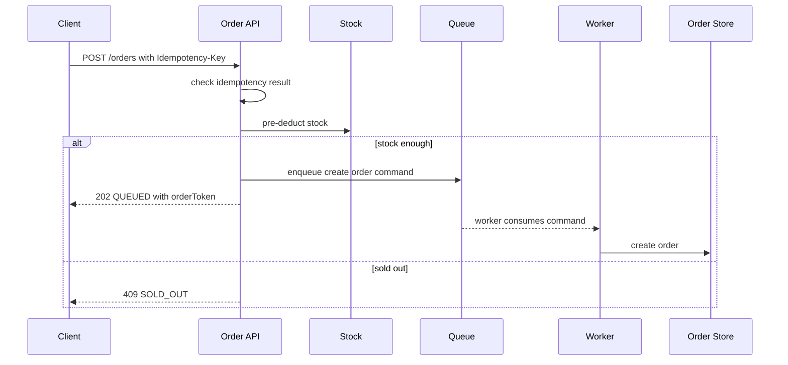
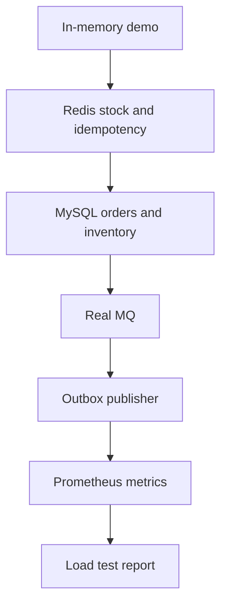
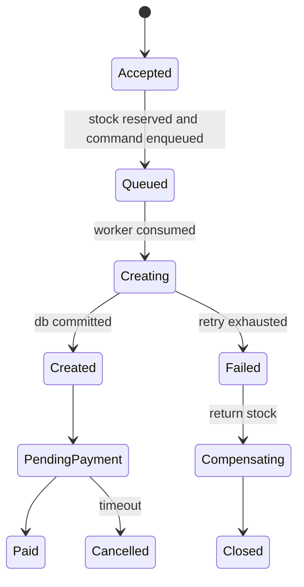

# 可运行项目：高并发订单系统

这篇把前面的知识点收敛成一个能跑、能讲、能继续扩展的面试项目。仓库里已经提供一个零依赖 Node.js 示例：`examples/high-concurrency-order-node`。它不是生产级电商系统，而是用最小代码演示后端面试最常问的几个机制。

```mermaid
flowchart LR
    C[Client] --> API[POST /orders]
    API --> Idem[Idempotency Map]
    API --> Stock[Stock Pre-deduct]
    API --> Q[In-memory Queue]
    Q --> W[Worker]
    W --> O[Orders Map]
    C --> Status[GET /orders/{token}]
    C --> Metrics[GET /metrics]
```

## 项目目标

这个项目要让你在面试中能讲清楚：

- 为什么创建订单需要幂等键。
- 为什么高并发下单不应该所有请求都同步写数据库。
- Redis 预扣库存解决什么问题，又有什么补偿风险。
- MQ 削峰如何把瞬时流量变成 worker 可处理的速度。
- 异步下单为什么要有状态查询接口。
- 线上如何用指标判断库存、队列和订单创建是否正常。

## 怎么运行

进入示例目录：

```bash
cd examples/high-concurrency-order-node
npm start
```

创建订单：

```bash
curl -X POST http://localhost:3000/orders \
  -H 'content-type: application/json' \
  -H 'idempotency-key: req_1' \
  -d '{"userId":"u1","skuId":"sku_1001","quantity":1}'
```

你会得到类似结果：

```json
{
  "code": "OK",
  "data": {
    "status": "QUEUED",
    "orderToken": "ord_xxx",
    "skuId": "sku_1001"
  },
  "traceId": "tr_xxx"
}
```

查询订单状态：

```bash
curl http://localhost:3000/orders/ord_xxx
```

查看指标：

```bash
curl http://localhost:3000/metrics
```

## 核心接口设计

| 接口 | 作用 | 面试要点 |
| --- | --- | --- |
| `POST /orders` | 接受下单请求 | 幂等、预扣库存、异步入队 |
| `GET /orders/{orderToken}` | 查询异步结果 | 处理中、成功、失败状态 |
| `GET /metrics` | 查看运行状态 | 库存、队列长度、成功数、失败数 |

创建订单请求必须带 `Idempotency-Key`：

```http
POST /orders
Idempotency-Key: req_1
Content-Type: application/json

{"userId":"u1","skuId":"sku_1001","quantity":1}
```

同一个幂等键重复请求，会返回同一个结果，不会重复扣库存。

## 核心流程



这个流程对应真实系统里的组件：

| 示例项目 | 真实系统 |
| --- | --- |
| `Map idempotency` | Redis + MySQL 幂等表 |
| `Map stock` | Redis 预扣库存 + DB 库存兜底 |
| `Array queue` | Kafka / RabbitMQ / SQS |
| `setInterval worker` | 消费者服务 |
| `Map orders` | MySQL / PostgreSQL |
| `/metrics` JSON | Prometheus metrics |

## 代码结构

```text
examples/high-concurrency-order-node/
  package.json
  README.md
  server.mjs
```

`server.mjs` 里有几个关键函数：

- `createOrderCommand`：处理幂等、库存预扣和入队。
- `workerTick`：模拟异步 worker 创建订单。
- `json`：统一响应格式。
- `/metrics`：暴露库存、队列长度、订单数和计数指标。

## 你应该怎么改造成作品集项目

第一阶段：把内存版跑通。

- 能创建订单。
- 重复幂等键不会重复扣库存。
- 库存卖完后返回 `SOLD_OUT`。
- worker 能把 `QUEUED` 订单变成 `PENDING_PAYMENT`。

第二阶段：替换真实组件。



建议改造顺序：

1. 用 MySQL 保存 `orders`、`inventory`、`idempotency_keys`。
2. 用 Redis 保存库存预扣和短期幂等状态。
3. 用真实 MQ 替换内存队列。
4. 增加 Outbox，保证订单落库后事件不丢。
5. 增加压测脚本，对比同步下单和异步下单。
6. 增加故障注入：MQ 失败、worker 失败、库存补偿。

## 真实数据库表结构

```sql
create table idempotency_keys (
  user_id varchar(64) not null,
  idempotency_key varchar(128) not null,
  status varchar(32) not null,
  response_body text,
  created_at timestamp not null,
  updated_at timestamp not null,
  primary key (user_id, idempotency_key)
);

create table orders (
  order_id varchar(64) primary key,
  user_id varchar(64) not null,
  sku_id varchar(64) not null,
  quantity int not null,
  status varchar(32) not null,
  created_at timestamp not null,
  updated_at timestamp not null,
  unique (user_id, sku_id)
);

create table inventory (
  sku_id varchar(64) primary key,
  available int not null,
  locked int not null default 0,
  sold int not null default 0,
  updated_at timestamp not null
);
```

库存最终兜底 SQL：

```sql
update inventory
set available = available - ?,
    locked = locked + ?,
    updated_at = now()
where sku_id = ?
  and available >= ?;
```

## Redis Key 设计

```text
idem:order:{user_id}:{idempotency_key} -> PROCESSING / QUEUED / CREATED / FAILED
stock:sku:{sku_id} -> available stock
rate:user:{user_id}:{minute} -> request count
rate:sku:{sku_id}:{second} -> request count
order:status:{order_token} -> latest status snapshot
```

注意：Redis 状态只是加速和保护链路，真实订单和库存最终要落到数据库。

## 状态机



面试时要强调：异步系统必须显式建模状态，不能只靠“有没有订单记录”判断用户请求的结果。

## 压测怎么做

你可以用 `curl` 先模拟重复请求：

```bash
curl -X POST http://localhost:3000/orders \
  -H 'content-type: application/json' \
  -H 'idempotency-key: req_same' \
  -d '{"userId":"u1","skuId":"sku_1001","quantity":1}'

curl -X POST http://localhost:3000/orders \
  -H 'content-type: application/json' \
  -H 'idempotency-key: req_same' \
  -d '{"userId":"u1","skuId":"sku_1001","quantity":1}'
```

然后观察：

```bash
curl http://localhost:3000/metrics
```

正式作品集可以补一份压测报告：

| 指标 | 目标 |
| --- | --- |
| `order_create_qps` | 系统可接受请求速率 |
| `order_create_p99_ms` | 下单入口 P99 |
| `queue_length` | 是否积压 |
| `worker_success_rate` | worker 成功率 |
| `sold_out_total` | 售罄请求数 |
| `duplicate_request_total` | 幂等命中次数 |

## 故障注入练习

你可以有意识地制造这些问题：

- 把初始库存改成 1，然后连续发送多个不同幂等键请求，观察是否超卖。
- 把 `workerTick` 里的创建订单逻辑改成随机失败，观察库存是否补偿。
- 把 worker 间隔从 200ms 改成 2000ms，观察队列积压。
- 重复使用同一个 `Idempotency-Key`，观察是否重复扣库存。

这些练习能在面试里转化成项目经验，而不是只背概念。

## 面试讲解稿

可以这样介绍这个项目：

> 我做了一个高并发下单的最小项目，用来练习后端核心机制。下单接口要求传幂等键，先检查重复请求，再做库存预扣，成功后把创建订单命令放入队列，接口返回处理中。后台 worker 异步消费命令并创建订单。这样做的好处是入口链路短，能削峰，也能防止重复提交和超卖。真实系统里我会把内存状态替换成 Redis、MySQL 和 MQ，并用数据库唯一约束、库存条件更新和 Outbox 做最终兜底。监控上会看入口 QPS、P99、队列长度、worker 成功率、售罄数和幂等命中数。

追问“如果 MQ 失败怎么办”：

> 示例里会补回库存并标记失败。真实系统里会把请求状态持久化，或者用 Outbox 保证本地状态和事件发布最终一致。关键是预扣库存不能永久丢失，失败必须可补偿。

追问“为什么不直接同步写数据库”：

> 低流量可以同步写。高并发抢购时，同步链路容易把数据库连接池和库存行锁打满。用 Redis 预扣和 MQ 削峰，可以先过滤掉超出库存的请求，再按 worker 能处理的速度落库。数据库仍然要做最终一致性兜底。

## 检查清单

- 项目是否能一条命令启动？
- 是否能演示重复请求不会重复扣库存？
- 是否能演示库存卖完后明确返回 `SOLD_OUT`？
- 是否有异步状态查询，而不是要求用户一直等同步结果？
- 是否能说清楚内存版如何替换为 Redis、MySQL、MQ？
- 是否有指标说明系统是否健康？
- 是否准备了故障注入和面试讲解稿？

## 延伸阅读

- [Stripe: Idempotent requests](https://docs.stripe.com/api/idempotent_requests)
- [Microservices.io: Transactional Outbox](https://microservices.io/patterns/data/transactional-outbox.html)
- [Redis: INCR command](https://redis.io/docs/latest/commands/incr/)
- [Google SRE Book: Handling Overload](https://sre.google/sre-book/handling-overload/)
