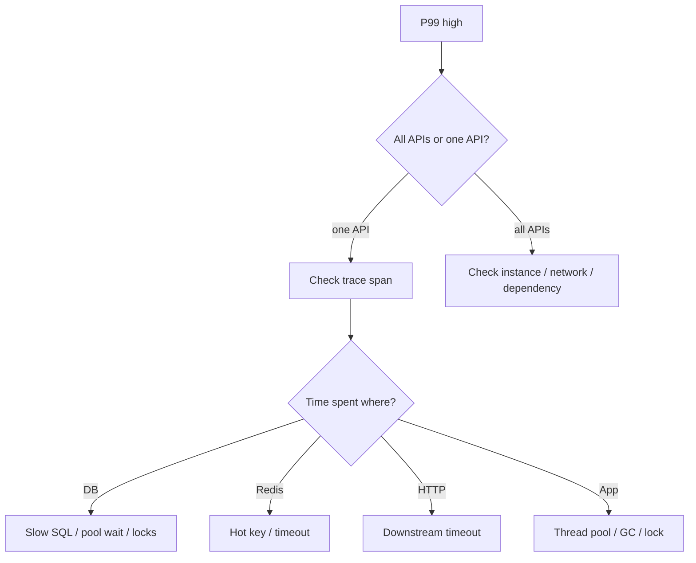
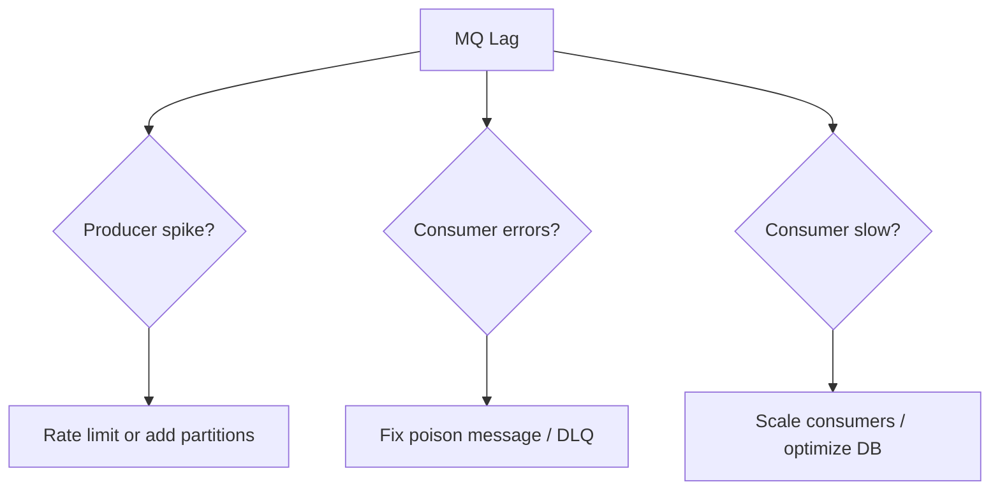

# 线上排障案例

后端面试很容易问：“接口突然变慢你怎么查？”、“MQ 积压怎么办？”、“Redis 热 key 怎么处理？”如果你没有线上经验，可以先学一套固定排查路径：先判断影响面，再止血，再定位，再修复，再复盘。


## 通用排障框架

看到告警不要直接猜原因。按这个顺序：

1. 确认影响面：哪个接口、哪个用户群、哪个地域、从什么时候开始。
2. 看四个基础指标：流量、错误率、延迟、饱和度。
3. 先止血：限流、降级、扩容、回滚、切流量。
4. 用 trace 拆链路：应用、数据库、Redis、MQ、第三方。
5. 找根因：代码变更、流量变化、依赖故障、数据异常、容量瓶颈。
6. 修复和复盘：补监控、补压测、补保护、补 runbook。

## 案例 1：接口 P99 延迟升高

现象：

```text
order_create_latency_p99 从 350ms 升到 3s
order_create_error_rate 从 0.1% 升到 2%
CPU 正常，数据库连接池等待时间升高
```

排查图：



先止血：

- 降低入口并发，保护数据库连接池。
- 关闭非核心同步逻辑，例如推荐、优惠券预估、非必要风控。
- 如果刚发版，优先对比变更并回滚。

定位动作：

```text
1. 看 trace：DB span 是否从 50ms 变成 2s。
2. 看连接池：active、idle、wait_ms、timeout_count。
3. 看慢 SQL：是否出现新 SQL 或 rows 扫描暴增。
4. 看锁等待：是否有长事务占用订单或库存行。
```

常见根因：

- 新增查询缺索引，导致全表扫描。
- 事务里调用外部服务，连接和锁被长时间占用。
- 连接池太小或请求暴涨，应用排队等待连接。
- 下游超时配置过长，线程被卡住。

面试表达：

> 我会先确认是单接口还是全站问题，再看流量、错误、延迟、饱和度。P99 高时平均值可能不明显，所以要看 trace。假如 trace 显示时间主要花在 DB，我会继续看连接池等待、慢 SQL 和锁等待。止血上可以先限流或降级非核心逻辑，避免把数据库打垮。根因修复可能是补索引、缩短事务、调整超时或回滚问题版本。

## 案例 2：接口 500 错误升高

现象：

```text
payment_callback_error_rate 从 0.0% 升到 8%
日志出现 duplicate key 和 JSON parse error
```

排查路径：

- 按错误码和异常类型聚合，不要逐条翻日志。
- 按版本、实例、渠道、请求来源分组，看是否集中。
- 找第一条错误发生时间，对比发布、配置、渠道回调格式变更。
- 如果是回调类接口，确认重复回调是否被当成异常。

修复方式：

```text
duplicate key -> 如果是幂等重复，改成返回成功并查询已有结果
JSON parse error -> 兼容渠道新增字段或错误 content-type
null pointer -> 参数校验和默认值修复
```

面试表达：

> 500 升高先按异常类型聚合，再按版本和实例分组。如果集中在新版本，优先回滚。如果是支付回调这类天然会重复的接口，唯一键冲突不应该直接变 500，而应该作为幂等命中处理，查询已有支付结果并返回成功。

## 案例 3：数据库连接池打满

现象：

```text
db_pool_active = max
db_pool_wait_ms_p99 = 1500ms
db_qps 没有明显升高
app request threads blocked
```

为什么 QPS 没升高但接口变慢：请求不是在数据库执行慢，而是在应用里等连接。

排查动作：

- 看连接池 active、idle、wait、timeout。
- 看慢 SQL 和长事务。
- 看有没有事务未关闭或连接泄漏。
- 看下游 HTTP 是否被放在事务里。

修复：

- 先限流，减少等待连接的请求。
- 找到长事务并修复，避免事务里做网络调用。
- 给慢 SQL 补索引。
- 调整连接池不是第一选择，必须确认数据库能承受更多连接。

## 案例 4：MQ 积压

现象：

```text
mq_consumer_lag_messages{topic="order.create"} = 1,200,000
consumer_success_rate 正常但消费速度低于生产速度
```

排查图：



先止血：

- 扩容消费者，但要确认下游数据库和外部服务扛得住。
- 暂停低优先级 topic，例如营销通知。
- 把 poison message 放入 DLQ，避免卡住分区。

定位动作：

- 看生产速率和消费速率。
- 看失败率和重试次数。
- 看单条消息处理耗时：DB、Redis、HTTP 哪一步慢。
- 看分区是否倾斜，例如某个 key 过热。

面试表达：

> MQ 积压要区分是生产突增、消费者报错，还是消费者处理慢。先看生产和消费速率，再看失败率和重试。如果是 poison message，要进 DLQ，不能无限重试卡住队列。如果只是消费慢，可以扩容消费者，但要同时看下游容量，避免把数据库打崩。

## 案例 5：Redis 热 key

现象：

```text
redis_cmd_qps 高度集中在 product:detail:1001
Redis 单分片 CPU 95%
接口缓存命中率高，但延迟仍升高
```

为什么命中缓存还会慢：热 key 命中率高，但所有请求都打到同一个 Redis 分片或同一个应用连接池。

修复手段：

- 本地缓存热点数据，TTL 1 到 5 秒。
- 读副本或多级缓存分摊读压力。
- 对计数类 key 做分片，例如 `like:post:1001:shard:0..31`。
- 热点接口限流，返回旧值或降级字段。
- 提前预热活动商品缓存。

面试表达：

> 热 key 不是缓存未命中问题，而是单个 key 访问过于集中。处理上可以加本地缓存、读副本、key 分片和限流。对于商品详情这种短时间可接受旧值的数据，本地缓存几秒通常能显著降低 Redis 压力。对于计数，可以拆分多个 shard 累加，再异步聚合。

## 案例 6：慢 SQL

现象：

```text
orders list API P95 变慢
slow log 出现 select from orders where user_id=? order by created_at desc limit 20
EXPLAIN rows = 800000, Extra = Using filesort
```

定位动作：

```sql
explain
select order_id, status, amount_cents, created_at
from orders
where user_id = ?
order by created_at desc
limit 20;
```

修复索引：

```sql
create index idx_orders_user_created
on orders(user_id, created_at desc, order_id desc);
```

如果还有状态过滤：

```sql
create index idx_orders_user_status_created
on orders(user_id, status, created_at desc, order_id desc);
```

面试表达：

> 慢 SQL 我会先看慢日志和 `EXPLAIN`，关注是否走了预期索引、扫描行数、是否 filesort。索引设计从查询模式倒推，订单列表通常按 user_id 过滤、按 created_at 排序，所以联合索引要覆盖过滤和排序。深分页还要改成 cursor 分页。

## 案例 7：CPU 飙高

现象：

```text
app_cpu_usage = 95%
request_qps 没明显升高
latency_p99 升高
```

排查方向：

- 是否有死循环、正则灾难、JSON 大对象序列化。
- 是否日志量暴涨，字符串拼接和同步写日志消耗 CPU。
- 是否 GC 频繁，CPU 花在垃圾回收。
- 是否某个实例异常，流量分布不均。

止血：

- 摘除异常实例或扩容。
- 回滚最近版本。
- 降低日志级别或关闭高成本调试日志。

## 案例 8：内存泄漏或 OOM

现象：

```text
memory_usage 持续上涨，不随流量回落
pod/container 被 OOM killed
```

排查方向：

- 无界本地缓存，例如 Map 只增不删。
- 请求体或导出任务一次性加载太多数据。
- 消息积压在应用内存队列。
- trace、日志、指标标签基数过高。

修复：

- 本地缓存设置最大容量和 TTL。
- 大文件、导出、批处理改成分页或流式处理。
- 内存队列加上限，满了要拒绝或降级。
- 指标标签不要放 userId、orderId 这种高基数字段。

## 排障指标清单

| 类型 | 指标例子 | 用途 |
| --- | --- | --- |
| 流量 | `http_requests_total` | 是否流量突增 |
| 错误 | `http_errors_total` | 错误率和错误类型 |
| 延迟 | `http_request_duration_ms_p99` | 用户体验是否变差 |
| 饱和度 | `db_pool_wait_ms`, `thread_pool_queue_size` | 是否资源耗尽 |
| DB | `slow_query_count`, `lock_wait_ms` | 慢 SQL 和锁等待 |
| Redis | `redis_cmd_latency_ms`, `hot_key_qps` | 缓存延迟和热点 |
| MQ | `consumer_lag_messages`, `retry_total`, `dlq_total` | 积压和失败 |
| JVM/Runtime | `gc_pause_ms`, `heap_used` | GC 和内存问题 |

## 面试回答模板

可以背这个结构：

> 我会先确认影响面和开始时间，然后看流量、错误、延迟、饱和度这四类指标。止血优先于根因分析，比如限流、降级、扩容、回滚。定位时用 trace 拆链路，判断时间花在应用、DB、Redis、MQ 还是第三方。找到根因后修复，比如补索引、缩短事务、调整超时、处理热 key。最后补监控、告警、压测和 runbook，避免同类问题再次发生。

## 检查清单

- 是否先确认影响面，而不是直接猜原因？
- 是否能说出止血手段：限流、降级、扩容、回滚？
- 是否能用指标定位：流量、错误、延迟、饱和度？
- 是否能区分 DB 慢、连接池等待、下游慢、应用线程阻塞？
- 是否知道 MQ 积压要看生产速率、消费速率、失败率？
- 是否知道热 key 命中缓存也可能导致延迟？
- 是否能把复盘落到监控、压测、保护和 runbook？

## 延伸阅读

- [Google SRE Book: Monitoring Distributed Systems](https://sre.google/sre-book/monitoring-distributed-systems/)
- [Google SRE Book: Handling Overload](https://sre.google/sre-book/handling-overload/)
- [AWS Builders Library: Timeouts, retries, and backoff with jitter](https://aws.amazon.com/builders-library/timeouts-retries-and-backoff-with-jitter/)
- [MySQL: Optimizing Queries with EXPLAIN](https://dev.mysql.com/doc/refman/8.4/en/using-explain.html)
