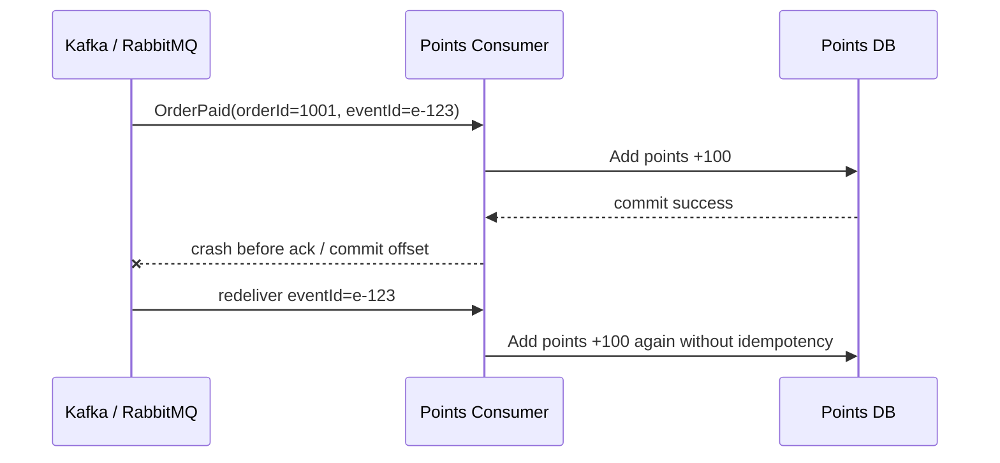
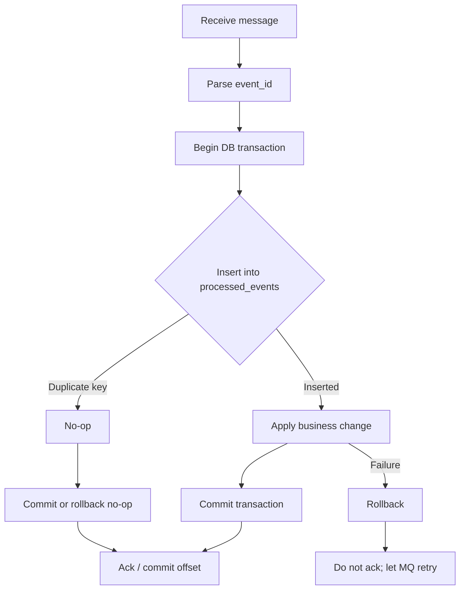
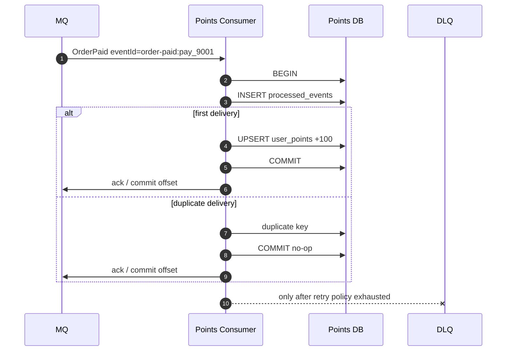

import Tabs from '@theme/Tabs';
import TabItem from '@theme/TabItem';

# MQ 幂等消费

消息队列通常提供“至少一次投递”，或者需要生产者、Broker、消费者和业务存储共同配合，才能接近“恰好一次效果”。因此消费者必须默认消息可能重复，业务处理必须幂等。

## 先理解这些概念

- **至少一次投递**：MQ 尽量不丢消息，但可能把同一消息投递多次。
- **Ack / Offset**：消费者处理完后告诉 MQ“这条我处理过了”。
- **重复消息**：业务意义相同的消息再次到达，比如同一个 `OrderPaid`。
- **幂等 key**：用来识别同一业务事件的稳定 ID，比如 `event_id` 或 `order_id + event_type`。
- **去重表**：数据库里记录处理过的消息 ID，重复消息来了直接跳过。
- **业务恰好一次效果**：消息可能重复，但业务结果只生效一次。

读这篇时先接受一个事实：MQ 重复投递不是异常，而是正常设计边界。消费者必须自己保证重复处理不会产生重复副作用。

## 它是什么

幂等消费是指同一条业务消息被消费一次或多次，最终业务结果一致。这里的“同一条消息”不能只看 MQ 的 offset、delivery tag 或消费时间，而要看业务事件的稳定标识，例如 `event_id`、`order_id + event_type`、`payment_id`。

以积分系统为例，订单服务发布 `OrderPaid` 消息，积分服务消费后给用户加 100 积分。如果消费者在“积分已加成功，但还没提交 offset/ack”时崩溃，MQ 会再次投递同一条消息。没有幂等保护时，用户会被重复加积分。

## 为什么需要它

分布式系统里，消息重复是正常情况：

- 消费者处理成功后，提交 offset 前崩溃。
- 消费者处理超时，Broker 认为投递失败并重新投递。
- 生产者发送消息后没收到 ack，重试发送同一业务事件。
- Broker leader 切换、网络抖动或客户端 rebalance。
- 死信队列重放或人工补偿时重复投递历史消息。

如果消费者没有幂等设计，重复消息会造成重复加积分、重复发券、重复发货、重复扣库存、重复调用第三方接口。越是可靠的 MQ，越可能通过重试保证“不丢”，但“不丢”的代价就是业务侧必须能处理重复。

## 它解决什么问题

| 机制 | 解决的问题 | 边界 |
| --- | --- | --- |
| 业务事件 id | 识别同一条业务事件 | 必须由生产者稳定生成 |
| 去重表 | 记录某消费者已经处理过的事件 | 表会增长，需要保留策略 |
| 本地事务 | 保证去重记录和业务变更同时成功或失败 | 只能覆盖同一个数据库内的写入 |
| 唯一约束 | 让并发重复消息只有一个成功 | 需要正确处理 duplicate key |
| 下游幂等 key | 避免外部 API 被重复调用产生副作用 | 下游必须支持幂等语义 |
| DLQ / 重放 | 失败消息可恢复 | 重放仍然会产生重复，仍需幂等 |

幂等消费不等于消息不会重复，也不等于 MQ 提供强事务。它解决的是：即使重复投递发生，业务最终结果仍然正确。

## 核心原理

重复消费最常见的窗口，是业务写入成功但消费进度提交失败。



正确模型是：消费者在同一个数据库事务里先插入去重记录，再执行业务变更。唯一约束保证同一 `event_id + consumer_name` 只能插入一次。



推荐表结构：

```sql
CREATE TABLE processed_events (
  event_id VARCHAR(128) NOT NULL,
  consumer_name VARCHAR(128) NOT NULL,
  processed_at TIMESTAMP NOT NULL DEFAULT CURRENT_TIMESTAMP,
  PRIMARY KEY (event_id, consumer_name)
);

CREATE TABLE user_points (
  user_id BIGINT PRIMARY KEY,
  points BIGINT NOT NULL
);
```

为什么主键要包含 `consumer_name`？同一条 `OrderPaid` 事件可能被积分服务、通知服务、数据分析服务分别消费。它们各自的幂等状态应该独立。

## 最小示例

下面示例展示同一个模式：处理 `OrderPaid` 事件时，在同一个事务里写入 `processed_events` 和更新 `user_points`。如果去重插入发现重复，直接 no-op，并允许 ack 这条消息。

<Tabs groupId="language">
  <TabItem value="java" label="Java">

```java
import java.sql.Connection;
import java.sql.PreparedStatement;
import java.sql.SQLException;

record OrderPaidEvent(String eventId, long userId, long points) {}

public class PointsConsumer {
    private static final String CONSUMER = "points-consumer";

    public void handle(Connection connection, OrderPaidEvent event) throws SQLException {
        boolean oldAutoCommit = connection.getAutoCommit();
        connection.setAutoCommit(false);
        try {
            if (!insertProcessedEvent(connection, event.eventId())) {
                connection.commit();
                return;
            }

            addPoints(connection, event.userId(), event.points());
            connection.commit();
        } catch (SQLException e) {
            connection.rollback();
            throw e;
        } finally {
            connection.setAutoCommit(oldAutoCommit);
        }
    }

    private boolean insertProcessedEvent(Connection connection, String eventId) throws SQLException {
        String sql = "INSERT INTO processed_events(event_id, consumer_name) VALUES (?, ?)";
        try (PreparedStatement statement = connection.prepareStatement(sql)) {
            statement.setString(1, eventId);
            statement.setString(2, CONSUMER);
            statement.executeUpdate();
            return true;
        } catch (SQLException e) {
            if (isDuplicateKey(e)) {
                return false;
            }
            throw e;
        }
    }

    private void addPoints(Connection connection, long userId, long points) throws SQLException {
        String sql = """
            INSERT INTO user_points(user_id, points)
            VALUES (?, ?)
            ON DUPLICATE KEY UPDATE points = points + VALUES(points)
            """;
        try (PreparedStatement statement = connection.prepareStatement(sql)) {
            statement.setLong(1, userId);
            statement.setLong(2, points);
            statement.executeUpdate();
        }
    }

    private boolean isDuplicateKey(SQLException e) {
        return "23000".equals(e.getSQLState()) || "23505".equals(e.getSQLState());
    }
}
```

  </TabItem>
  <TabItem value="go" label="Go">

```go
package points

import (
    "context"
    "database/sql"
    "errors"
    "strings"
)

const consumerName = "points-consumer"

type OrderPaidEvent struct {
    EventID string
    UserID  int64
    Points  int64
}

func Handle(ctx context.Context, db *sql.DB, event OrderPaidEvent) error {
    tx, err := db.BeginTx(ctx, nil)
    if err != nil {
        return err
    }
    defer tx.Rollback()

    inserted, err := insertProcessedEvent(ctx, tx, event.EventID)
    if err != nil {
        return err
    }
    if !inserted {
        return tx.Commit()
    }

    if err := addPoints(ctx, tx, event.UserID, event.Points); err != nil {
        return err
    }
    return tx.Commit()
}

func insertProcessedEvent(ctx context.Context, tx *sql.Tx, eventID string) (bool, error) {
    _, err := tx.ExecContext(ctx,
        `INSERT INTO processed_events(event_id, consumer_name) VALUES (?, ?)`,
        eventID,
        consumerName,
    )
    if err == nil {
        return true, nil
    }
    if isDuplicateKey(err) {
        return false, nil
    }
    return false, err
}

func addPoints(ctx context.Context, tx *sql.Tx, userID int64, points int64) error {
    _, err := tx.ExecContext(ctx,
        `INSERT INTO user_points(user_id, points)
         VALUES (?, ?)
         ON DUPLICATE KEY UPDATE points = points + VALUES(points)`,
        userID,
        points,
    )
    return err
}

func isDuplicateKey(err error) bool {
    if errors.Is(err, sql.ErrNoRows) {
        return false
    }
    message := err.Error()
    return strings.Contains(message, "Duplicate") ||
        strings.Contains(message, "duplicate") ||
        strings.Contains(message, "unique")
}
```

  </TabItem>
  <TabItem value="typescript" label="TypeScript">

```typescript
import { Pool, PoolClient } from 'pg';

type OrderPaidEvent = {
  eventId: string;
  userId: string;
  points: number;
};

const CONSUMER = 'points-consumer';

export async function handleOrderPaid(pool: Pool, event: OrderPaidEvent): Promise<void> {
  const client = await pool.connect();
  try {
    await client.query('BEGIN');

    const inserted = await insertProcessedEvent(client, event.eventId);
    if (!inserted) {
      await client.query('COMMIT');
      return;
    }

    await client.query(
      `INSERT INTO user_points(user_id, points)
       VALUES ($1, $2)
       ON CONFLICT (user_id)
       DO UPDATE SET points = user_points.points + EXCLUDED.points`,
      [event.userId, event.points],
    );

    await client.query('COMMIT');
  } catch (error) {
    await client.query('ROLLBACK');
    throw error;
  } finally {
    client.release();
  }
}

async function insertProcessedEvent(client: PoolClient, eventId: string): Promise<boolean> {
  const result = await client.query(
    `INSERT INTO processed_events(event_id, consumer_name)
     VALUES ($1, $2)
     ON CONFLICT DO NOTHING`,
    [eventId, CONSUMER],
  );
  return result.rowCount === 1;
}
```

  </TabItem>
  <TabItem value="python" label="Python">

```python
from dataclasses import dataclass


CONSUMER = "points-consumer"


@dataclass(frozen=True)
class OrderPaidEvent:
    event_id: str
    user_id: int
    points: int


def handle_order_paid(connection, event: OrderPaidEvent) -> None:
    try:
        with connection.cursor() as cursor:
            inserted = insert_processed_event(cursor, event.event_id)
            if not inserted:
                connection.commit()
                return

            cursor.execute(
                """
                INSERT INTO user_points(user_id, points)
                VALUES (%s, %s)
                ON CONFLICT (user_id)
                DO UPDATE SET points = user_points.points + EXCLUDED.points
                """,
                (event.user_id, event.points),
            )
        connection.commit()
    except Exception:
        connection.rollback()
        raise


def insert_processed_event(cursor, event_id: str) -> bool:
    cursor.execute(
        """
        INSERT INTO processed_events(event_id, consumer_name)
        VALUES (%s, %s)
        ON CONFLICT DO NOTHING
        """,
        (event_id, CONSUMER),
    )
    return cursor.rowcount == 1
```

  </TabItem>
</Tabs>

## 工程实践

### 1. 事件 id 必须是业务稳定 id

不要用消费时间、offset、delivery tag 或随机 UUID 作为幂等 key。生产者应该在业务事件产生时生成稳定的 `event_id`，并在重试发送时复用同一个 id。常见选择是：`order_paid:{payment_id}`、`order_created:{order_id}`、`coupon_issued:{user_id}:{campaign_id}`。

### 2. 去重记录和业务变更必须在同一个事务里

如果先加积分，再写去重表，中间失败会留下重复窗口；如果先写去重表，再加积分，但不在同一个事务里，业务失败后消息重试会被误判为已处理。最稳妥的方式是同库同事务提交。

### 3. ack 必须发生在业务提交之后

消费者只有在数据库事务提交成功后才能 ack 或提交 offset。业务失败时不要 ack，让 MQ 重试或进入死信队列。重复消息应该 no-op 后 ack，因为它已经被成功处理过。

### 4. 外部副作用要继续传递幂等 key

如果消费者处理过程中要调用外部系统，例如发券、转账、发送短信，数据库本地事务无法覆盖这些副作用。要么让外部系统支持幂等 key，要么先记录本地意图，再由补偿任务可靠推进。

### 5. 去重表需要生命周期管理

去重表会持续增长。可以按事件时间分区，保留 30 到 180 天，具体取决于消息最大延迟、死信重放窗口和审计要求。删除过早会让历史消息重放产生重复副作用。

## 常见坑

- 先写业务表，再写去重表，中间失败会留下重复窗口。
- 去重表和业务表不在同一个事务里，导致“已去重但业务没执行”。
- 用 Redis 做唯一去重，但没有持久化和保留策略，key 过期后历史消息重放造成重复。
- 消费失败后仍然 ack，导致消息丢失。
- 把“顺序消费”误认为可以替代幂等。
- 用 MQ offset 做幂等 key，rebalance、重放或换 topic 后失效。
- 下游外部接口没有幂等 key，本地消费者幂等了但外部副作用仍重复。
- 去重表没有分区或清理策略，几年后变成新的慢查询来源。

## 完整案例：订单支付后加积分

### 场景

订单服务在支付成功后发布事件：

```json
{
  "eventId": "order-paid:pay_9001",
  "eventType": "OrderPaid",
  "orderId": "1001",
  "userId": "42",
  "points": 100
}
```

积分服务消费这条消息，给用户加 100 积分。要求：重复投递不能重复加积分；处理失败可以重试；死信队列重放也不能破坏积分。

### 处理流程



### 故障恢复

如果消费者在提交数据库事务前崩溃，事务回滚，MQ 重投后会重新执行。如果消费者在提交数据库事务后、ack 前崩溃，MQ 重投后会命中 `processed_events` 唯一约束，不会重复加积分，并且可以安全 ack。

## 检查清单

学完这一节后，你应该能回答：

- 为什么 MQ 消息可能重复投递？
- “至少一次投递”和“业务恰好一次效果”有什么区别？
- 幂等 key 应该用什么，为什么不能用随机消费 id？
- 为什么去重记录和业务变更要在同一个事务里？
- 业务成功但 ack 失败时，下一次消费应该怎么处理？
- 消费者调用外部系统时，如何继续保证幂等？
- 去重表如何设计主键、保留周期和清理策略？
- 重复消息、失败消息、毒丸消息分别应该怎么处理？

## 这篇文章在系统里怎么用

幂等消费常用于订单支付后加积分、库存扣减、搜索索引同步、通知发送等场景。只要消息来自 MQ，就要默认它可能重复。

系统设计时，要说明消费者使用什么幂等 key，去重记录和业务更新是否在同一个数据库事务里，外部调用是否也带幂等键。否则“用 MQ 解耦”会变成重复扣库存、重复发券、重复通知。

## 术语回看

- [幂等](../system-design/glossary.md#幂等)
- [DLQ](../system-design/glossary.md#dlq)
- [Outbox](../system-design/glossary.md#outbox)
- [最终一致性](../system-design/glossary.md#最终一致性)

## 延伸阅读

- [Apache Kafka Documentation: Message Delivery Semantics](https://kafka.apache.org/documentation/#semantics)
- [Microservices.io: Idempotent Consumer Pattern](https://microservices.io/patterns/communication-style/idempotent-consumer.html)
- [AWS Builders Library: Making retries safe with idempotent APIs](https://aws.amazon.com/builders-library/making-retries-safe-with-idempotent-APIs/)
- [RabbitMQ Reliability Guide](https://www.rabbitmq.com/docs/reliability)
- [RabbitMQ Consumer Acknowledgements](https://www.rabbitmq.com/docs/confirms)
- [Confluent: Exactly-Once Semantics Are Possible](https://www.confluent.io/blog/simplified-robust-exactly-one-semantics-in-kafka-2-5/)
