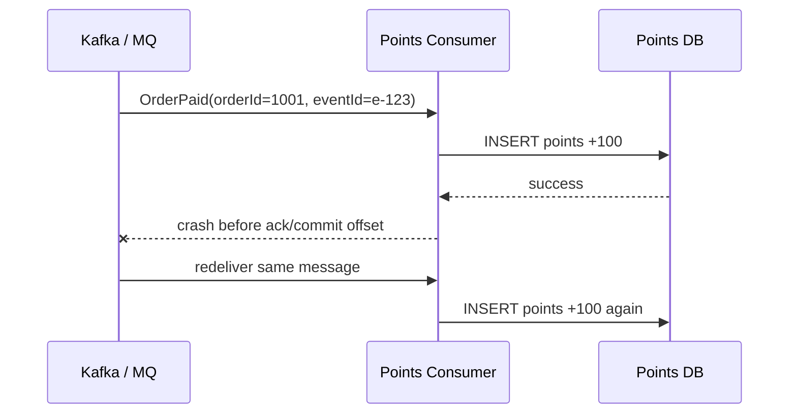
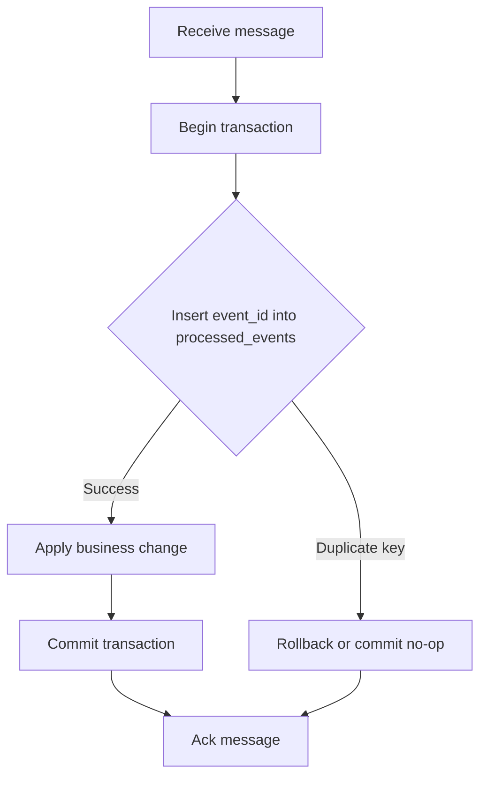

# MQ 幂等消费

消息队列通常只能提供“至少一次投递”或需要业务侧配合才能接近“恰好一次效果”。因此消费者必须默认消息可能重复，业务处理必须幂等。

## 问题场景

订单服务发布 `OrderPaid` 消息，积分服务消费后给用户加积分。如果消费者处理完成但提交 offset 前崩溃，消息会被再次投递。没有幂等保护时，用户会被重复加积分。

## 重复消费时序



## 幂等处理模型

业务侧为每条事件生成稳定的 `event_id`，消费者在同一个数据库事务里写入去重表和业务结果。



## 示例表结构

```sql
CREATE TABLE processed_events (
  event_id VARCHAR(64) PRIMARY KEY,
  consumer_name VARCHAR(128) NOT NULL,
  processed_at TIMESTAMP NOT NULL DEFAULT CURRENT_TIMESTAMP
);

CREATE TABLE user_points (
  user_id BIGINT PRIMARY KEY,
  points BIGINT NOT NULL
);
```

## 示例代码

```java
@Transactional
public void handle(OrderPaidEvent event) {
    boolean inserted = processedEventRepository.insertIfAbsent(
        event.eventId(),
        "points-consumer"
    );
    if (!inserted) {
        return;
    }

    pointsRepository.addPoints(event.userId(), event.points());
}
```

## 设计要点

| 问题 | 推荐做法 |
| --- | --- |
| 去重 key 用什么 | 使用业务事件 id，不要使用随机消费 id |
| 去重记录放哪里 | 和业务写入放同一个数据库事务里 |
| 消息处理失败 | 不 ack，让 MQ 重试或进入死信队列 |
| 下游接口调用 | 下游也需要支持幂等 key |
| 去重表太大 | 按时间分区或设置保留周期 |

## 常见错误

- 先写业务表，再写去重表，中间失败会留下重复窗口。
- 用 Redis 做去重但没有持久化要求，重启或淘汰后重复消费。
- 消费失败后仍然 ack，导致消息丢失。
- 把“顺序消费”误认为可以替代幂等。

## 工程化方案

消费者需要把“处理成功”和“提交消费进度”设计成可恢复流程。对外部副作用，例如发券、转账、调用第三方 API，要传递幂等键。对不可逆副作用，要优先通过本地事务记录意图，再由补偿任务推进状态。

## 延伸阅读

- [Apache Kafka Documentation: Message Delivery Semantics](https://kafka.apache.org/documentation/#semantics)
- [Microservices.io: Idempotent Consumer Pattern](https://microservices.io/patterns/communication-style/idempotent-consumer.html)
- [AWS Builders Library: Making retries safe with idempotent APIs](https://aws.amazon.com/builders-library/making-retries-safe-with-idempotent-APIs/)
- [RabbitMQ Reliability Guide](https://www.rabbitmq.com/docs/reliability)
